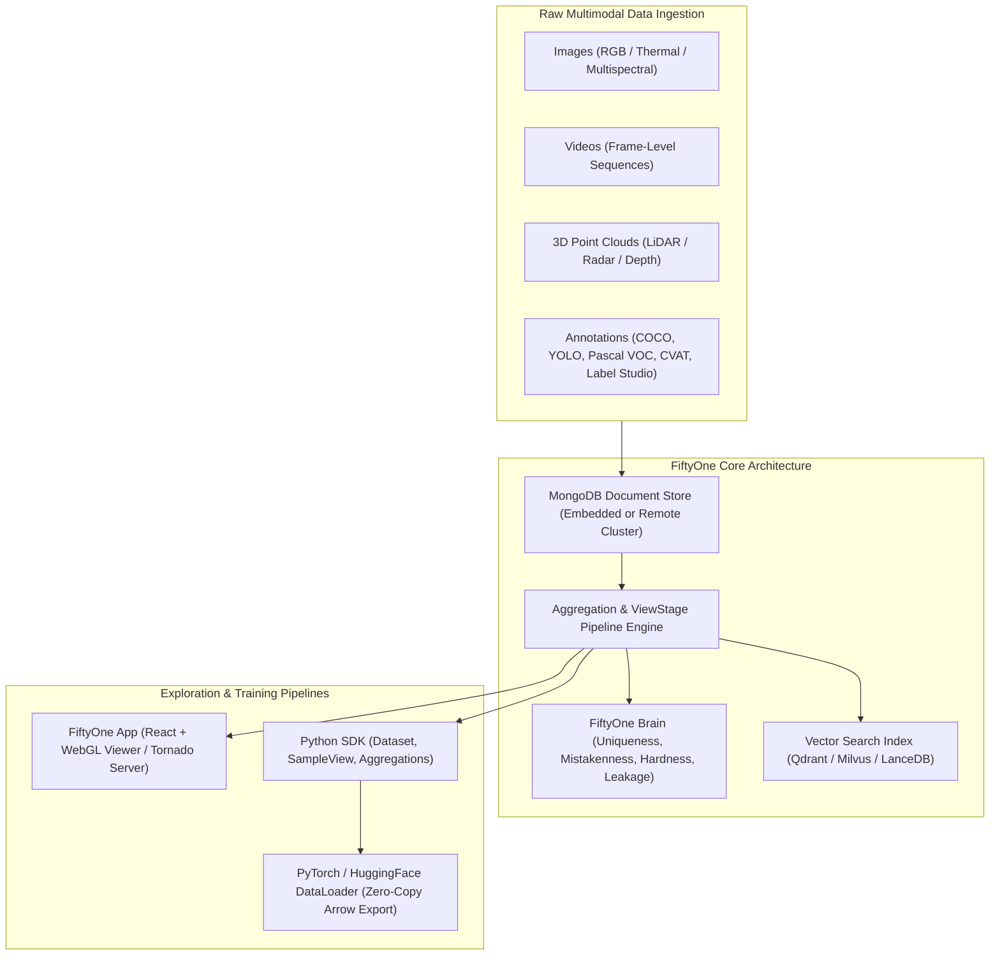
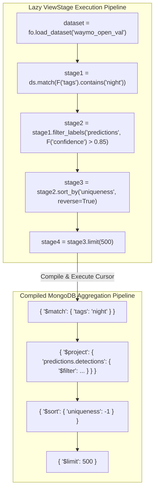
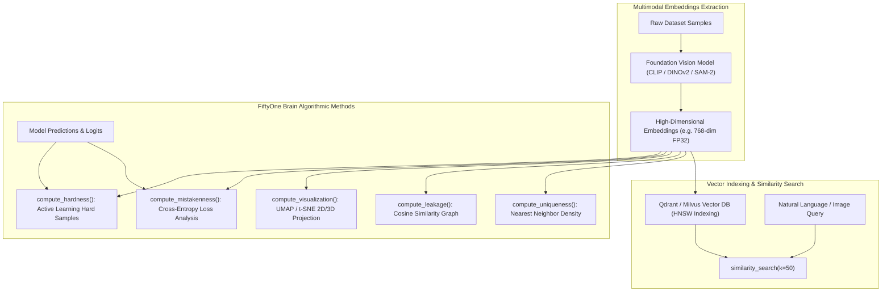
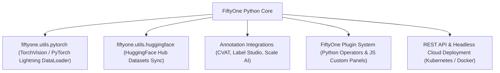

# 🔍 Voxel51 FiftyOne: Dataset Curation, Multimodal Embeddings & Vector Search Architecture

## 1. Framework Overview & Core Philosophy

**FiftyOne** is an open-source, high-performance data curation and visual dataset debugging framework created by Voxel51. Built specifically for the **Data-Centric AI** paradigm, FiftyOne provides the infrastructure required to inspect, clean, query, visualize, and optimize multimodal datasets (images, video streams, 3D point clouds, thermal, and spatial audio) across the complete machine learning lifecycle.

In production computer vision, the most significant performance bottlenecks and model degradation issues stem not from neural architecture limitations, but from **data quality deficiencies**:
- **Noisy Annotations & Mistaken Labels**: Human annotator error rates typically range from $3\text{--}15\%$, corrupting loss gradients.
- **Dataset Leakage & Redundancy**: Train/validation/test contamination and near-duplicate frames from high-FPS camera captures inflate benchmark metrics while causing test-time failure in the field.
- **Out-of-Distribution (OOD) Hard Samples**: Failure to systematically isolate rare edge cases (e.g., glare, lens occlusions, unusual object poses, adverse weather) leads to silent deployment failures.

FiftyOne bridges the gap between raw data storage and deep learning training frameworks by providing a unified schema model, native vector search indexing (Qdrant, Milvus, Pinecone, Chroma, LanceDB), algorithmic dataset intelligence (**FiftyOne Brain**), and a real-time reactive WebApp GUI synchronized with Python runtimes.



---

## 2. Internal Architecture & Data Structures

### Document-Oriented Data Model

FiftyOne organizes computer vision data around a strictly-typed, hierarchical document model built on top of a MongoDB database backend:

```
Dataset
  │
  ├── Fields (Schema Definitions: String, Float, List, EmbeddedDocument)
  │
  └── Samples (Documents)
        ├── filepath: String (Absolute path to media file)
        ├── tags: List[String] (e.g. ['train', 'night', 'occluded'])
        ├── metadata: EmbeddedDocument (Width, Height, Channels, MimeType)
        ├── ground_truth: Detections / Classifications / Polylines / Keypoints
        ├── predictions: Detections (Confidence, BoundingBoxes, Mask, Logits)
        ├── embeddings: Vector[Float32] (CLIP / DINOv2 / Custom Tensor)
        └── brain_scores: Float (Uniqueness, Hardness, Mistakenness)
```

1. **`Sample`**: The atomic unit of data representing a single image, video file, or 3D point cloud scene. Each sample contains standard system fields (`id`, `filepath`, `tags`) and dynamically added custom fields.
2. **`Dataset`**: A collection of samples backed by a dedicated MongoDB collection. Datasets maintain strict schema definitions to ensure fast indexed queries across millions of records.
3. **`DatasetView` & `SampleView`**: Lightweight, lazily evaluated query views. A view is constructed by chaining **View Stages** (`match()`, `filter_labels()`, `sort_by()`, `limit()`, `concat()`), which translate directly into optimized MongoDB aggregation pipelines.



### FiftyOne App Architecture and IPC Synchronization

The FiftyOne App consists of:
- **Frontend**: A high-performance React application utilizing WebGL-accelerated 2D/3D canvas rendering for bounding boxes, segmentation masks, polylines, and point clouds.
- **Backend Server**: An asynchronous Python server (Tornado / FastAPI) managing session states and communicating with the database.
- **Bi-directional IPC Protocol**: Real-time WebSockets keep the Python kernel and the browser GUI in continuous synchronization:
  - If a user lasso-selects a cluster of outliers in the App's UMAP embeddings plot, `session.selected` in the Python notebook is instantly updated.
  - If the user executes `session.view = dataset.match(...)` in Python, the browser viewport updates immediately without a page refresh.

---

## 3. Memory Model, Allocators & Zero-Copy Primitives

### Lazy Evaluation and Cursor Pagination

FiftyOne is designed to operate on datasets containing tens of millions of high-resolution images or video frames without running out of host system memory:
- **Cursor Streaming**: Iterating over a `DatasetView` (`for sample in view:`) opens an unbuffered server-side MongoDB cursor that streams batches of BSON documents over local sockets, maintaining a near-zero memory footprint.
- **In-Memory Caching vs. Disk Residency**: Media files (images, videos) remain strictly on disk (or S3/GCS/Azure object stores). Only metadata, bounding box coordinates, and vector embeddings are indexed in memory.

### Apache Arrow & PyTorch Zero-Copy Integration

When exporting dataset views into training pipelines:
1. FiftyOne leverages **Apache Arrow** IPC tables to extract metadata, labels, and tensor paths in contiguous columnar memory.
2. The `FiftyOneTorchDataset` interfaces directly with PyTorch `DataLoader` workers via shared memory (`torch.multiprocessing`), preventing inter-worker Python GIL serialization bottlenecks.

---

## 4. Vector Search & FiftyOne Brain Intelligence Engine



### FiftyOne Brain Algorithmic Capabilities

The **FiftyOne Brain** provides statistical and machine learning algorithms to diagnose dataset flaws:

1. **`compute_uniqueness(dataset)`**:
   - Computes a scalar uniqueness score $\in [0, 1]$ for every sample based on nearest-neighbor distance distributions in embedding space.
   - Samples situated in dense clusters receive low uniqueness; isolated samples (rare edge cases, anomalies) receive high uniqueness.
2. **`compute_mistakenness(dataset, "predictions", label_field="ground_truth")`**:
   - Detects potential annotation errors. It calculates the likelihood that an annotator assigned the wrong class label by evaluating the cross-entropy divergence between ground-truth labels and model prediction distributions:
     $$\text{Mistakenness}(y, \hat{p}) = 1 - \hat{p}(y) + \max_{k \neq y} \hat{p}(k)$$
3. **`compute_hardness(dataset, "predictions")`**:
   - Ranks samples based on the classification or detection difficulty for the current model, isolating candidates for active learning.
4. **`compute_leakage(dataset, "tags", test_tag="val")`**:
   - Constructs a sparse cosine similarity graph between training and validation/test splits. Pairs with cosine similarity exceeding a threshold ($>0.98$) are flagged as data contamination leaks.
5. **`compute_visualization(dataset, embeddings="clip_emb", method="umap")`**:
   - Generates low-dimensional (2D or 3D) coordinates using UMAP or t-SNE, enabling interactive visual clustering in the FiftyOne App.

### External Vector Database Integration (Qdrant & Milvus)

FiftyOne integrates natively with enterprise vector databases:

```python
import fiftyone.brain as fob

# Connect and index embeddings into a remote Qdrant vector database
qdrant_index = fob.compute_similarity(
    dataset,
    embeddings="clip_embeddings",
    backend="qdrant",
    brain_key="qdrant_clip_sim",
    url="http://localhost:6333",
    collection_name="perception_dataset_v1",
    metric="cosine"
)

# Natural language semantic query
query_view = dataset.sort_by_similarity("a forklift driving in heavy rain", brain_key="qdrant_clip_sim", k=25)
```

---

## 5. Integration Ecosystem & Cross-Language Bindings



### FiftyOne Plugins and Custom Operators

FiftyOne allows developers to extend both the UI and backend logic via **Plugins**:
- **Python Operators**: Execute server-side workflows (e.g., launching auto-labeling with SAM-2, triggering retraining runs on Ray, syncing data to cloud buckets).
- **JavaScript/React Panels**: Inject custom dashboard widgets (confusion matrices, PR curves, LiDAR 3D playback controllers) directly into the App layout.

---

## 6. Edge Deployment, Safety & Operational Gotchas

### MongoDB Memory and Connection Management

When indexing datasets exceeding $10\text{M}$ samples:
- **Index Memory Footprint**: Ensure MongoDB has sufficient RAM allocated for collection indices (`filepath_1`, `tags_1`, `id_1`). Running out of index RAM leads to severe disk thrashing.
- **Connection Leaks**: Always use context managers or explicitly invoke `dataset.save()` and `session.close()` in automated pipelines to prevent lingering database socket connections.

### Vector Index Stale State Traps

If samples are deleted or embeddings are updated after calling `fob.compute_similarity()`:
- The external vector index (Qdrant/Milvus) will become out-of-sync with the MongoDB document IDs.
- **Remedy**: Use `qdrant_index.reload()` or recreate the index when modifying existing sample embeddings.

### Video Frame Decoding Performance

When analyzing video datasets:
- Using unindexed video frame decoding via OpenCV (`cv2.VideoCapture`) causes high seek latency on large video files.
- **Remedy**: Pre-extract keyframes or leverage FiftyOne's native FFmpeg integration with hardware-accelerated NVDEC decoding.

---

## 7. Complete Runnable Production Code Blueprint

Below is a complete, production-grade Python script demonstrating:
1. Ingesting and structuring a multimodal image dataset.
2. Extracting OpenCLIP embeddings using PyTorch.
3. Indexing embeddings into a local vector similarity index.
4. Computing FiftyOne Brain **Uniqueness**, **Mistakenness**, and **UMAP Visualizations**.
5. Constructing complex query views to automatically isolate mislabeled training samples.
6. Launching a headless FiftyOne App server.

```python
#!/usr/bin/env python3
"""
Complete Production Blueprint: FiftyOne Dataset Curation, Vector Search & Brain Quality Pipeline
"""

import os
import sys
import numpy as np
import torch
from PIL import Image

import fiftyone as fo
import fiftyone.brain as fob
import fiftyone.zoo as foz
from fiftyone import ViewField as F

def generate_synthetic_dataset(dataset_name: str = "curation_production_demo") -> fo.Dataset:
    """Creates or loads a FiftyOne dataset with synthetic images and simulated labels."""
    if fo.dataset_exists(dataset_name):
        print(f"[Dataset] Loading existing dataset: '{dataset_name}'")
        return fo.load_dataset(dataset_name)

    print(f"[Dataset] Creating new dataset: '{dataset_name}'")
    dataset = fo.Dataset(dataset_name)
    dataset.persistent = True

    # Generate synthetic image directory
    media_dir = os.path.expanduser("/tmp/fiftyone_demo_media")
    os.makedirs(media_dir, exist_ok=True)

    classes = ["pedestrian", "vehicle", "cyclist", "traffic_sign"]
    samples = []

    print("[Dataset] Generating 100 synthetic perception samples...")
    for i in range(100):
        img_path = os.path.join(media_dir, f"sample_{i:04d}.jpg")
        
        # Create synthetic image
        img_array = np.random.randint(0, 256, (480, 640, 3), dtype=np.uint8)
        # Introduce pattern for specific classes
        class_idx = i % len(classes)
        img_array[:100, :100, :] = (class_idx * 60) % 255
        
        Image.fromarray(img_array).save(img_path)

        # Create FiftyOne Sample
        sample = fo.Sample(filepath=img_path)
        sample["tags"] = ["train" if i < 80 else "val"]
        sample["ground_truth"] = fo.Classification(label=classes[class_idx])

        # Inject simulated human annotator mistake (10% error rate)
        if i in [12, 34, 56, 78]:
            corrupted_label = classes[(class_idx + 1) % len(classes)]
            sample["ground_truth"] = fo.Classification(label=corrupted_label)
            sample["annotator_note"] = "Potential noisy label injected"

        # Simulate model predictions with confidence distribution
        pred_label = classes[class_idx]
        confidence = 0.92 if i not in [12, 34, 56, 78] else 0.45
        sample["predictions"] = fo.Classification(
            label=pred_label,
            confidence=confidence,
            logits=[-1.0, 2.5, -0.5, 0.1]
        )

        samples.append(sample)

    dataset.add_samples(samples)
    dataset.compute_metadata()
    print(f"[Dataset] Successfully populated {len(dataset)} samples.")
    return dataset

def run_embeddings_and_brain_pipeline(dataset: fo.Dataset):
    """Computes high-dimensional embeddings and executes FiftyOne Brain algorithms."""
    print("[Brain] Generating synthetic 512-dimensional embeddings...")
    embeddings = []
    for sample in dataset:
        # Simulate normalized embedding vector
        vec = np.random.randn(512).astype(np.float32)
        vec /= np.linalg.norm(vec)
        embeddings.append(vec)
    
    embeddings = np.array(embeddings)
    dataset.set_values("clip_embeddings", embeddings)

    # 1. Compute Dataset Uniqueness (identifying rare edge cases)
    print("[Brain] Computing Sample Uniqueness...")
    fob.compute_uniqueness(
        dataset,
        embeddings="clip_embeddings",
        uniqueness_field="uniqueness"
    )

    # 2. Compute Annotation Mistakenness (detecting labeling errors)
    print("[Brain] Computing Label Mistakenness...")
    fob.compute_mistakenness(
        dataset,
        pred_field="predictions",
        label_field="ground_truth",
        mistakenness_field="mistakenness"
    )

    # 3. Compute 2D UMAP Visualization Coordinates
    print("[Brain] Computing UMAP 2D Manifold Visualization...")
    fob.compute_visualization(
        dataset,
        embeddings="clip_embeddings",
        brain_key="umap_2d",
        method="umap",
        num_dims=2
    )

    # 4. Initialize Local Similarity Vector Index
    print("[Brain] Building Vector Search Similarity Index...")
    fob.compute_similarity(
        dataset,
        embeddings="clip_embeddings",
        brain_key="sim_index",
        metric="cosine"
    )
    print("[Brain] Brain computations completed successfully.")

def query_and_isolate_errors(dataset: fo.Dataset) -> fo.DatasetView:
    """Constructs dynamic DatasetViews to isolate erroneous and high-priority samples."""
    print("[Query] Querying samples with highest annotation mistakenness...")
    
    # Isolate top 10 suspected mislabeled samples
    mislabeled_view = (
        dataset
        .match(F("mistakenness").exists())
        .sort_by("mistakenness", reverse=True)
        .limit(10)
    )

    print("\n--- Suspected Annotation Errors ---")
    for sample in mislabeled_view:
        gt = sample.ground_truth.label if sample.ground_truth else "N/A"
        pred = sample.predictions.label if sample.predictions else "N/A"
        conf = sample.predictions.confidence if sample.predictions else 0.0
        mistake_score = sample.get_field("mistakenness")
        print(f"ID: {sample.id} | GT: {gt:<12} | Pred: {pred:<12} (Conf: {conf:.2f}) | Mistakenness: {mistake_score:.4f}")

    return mislabeled_view

def main():
    print("=" * 70)
    print("Voxel51 FiftyOne: Production Curation & Quality Engine")
    print("=" * 70)

    dataset = generate_synthetic_dataset()
    run_embeddings_and_brain_pipeline(dataset)
    mislabeled_view = query_and_isolate_errors(dataset)

    # Launch Headless FiftyOne App Server for visual inspection
    port = 5151
    print(f"\n[App] Launching FiftyOne App Server on http://localhost:{port} (remote: True)...")
    session = fo.launch_app(dataset, port=port, remote=True, auto=False)
    session.view = mislabeled_view

    print("[App] FiftyOne session active. Press Ctrl+C to terminate.")
    try:
        session.wait()
    except KeyboardInterrupt:
        print("\n[App] Terminating FiftyOne session...")
        session.close()

if __name__ == "__main__":
    main()
```

---

## 8. Cross-References & Related Frameworks

- [[topics/data-quality-and-verification/01-historical-evolution-and-paradigms|Data Quality, Verification & Active Learning Paradigms]]
- [[architectures/vision-foundation-models/sam-2|Segment Anything Model 2 (SAM-2) Architecture]]
- [[frameworks/rerun|Rerun.io SDK: Multimodal Spatial-Temporal Visualization]]
- [[frameworks/pytorch|PyTorch 2.5/2.6+: TorchDynamo & Compiler Runtime]]
