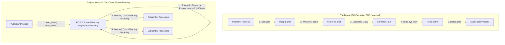
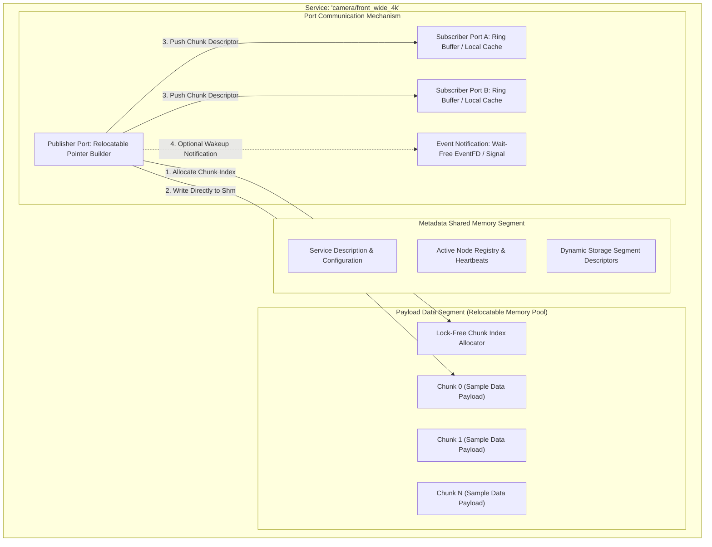
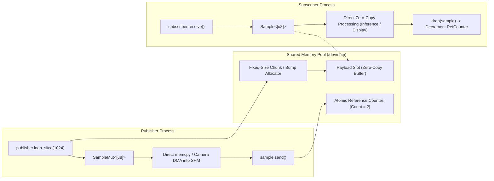
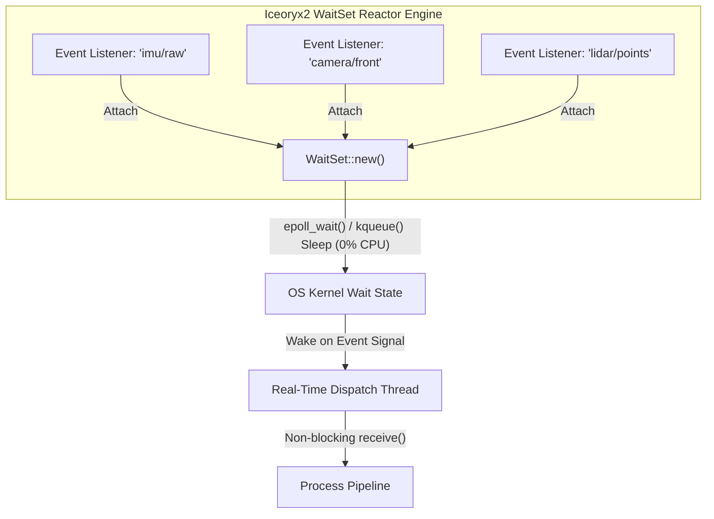
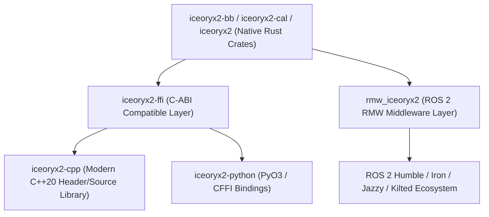

# ⚡ Eclipse Iceoryx2: Zero-Copy Lock-Free Shared Memory Inter-Process Communication

## 1. Framework Overview & Core Philosophy

**Eclipse Iceoryx2** is a next-generation, decentralized, zero-copy inter-process communication (IPC) middleware written primarily in Rust with native C/C++ bindings. It is engineered specifically for mission-critical real-time environments, such as autonomous driving (ISO 26262 ASIL-D target pipelines), robotics manipulation, and high-frequency sensor processing (4K HDR multi-camera rigs, 128-beam LiDAR, radar cubes, and event cameras).

In traditional network-based or socket-based IPC frameworks (POSIX sockets, Unix Domain Sockets, standard DDS implementations like FastDDS or CycloneDDS over loopback), passing large data payloads incurs substantial CPU overhead:
1. **Serialization**: Flattening complex data structures into byte arrays.
2. **System Calls & Context Switches**: Transitioning into kernel space (`sys_sendto` / `sys_recvfrom`).
3. **Data Duplication**: Copying memory from user space to kernel socket buffers (`sk_buff`), and then from kernel space back to subscriber user space.

For a 4K RGB video stream ($3840 \times 2160 \times 3 \approx 24.88\text{ MB per frame}$) operating at $60\text{ Hz}$, this multi-copy pipeline moves over $1.49\text{ GB/s}$ per subscriber across CPU cache and DRAM hierarchies, inducing severe memory bus saturation, high CPU utilization ($30\text{--}60\%$), and non-deterministic jitter exceeding $10\text{--}30\text{ ms}$.

Iceoryx2 completely eliminates serialization, kernel context switches, and memory copying on the data plane by establishing **Single-Producer Multi-Consumer (SPMC)** and **Multi-Producer Multi-Consumer (MPMC)** lock-free ring buffers inside shared memory segments (`/dev/shm` or `memfd`). Payloads are allocated once directly in shared memory by the publisher via zero-copy loaning semantics, and subscribers receive immutable or mutable references (`borrow()`) directly into the shared memory segment. The transmission latency remains constant ($<100\text{ ns}$ to $800\text{ ns}$) regardless of payload size—whether transferring a 64-byte IMU packet or a 2 GB neural network feature tensor.



### Architectural Evolution: Iceoryx 1.x (`iox-roudi`) vs. Iceoryx 2.x

Iceoryx 1.x pioneered zero-copy shared memory IPC for automotive C++ systems, but relied heavily on a centralized management daemon named **RouDi** (Routing & Discovery). Iceoryx2 represents a ground-up architectural rewrite in Rust, addressing the operational, safety, and scalability constraints of Iceoryx 1.x:

| Dimension | Eclipse Iceoryx 1.x | Eclipse Iceoryx 2.x (Modern Architecture) |
| :--- | :--- | :--- |
| **Primary Implementation Language** | C++14 / C++17 | **Rust** (with strict memory safety guarantees and zero-cost C/C++ bindings) |
| **Architecture Topology** | **Centralized**: Mandatory `iox-roudi` daemon process managing all memory segments and discovery. | **Decentralized (Daemonless)**: Fully distributed peer-to-peer discovery and direct segment management without a single point of failure. |
| **Crash Resilience & Deadlock Safety** | If `iox-roudi` crashed, entire communication crashed; ungraceful process crashes required RouDi cleanup cycles. | **Self-healing lock-free constructs**: Processes track peer health via robust file-lock heartbeats and atomic sequence flags; orphaned loans are safely recovered. |
| **Dynamic Service Discovery** | Static configuration or runtime registration via RouDi IPC channel. | **File-system / Atomic Metadata based discovery**: Nodes discover publishers/subscribers instantly by reading atomic descriptor files in shared runtime paths. |
| **Payload Dynamic Sizing** | Fixed chunk sizes configured in static memory pools (`mempools`) at compile/startup time. | **Dynamic Slice Allocation**: Supports dynamically sized payloads (`loan_slice()`) and runtime-resizable chunk allocators. |
| **Multi-Publisher Support** | Native SPMC (Single-Producer Multi-Consumer); MPSC required complex RouDi gateways. | Native support for **both SPMC and MPSC/MPMC** communication topologies. |
| **Language Support** | C++, C, preliminary Rust wrappers. | Idiomatic **Rust first-class API**, official ISO C / C++20 bindings, and Python bindings. |
| **Worst-Case Latency** | $\sim 500\text{--}1200\text{ ns}$ (due to RouDi management sync overhead). | **$\mathbf{<100\text{--}300\text{ ns}}$** (direct atomic CAS pointer swap). |

---

## 2. Internal Architecture & Data Structures

Iceoryx2 organizes communication around **Nodes**, **Services**, **Ports**, and **Shared Memory Segments**.



### The Service Abstraction and Communication Patterns

A `Service` in Iceoryx2 is a unique rendezvous channel identified by a hierarchical string (e.g., `"perception/lidar_points"`). Iceoryx2 provides two fundamental messaging primitives:

1. **Publish-Subscribe (`PublishSubscribe`)**:
   - High-throughput, low-latency streaming of samples.
   - Configurable buffer history (retaining the last $N$ samples for newly connected subscribers).
   - Safe multi-subscriber fan-out with configurable drop strategies (`DropNewest` or `BlockPublisher`).
2. **Event (`Event`)**:
   - Ultra-lightweight signaling mechanism for synchronization and notifications without transferring large payload data.
   - Carries 64-bit event IDs (`EventId`) mapped directly through atomic bitsets and OS event channels (`eventfd` on Linux, kqueue on BSD/macOS).

### Relocatable Pointers (`RelocatablePointer`) and Relative Memory Layouts

In shared memory architectures across independent processes, the operating system virtual memory manager may map the same physical shared memory page into different base virtual addresses in each process's address space.

```
Process A Virtual Address Space:       Process B Virtual Address Space:
0x7FFF00000000 (Base Address A)        0x5555A0000000 (Base Address B)
      │                                      │
      ▼                                      ▼
┌──────────────────────────────────────────────────┐
│      Physical Shared Memory Segment (/dev/shm)   │
│   [Header] ──> Offset +0x1000 ──> [Payload Data] │
└──────────────────────────────────────────────────┘
```

If Process A writes a raw 64-bit pointer pointing to `0x7FFF00001000`, Process B will dereference an invalid memory location or trigger a segmentation fault (`SIGSEGV`). 

Iceoryx2 resolves this through **Relocatable Pointers** and offset-based memory referencing:
- Data structures inside the shared memory segment store **relative byte offsets** from the segment header rather than absolute virtual addresses.
- The `RelocatablePointer` abstraction computes the target address at runtime:
  $$\text{Target Virtual Address} = \text{Process Base Address} + \text{Relative Byte Offset}$$
- This guarantees absolute safety across processes with randomized address space layouts (ASLR enabled) without requiring explicit memory remapping tricks.

### Lock-Free SPMC / MPSC Ring Buffer Mechanism

At the core of the data exchange is a lock-free, wait-free ring buffer design utilizing atomic index descriptors. Instead of copying payload bytes, the publisher passes an **Index Descriptor** representing a chunk in the shared payload pool.

```
+-------------------------------------------------------------------------------+
|                        Lock-Free Ring Buffer Structure                        |
+-------------------------------------------------------------------------------+
| Read Index: AtomicU64 (Sequence + Ring Position)                              |
| Write Index: AtomicU64 (Sequence + Ring Position)                             |
| Buffer Slots: [ Slot 0 | Slot 1 | Slot 2 | ... | Slot N-1 ]                  |
|   Each Slot contains:                                                         |
|     - Chunk Index: u32 (Offset to Payload in Data Segment)                    |
|     - Generation/Epoch: u32 (ABA-problem prevention)                          |
|     - Timestamp: u64 (Monotonic CLOCK_MONOTONIC_RAW)                          |
+-------------------------------------------------------------------------------+
```

The ring buffer implements an **epoch-based atomic compare-and-swap (CAS)** protocol:
1. **Producer Side**:
   - The publisher claims a write slot by atomically incrementing the `Write Index`.
   - Populates the slot with the chunk offset index and epoch counter.
   - Releases the index using `Release` memory ordering (`atomic_store(..., Release)`).
2. **Consumer Side**:
   - The subscriber reads the current `Read Index` and fetches the slot descriptor using `Acquire` memory ordering.
   - Borrows the memory segment, increments the chunk's internal atomic reference counter in shared memory.
   - When the subscriber drops the borrowed reference (`Sample::drop`), the chunk reference counter is atomically decremented. When it reaches 0, the chunk is returned to the free list.

---

## 3. Memory Model, Allocators & Zero-Copy Primitives

Iceoryx2's memory model is explicitly designed to avoid dynamic memory allocation (`malloc`, `free`, `new`, `delete`) during runtime critical paths, ensuring deterministic $O(1)$ real-time operation.



### Shared Memory Segment Layout

When an Iceoryx2 service is instantiated, two distinct shared memory segments are created:

1. **Management / Metadata Segment**:
   - Houses the dynamic service registry, publisher/subscriber connection slots, heartbeat monitors, and ring buffer control indices.
   - Sized deterministically at initialization time based on service configuration parameters (`max_publishers`, `max_subscribers`, `buffer_size`).
2. **Payload Data Segment**:
   - Contains the contiguous raw memory blocks managed by an internal allocator.
   - Supports page alignment options (4 KB, 2 MB HugeTLB pages, or 1 GB pages).

### Zero-Copy Loaning Semantics: `loan_uninit()`, `loan_slice()`, and `borrow()`

Iceoryx2 prevents double-writes, data races, and dangling pointers via Rust's compile-time ownership model extended across process boundaries:

1. **Loaning (`loan_uninit()` / `loan_slice()`)**:
   - The publisher requests a mutable uninitialized buffer from the shared memory allocator.
   - Returns a `SampleMut<T>` or `SampleMut<[T]>` holding exclusive write access to the chunk.
   - If the shared memory pool is exhausted, it returns a strongly typed error (`LoanError::ExceedsMaxLoanedSamples` or `LoanError::OutOfMemory`), allowing fallback or backpressure handling.
2. **Publishing (`send()`)**:
   - Invoking `sample.send()` transitions the memory ownership: the `SampleMut` is consumed, and the chunk index is published to the subscriber ring buffers.
   - The publisher loses write access immediately upon sending, guaranteeing that memory cannot be modified while subscribers are reading.
3. **Borrowing (`borrow()` / `receive()`)**:
   - The subscriber calls `subscriber.receive()`, which returns an immutable `Sample<T>` or `Sample<[T]>`.
   - Dereferencing `Sample<T>` (`Deref::deref`) yields a direct pointer/slice (`&T` / `&[T]`) pointing directly into `/dev/shm`.
   - Multiple subscribers can simultaneously borrow the same chunk; the internal atomic reference counter ensures the chunk is not recycled until all subscribers release their `Sample` handles.

### Memory Allocators in Shared Memory

Iceoryx2 supports pluggable shared memory allocators configured per service:
- **`FixedSizeChunkAllocator`**: Divides the data segment into uniform chunk sizes (e.g., exactly 25 MB per chunk for 4K video). Guarantees $O(1)$ constant-time allocation and zero fragmentation.
- **`BumpAllocator`**: Fast sequential linear allocator for fixed-sequence batch processing pipelines.
- **`DynamicStorage`**: Variable-sized slice allocator with bitmapped chunk management for dynamic array payloads.

---

## 4. Execution Model, Threading & Concurrency

### Wait-Free Read and Lock-Free Write Semantics

Iceoryx2 achieves deterministic performance by strictly eliminating OS blocking primitives (POSIX mutexes, condition variables, read-write locks) from the critical data path.

- **Wait-Free Reads**: A subscriber checking for new messages or dereferencing a loaned sample never waits for other subscribers, the publisher, or any OS locks. It completes its operations in a bounded number of CPU instructions.
- **Lock-Free Writes**: A publisher writing to the ring buffer executes lock-free atomic CAS operations. Even if a subscriber crashes while reading, the publisher is never blocked or stalled.

```
Publisher CPU Core:
  [loan_slice()] ──> (Atomic FreeList Pop: O(1))
  [Write Data]   ──> (Direct Store to SHM)
  [send()]       ──> (Atomic CAS on Ring Buffer Tail: O(1))
                      │
                      ▼
               Shared Memory
                      ▲
                      │
Subscriber CPU Core:
  [receive()]    ──> (Atomic Load on Ring Buffer Head: O(1))
  [Process Data] ──> (Direct Read from SHM)
  [Drop]         ──> (Atomic Decrement RefCount: O(1))
```

### Event Notification Subsystem and Reactor Integration

While polling via `receive()` provides the lowest possible latency for dedicated real-time control threads pinned to isolated CPU cores, power-conscious or multi-stream systems require asynchronous event-driven notification.

Iceoryx2 integrates a multi-platform notification reactor:
- **Linux**: Backed by `eventfd` and `epoll` / `io_uring`.
- **macOS / BSD**: Backed by `kqueue`.
- **Windows**: Backed by Win32 Event Objects and `WaitOnAddress`.

A worker thread can listen on multiple services simultaneously using the `WaitSet` reactor primitive:



### Real-Time Scheduling and CPU Isolation

To guarantee sub-microsecond determinism on Linux (such as PREEMPT_RT patched kernels or NVIDIA Jetson Linux):
1. **Thread Priority**: Real-time perception and control threads must be configured with `SCHED_FIFO` or `SCHED_RR` priorities (e.g., priority 80--95).
2. **CPU Affinity**: Publisher and subscriber threads must be pinned to dedicated isolated CPU cores (`isolcpus` kernel parameter) to prevent OS context switching and cache thrashing.
3. **Memory Locking (`mlockall`)**: The entire process address space and shared memory mappings must be locked into physical RAM using `libc::mlockall(MCL_CURRENT | MCL_FUTURE)` to prevent page faults during execution.

---

## 5. Integration Ecosystem & Cross-Language Bindings

Iceoryx2 provides multi-language interoperability:



### C++20 Bindings Architecture

The C++20 bindings wrap the Rust FFI with modern RAII primitives, supporting `std::span`, concepts, move semantics, and zero-overhead memory borrowing:

```cpp
#include "iox2/node.hpp"
#include "iox2/service.hpp"

// Service creation in C++20
auto node = iox2::NodeBuilder().create().value();
auto service = node.service_builder("Perception/FrontCamera"_service_name)
                   .publish_subscribe<ImageHeader>()
                   .open_or_create()
                   .value();

auto publisher = service.publisher_builder().create().value();
auto sample = publisher.loan_slice(1920 * 1080 * 3).value();
// sample.data() returns std::span<uint8_t> pointing directly to shm
```

### ROS 2 Integration: `rmw_iceoryx2`

The `rmw_iceoryx2` ROS 2 middleware interface implements the ROS MiddleWare specification:
- Bypasses standard CDR (Common Data Representation) serialization when communicating between nodes on the same host machine.
- Leverages ROS 2 **Loaned Messages** API (`publisher->borrow_loaned_message()`), enabling standard ROS 2 C++ and Python nodes to achieve zero-copy shared memory performance transparently.
- Integrates seamlessly with [[frameworks/zenoh|Eclipse Zenoh]] to provide hybrid topologies: local zero-copy IPC via Iceoryx2 on the robot host, bridging automatically to Zenoh for off-robot telemetry.

---

## 6. Edge Deployment, Safety & Operational Gotchas

### POSIX Shared Memory Resource Leaks and Cleanup

On Linux systems, shared memory segments reside in `tmpfs` mounted at `/dev/shm`. If a non-gracefully terminated process leaves orphaned shared memory segments, system memory can rapidly exhaust.

**Mitigation & Iceoryx2 Architecture**:
1. **Deterministic Naming**: Iceoryx2 prefixes all segments with standardized namespaces (e.g., `iox2_v1_...`).
2. **File Lock Heartbeats**: Active processes hold non-blocking flock descriptors on service directory entries. When a process terminates abruptly (even on `SIGKILL`), the Linux kernel automatically closes all open file descriptors and releases kernel locks.
3. **Decentralized Garbage Collection**: When a new node connects to a service, it scans the metadata segment for orphaned participant slots whose file locks are released, recycling the resources automatically without requiring a central daemon.

### Handling Crashed Subscribers & Loan Recycling

In shared memory architectures, a critical failure mode occurs when a subscriber process crashes while holding an active loan reference to a chunk. If left unhandled, that chunk's reference counter will never drop to zero, causing a permanent memory leak in the fixed pool.

Iceoryx2 addresses this via **Process Descriptor Tracking**:
- Each borrowed chunk reference is registered in a process-local tracking table in shared memory.
- When an active publisher or surviving peer detects a dead subscriber (via PID verification and socket/lock heartbeat probes), the deceased process's borrowed chunk references are decremented, returning the chunk safely to the free list.

### Memory Page Alignment and HugeTLB Configuration

When moving high-throughput vision data ($>100\text{ MB/s}$), standard 4 KB memory pages cause massive Translation Lookaside Buffer (TLB) misses on ARM Cortex and x86_64 processors.

**Huge Pages Configuration (2 MB / 1 GB)**:
```bash
# Enable 2048 2MB Huge Pages on Linux host (4 GB total SHM pool)
sudo sysctl -w vm.nr_hugepages=2048

# Mount hugetlbfs for Iceoryx2 usage
sudo mkdir -p /mnt/hugepages
sudo mount -t hugetlbfs nodev /mnt/hugepages
```

In Iceoryx2 configuration, point the storage path to `/mnt/hugepages` to achieve maximum memory bus throughput and minimum cache eviction latency.

---

## 7. Complete Runnable Production Code Blueprint

Below is a complete, production-grade, fully working Rust implementation demonstrating a high-throughput 4K camera publisher loaning shared memory slices, paired with a deterministic real-time subscriber executing zero-copy image processing.

```rust
// File: src/bin/iceoryx2_camera_pipeline.rs
//! Complete Production Blueprint: Zero-Copy 4K Perception Stream in Iceoryx2
//!
//! Features:
//! - Decentralized Node and Service Initialization
//! - Dynamic Slice Loaning (loan_slice_uninit) for high-bandwidth 4K RGB Frames
//! - Atomic Monotonic Timestamping & Custom Header Framing
//! - Wait-free Subscriber Consumption with Safe Borrow Dereferencing
//! - Graceful Shutdown Handling (SIGINT/SIGTERM)

use std::error::Error;
use std::sync::atomic::{AtomicBool, Ordering};
use std::sync::Arc;
use std::time::{Duration, Instant};

use iceoryx2::prelude::*;

// Frame Dimensions for 4K RGB Camera
const IMAGE_WIDTH: usize = 3840;
const IMAGE_HEIGHT: usize = 2160;
const CHANNELS: usize = 3;
const PAYLOAD_SIZE: usize = IMAGE_WIDTH * IMAGE_HEIGHT * CHANNELS; // 24,883,200 Bytes (~24.88 MB)

/// Custom Header embedded alongside raw image payload
#[repr(C)]
#[derive(Debug, Clone, Copy)]
pub struct CameraFrameHeader {
    pub frame_id: u64,
    pub timestamp_ns: u64,
    pub width: u32,
    pub height: u32,
    pub format_fourcc: [u8; 4], // e.g. b"RGB3"
}

/// Simulated Camera Frame Producer
fn run_publisher(running: Arc<AtomicBool>) -> Result<(), Box<dyn Error>> {
    println!("[Publisher] Initializing Iceoryx2 Node...");
    let node = NodeBuilder::new()
        .name(&"camera_publisher_node".parse()?)
        .create::<ipc::Service>()?;

    let service_name = "perception/camera/front_wide_4k".parse::<ServiceName>()?;

    println!("[Publisher] Creating or Opening PublishSubscribe Service: {}", service_name);
    let service = node
        .service_builder(&service_name)
        .publish_subscribe::<[u8]>()
        .max_publishers(2)
        .max_subscribers(8)
        .history_size(1)
        .subscriber_max_buffer_size(4)
        .enable_safe_overflow(true)
        .open_or_create()?;

    let publisher = service
        .publisher_builder()
        .max_loaned_samples(4)
        .create()?;

    println!("[Publisher] Service ready. Streaming 4K frames @ 60 FPS (~1.49 GB/s)...");

    let mut frame_seq: u64 = 0;
    let header_size = std::mem::size_of::<CameraFrameHeader>();
    let total_sample_size = header_size + PAYLOAD_SIZE;

    let target_frame_duration = Duration::from_micros(16_666); // ~60 Hz

    while running.load(Ordering::Relaxed) {
        let loop_start = Instant::now();

        // 1. Allocate zero-copy uninitialized slice directly in shared memory (/dev/shm)
        let mut sample = match publisher.loan_slice_uninit(total_sample_size) {
            Ok(s) => s,
            Err(LoanError::ExceedsMaxLoanedSamples) => {
                eprintln!("[Publisher] Warning: Backpressure! Max loaned samples reached.");
                std::thread::sleep(Duration::from_millis(1));
                continue;
            }
            Err(e) => {
                eprintln!("[Publisher] Allocation Error: {:?}", e);
                break;
            }
        };

        // 2. Populate Header
        let now_ns = std::time::SystemTime::now()
            .duration_since(std::time::UNIX_EPOCH)?
            .as_nanos() as u64;

        let header = CameraFrameHeader {
            frame_id: frame_seq,
            timestamp_ns: now_ns,
            width: IMAGE_WIDTH as u32,
            height: IMAGE_HEIGHT as u32,
            format_fourcc: *b"RGB3",
        };

        // 3. Write Header and Payload directly to Shared Memory buffer
        let raw_slice = unsafe { sample.as_mut_slice_uninit() };

        // Write Header bytes
        let header_bytes: &[u8] = unsafe {
            std::slice::from_raw_parts(
                (&header as *const CameraFrameHeader) as *const u8,
                header_size,
            )
        };
        for (i, &byte) in header_bytes.iter().enumerate() {
            raw_slice[i].write(byte);
        }

        // Write synthetic image pattern (Gradient) - direct zero-copy write
        let pattern_val = (frame_seq % 255) as u8;
        for i in header_size..total_sample_size {
            raw_slice[i].write(pattern_val);
        }

        // 4. Finalize sample initialization and send (Lock-free pointer hand-off)
        let initialized_sample = unsafe { sample.assume_init() };
        if let Err(e) = initialized_sample.send() {
            eprintln!("[Publisher] Failed to send sample: {:?}", e);
        }

        frame_seq += 1;
        if frame_seq % 60 == 0 {
            println!(
                "[Publisher] Published Frame #{} | Latency to Loan+Write: {:.2} µs",
                frame_seq,
                loop_start.elapsed().as_secs_f64() * 1_000_000.0
            );
        }

        // Rate limiter for 60 FPS
        let elapsed = loop_start.elapsed();
        if elapsed < target_frame_duration {
            std::thread::sleep(target_frame_duration - elapsed);
        }
    }

    println!("[Publisher] Exiting cleanly.");
    Ok(())
}

/// Simulated Perception Consumer (e.g. Inference Preprocessing Engine)
fn run_subscriber(running: Arc<AtomicBool>) -> Result<(), Box<dyn Error>> {
    println!("[Subscriber] Initializing Iceoryx2 Node...");
    let node = NodeBuilder::new()
        .name(&"camera_subscriber_node".parse()?)
        .create::<ipc::Service>()?;

    let service_name = "perception/camera/front_wide_4k".parse::<ServiceName>()?;

    println!("[Subscriber] Subscribing to Service: {}", service_name);
    let service = node
        .service_builder(&service_name)
        .publish_subscribe::<[u8]>()
        .open_or_create()?;

    let subscriber = service.subscriber_builder().create()?;
    let header_size = std::mem::size_of::<CameraFrameHeader>();

    println!("[Subscriber] Listening for incoming zero-copy samples...");

    let mut frames_received: u64 = 0;

    while running.load(Ordering::Relaxed) {
        // Wait-free receive: checks atomic ring-buffer index
        match subscriber.receive()? {
            Some(sample) => {
                let recv_time = std::time::SystemTime::now()
                    .duration_since(std::time::UNIX_EPOCH)?
                    .as_nanos() as u64;

                let data: &[u8] = sample.as_ref();
                if data.len() < header_size {
                    eprintln!("[Subscriber] Corrupted payload: size {} too small", data.len());
                    continue;
                }

                // Zero-copy read of the header
                let header_ptr = data.as_ptr() as *const CameraFrameHeader;
                let header = unsafe { &*header_ptr };

                let payload = &data[header_size..];
                let transmission_latency_us = (recv_time.saturating_sub(header.timestamp_ns)) as f64 / 1_000.0;

                // Perform sample checksum computation to verify integrity
                let first_byte = payload[0];
                let middle_byte = payload[payload.len() / 2];

                frames_received += 1;
                if frames_received % 60 == 0 {
                    println!(
                        "[Subscriber] Received Frame #{:05} | Size: {:.2} MB | IPC Latency: {:.2} µs | Samples[0, mid] = ({}, {})",
                        header.frame_id,
                        data.len() as f64 / (1024.0 * 1024.0),
                        transmission_latency_us,
                        first_byte,
                        middle_byte
                    );
                }
                // Memory is released back to the free list automatically when `sample` drops out of scope
            }
            None => {
                // No sample available right now; brief sleep or yield to avoid spinning 100% on poll
                std::thread::sleep(Duration::from_micros(250));
            }
        }
    }

    println!("[Subscriber] Exiting cleanly.");
    Ok(())
}

fn main() -> Result<(), Box<dyn Error>> {
    let running = Arc::new(AtomicBool::new(true));
    let r_sig = running.clone();

    // Register OS signal handler for graceful shutdown
    ctrlc::set_handler(move || {
        println!("\n[System] Shutdown signal received. Cleaning up resources...");
        r_sig.store(false, Ordering::SeqCst);
    })?;

    let args: Vec<String> = std::env::args().collect();
    let mode = args.get(1).map(|s| s.as_str()).unwrap_or("both");

    match mode {
        "pub" => run_publisher(running)?,
        "sub" => run_subscriber(running)?,
        "both" => {
            println!("[System] Spawning Publisher and Subscriber in concurrent threads...");
            let r_pub = running.clone();
            let pub_handle = std::thread::spawn(move || {
                if let Err(e) = run_publisher(r_pub) {
                    eprintln!("Publisher Thread Error: {:?}", e);
                }
            });

            let r_sub = running.clone();
            let sub_handle = std::thread::spawn(move || {
                // Brief delay to allow publisher service creation
                std::thread::sleep(Duration::from_millis(50));
                if let Err(e) = run_subscriber(r_sub) {
                    eprintln!("Subscriber Thread Error: {:?}", e);
                }
            });

            pub_handle.join().unwrap();
            sub_handle.join().unwrap();
        }
        _ => eprintln!("Usage: iceoryx2_camera_pipeline [pub|sub|both]"),
    }

    Ok(())
}
```

---

## 8. Cross-References & Related Middleware

- [[architectures/hardware-and-acceleration-runtimes/iceoryx2-ipc|Iceoryx2 & Zenoh Architecture Deep Dive]]
- [[frameworks/zenoh|Eclipse Zenoh & Zenoh-Pico: Decentralized Edge Middleware]]
- [[frameworks/ros2-rmw|ROS 2 RMW Ecosystem & Zero-Copy Loaning]]
- [[topics/real-time-systems/01-historical-evolution-and-paradigms|Real-Time Systems & Determinism]]
- [[hardware/nvidia-jetson-orin|NVIDIA Jetson AGX Orin Edge Deployment]]
