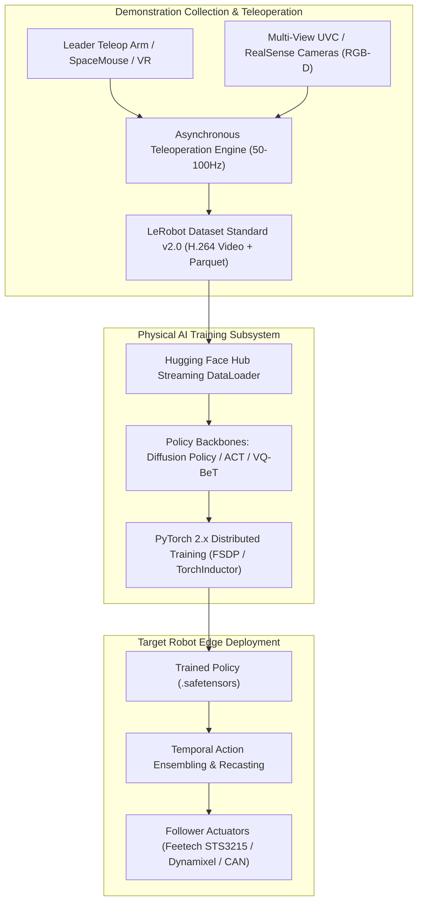
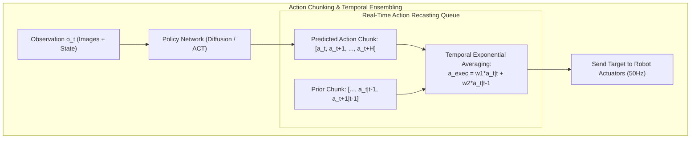
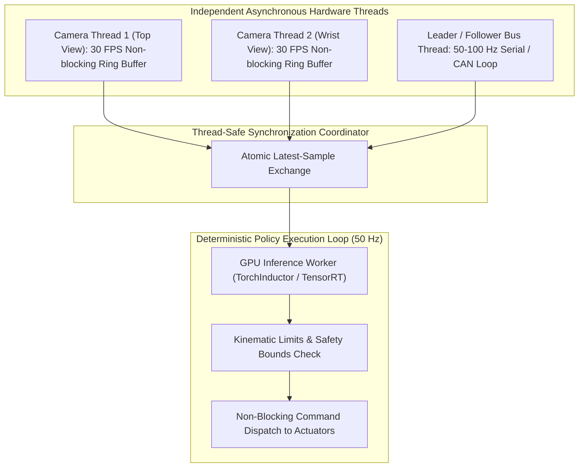

# 🦾 HuggingFace LeRobot: Physical AI, Robot Teleoperation & Visuomotor Policy Pipelines

## 1. Framework Overview & Core Philosophy

**HuggingFace LeRobot** is an open-source framework designed to democratize and industrialize **Physical AI and Visuomotor Robot Learning**. 

Historically, robot manipulation relied on rigid, hand-engineered control stacks: analytical forward/inverse kinematics, trajectory optimization, PID feedback controllers, and brittle finite state machines. While reliable in structured manufacturing environments, classical control fails when confronted with unstructured, deformable, or visually diverse real-world tasks (such as folding laundry, preparing food, or clearing cluttered tables).

LeRobot pioneers the transition to **End-to-End Visuomotor Imitation Learning**:
- Neural policies ingest raw multimodal sensory observations: multi-view RGB video streams, depth maps, and proprioceptive joint positions.
- Neural networks directly predict continuous actuator control trajectories (joint angles, velocities, torques, or 6-DoF end-effector poses).
- Provides standardized dataset formats on the Hugging Face Hub, reference implementations of state-of-the-art policy architectures (**Diffusion Policy**, **Action Chunking with Transformers [ACT]**, **VQ-BeT**, and **SmolVLM-Robot**), and plug-and-play teleoperation tools for open-source manipulators (SO-100, ALOHA, Koch v1.1, Franka Emika Panda, and Unitree G1 humanoids).



---

## 2. LeRobot Dataset Standard (v2.0) Architecture

A major historical obstacle in robotics research was the fragmentation of demonstration formats across custom HDF5 schemas, ROS 1/2 bag files, and uncompressed NumPy arrays. LeRobot introduces a unified, cloud-native dataset standard:

```
dataset_root/
  ├── meta/
  │     ├── info.json          (Robot hardware specs, features schema, FPS, total frames)
  │     ├── episodes.jsonl     (Episode boundaries, tasks, success flags)
  │     └── tasks.jsonl        (Natural language task descriptions)
  ├── videos/
  │     ├── observation.images.laptop/
  │     │     ├── chunk-000.mp4 (H.264 / AV1 compressed multi-frame video)
  │     │     └── chunk-001.mp4
  │     └── observation.images.wrist/
  │           └── chunk-000.mp4
  └── data/
        ├── chunk-000.parquet   (Proprioception: joint positions, velocities, actions)
        └── chunk-001.parquet
```

- **Video Compression**: Image streams are stored as hardware-accelerated H.264 or AV1 MP4 chunks, reducing dataset footprints by **$>90\%$** compared to raw uncompressed NumPy/HDF5 frames.
- **Apache Parquet / Arrow Columnar Storage**: High-frequency numerical observations (joint angles, velocities, torques, timestamps, actions) are stored in flat Parquet files, enabling instant slicing and zero-copy ingestion into PyTorch.

---

## 3. The Action Chunking & Temporal Ensembling Paradigm

Standard behavioral cloning (predicting a single action $a_t$ given observation $o_t$) suffers from severe **compounding execution error**: minor visual shifts cause the robot to drift off-trajectory, leading to catastrophic task failure.

LeRobot solves this via **Action Chunking**:
- The policy observes a short historical window of observations $o_{t-k:t}$.
- It predicts an entire future trajectory chunk of actions $A_t = [a_t, a_{t+1}, a_{t+2}, \dots, a_{t+H}]$ spanning an action horizon $H$ (typically $H = 16\text{--}64$ steps, representing $0.3\text{--}1.5\text{ seconds}$).
- During inference, overlapping action chunks generated at successive timesteps are combined using **Temporal Action Ensembling** (exponentially decaying moving average), resulting in smooth, dynamic manipulation.



---

## 4. Policy Architectures

### A. Diffusion Policy (DDPM & DDIM)
Formulates robot action generation as a conditional denoising diffusion process over continuous action trajectories:
- Ingests visual tokens extracted via a vision backbone (ResNet-18/50, DINOv2, or SigLIP) concatenated with robot joint states.
- Applies an iterative stochastic reverse diffusion process starting from standard Gaussian noise $\epsilon \sim \mathcal{N}(0, I)$ to generate the action sequence $A_t \in \mathbb{R}^{H \times D_a}$.
- **Core Advantage**: Expresses arbitrary multi-modal action distributions (e.g., deciding whether to navigate around an obstacle via the left or right path without averaging them into a disastrous middle collision).

### B. Action Chunking with Transformers (ACT)
- Employs a Conditional Variational Autoencoder (C-VAE) paired with a Transformer Encoder-Decoder.
- The C-VAE encodes demonstration style and human variability into a latent variable $z \sim q(z|o, a)$.
- The Transformer Decoder takes visual patch tokens, joint positions, and the sampled latent vector $z$, outputting $H$ future action steps in a single forward pass.
- **Inference Speed**: Executes in a single neural forward pass ($<15\text{ ms}$ on NVIDIA Jetson Orin), making it significantly faster than iterative diffusion models.

---

## 5. Asynchronous Teleoperation & Hardware Drivers

In physical robot operation, synchronous blocking loops cause catastrophic stuttering: If a camera frame grab takes $45\text{ ms}$ due to USB bus contention, the motor control loop will miss its $50\text{ Hz}$ ($20\text{ ms}$) real-time deadline, causing the arm to lose stiffness and drop objects.

LeRobot resolves this through an **Asynchronous Multi-Threaded Architecture**:



### Supported Hardware Manipulators
- **SO-100 & SO-ARM100**: Low-cost ($<\$120$) 3D-printed 6-DoF arms using Feetech STS3215 serial bus servomotors.
- **ALOHA & Mobile ALOHA**: Dual-arm bimanual teleoperation stations with active grabbers.
- **Franka Emika Panda & UR5e**: Industrial arms controlled via direct libfranka / RTDE interfaces.
- **Unitree G1 & H1 Humanoids**: Full-body humanoid coordination policies.

---

## 6. Complete Runnable Production Code Blueprint

```python
#!/usr/bin/env python3
"""
Complete Production Blueprint: LeRobot / ACT Imitation Learning & Teleoperation Pipeline
"""

import time
import math
import torch
import torch.nn as nn
from collections import deque
from dataclasses import dataclass

@dataclass
class RobotState:
    joint_positions: list
    timestamp: float

class MockACTPolicy(nn.Module):
    """
    Action Chunking with Transformers (ACT) Policy Module
    Predicts a trajectory chunk of future joint actions given multimodal inputs.
    """
    def __init__(self, action_dim=6, chunk_size=16):
        super().__init__()
        self.action_dim = action_dim
        self.chunk_size = chunk_size

        # Simple projection simulating visual + proprioception transformer decoder
        self.net = nn.Sequential(
            nn.Linear(action_dim, 128),
            nn.ReLU(),
            nn.Linear(128, chunk_size * action_dim)
        )

    def forward(self, qpos):
        B = qpos.shape[0]
        out = self.net(qpos)
        return out.view(B, self.chunk_size, self.action_dim)

class TemporalActionEnsembler:
    """
    Exponentially decaying moving average across overlapping action chunks.
    """
    def __init__(self, chunk_size=16, exp_weight=0.01):
        self.chunk_size = chunk_size
        self.exp_weight = exp_weight
        self.action_history = deque(maxlen=chunk_size)

    def update_and_get_action(self, new_action_chunk: torch.Tensor) -> torch.Tensor:
        # new_action_chunk shape: (chunk_size, action_dim)
        self.action_history.append(new_action_chunk)

        num_chunks = len(self.action_history)
        action_dim = new_action_chunk.shape[-1]
        weighted_action = torch.zeros(action_dim)
        total_weight = 0.0

        for i, chunk in enumerate(self.action_history):
            # Target index for current timestep in older chunks
            t_idx = (num_chunks - 1) - i
            if t_idx < self.chunk_size:
                weight = math.exp(-self.exp_weight * t_idx)
                weighted_action += chunk[t_idx] * weight
                total_weight += weight

        return weighted_action / total_weight

def run_physical_ai_demo():
    print("[LeRobot] Initializing Action Chunking Transformer (ACT) Pipeline...")
    device = "cuda" if torch.cuda.is_available() else "cpu"

    policy = MockACTPolicy(action_dim=6, chunk_size=16).to(device)
    policy.eval()

    ensembler = TemporalActionEnsembler(chunk_size=16, exp_weight=0.05)

    print("[LeRobot] Simulating 50Hz Real-Time Visuomotor Control Loop...")
    for step in range(20):
        # 1. Ingest Robot Proprioception (6-DoF Joint Angles)
        qpos_current = torch.randn(1, 6, device=device)

        # 2. Run Policy Inference (Predict Action Chunk of 16 Steps)
        with torch.no_grad():
            action_chunk = policy(qpos_current).squeeze(0) # Shape: (16, 6)

        # 3. Apply Temporal Action Ensembling
        smoothed_action = ensembler.update_and_get_action(action_chunk.cpu())

        print(f"Step {step:02d} | Executing Ensembled Joint Target: {smoothed_action[:3].numpy().round(3)}")
        time.sleep(0.02) # 50Hz control tick

    print("[LeRobot] Visuomotor execution loop completed successfully.")

if __name__ == "__main__":
    run_physical_ai_demo()
```

---

## 7. Cross-Reference Links
- [[frameworks/robomimic|Robomimic Imitation Learning & Offline RL Suite]]
- [[frameworks/torchvision|TorchVision Operators, Transforms v2 & GPU Decoding]]
- [[hardware/nvidia-jetson-orin|NVIDIA Jetson AGX Orin Physical AI Deployment]]
