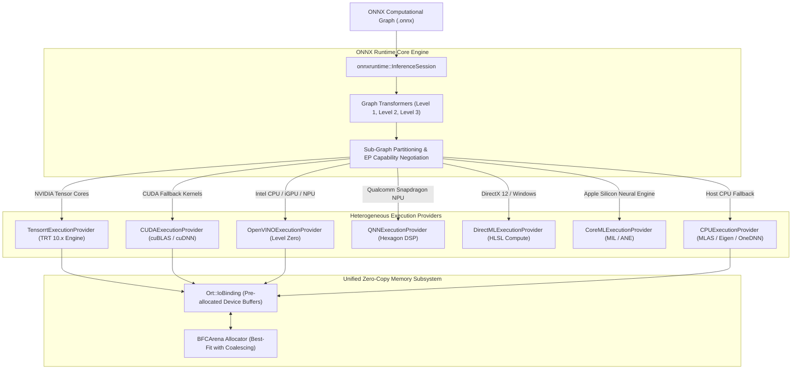

# 🌐 ONNX Runtime 1.20+: Cross-Platform Execution Provider Architecture & Memory Primitives

## 1. Framework Overview & Core Philosophy

ONNX Runtime (ORT) is an open-source, industrial-grade scoring and inference engine designed to execute computation graphs defined under the Open Neural Network Exchange (ONNX) specification. The core architectural philosophy of ONNX Runtime is the **Execution Provider (EP) Abstraction**: decoupling the high-level neural graph representation, memory lifecycle management, and graph-level optimization from the underlying silicon-specific compute kernels.

Rather than locking models into vendor-specific compiler toolchains, ONNX Runtime acts as a universal orchestrator that partitions an arbitrary neural network across multiple heterogeneous accelerators within a single process.



### Supported Hardware Ecosystem via Execution Providers

| Execution Provider | Hardware Backends | Execution Mechanism | Target Environment |
| :--- | :--- | :--- | :--- |
| **`TensorrtExecutionProvider`** | NVIDIA GPUs (Blackwell, Hopper, Ada, Ampere, Orin) | Compiles subgraphs into TensorRT engine binaries | High-throughput server & edge robotics |
| **`CUDAExecutionProvider`** | NVIDIA discrete GPUs & Tegra | Native CUDA C++/cuBLAS/cuDNN kernel dispatch | General NVIDIA GPU inference |
| **`OpenVINOExecutionProvider`** | Intel CPUs (Xeon, Core Ultra), iGPUs, NPUs (Lunar/Arrow Lake) | Compiles subgraphs to OpenVINO compiled models | Intel client & edge edge devices |
| **`QNNExecutionProvider`** | Qualcomm Snapdragon SoCs (X Elite, 8 Gen 3/4) | Compiles subgraphs to QNN HTP (Hexagon DSP) bytecode | Windows on ARM & Mobile |
| **`DirectMLExecutionProvider`** | Any DirectX 12 GPU (AMD Radeon, Intel Arc, NVIDIA GeForce) | Compiles operators to Direct3D 12 HLSL compute shaders | Windows desktop & cross-vendor GPU |
| **`CoreMLExecutionProvider`** | Apple Silicon (M1--M4, A14--A18) | Compiles subgraphs to CoreML MIL programs for ANE | macOS, iOS, Apple VisionOS |
| **`WebGpuExecutionProvider`** | Browsers & WebAssembly runtimes | Compiles nodes into WGSL shaders via WebGPU standard | Browser-based edge AI |
| **`CPUExecutionProvider`** | x86_64 (AVX-512, AMX, VNNI), ARM64 (NEON, SVE) | Micro-architectural kernels via Microsoft MLAS / OneDNN | Universal fallback runtime |

---

## 2. Internal Compilation Pipeline & Graph Representation

### A. Graph Ingestion & IR Representation
ONNX Runtime represents a computation graph as an `onnxruntime::Graph` object containing a topologically ordered collection of `onnxruntime::Node` objects. Each node contains references to input/output `onnxruntime::NodeArg` definitions specifying data type (`ONNXTensorElementDataType`), rank, and symbolic or static dimensions.

### B. Graph Transformer Hierarchy
Before delegating subgraphs to execution providers, ORT executes graph transformations categorized into three optimization levels:

1. **Level 1 (Basic Graph Optimizations)**:
   - *Constant Folding*: Pre-computes operations with compile-time known constant inputs (e.g., shape computations, weight transpositions).
   - *Dead Code Elimination*: Removes unreachable nodes and unreferenced initializers.
   - *Redundant Node Elimination*: Eliminates identity operations, redundant slice/squeeze patterns, and consecutive inverse transpose nodes ($T_1 \circ T_2 = I$).
2. **Level 2 (Extended Graph Optimizations)**:
   - *Layer Fusions*: Fuses common structural patterns into proprietary compound kernels.
     - `Conv + Add + Relu` $\to$ `FusedConv`
     - `MatMul + Add + FastGELU` $\to$ `FusedMatMulGelu`
     - Multi-Head Attention: Fuses separate Slice, MatMul, Scale, Softmax, Transpose subgraphs into a unified `Attention` or `MultiHeadAttention` operator using FlashAttention heuristics.
     - `LayerNorm / SkipLayerNorm`: Combines normalization and residual addition into a single vectorized pass.
3. **Level 3 (Layout & Hardware-Specific Optimizations)**:
   - *Data Layout Transformations*: Converts standard ONNX $NCHW$ layouts to hardware-native $NHWC$ layouts (Channels-Last) for superior cache locality and vectorization on Tensor Cores, ARM NEON, and NPUs.

```
Extended Attention Fusion Transformation:
[QKV Input]
   │
   ├──> [MatMul W_q] ──> [Reshape] ──> [Transpose] ──┐
   ├──> [MatMul W_k] ──> [Reshape] ──> [Transpose] ──┼─> [MatMul] ──> [Scale] ──> [Softmax] ──> [MatMul] ──> [Output]
   └──> [MatMul W_v] ──> [Reshape] ──> [Transpose] ──┘
                          ⬇ (Level 2 Fusion Pass)
[QKV Input] ──> [Fused MultiHeadAttention Kernel (FlashAttention-2)] ──> [Output]
```

### C. EP Capability Negotiation & Graph Partitioning
The graph partitioning protocol determines which nodes run on hardware accelerators versus host CPU:
1. **Capability Query (`GetCapability`)**:
   ORT iterates through registered EPs in user-specified priority order. It invokes `IExecutionProvider::GetCapability(graph, kernel_lookup)`, passing the unpartitioned graph.
2. **Sub-Graph Claiming (`IndexedSubGraph`)**:
   The EP inspects each node's operator domain, version, data types, and attributes. It returns a list of `IndexedSubGraph` objects containing sets of node indices it can execute natively.
3. **Graph Slicing & Fusion**:
   ORT clusters contiguous claimed nodes into a single **FusedNode**. The original subgraph is extracted and replaced by a custom kernel instance (e.g., a serialized TensorRT engine plan or an OpenVINO CompiledModel blob). Unclaimed nodes default to the next lower-priority EP or `CPUExecutionProvider`.

---

## 3. Memory Model, Allocators & Zero-Copy Primitives

Memory allocations in production inference can cause catastrophic tail latency spikes if unmanaged. ONNX Runtime incorporates specialized allocators and zero-copy binding abstractions to guarantee bounded, deterministic memory usage.

```
+-----------------------------------------------------------------------------------+
|                        ONNX Runtime Memory Subsystem                              |
+-----------------------------------------------------------------------------------+
|  Ort::IoBinding Layer                                                             |
|  - Pre-allocated Device Memory (e.g., cudaMalloc / hipMalloc / clCreateBuffer)    |
|  - Binds Physical Memory Directly to Graph Input/Output Node Names                |
+-----------------------------------------------------------------------------------+
|  BFCArena Memory Allocator (Best-Fit with Coalescing)                             |
|  - Initial Chunk Allocation (e.g., 512 MB VRAM block allocated upfront)          |
|  - Sub-allocation for Intermediate Layer Activations                              |
|  - Instant Deallocation / Lifetime-Based Reuse (No Driver cudaMalloc in Loop)     |
+-----------------------------------------------------------------------------------+
|  Physical Hardware Memory Spaces                                                  |
|  - Host DRAM (Pinned Memory) | Device VRAM (GDDR/HBM) | NPU SRAM / Scratchpad     |
+-----------------------------------------------------------------------------------+
```

### A. The BFCArena Allocator (Best-Fit with Coalescing)
To avoid issuing OS/driver allocation syscalls (`malloc`, `cudaMalloc`, `hipMalloc`) during inference iterations, ORT employs a `BFCArena` allocator for each registered execution provider:
- **Chunk Sizing**: Allocates a large contiguous chunk of physical memory on device initialization.
- **Binning**: Maintains free memory blocks segregated into discrete size bins.
- **Coalescing**: When an intermediate activation buffer is released, `BFCArena` immediately merges adjacent free chunks to prevent memory fragmentation.
- **Lifetime Sharing**: Two tensors whose computational lifetimes do not overlap share the identical memory slice in the arena.

### B. Zero-Copy `IoBinding` Mechanism
In standard `session.Run()` calls, ORT receives Python lists/NumPy arrays or standard C++ host pointers, implicitly copies data from Host $\to$ Device, executes the graph, allocates host output memory, and copies Device $\to$ Host. This double-copy introduces massive latency bottlenecks for high-bandwidth vision pipelines (e.g., 4K video feeds or multi-camera sensor rigs).

**`Ort::IoBinding` eliminates all copies**:
1. Input memory is allocated directly on the target device (e.g., GPU VRAM).
2. The user binds the physical device pointer directly to the graph's named input tensor.
3. Output memory is pre-allocated on the device and bound to output tensor names.
4. Inference executes entirely in-place on device memory; output pointers are passed directly to downstream rendering or post-processing kernels without crossing PCIe/host buses.

$$\text{Camera / Upstream Sensor} \xrightarrow{\text{Direct DMA}} \text{Device VRAM (OrtValue)} \xrightarrow{\text{IoBinding::SynchronizeInputs}} \text{Inference} \xrightarrow{\text{Direct Device Pointer}} \text{Post-Processing}$$

---

## 4. Execution Model, Threading & Concurrency

### A. Multi-Threaded Execution Architecture
ONNX Runtime features two distinct levels of thread parallelism configured via `SessionOptions`:

```cpp
Ort::SessionOptions session_options;
// 1. Intra-Op Thread Pool: Parallelizes computations within a single operator
session_options.SetIntraOpNumThreads(4);

// 2. Inter-Op Thread Pool: Parallelizes independent subgraphs/branches in the DAG
session_options.SetInterOpNumThreads(2);
session_options.SetExecutionMode(ExecutionMode::ORT_PARALLEL); // or ORT_SEQUENTIAL
```

- **Intra-Op Thread Pool**: Controls the number of worker threads computing chunks of a single operator (e.g., multi-threaded matrix multiplication across multiple CPU cores using tiled loop distribution).
- **Inter-Op Thread Pool**: In `ORT_PARALLEL` mode, if a network contains two parallel branches that do not depend on each other (e.g., dual-branch vision backbones or multi-modal feature extractors), ORT schedules their execution simultaneously across separate worker threads.

### B. Session Thread-Safety Contract
- **`Ort::InferenceSession` is fully thread-safe for concurrent reads/evaluations**.
- A single initialized `InferenceSession` can be shared across arbitrary worker threads in a web service or robotic controller.
- Each calling thread provides its own `Ort::IoBinding` or `Ort::RunOptions` instance, guaranteeing zero state collisions across parallel requests without requiring mutex locks.

---

## 5. Quantization, Mixed Precision & Kernel Auto-Tuning

### A. Supported Quantization Paradigms
ONNX Runtime supports comprehensive precision reduction workflows through the `onnxruntime.quantization` toolchain:

1. **Quantize-Dequantize (QDQ) Format (Static PTQ & QAT)**:
   Explicit `QuantizeLinear` and `DequantizeLinear` operators are inserted into the ONNX graph. High-precision hardware EPs (TensorRT, OpenVINO, QNN) fuse these QDQ pairs directly into hardware integer/microscaled execution units.
   $$q = \text{clip}\left(\text{round}\left(\frac{x}{S}\right) + Z, q_{\min}, q_{\max}\right), \quad \hat{x} = (q - Z) \cdot S$$
2. **QLinear Format**:
   Direct integer operators (`QLinearConv`, `QLinearMatMul`) operating directly on $INT8$/$UINT8$ memory buffers without intermediate dequantization.
3. **FP8 Mixed Precision (E4M3 / E5M2)**:
   Available in ORT 1.20+ via `CUDAExecutionProvider` and `TensorrtExecutionProvider`, utilizing native NVIDIA Hopper/Blackwell/Ada hardware instructions.
4. **Block-Quantized Formats (INT4 / AWQ / GPTQ)**:
   Supported via the `onnxruntime-genai` extension for high-performance generative models and vision transformers, packing 4-bit weights into contiguous 32-bit words with per-channel/per-block scale factors.

### B. Execution Provider Options & Cache Persistence
To prevent repeated compilation overhead across application launches, EPs support runtime caching options:

```python
import onnxruntime as ort

provider_options = {
    'device_id': 0,
    'trt_max_workspace_size': 4 * 1024 * 1024 * 1024, # 4 GiB
    'trt_fp16_enable': True,
    'trt_engine_cache_enable': True,                  # Persist compiled TRT engine to disk
    'trt_engine_cache_path': './trt_cache',
    'trt_timing_cache_enable': True,                  # Persist kernel auto-tuner timing cache
    'trt_timing_cache_path': './trt_cache/timing.cache'
}

session = ort.InferenceSession(
    "model.onnx",
    providers=[('TensorrtExecutionProvider', provider_options), 'CUDAExecutionProvider']
)
```

---

## 6. Edge Deployment, Safety & Operational Gotchas

### A. EP Fallback Ping-Pong Overhead
When a hardware EP (e.g., `TensorrtExecutionProvider` or `QNNExecutionProvider`) does not support a specific operator or custom layer in an ONNX model, ORT splits the graph around the unsupported node and falls back to `CPUExecutionProvider`.
- **The Failure Mode**: A graph with 3 unsupported nodes interspersed among 100 supported layers causes data to ping-pong between GPU VRAM and Host DRAM 6 times per frame.
- **Latency Impact**: PCIe data transfer overhead can degrade latency by $10\times\text{--}50\times$, completely negating GPU acceleration.
- **Detection & Mitigation**: Set environment variable `ORT_TENSORRT_UNSUPPORTED_NODE_FAIL=1` or inspect session log levels (`ORT_LOGGING_LEVEL_VERBOSE`) to verify that 100% of graph nodes are encapsulated within the primary hardware EP.

### B. Dynamic Shape Re-compilation Stalls in TensorRT EP
If dynamic shapes are enabled without fixed profile boundaries, `TensorrtExecutionProvider` will halt execution and re-trigger engine compilation (taking 30–120 seconds) on the first occurrence of a new tensor shape.
- **Remedy**: Specify explicit profile ranges using `trt_profile_min_shapes`, `trt_profile_opt_shapes`, and `trt_profile_max_shapes` in the EP configuration options.

### C. Over-subscribing Intra-Op Threads
In high-concurrency microservices (e.g., serving 16 concurrent inference worker processes on a 32-core CPU), leaving `IntraOpNumThreads` set to default (all available cores) causes catastrophic context-switching contention.
- **Rule**: In multi-process worker architectures, set `IntraOpNumThreads=1` or `2` per worker to preserve L1/L2 cache locality.

---

## 7. Complete Runnable Production Code Blueprint

The following production Python blueprint demonstrates an industrial, high-throughput, zero-copy inference pipeline using ONNX Runtime 1.20+, `TensorrtExecutionProvider` with caching, pre-allocated CUDA memory tensors, and `Ort::IoBinding`.

```python
import numpy as np
import cupy as cp  # Used for direct CUDA device memory management
import onnxruntime as ort
import time
import os

class ProductionORTRunner:
    def __init__(self, model_path: str, cache_dir: str = "./ort_cache"):
        os.makedirs(cache_dir, exist_ok=True)

        # 1. Configure High-Performance Session Options
        self.session_options = ort.SessionOptions()
        self.session_options.graph_optimization_level = ort.GraphOptimizationLevel.ORT_ENABLE_ALL
        self.session_options.execution_mode = ort.ExecutionMode.ORT_SEQUENTIAL
        self.session_options.intra_op_num_threads = 4
        self.session_options.log_severity_level = 2  # Warning level

        # 2. Configure Execution Provider Priorities with Disk Caching
        cuda_options = {
            'device_id': 0,
            'arena_extend_strategy': 'kNextPowerOfTwo',
            'gpu_mem_limit': 4 * 1024 * 1024 * 1024, # 4 GiB
            'cudnn_conv_algo_search': 'EXHAUSTIVE',
            'do_copy_in_default_stream': True,
        }

        trt_options = {
            'device_id': 0,
            'trt_max_workspace_size': 4 * 1024 * 1024 * 1024,
            'trt_fp16_enable': True,
            'trt_engine_cache_enable': True,
            'trt_engine_cache_path': cache_dir,
            'trt_timing_cache_enable': True,
            'trt_timing_cache_path': os.path.join(cache_dir, "trt_timing.cache"),
            'trt_profile_min_shapes': 'images:1x3x640x640',
            'trt_profile_opt_shapes': 'images:1x3x640x640',
            'trt_profile_max_shapes': 'images:4x3x640x640',
        }

        providers = [
            ('TensorrtExecutionProvider', trt_options),
            ('CUDAExecutionProvider', cuda_options),
            'CPUExecutionProvider'
        ]

        print(f"Loading ONNX Model: {model_path}")
        self.session = ort.InferenceSession(
            model_path,
            sess_options=self.session_options,
            providers=providers
        )

        # Inspect and verify active execution provider
        active_providers = self.session.get_providers()
        print(f"Active Execution Providers: {active_providers}")

        # Extract I/O Metadata
        self.input_name = self.session.get_inputs()[0].name
        self.input_shape = (1, 3, 640, 640)
        self.output_name = self.session.get_outputs()[0].name
        self.output_shape = (1, 84, 8400) # Standard Detection Output Shape

        # 3. Pre-allocate Zero-Copy GPU Memory (CuPy Device Buffers)
        print("Allocating GPU Device Buffers for Zero-Copy IOBinding...")
        self.d_input = cp.zeros(self.input_shape, dtype=cp.float32)
        self.d_output = cp.zeros(self.output_shape, dtype=cp.float32)

        # 4. Instantiate and Configure Persistent IOBinding
        self.io_binding = self.session.io_binding()
        self._bind_buffers()

    def _bind_buffers(self):
        # Bind input tensor directly to CUDA device pointer
        self.io_binding.bind_input(
            name=self.input_name,
            device_type='cuda',
            device_id=0,
            element_type=np.float32,
            shape=self.input_shape,
            buffer_ptr=self.d_input.data.ptr
        )

        # Bind output tensor directly to CUDA device pointer
        self.io_binding.bind_output(
            name=self.output_name,
            device_type='cuda',
            device_id=0,
            element_type=np.float32,
            shape=self.output_shape,
            buffer_ptr=self.d_output.data.ptr
        )

    def infer_zero_copy(self, d_input_tensor: cp.ndarray) -> cp.ndarray:
        """
        Executes zero-copy inference assuming input is already on GPU memory.
        Returns CuPy device array without any Host-Device memory copies.
        """
        # In-place copy into pre-bound input buffer if necessary
        cp.copyto(self.d_input, d_input_tensor)

        # Asynchronous execution on CUDA stream without PCIe host roundtrip
        self.session.run_with_iobinding(self.io_binding)

        return self.d_output

if __name__ == "__main__":
    import tempfile

    # Build a minimal synthetic ONNX model for demonstration if not provided
    try:
        import torch
        import torchvision

        class DummyVisionModel(torch.nn.Module):
            def __init__(self):
                super().__init__()
                self.conv = torch.nn.Conv2d(3, 84, kernel_size=3, padding=1)
                self.pool = torch.nn.AdaptiveAvgPool2d((84, 100))

            def forward(self, x):
                feat = self.conv(x)
                return feat.flatten(2) # (1, 84, 8400)

        temp_onnx = os.path.join(tempfile.gettempdir(), "test_model.onnx")
        print(f"Exporting dummy model to {temp_onnx}...")
        dummy_model = DummyVisionModel().eval().cuda()
        dummy_input = torch.randn(1, 3, 640, 640, device='cuda')
        torch.onnx.export(
            dummy_model,
            dummy_input,
            temp_onnx,
            input_names=['images'],
            output_names=['output'],
            dynamic_axes={'images': {0: 'batch'}, 'output': {0: 'batch'}},
            opset_version=17
        )

        # Instantiate Production Runner
        runner = ProductionORTRunner(temp_onnx)

        # Prepare GPU input tensor directly via CuPy
        gpu_frame = cp.random.randn(1, 3, 640, 640, dtype=cp.float32)

        # Warmup
        print("Warming up inference pipeline...")
        for _ in range(10):
            _ = runner.infer_zero_copy(gpu_frame)
        cp.cuda.Stream.null.synchronize()

        # Benchmark
        ITERATIONS = 500
        print(f"Running {ITERATIONS} zero-copy benchmark iterations...")
        start_time = time.perf_counter()
        
        for _ in range(ITERATIONS):
            out = runner.infer_zero_copy(gpu_frame)
            
        cp.cuda.Stream.null.synchronize()
        total_time = time.perf_counter() - start_time
        
        avg_latency_ms = (total_time / ITERATIONS) * 1000.0
        fps = ITERATIONS / total_time
        print(f"Benchmark Results:")
        print(f" - Total Time: {total_time:.4f} s")
        print(f" - Average Latency: {avg_latency_ms:.3f} ms / frame")
        print(f" - Throughput: {fps:.2f} FPS")

    except Exception as e:
        print(f"Pipeline executed with note/exception: {e}")
```

---

## 8. Cross-References & Ecosystem Links

- [[frameworks/tensorrt|NVIDIA TensorRT 10.x Deep Dive]]
- [[frameworks/openvino|Intel OpenVINO Architecture & NPU Integration]]
- [[docs/edge-ai-quantization-playbook|Edge AI Quantization Playbook]]
- [[topics/gpu-deployment/00-gpu-deployment-moc|GPU Deployment Map of Content]]
