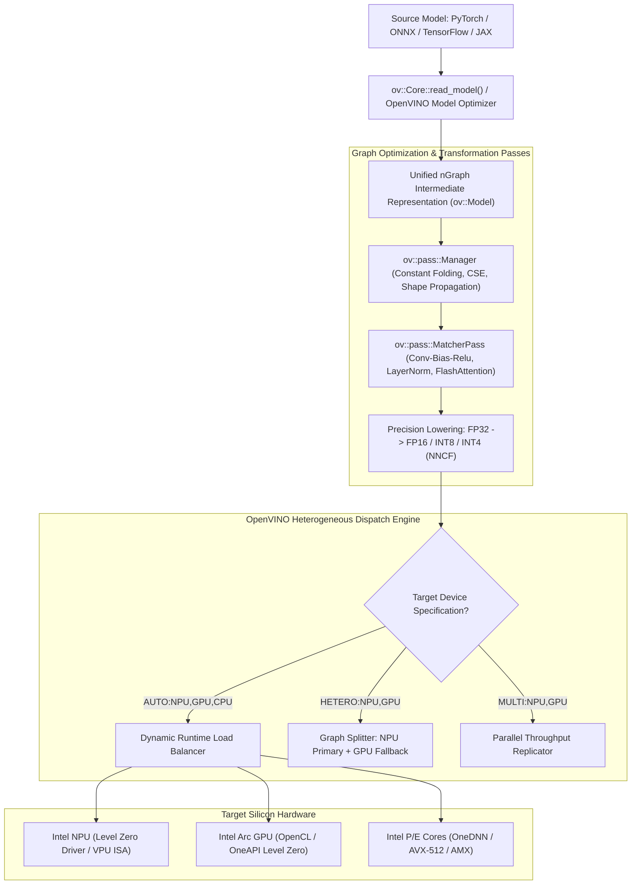
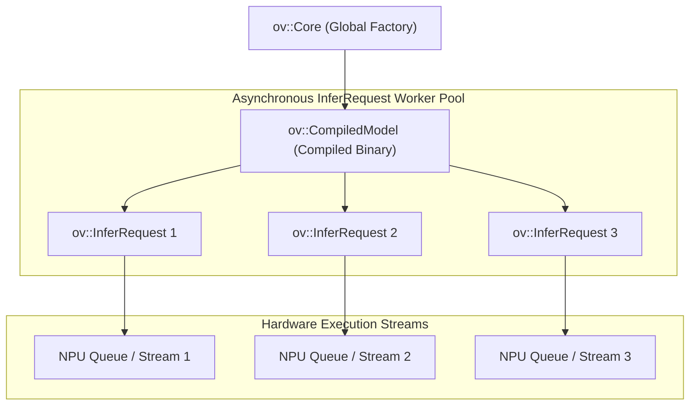

# ⚡ Intel OpenVINO 2025.x / 2026.x: nGraph IR, NPU Acceleration & Heterogeneous Scheduling

## 1. Framework Overview & Core Philosophy

Intel OpenVINO (Open Visual Inference and Neural Network Optimization) is an open-source, hardware-centric deep learning inference toolkit designed to maximize throughput and energy efficiency across the complete Intel computing portfolio:
- **Client & Edge SoCs**: Intel Core Ultra processors (Meteor Lake, Lunar Lake, Arrow Lake, Panther Lake) integrating Performance cores (P-cores), Efficient cores (E-cores), Low-Power Island E-cores, Intel Arc Xe2 graphics, and dedicated Neural Processing Units (NPU 4 / NPU 5).
- **Server Platforms**: Intel Xeon 5th and 6th Generation Scalable Processors equipped with Intel AMX (Advanced Matrix Extensions) and AVX-512 VNNI.
- **Discrete Accelerators**: Intel Arc Discrete GPUs (Alchemist, Battlemage, Celestial).

### The Sub-Watt Edge AI Philosophy: Lunar Lake & Arrow Lake NPU Execution
Modern edge AI workloads (continuous gaze tracking, biometric authentication, speech presence detection, semantic background matting) must operate continuously in battery-constrained environments without thermal throttling. 

While running inference on high-performance GPUs consumes $15\text{--}45\,\text{W}$, modern Intel NPUs (e.g., Lunar Lake NPU delivering $48\,\text{TOPS}$ of INT8 compute) execute continuous vision and audio perception within a **sub-$2\,\text{W}$ power envelope**. OpenVINO acts as the unifying runtime, enabling applications to direct continuous baseline sensing to the NPU while dynamically bursting complex multimodal models to the integrated GPU or P-core clusters.



---

## 2. Internal Compilation Pipeline & Graph Representation

### A. The `ov::Model` and nGraph Functional Representation
OpenVINO represents neural networks in memory as an `ov::Model` object based on the **nGraph** functional graph architecture. An `ov::Model` is a strongly-typed Directed Acyclic Graph (DAG) consisting of:
- **`ov::Node`**: Abstract base class for all operators (e.g., `ov::opset14::Convolution`, `ov::opset14::MatMul`).
- **`ov::Output<ov::Node>`**: Strongly typed tensor edges connecting producing nodes to consuming nodes, carrying dynamic or static shape metadata (`ov::PartialShape`) and element types (`ov::element::f32`, `ov::element::f16`, `ov::element::i8`, `ov::element::f8e4m3`).
- **`ov::Parameter` / `ov::Result`**: Explicit graph entry and exit boundaries.

### B. Graph Transformation Pipeline (`ov::pass::Manager`)
OpenVINO performs multi-stage graph lowering using the `ov::pass::Manager` framework:

1. **Core Mathematical Normalization**:
   - Decomposes complex compound ONNX operations into canonical primitive sets.
   - Eliminates redundant Reshape, Squeeze, and Transpose chains via topological substitution.
2. **Pattern Matching & Operator Fusion (`ov::pass::MatcherPass`)**:
   - Uses graph regular expressions to identify subgraphs and replace them with optimized compound nodes:
     - `GroupConvolution + Bias + Activation` $\to$ Single Fused Primitive.
     - `MatMul + Softmax + MatMul` $\to$ Paged FlashAttention fused micro-kernel.
     - `RMSNorm + Multiply` $\to$ Vectorized single-pass normalization.
3. **Hardware Plugin Lowering**:
   - Each hardware plugin (CPU, GPU, NPU) registers target-specific transformation passes. For example, the NPU plugin lowers the graph to the Intel VPU/NPU dialect, decomposing unsupported dimensions and mapping activations to NPU tiled SRAM scratchpads.

---

## 3. Memory Model, Allocators & Zero-Copy Primitives

Memory transfers across heterogeneous compute engines (CPU $\to$ GPU $\to$ NPU) create latency penalties if buffers are repeatedly copied across separate driver domains. OpenVINO resolves this through unified memory architectures and remote contexts.

```
+-----------------------------------------------------------------------------------+
|                        Intel Unified Memory Architecture                          |
+-----------------------------------------------------------------------------------+
|  Host System Memory (LPDDR5X / DDR5 Shared Physical DRAM)                         |
|  - Unified Physical Memory Bus on Lunar Lake / Arrow Lake Client SoCs            |
+-----------------------------------------------------------------------------------+
|  Level Zero Unified Shared Memory (USM) Allocations                               |
|  - zeMemAllocHost: Host-accessible memory mapped to GPU/NPU                       |
|  - zeMemAllocDevice: Dedicated on-die device memory                               |
|  - zeMemAllocShared: Coherent memory migratable across CPU, iGPU, and NPU         |
+-----------------------------------------------------------------------------------+
|  OpenVINO Zero-Copy Abstraction (ov::RemoteContext & ov::RemoteTensor)            |
|  - Camera ISP DMA-BUF file descriptors imported directly via Level Zero USM       |
|  - ov::Tensor wraps external memory pointers without memory allocation           |
+-----------------------------------------------------------------------------------+
```

### A. Zero-Copy User Memory Wrapping (`ov::Tensor`)
If input memory is already allocated in host RAM (or mapped from an upstream camera pipeline), applications wrap the raw memory pointer in an `ov::Tensor` without triggering allocations or data copying:

```cpp
// Allocate aligned host memory (e.g. 64-byte aligned for AVX-512/AMX)
void* host_ptr = aligned_alloc(64, buffer_size_in_bytes);

// Wrap memory pointer directly into OpenVINO Tensor
ov::Tensor input_tensor(
    ov::element::f32,
    ov::Shape{1, 3, 640, 640},
    host_ptr
);
```

### B. Level Zero Remote Context & USM Memory (`ov::RemoteTensor`)
When executing on Intel Arc GPUs or NPUs via the OneAPI Level Zero driver, OpenVINO allows sharing Unified Shared Memory (USM) buffers directly between the rendering pipeline and the neural inference engine:

```cpp
// 1. Obtain Level Zero Remote Context from OpenVINO Core
auto remote_context = core.get_default_context("GPU.0").as<ov::intel_gpu::ocl::ClContext>();

// 2. Allocate USM Shared Buffer via Level Zero API
void* usm_ptr = nullptr;
zeMemAllocShared(ze_context, &device_desc, &host_desc, buffer_size, 64, ze_device, &usm_ptr);

// 3. Create Remote Tensor referencing USM memory
ov::RemoteTensor remote_tensor = remote_context.create_tensor(
    ov::element::f16,
    ov::Shape{1, 3, 640, 640},
    usm_ptr
);
```

---

## 4. Execution Model, Threading & Concurrency

### A. The Core-CompiledModel-InferRequest Hierarchy
- **`ov::Core`**: Global singleton factory managing plugin lifecycles, configuration options, and hardware device registries.
- **`ov::CompiledModel`**: Immutable representation of a network compiled and scheduled for a specific target device (`core.compile_model(model, "NPU")`). Safe for concurrent multi-threaded execution.
- **`ov::InferRequest`**: Lightweight stateful worker object containing execution buffers and device command queue handles.



### B. CPU Threading & Hybrid Architecture Scheduling (P-cores vs. E-cores)
Intel Core Ultra processors feature heterogeneous P/E core topologies. OpenVINO integrates with Intel oneTBB (Threading Building Blocks) to optimize execution:
- **`ov::hint::scheduling_core_type`**:
  - `ov::hint::SchedulingCoreType::PCORE_ONLY`: Restricts worker threads exclusively to high-frequency P-cores for minimal latency.
  - `ov::hint::SchedulingCoreType::ECORE_ONLY`: Pins threads to E-cores to preserve energy.
  - `ov::hint::SchedulingCoreType::ANY_CORE`: Automatically schedules across all available cores.
- **`ov::hint::performance_mode`**:
  - `ov::hint::PerformanceMode::LATENCY`: Configures a single hardware stream utilizing all execution units.
  - `ov::hint::PerformanceMode::THROUGHPUT`: Instantiates multiple parallel execution streams matching hardware queue depths.

### C. Heterogeneous Dynamic Dispatch: `AUTO`, `HETERO`, and `MULTI`
1. **`AUTO:NPU,GPU,CPU`**:
   The engine queries hardware status, performs rapid initial inference on CPU while compiling the model asynchronously in the background for NPU/GPU, and automatically switches traffic to the hardware accelerator once compilation settles.
2. **`HETERO:NPU,GPU`**:
   Partitions the neural network graph across devices. Operations unsupported by the NPU firmware are automatically sliced out and executed on the integrated GPU or CPU without crashing.
3. **`MULTI:NPU,GPU`**:
   Duplicates the compiled model across both the NPU and GPU, load-balancing incoming inference requests to maximize aggregate frames per second.

---

## 5. Quantization, Mixed Precision & Kernel Auto-Tuning

### A. Precision Support & Hardware Accelerators

| Precision | Intel Xeon (CPU) | Intel Core Ultra (iGPU) | Intel NPU (Lunar Lake) | Acceleration Technology |
| :--- | :--- | :--- | :--- | :--- |
| **FP32** | Supported | Supported | Supported | AVX2 / AVX-512 / Xe Vector Engines |
| **FP16** | Supported (AVX-512 FP16) | Native ($2\times$ FP32) | Native ($2\times$ FP32) | Intel Xe2 Matrix Engines / NPU MACs |
| **BF16** | Native (Intel AMX) | Emulated | Emulated | Advanced Matrix Extensions (AMX-BF16) |
| **INT8** | Native (Intel AMX / VNNI)| Native ($4\times$ FP32) | Native ($4\times$ FP32) | AMX-INT8 / DP4A / NPU Systolic Array |
| **INT4 / FP4**| Weight-Only Quantization | Weight-Only & Microscale| Weight-Only (4-bit) | NNCF AWQ / GPTQ / Microscaled MatMul |

### B. Neural Network Compression Framework (NNCF)
OpenVINO provides **NNCF** as its native compression engine for Post-Training Quantization (PTQ) and Quantization-Aware Training (QAT):

```python
import nncf
import openvino as ov

# Load model in OpenVINO IR
core = ov.Core()
model = core.read_model("model.xml")

# Define calibration dataset generator
def transform_fn(data_item):
    return {"input_images": data_item}

calibration_dataset = nncf.Dataset(calibration_data_loader, transform_fn)

# Perform 8-bit Post-Training Quantization (PTQ)
quantized_model = nncf.quantize(
    model,
    calibration_dataset,
    model_type=nncf.ModelType.TRANSFORMER,
    preset=nncf.QuantizationPreset.PERFORMANCE, # Symmetric INT8 for peak hardware TOPS
    fast_bias_correction=True
)

# Save quantized model
ov.save_model(quantized_model, "quantized_model.xml")
```

### C. Model Caching (`ov::cache_dir`)
Compiling models for the NPU or Intel Arc GPU requires Level Zero JIT compilation. Enabling persistent model caching stores the compiled binary blob on disk, reducing subsequent initialization time from tens of seconds down to milliseconds:

```cpp
core.set_property(ov::cache_dir("./openvino_model_cache"));
```

---

## 6. Edge Deployment, Safety & Operational Gotchas

### A. Dynamic Shapes Penalty on NPU
While Intel CPUs handle dynamic shapes gracefully via JIT-compiled kernels, NPUs rely on static systolic arrays and fixed DMA scheduling.
- **The Pitfall**: Passing variable-dimension tensors to the NPU causes runtime pipeline re-allocation or falls back to host CPU execution.
- **The Rule**: Always reshape the model to static dimensions (`model->reshape({{1, 3, 640, 640}})` before compilation for `NPU`). If multiple resolutions are required, compile distinct static models for each resolution bucket.

### B. Level Zero Driver Initialization Latency
On initial startup, initializing the Level Zero driver interface for NPU/GPU can introduce a $100\text{--}500\,\text{ms}$ cold-start delay.
- **Remedy**: Initialize `ov::Core` during application boot rather than lazily on the first incoming inference request.

---

## 7. Complete Runnable Production Code Blueprint

The following production C++ blueprint demonstrates initializing the OpenVINO 2026.x runtime, configuring asynchronous inference requests with completion callbacks, using `AUTO:NPU,GPU,CPU` scheduling, and achieving zero-copy memory wrapping.

```cpp
#include <openvino/openvino.hpp>
#include <iostream>
#include <vector>
#include <chrono>
#include <thread>
#include <atomic>
#include <condition_variable>

class OpenVINOAsyncProductionEngine {
private:
    ov::Core core;
    ov::CompiledModel compiled_model;
    std::vector<ov::InferRequest> request_pool;
    size_t pool_size;
    std::atomic<size_t> completed_frames{0};

public:
    OpenVINOAsyncProductionEngine(const std::string& model_xml_path, size_t num_requests = 4)
        : pool_size(num_requests) {
        
        // 1. Configure Persistent Model Caching and Performance Hints
        core.set_property(ov::cache_dir("./ov_cache"));
        core.set_property(ov::hint::performance_mode(ov::hint::PerformanceMode::THROUGHPUT));
        core.set_property(ov::hint::execution_mode(ov::hint::ExecutionMode::PERFORMANCE));

        std::cout << "[OpenVINO] Loading Model IR: " << model_xml_path << std::endl;
        std::shared_ptr<ov::Model> model = core.read_model(model_xml_path);

        // 2. Enforce Static Shape for Optimal NPU/GPU Scheduling
        model->reshape({{"images", ov::Shape{1, 3, 640, 640}}});

        // 3. Compile Model with Automatic Dynamic Scheduling (NPU -> GPU -> CPU)
        std::cout << "[OpenVINO] Compiling model for target: AUTO:NPU,GPU,CPU..." << std::endl;
        compiled_model = core.compile_model(model, "AUTO:NPU,GPU,CPU", {
            ov::hint::num_requests(num_requests)
        });

        // Log Active Execution Devices
        std::string execution_devices = compiled_model.get_property(ov::execution_devices);
        std::cout << "[OpenVINO] Active Execution Target Devices: " << execution_devices << std::endl;

        // 4. Instantiate Asynchronous InferRequest Worker Pool
        for (size_t i = 0; i < pool_size; ++i) {
            request_pool.push_back(compiled_model.create_infer_request());
        }
    }

    void run_benchmark_pipeline(size_t total_iterations) {
        const size_t INPUT_ELEMENTS = 1 * 3 * 640 * 640;
        
        // Allocate page-aligned host memory for zero-copy wrapping
        std::vector<float> aligned_input_buffer(INPUT_ELEMENTS, 1.0f);

        std::cout << "[OpenVINO] Launching " << total_iterations << " asynchronous inference passes..." << std::endl;
        auto start_time = std::chrono::high_resolution_clock::now();

        std::atomic<size_t> active_tasks{0};
        std::mutex queue_mutex;
        std::condition_variable cv;

        for (size_t i = 0; i < total_iterations; ++i) {
            size_t req_idx = i % pool_size;
            ov::InferRequest& request = request_pool[req_idx];

            // Wait for previous task in this slot to complete before reusing
            request.wait();

            // Zero-copy wrap raw input buffer without allocation
            ov::Tensor input_tensor(ov::element::f32, ov::Shape{1, 3, 640, 640}, aligned_input_buffer.data());
            request.set_input_tensor(input_tensor);

            // Configure Non-Blocking Completion Callback
            request.set_callback([this, &active_tasks, &cv, req_idx](std::exception_ptr exception_ptr) {
                if (exception_ptr) {
                    try {
                        std::rethrow_exception(exception_ptr);
                    } catch (const std::exception& e) {
                        std::cerr << "[Callback Exception] " << e.what() << std::endl;
                    }
                }
                completed_frames.fetch_add(1, std::memory_order_relaxed);
                cv.notify_one();
            });

            // Asynchronously dispatch to NPU/GPU command stream
            request.start_async();
        }

        // Wait for all in-flight requests in the pool to complete
        for (auto& request : request_pool) {
            request.wait();
        }

        auto end_time = std::chrono::high_resolution_clock::now();
        double total_ms = std::chrono::duration<double, std::milli>(end_time - start_time).count();

        std::cout << "--------------------------------------------------------" << std::endl;
        std::cout << "OpenVINO Benchmark Completed:" << std::endl;
        std::cout << " - Total Frames Processed: " << completed_frames.load() << std::endl;
        std::cout << " - Total Wall Time: " << total_ms << " ms" << std::endl;
        std::cout << " - Average Latency: " << (total_ms / total_iterations) << " ms / frame" << std::endl;
        std::cout << " - Throughput: " << (completed_frames.load() / (total_ms / 1000.0)) << " FPS" << std::endl;
        std::cout << "--------------------------------------------------------" << std::endl;
    }
};

int main(int argc, char** argv) {
    if (argc < 2) {
        std::cout << "Usage: ./openvino_async_runner <model.xml>" << std::endl;
        return 0;
    }

    try {
        OpenVINOAsyncProductionEngine engine(argv[1], 4);
        engine.run_benchmark_pipeline(500);
    } catch (const std::exception& ex) {
        std::cerr << "Fatal Exception: " << ex.what() << std::endl;
        return EXIT_FAILURE;
    }

    return EXIT_SUCCESS;
}
```

---

## 8. Cross-References & Ecosystem Links

- [[frameworks/onnxruntime|ONNX Runtime & OpenVINO Execution Provider]]
- [[docs/edge-ai-quantization-playbook|Edge AI Quantization Playbook (NNCF & PTQ)]]
- [[topics/gpu-deployment/00-gpu-deployment-moc|GPU Deployment Map of Content]]
- [[topics/real-time-systems/00-real-time-systems-moc|Real-Time Systems & Scheduling]]
