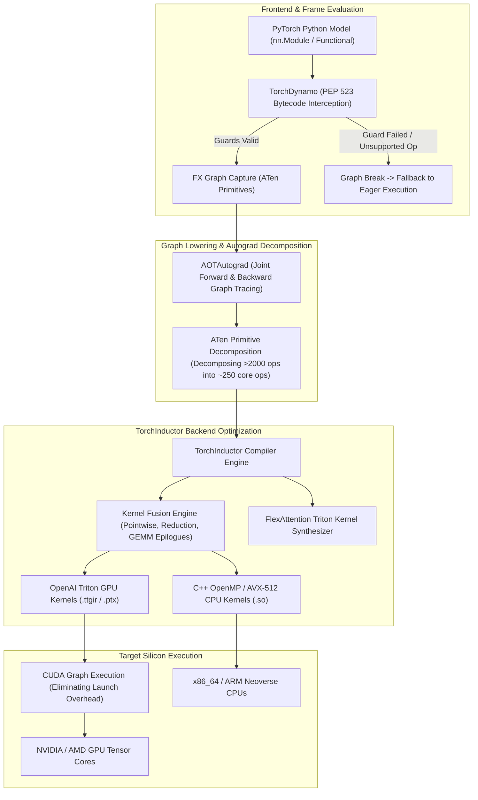
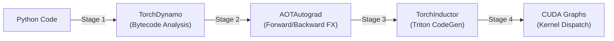
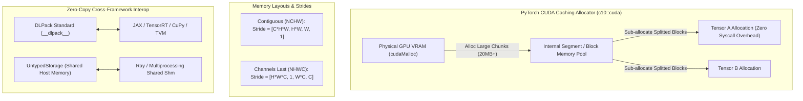
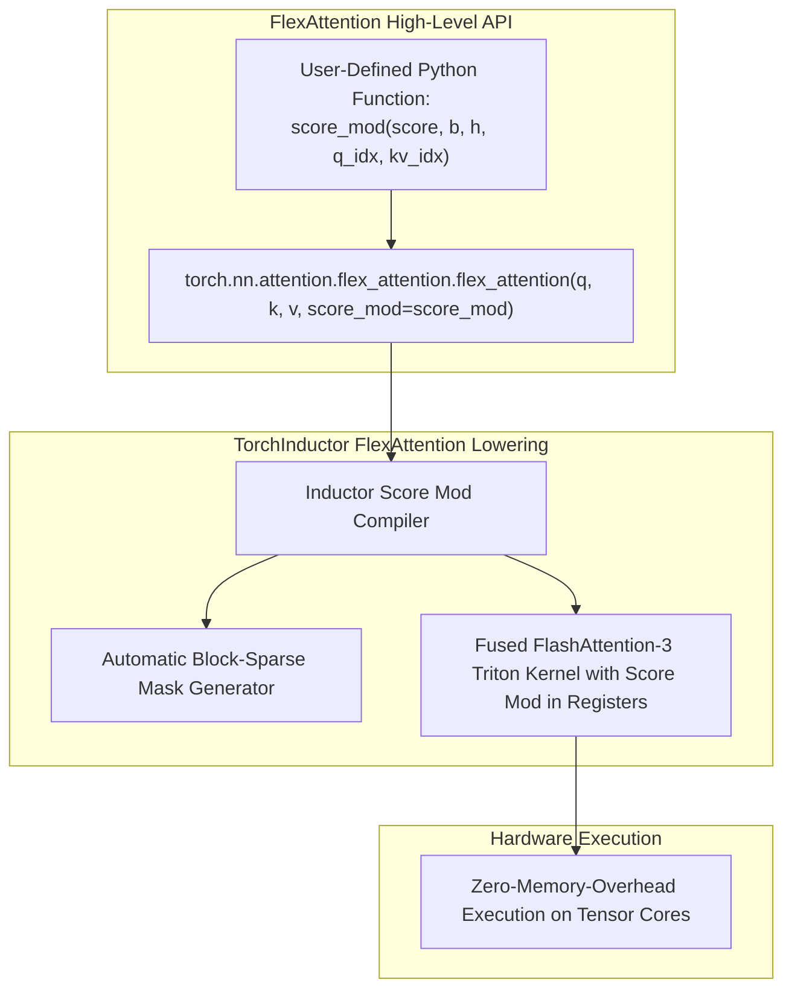

# ⚡ PyTorch 2.5 / 2.6 Core: TorchDynamo, AOTAutograd, TorchInductor & FlexAttention

## 1. Framework Overview & Core Philosophy

**PyTorch 2.x** represents a fundamental evolution in deep learning execution. While PyTorch 1.x achieved dominance through its flexible, intuitive **Eager Mode** (`torch.nn.Module`), eager execution fundamentally suffers from Python runtime dispatch overhead and poor GPU memory bandwidth efficiency. In eager mode, every mathematical operation launches an isolated GPU kernel, forcing intermediate activation tensors to round-trip through off-chip GPU High Bandwidth Memory (HBM/VRAM).

Historical attempts to solve this via ahead-of-time graph capture—such as **TorchScript** (`torch.jit.trace` / `torch.jit.script`)—failed in real-world production because they forced developers to abandon standard Python constructs, dynamic control flow, and external libraries.

PyTorch 2 introduces **`torch.compile`**, a non-invasive compiler stack that achieves compiler-grade performance without breaking Python ergonomics:
1. **TorchDynamo**: Intercepts Python frame evaluation (PEP 523) to capture computation graphs just-in-time while safely handling dynamic Python control flow and guards.
2. **AOTAutograd**: Traces ahead-of-time forward and backward graphs decomposed into atomic ATen operators.
3. **TorchInductor**: Compiles computation graphs directly into high-performance **OpenAI Triton** kernels for GPUs and vector-parallel C++/OpenMP code for CPUs.
4. **FlexAttention**: A revolutionary attention engine introduced in PyTorch 2.5+ that generates fused, block-sparse FlashAttention kernels from arbitrary user-defined Python scoring functions.



---

## 2. The 4-Stage Compilation Pipeline



### Stage 1: TorchDynamo & Guard Generation
TorchDynamo evaluates Python bytecode before execution using Python C-API frame evaluation hooks (`PyInterpreterState_SetEvalFrameFunc`):
- It parses Python bytecode instructions (`LOAD_FAST`, `BINARY_ADD`, `CALL_FUNCTION`), tracking tensor operations symbolically into an **FX Graph**.
- When it encounters standard Python logic (e.g., looping over integers or calling built-in math), it evaluates it at compile time.
- **Guards (`GuardBuilder`)**: Dynamo attaches runtime guard checks to every captured graph (e.g., `tensor.dtype == torch.float32`, `tensor.ndim == 4`, `tensor.shape[1] == 128`).
- **Graph Breaks**: If code relies on untraceable dynamic behavior (such as calling a C-extension or branching on a data-dependent scalar tensor value `if x.sum() > 0:`), Dynamo pauses compilation, hands control back to eager Python for that instruction, and resumes compilation for the remaining subgraph.

### Stage 2: AOTAutograd (Ahead-Of-Time Autograd)
Unlike eager autograd which builds an engine graph dynamically during the forward pass:
- AOTAutograd traces both the **Forward graph** and the exact **Backward gradient graph** ahead of time.
- It leverages **ATen Operator Decomposition**, normalizing more than $2000+$ high-level PyTorch operators down to a minimal set of $\sim 250$ canonical primitive operators (`torch._ops.aten`).
- It analyzes memory lifespans to optimize gradient checkpointing and memory recomputation versus memory caching.

### Stage 3: TorchInductor & OpenAI Triton Codegen
TorchInductor is the default compiler backend for PyTorch 2:
- **Loop Level Fusion**: Fuses sequences of pointwise operators (`x * scale + bias -> relu -> layernorm`) into a single GPU kernel. Instead of writing intermediate activations to VRAM and reading them back, data is maintained exclusively inside GPU registers and $L1$ cache.
- **Triton Code Generation**: Generates clean, human-readable OpenAI Triton code. Triton abstracts GPU thread block and warp scheduling while generating assembly-level PTX code that rivals hand-tuned CUDA C++ kernels.

### Stage 4: CUDA Graph Capture
In latency-critical inference and small-batch training, the CPU overhead of launching dozens of individual CUDA kernels sequentially via the driver dominates overall execution time.

TorchInductor automatically integrates with **CUDA Graphs**:
- Sequences of static Triton and cuBLAS kernels are recorded once into a CUDA Graph topology.
- Subsequent iterations execute the entire graph with a single CPU driver launch instruction (`cudaGraphLaunch`), reducing kernel launch latency from $\sim 10\text{--}50\text{ µs}$ to $<2\text{ µs}$.

---

## 3. Memory Model & Caching Allocator



### PyTorch CUDA Caching Allocator
Calling `cudaMalloc` and `cudaFree` incurs synchronous kernel driver overhead. PyTorch circumvents this via the `c10::cuda::CUDACachingAllocator`:
- Maintains two segregated memory pools: **Small Allocations** ($<1\text{ MB}$) and **Large Allocations** ($\ge 1\text{ MB}$).
- Implements buddy allocation and block splitting: When a tensor is freed in Python, its memory is returned to the allocator pool immediately without invoking `cudaFree`.

### Memory Formats: `torch.channels_last`
For computer vision models on modern GPUs with Tensor Cores (NVIDIA Ampere, Ada Lovelace, Hopper, Blackwell):
- Standard NCHW memory format requires tensor transpositions to align with Tensor Core matrix multiply units ($16 \times 16$ tiles).
- Setting `model.to(memory_format=torch.channels_last)` formats image tensors in **NHWC** order, maximizing memory coalescing and boosting convolution/attention throughput by $15\text{--}30\%$.

---

## 4. FlexAttention: Dynamic Attention Kernel Generation

Introduced in PyTorch 2.5+, **`FlexAttention`** solves one of the longest-standing problems in deep learning: how to implement custom, specialized attention variants without writing complex, bug-prone CUDA/Triton kernels from scratch.



### The `score_mod` Functional Paradigm
Instead of materializing massive $O(N^2)$ attention bias matrices in VRAM, `flex_attention` accepts a mathematical function describing how attention logits are modified:

$$\text{Attention}(Q, K, V) = \text{softmax}\left(\frac{QK^T}{\sqrt{d}} + \text{score\_mod}(Q, K, b, h, q_{\text{idx}}, kv_{\text{idx}})\right) V$$

TorchInductor inspects `score_mod`, evaluates which blocks of attention are completely masked out (creating a **BlockMask**), and generates a specialized FlashAttention Triton kernel that computes the scoring function directly inside GPU registers during the tiled online softmax loop.

### Supported Attention Variants via FlexAttention
- **Causal Masking**: Zero-overhead autoregressive masking.
- **Sliding Window Attention**: Restricting attention to local receptive fields ($|q_{\text{idx}} - kv_{\text{idx}}| \le W$).
- **Document Packing / Variable Lengths**: Processing multiple concatenated sequences in a single batch without padding token compute waste.
- **Relative Position Biases (Alibi / Rotary / 2D Spatial Distance)**: Directly applying spatial offsets for vision transformers.

---

## 5. AOTInductor: Python-Free C++ Deployment

For edge robotics and autonomous driving systems where running a Python runtime is prohibited by safety standards:
- **`torch._inductor.aot_compile(model, example_inputs)`** exports the compiled model directly into a standalone C-ABI shared library (`.so`).
- The generated `.so` contains compiled Triton/C++ kernels and can be loaded directly from pure C++ applications (`#include <torch/csrc/inductor/aot_inductor_model_container.h>`) with zero Python runtime overhead.

---

## 6. Edge Deployment, Safety & Operational Gotchas

### Diagnosing and Eliminating Graph Breaks
A graph break fractures a neural network into multiple distinct subgraphs, completely disabling cross-layer kernel fusion and triggering repeated CPU/GPU synchronization.

```python
import torch._dynamo as dynamo

# 1. Explain graph breaks
explanation = dynamo.explain(model, *sample_inputs)
print(f"Graph breaks detected: {explanation.graph_break_count}")
for break_reason in explanation.break_reasons:
    print(f"Reason: {break_reason.reason} at {break_reason.user_stack}")

# 2. Strict Compilation Mode (Fail immediately on graph breaks)
compiled_model = torch.compile(model, fullgraph=True)
```

### Dynamic Shapes vs. Recompilation Storms
If tensor batch sizes or image resolutions vary dynamically:
- By default, Dynamo may specialize graphs to exact shapes ($1 \times 3 \times 224 \times 224$, then $1 \times 3 \times 256 \times 256$), triggering expensive JIT recompilations.
- **Solution**: Pass `dynamic=True` to `torch.compile`, forcing TorchDynamo to emit symbolic shape dimensions (`SymInt`) and compile shape-agnostic kernels.

---

## 7. Complete Runnable Production Code Blueprint

```python
#!/usr/bin/env python3
"""
Complete Production Blueprint: PyTorch 2.5/2.6 Compilation, FlexAttention & CUDA Graphs
"""

import torch
import torch.nn as nn
from torch.nn.attention.flex_attention import flex_attention, create_block_mask

# 1. Define Custom Scoring Function for FlexAttention (2D Spatial Vision Bias)
def spatial_2d_bias_mod(score, b, h, q_idx, kv_idx):
    # Apply synthetic spatial distance penalty
    dist = (q_idx - kv_idx).abs()
    return score - (dist.float() * 0.05)

# 2. Define High-Performance Vision Attention Module
class VisionTransformerLayer(nn.Module):
    def __init__(self, dim=768, num_heads=12):
        super().__init__()
        self.dim = dim
        self.num_heads = num_heads
        self.head_dim = dim // num_heads
        self.qkv_proj = nn.Linear(dim, dim * 3, bias=False)
        self.out_proj = nn.Linear(dim, dim, bias=False)
        self.norm = nn.LayerNorm(dim)

    def forward(self, x):
        B, S, C = x.shape
        normed = self.norm(x)
        qkv = self.qkv_proj(normed).reshape(B, S, 3, self.num_heads, self.head_dim).permute(2, 0, 3, 1, 4)
        q, k, v = qkv[0], qkv[1], qkv[2]

        # Invoke FlexAttention with custom score_mod
        attn_out = flex_attention(q, k, v, score_mod=spatial_2d_bias_mod)
        attn_out = attn_out.transpose(1, 2).reshape(B, S, C)
        return x + self.out_proj(attn_out)

def run_pytorch_compile_demo():
    if not torch.cuda.is_available():
        print("[PyTorch Core] CUDA device not detected. Running CPU demonstration.")
        device = "cpu"
    else:
        device = "cuda"

    print(f"[PyTorch Core] Initializing Model on {device}...")
    model = VisionTransformerLayer().to(device=device, dtype=torch.float16 if device == "cuda" else torch.float32)
    model.eval()

    # Create Synthetic Input Batch
    dummy_input = torch.randn(2, 256, 768, device=device, dtype=torch.float16 if device == "cuda" else torch.float32)

    # 3. Apply torch.compile with Max Autotune & CUDA Graphs
    print("[PyTorch Core] Compiling Model with TorchInductor & Triton Codegen...")
    compiled_model = torch.compile(model, mode="reduce-overhead" if device == "cuda" else "default")

    # Warmup Passes (Trigger Dynamo tracing, Inductor Triton compilation & CUDA Graph capture)
    for _ in range(3):
        with torch.inference_mode():
            _ = compiled_model(dummy_input)

    # Measure Execution Latency
    print("[PyTorch Core] Measuring Steady-State Inference Latency...")
    start_event = torch.cuda.Event(enable_timing=True) if device == "cuda" else None
    end_event = torch.cuda.Event(enable_timing=True) if device == "cuda" else None

    iterations = 50
    if device == "cuda":
        start_event.record()
        with torch.inference_mode():
            for _ in range(iterations):
                _ = compiled_model(dummy_input)
        end_event.record()
        torch.cuda.synchronize()
        avg_ms = start_event.elapsed_time(end_event) / iterations
        print(f"[PyTorch Core] Average Inference Latency: {avg_ms:.3f} ms per pass.")
    else:
        print("[PyTorch Core] Executed compiled forward passes successfully on CPU.")

if __name__ == "__main__":
    run_pytorch_compile_demo()
```

---

## 8. Cross-Reference Links
- [[frameworks/torchvision|TorchVision Operators, Transforms v2 & GPU Decoding]]
- [[frameworks/apache-tvm|Apache TVM Unity Machine Learning Compiler]]
- [[hardware/nvidia-blackwell-b200|NVIDIA Blackwell GPU Architecture]]
