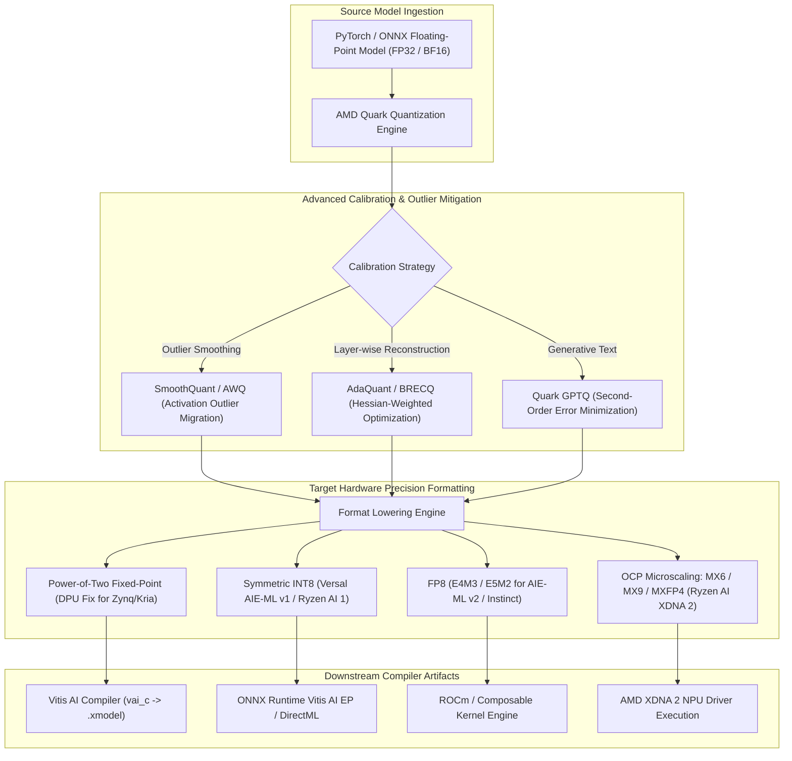

# 💎 AMD Quark: Unified Quantization, Sub-Byte Formats (FP8, MX6, MX9, INT4) & Hardware Calibration

## 1. Framework Overview & Core Philosophy

**AMD Quark** is AMD’s next-generation unified deep learning quantization, pruning, and model compression framework. Quark succeeds legacy tools (such as `vai_q_pytorch`, `vai_q_onnx`, and `vai_q_tensorflow`), replacing fragmented per-hardware scripts with a single, modular engine targeting:
- **Client & Edge NPUs**: AMD Ryzen AI processors (Phoenix, Hawk Point, Strix Point, Strix Halo) featuring **XDNA 1** and **XDNA 2** NPUs.
- **Adaptive SoCs & FPGAs**: AMD Versal AI Core, Versal AI Edge, and Kria SOMs featuring **AIE-ML v1 / v2** systolic arrays.
- **Datacenter GPUs**: AMD Instinct MI300X, MI325X, and MI350 series accelerators (CDNA 3 / CDNA 4).

### Core Philosophy: Hardware-Centric Accuracy Preservation
Standard quantization frameworks often treat quantization as a generic software truncation process ($\text{round}(x / S) + Z$). However, real hardware accelerators impose strict silicon constraints:
- Hardware DPUs only support power-of-two scaling ($S = 2^{-k}$) to eliminate expensive floating-point divider circuits.
- Modern NPUs (XDNA 2) implement **OCP Microscaling (MX)** formats, sharing a single exponent across a block of 32 sub-byte mantissas.
- Transformer attention layers suffer from severe activation outliers that cause catastrophic accuracy collapse if not mitigated via outlier redistribution (SmoothQuant/AWQ).

Quark bridges high-level PyTorch / ONNX models and silicon hardware by applying mathematically rigorous Post-Training Quantization (PTQ) and Quantization-Aware Training (QAT) calibrated specifically for target execution engines.



---

## 2. Supported Numerical Formats & Mathematical Foundations

### A. Power-of-Two Fixed-Point (DPU Fix Format)
Legacy and edge DPU IP cores (`DPUCZDX8G`, `DPUCAHX8H`) compute convolutions using fixed-point integer arithmetic where scale factors are strictly constrained to powers of two:

$$S = 2^{-\text{fix\_point}}, \quad q = \text{clip}\left(\left\lfloor x \cdot 2^{\text{fix\_point}} + 0.5 \right\rfloor, -128, 127\right)$$

- **Hardware Advantage**: Hardware multipliers eliminate floating-point dividers, implementing scale factor adjustments via single-cycle arithmetic right-bit-shifts (`>> fix_point`).

### B. Standard Floating-Point & Sub-Byte Formats (FP8, INT4)
- **FP8 (E4M3)**: 1 sign bit, 4 exponent bits, 3 mantissa bits ($E_{\text{bias}} = 7$, Max representable value: $448$). Optimized for activation representations due to higher precision near zero.
- **FP8 (E5M2)**: 1 sign bit, 5 exponent bits, 2 mantissa bits ($E_{\text{bias}} = 15$, Max representable value: $57344$). Optimized for gradient and weight representations requiring wider dynamic range.
- **Uniform INT4 (Symmetric / Asymmetric)**: Maps 16 discrete levels across a quantization scale $S$, packing two 4-bit weights into a single byte (`uint8`).

### C. OCP Microscaling Formats: MX6, MX9 & MXFP4
AMD Quark natively supports the **Open Compute Project (OCP) Microscaling Formats** standard, implemented in silicon on AMD XDNA 2 (Ryzen AI 300 / Strix Point) NPUs:

```
+-----------------------------------------------------------------------------------+
|                         OCP Microscaling (MX) Block Layout                        |
+-----------------------------------------------------------------------------------+
|  Shared Scale Factor: 8-bit E8M0 Floating-Point Exponent (1 Byte per 32 elements) |
+-----------------------------------------------------------------------------------+
|  Element 0..31: 4-bit (MXFP4 / E2M1) or 6-bit (MX6) or 9-bit (MX9) Mantissas      |
|  - Eliminates per-tensor dynamic range bottleneck without full FP16 storage cost  |
+-----------------------------------------------------------------------------------+
```

Mathematically, each element $x_i$ in a microscaling block of size $B = 32$ is computed as:

$$x_i = 2^{E_{\text{shared}} - E_{\text{bias}}} \times \text{sign}(m_i) \times \left(1 + \frac{\text{mantissa}_i}{2^p}\right)$$

Where $E_{\text{shared}} = \max_{j \in [0, 31]} \lfloor \log_2 |x_j| \rfloor$ represents the shared scale exponent.

---

## 3. Calibration Algorithms & Optimization Passes

### A. SmoothQuant (Outlier Migration)
In vision transformers (ViT) and multimodal LLMs, activation channels develop extreme mathematical outliers ($>100\times$ typical variance). Quantizing activations to INT8 or FP8 directly causes severe accuracy drops.

Quark implements **SmoothQuant**, mathematically migrating the quantization difficulty from activations ($X$) to weights ($W$) via a per-channel scaling matrix $s \in \mathbb{R}^C$:

$$Y = (X \cdot \text{diag}(s)^{-1}) \cdot (\text{diag}(s) \cdot W) = \hat{X} \cdot \hat{W}$$

$$s_j = \frac{\max(|X_j|)^\alpha}{\max(|W_j|)^{1 - \alpha}}$$

Where $\alpha \in [0, 1]$ is a migration hyperparameter ($\alpha = 0.5$ balances difficulty equally between activations and weights).

```
Activation Outliers: [  0.1,  0.2, 85.0,  0.3 ] ──> SmoothQuant Scaling ──> [  0.4,  0.8,  4.2,  1.1 ] (Quantizable!)
Weight Matrix:       [  1.2,  0.8,  0.5,  1.1 ] ──> Absorb Scale Factor  ──> [  0.3,  0.2,  9.5,  0.3 ]
```

### B. AdaQuant (Adaptive Layer Reconstruction)
Instead of calibrating each layer in isolation using simple MSE or KL-divergence, Quark's **AdaQuant** optimizes quantized weights $\hat{W}$ by minimizing the Frobenius norm of activation reconstruction errors across small calibration batches:

$$\min_{\hat{W}} \| W X - \hat{W} X \|_F^2 + \lambda \mathcal{R}(\hat{W})$$

Using integer programming and continuous relaxation, AdaQuant achieves $<0.5\%$ accuracy loss on aggressive 4-bit vision backbones.

---

## 4. Compilation Integration: Downstream Lowering

Quark produces artifacts tailored for downstream AMD compilers:
- **Vitis AI Compiler (`vai_c`)**: Exports `.xmodel` binaries for Versal AIE-ML and Kria FPGA DPUs.
- **ONNX Runtime Vitis AI Execution Provider (EP)**: Deploys quantized ONNX graphs onto AMD Ryzen AI NPUs via direct DirectML or XDNA driver bindings.
- **ROCm Composable Kernel (CK)**: Generates high-throughput FP8 GEMM kernels for AMD Instinct accelerators.

---

## 5. Production Code Blueprint: Quantizing a Vision Model with AMD Quark

The following production script demonstrates configuring AMD Quark to calibrate and quantize a PyTorch vision model to INT8 / FP8 precision with SmoothQuant outlier mitigation:

```python
#!/usr/bin/env python3
"""
AMD Quark Quantization Pipeline Blueprint: Vision Transformer Optimization
"""

import torch
import torchvision.models as models
from quark.torch import ModelQuantizer
from quark.torch.quantization.config.config import Config, QuantizationConfig, QuantizationSpec
from quark.torch.quantization.config.type import Dtype, ScaleType, RoundType, QSchemeType

def run_quark_quantization():
    print("[AMD Quark] Initializing Vision Model for Hardware Quantization...")
    # 1. Load Pretrained Floating-Point Model
    model = models.resnet50(weights=models.ResNet50_Weights.DEFAULT).eval()

    # 2. Define Hardware Quantization Specifications
    # Target: AMD Versal AIE-ML v2 / Ryzen AI NPU (Symmetric INT8 / FP8)
    quant_spec = QuantizationSpec(
        dtype=Dtype.int8,
        qscheme=QSchemeType.per_tensor,
        scale_type=ScaleType.power_of_two, # Power-of-two scaling for hardware DPUs
        round_type=RoundType.half_even,
        is_dynamic=False
    )

    quant_config = QuantizationConfig(
        weight_quant_spec=quant_spec,
        act_quant_spec=quant_spec
    )

    config = Config(global_quant_config=quant_config)

    # 3. Instantiate Quark Quantizer
    quantizer = ModelQuantizer(config)

    # 4. Calibrate with Representative Sensor Data
    print("[AMD Quark] Running Calibration Pass on Representative Dataset...")
    calibration_dataloader = [torch.randn(1, 3, 224, 224) for _ in range(16)]

    # Attach quantization hooks and perform forward passes
    quantized_model = quantizer.quantize_model(model, calibration_dataloader)

    # 5. Export Calibrated Model for Downstream Vitis AI / XDNA Compilation
    output_path = "resnet50_quark_int8.onnx"
    print(f"[AMD Quark] Exporting Quantized Model to {output_path}...")
    dummy_input = torch.randn(1, 3, 224, 224)
    quantizer.export_onnx(quantized_model, dummy_input, output_path)
    print("[AMD Quark] Model quantization and export completed successfully.")

if __name__ == "__main__":
    run_quark_quantization()
```

---

## 6. Cross-Reference Links
- [[frameworks/vitis-ai|AMD Vitis AI 3.5 DPU Compilation Reference]]
- [[docs/edge-ai-quantization-playbook|Model Quantization & Compression Map of Content]]
- [[hardware/amd-versal-ai-edge-gen1|AMD Versal AI Edge Hardware Architecture]]
