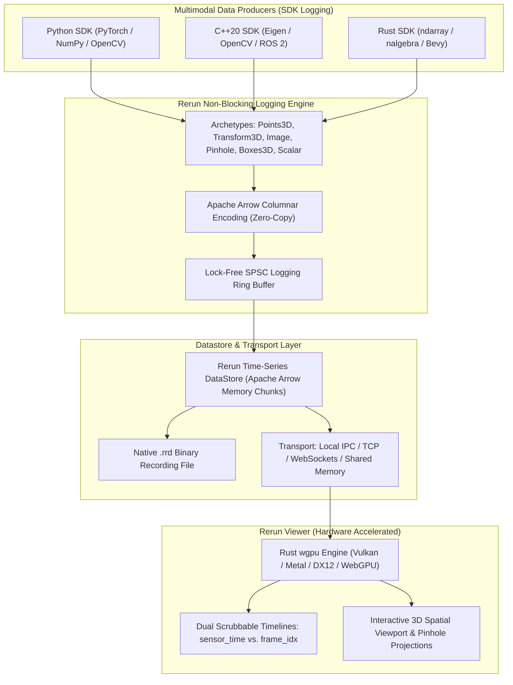
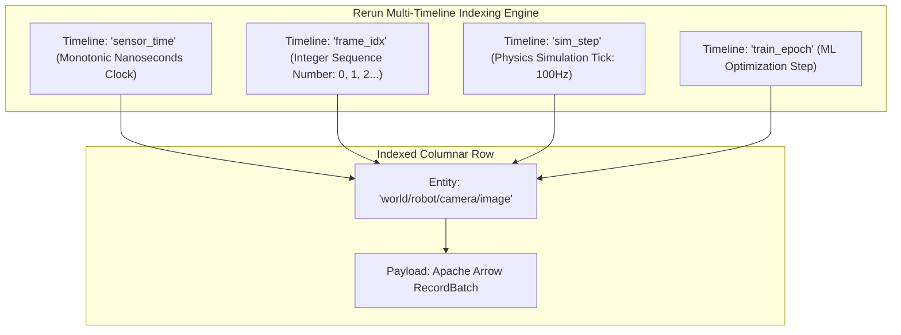
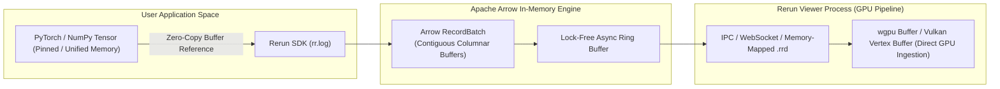
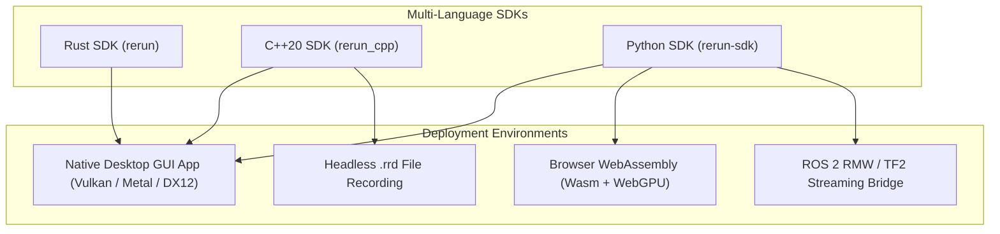

# 📊 Rerun.io SDK: Multimodal Spatial-Temporal Columnar Visualization & Time-Series Engine

## 1. Framework Overview & Core Philosophy

**Rerun** is an open-source, ultra-low-latency spatial-temporal visualization engine and data logging SDK engineered for physical AI, robotics manipulation, computer vision, autonomous vehicles, and spatial computing (SLAM, 3D Gaussian Splatting, NeRFs).

Modern multimodal perception systems generate complex, heterogeneous, high-bandwidth streams across both space and time:
- **Spatial Streams**: 3D coordinate frames ($SE(3)$ transforms), 2D RGB/Depth camera video, 3D LiDAR point clouds, mesh geometries, segmentation masks, bounding boxes, and camera pinhole rays.
- **Temporal & Scalar Streams**: High-frequency IMU linear accelerations ($1000\text{ Hz}$), joint torque vectors, odometry trajectories, loss metrics, and timestamped debug logs.

Traditional robotics visualization tools (RViz, Foxglove, TensorBoard) suffer from fundamental architectural bottlenecks:
1. **RViz (ROS 1/2)**: Bound to the ROS graph; heavyweight C++/Qt architecture; lacks multi-timeline time-travel debugging; struggles with high-density point clouds ($>500\text{k points}$).
2. **TensorBoard**: Designed for scalar loss curves and static 2D images; lacks interactive 3D spatial transforms, camera projection models, or real-time streaming capabilities.
3. **Web-Based Loggers**: Incur heavy JSON/Protobuf serialization overhead, introducing significant latency and CPU overhead on high-bandwidth sensor feeds.



Rerun solves these challenges by combining an **Entity Component System (ECS)** data model with an in-memory **Apache Arrow columnar database** and a native **Rust `wgpu` rendering engine**. Developers can log data asynchronously across arbitrary temporal indices (`timestamp`, `frame_idx`, `simulation_step`) with sub-microsecond logging latency and scrub backwards and forwards through multi-stream history in real time.

---

## 2. Internal Architecture & Data Structures

### Entity Component System (ECS) Data Model

Rerun organizes all data into an explicit Entity Component System:

```
Entity Path: "world/robot/base_link/camera_front"
  ├── Archetype: Pinhole
  │     ├── Component: PinholeProjection (3x3 Matrix) [Arrow Column]
  │     └── Component: Resolution (Width, Height)     [Arrow Column]
  │
  ├── Archetype: Image
  │     ├── Component: ImageBuffer (Binary Blob)      [Arrow Column]
  │     └── Component: ImageFormat (RGB8)             [Arrow Column]
  │
  └── Archetype: Transform3D
        ├── Component: Translation3D (X, Y, Z)        [Arrow Column]
        └── Component: Rotation3D (Quaternion)        [Arrow Column]
```

1. **`EntityPath`**: A hierarchical string identifying an object in the spatial/logical tree (e.g., `"world/robot/arm_left/wrist_camera/detections"`).
2. **`Component`**: A single typed, contiguous array of data backed directly by an **Apache Arrow DataType** (e.g., `rerun.components.Position3D`, `rerun.components.Color`, `rerun.components.Scalar`).
3. **`Archetype`**: A high-level, semantic collection of components bundled together for convenient logging (e.g., `rerun.Points3D`, `rerun.Boxes3D`, `rerun.Transform3D`, `rerun.Pinhole`).

### Dual-Timeline Model

Unlike traditional loggers that force a single global clock, Rerun supports **unlimited concurrent timelines**:



A user can scrub through a recorded run by:
- **`sensor_time`**: Replaying events at exact physical wall-clock speed to analyze real-world latency.
- **`frame_idx`**: Stepping frame-by-frame through neural inference iterations regardless of variable frame rate.
- **`sim_step`**: Correlating simulation physics states directly with sensor measurements.

### Spatial Transform Hierarchy ($SE(3)$ Engine)

Rerun maintains an active scene graph evaluating coordinate frame transformations at any instant in time:
- Transforms logged to `"world/robot"` automatically propagate to all child entities (`"world/robot/camera"`, `"world/robot/gripper"`).
- Supports translation vectors, unit quaternions, rotation matrices, 3D affine matrices, and pinhole camera projections.
- In 3D viewports, Rerun automatically projects 3D point clouds and bounding boxes into 2D camera image planes using active pinhole calibration matrices ($K$).

---

## 3. Memory Model, Allocators & Zero-Copy Primitives



### Apache Arrow Columnar Storage

Every component logged in Rerun is serialized into **Apache Arrow RecordBatches**:
- **Contiguous Memory**: Numeric arrays (such as $100\text{k}$ point cloud coordinates) are formatted in flat, cache-aligned columnar memory buffers.
- **Zero-Copy Serialization**: When logging NumPy arrays, PyTorch tensors, or C++ `std::vector` buffers, Rerun constructs Arrow memory wrappers directly over existing memory pointers without copying raw byte arrays.
- **Fast IPC & File Serialization**: Arrow RecordBatches can be written directly to disk (`.rrd` files) or transmitted over Unix Domain Sockets / WebSockets using the standardized Arrow IPC streaming binary format.

---

## 4. Execution Model, Threading & Concurrency

### Asynchronous Non-Blocking Logging Architecture

Calling `rr.log()` in a high-frequency control loop or real-time neural inference pipeline must never block the calling thread:
1. **Caller Thread**: Invoking `rr.log("points", rr.Points3D(positions))` performs light Arrow schema construction and pushes a pointer into an internal lock-free Single-Producer Single-Consumer (SPSC) ring buffer ($<2\text{ µs}$ execution time).
2. **Background Batching Thread**: A dedicated worker thread drains the ring buffer, coalesces multiple component batches into columnar chunks, indexes timeline coordinates, and routes chunks to configured sinks (in-memory datastore, network socket, or `.rrd` file).

```
User Inference Loop (100 Hz):
  [Model Forward] ──> [Extract Tensors] ──> [rr.log() (<2 µs)] ──> [Next Loop Tick]
                                                    │
                                                    ▼ (Lock-Free Push)
                                    [SPSC Ring Buffer Queue]
                                                    │
                                                    ▼ (Batch Drain)
                                    [Background Arrow Pipeline]
                                                    │
                                    ┌───────────────┴───────────────┐
                                    ▼                               ▼
                             [Memory Store]                 [TCP/IPC Socket]
```

### `wgpu` Hardware-Accelerated Rendering Engine

The Rerun Viewer GUI is built entirely in Rust using `egui` for UI layout and `wgpu` for 3D/2D graphics rendering:
- Supports native Vulkan (Linux/Android), Metal (macOS/iOS), DirectX 12 (Windows), and WebGPU / WebGL2 (Browser WebAssembly).
- Utilizes GPU instanced rendering: Millions of 3D points, line strips, and bounding boxes are rendered in a single draw call by binding Arrow columnar memory buffers directly to GPU storage buffers.

---

## 5. Integration Ecosystem & Cross-Language Bindings



### C++20 and Python Ecosystems

- **Python SDK**: Native zero-copy interop with PyTorch (`torch.Tensor`), NumPy (`np.ndarray`), and OpenCV (`cv2.Mat`).
- **C++20 SDK**: Modern type-safe template interfaces with Eigen (`Eigen::Vector3f`, `Eigen::Affine3f`) and OpenCV adapters.
- **Browser Embedded Viewer**: Rerun compiles to WebAssembly (`wasm32-unknown-unknown`), enabling interactive 3D robotics visualizers embedded directly into web applications and Jupyter Notebooks.

---

## 6. Edge Deployment, Safety & Operational Gotchas

### Memory Caps and Ring-Buffered Datastores

When streaming continuous sensor streams at high frame rates:
- Unbounded in-memory recording will exhaust system RAM.
- **Configuration**: Always configure a hard memory cap via `rr.init("session", default_enabled=True, memory_limit="4GB")`.
- When the memory cap is reached, Rerun automatically purges the oldest Arrow recording chunks while preserving recent spatial-temporal state.

### Disconnected Coordinate Frames and Transform Loops

If an entity transform is logged to `"world/robot"` and another to `"robot/world"`:
- Circular dependencies in the transform graph will produce invalid scene projections and runtime warnings.
- **Best Practice**: Always structure coordinate trees strictly hierarchically starting from a single root (e.g., `"world"` or `"map"`).

---

## 7. Complete Runnable Production Code Blueprint

Below is a complete, production-grade Python application demonstrating:
1. Initializing a Rerun stream with dual timelines (`frame_idx` and `timestamp_ns`).
2. Logging dynamic 3D coordinate frame transforms ($SE(3)$).
3. Logging camera pinhole calibration and 2D camera images.
4. Logging 3D LiDAR point clouds with scalar depth coloring and 3D bounding boxes.
5. Logging real-time scalar telemetry plots (tracking error, linear velocity).
6. Saving to an `.rrd` archive and spawning an embedded viewer.

```python
#!/usr/bin/env python3
"""
Complete Production Blueprint: Rerun.io Multimodal Spatial-Temporal Perception Logger
"""

import math
import time
import numpy as np
import rerun as rr

def simulate_and_log_perception_pipeline(num_frames: int = 120):
    print("[Rerun] Initializing Rerun recording stream...")
    
    # Initialize Rerun session with memory cap
    rr.init("robot_spatial_perception_demo", spawn=True, default_enabled=True)

    # Configure coordinate frame conventions
    # Set world frame to Z-Up, Right-Handed (Standard Robotics convention)
    rr.log("world", rr.ViewCoordinates.RIGHT_HAND_Z_UP, static=True)

    print(f"[Rerun] Streaming {num_frames} frames of multimodal perception data...")

    # Camera Intrinsics Matrix (Pinhole Model)
    width, height = 640, 480
    focal_length = 500.0
    cx, cy = width / 2.0, height / 2.0
    intrinsics = np.array([
        [focal_length, 0.0, cx],
        [0.0, focal_length, cy],
        [0.0, 0.0, 1.0]
    ])

    # Log static camera pinhole intrinsics
    rr.log(
        "world/robot/base_link/camera_front",
        rr.Pinhole(
            resolution=[width, height],
            image_from_camera=intrinsics,
            camera_xyz=rr.ViewCoordinates.RDF # Right, Down, Forward (Optical frame)
        ),
        static=True
    )

    for frame_idx in range(num_frames):
        # 1. Update Dual Timelines
        now_ns = time.time_ns()
        rr.set_time_sequence("frame_idx", frame_idx)
        rr.set_time_nanos("sensor_time", now_ns)

        # 2. Simulate Robot Kinematics (Moving in a circle)
        theta = frame_idx * 0.05
        robot_x = 2.0 * math.cos(theta)
        robot_y = 2.0 * math.sin(theta)
        robot_z = 0.0
        yaw = theta + math.pi / 2.0

        # Quaternion rotation around Z axis
        qw = math.cos(yaw / 2.0)
        qz = math.sin(yaw / 2.0)

        # Log Robot Base Transform in World frame
        rr.log(
            "world/robot/base_link",
            rr.Transform3D(
                translation=[robot_x, robot_y, robot_z],
                rotation=rr.Quaternion(xyzw=[0.0, 0.0, qz, qw])
            )
        )

        # 3. Simulate and Log 3D LiDAR Point Cloud (in Base Link frame)
        num_points = 5000
        angles = np.random.uniform(0, 2 * math.pi, num_points)
        radii = np.random.uniform(0.5, 6.0, num_points)
        heights = np.random.uniform(-0.5, 1.5, num_points)
        
        pts_x = radii * np.cos(angles)
        pts_y = radii * np.sin(angles)
        pts_z = heights
        point_cloud = np.stack([pts_x, pts_y, pts_z], axis=1).astype(np.float32)

        # Color points by distance (depth map colormap)
        colors = np.zeros((num_points, 3), dtype=np.uint8)
        colors[:, 0] = np.clip((radii / 6.0) * 255, 0, 255).astype(np.uint8) # Red intensity
        colors[:, 2] = np.clip(255 - (radii / 6.0) * 255, 0, 255).astype(np.uint8) # Blue intensity

        rr.log(
            "world/robot/base_link/lidar_points",
            rr.Points3D(
                positions=point_cloud,
                colors=colors,
                radii=0.02
            )
        )

        # 4. Simulate and Log Detected 3D Bounding Boxes (Detected Obstacles)
        box_center = [2.5 * math.cos(theta + 0.3), 2.5 * math.sin(theta + 0.3), 0.5]
        box_half_sizes = [0.4, 0.4, 0.5]
        
        rr.log(
            "world/tracked_obstacles",
            rr.Boxes3D(
                centers=[box_center],
                half_sizes=[box_half_sizes],
                labels=["Vehicle (Confidence: 0.94)"],
                colors=[[0, 255, 0]]
            )
        )

        # 5. Simulate and Log 2D Synthetic Camera Image
        img_data = np.zeros((height, width, 3), dtype=np.uint8)
        # Create animated pattern
        val = int((math.sin(theta * 2.0) + 1.0) * 127)
        img_data[:, :, 0] = val
        img_data[:, :, 1] = 120
        img_data[:, :, 2] = 200

        rr.log(
            "world/robot/base_link/camera_front/image_rgb",
            rr.Image(img_data)
        )

        # 6. Log Scalar Time-Series Telemetry
        linear_velocity = 2.0 * 0.05 * 30.0 # m/s
        tracking_error = 0.02 * math.sin(theta * 5.0)

        rr.log("telemetry/linear_velocity", rr.Scalar(linear_velocity))
        rr.log("telemetry/tracking_error_m", rr.Scalar(tracking_error))

        if frame_idx % 30 == 0:
            print(f"[Rerun] Logged frame {frame_idx:03d} / {num_frames} | Timestamp: {now_ns}")

        time.sleep(0.033) # ~30 FPS

    print("[Rerun] Finished streaming. Saving recording to '/tmp/perception_recording.rrd'...")
    rr.save("/tmp/perception_recording.rrd")
    print("[Rerun] Recording complete.")

if __name__ == "__main__":
    simulate_and_log_perception_pipeline(num_frames=120)
```

---

## 8. Cross-References & Related Frameworks

- [[frameworks/fiftyone|Voxel51 FiftyOne: Multimodal Dataset Curation]]
- [[frameworks/ros2-rmw|ROS 2 RMW Architecture & Real-Time Perception]]
- [[frameworks/lerobot|HuggingFace LeRobot & Robomimic]]
- [[architectures/spatial-radiance-and-slam/3dgs-slam|3D Gaussian Splatting SLAM]]
- [[hardware/nvidia-jetson-orin|NVIDIA Jetson AGX Orin Edge Deployment]]
