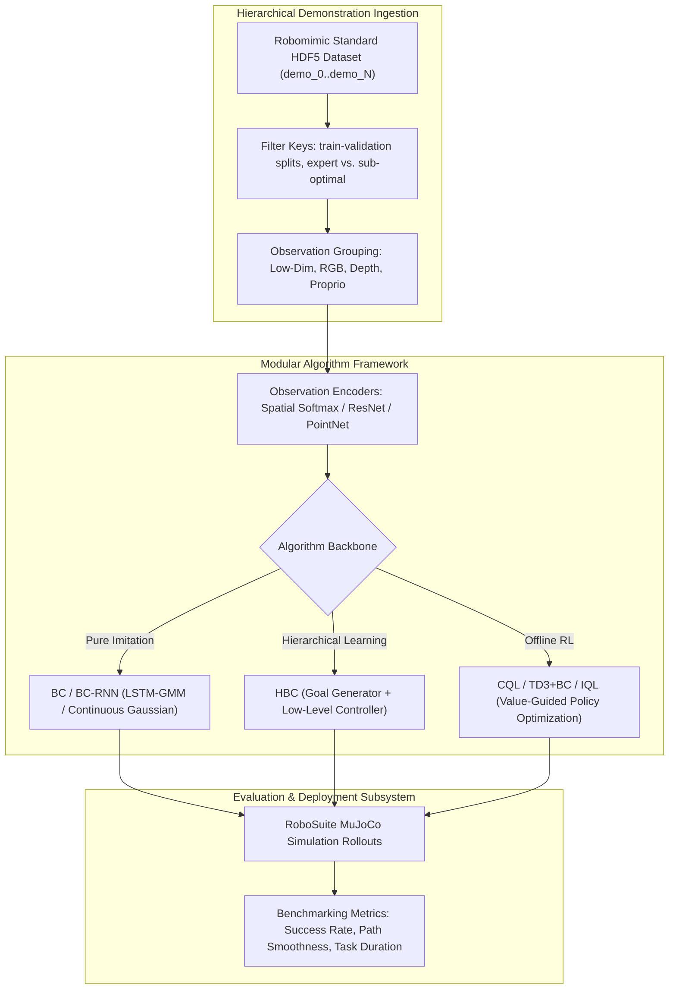
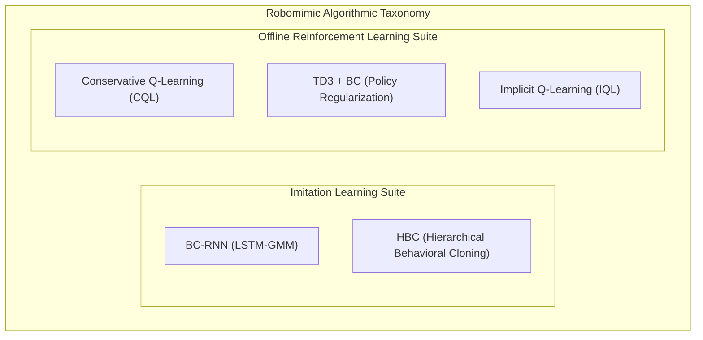

# 🤖 Robomimic: Modular Imitation Learning, Offline RL Benchmarks & RoboSuite Integration

## 1. Framework Overview & Core Philosophy

**Robomimic** is a standardized, modular framework and benchmark suite for **Robot Imitation Learning and Offline Reinforcement Learning**, developed by the Stanford Vision and Learning Lab (SVL) in collaboration with UT Austin.

While physical AI frameworks such as LeRobot focus heavily on low-cost hardware deployment, teleoperation pipelines, and cloud dataset streaming, Robomimic serves as the foundational academic and industrial standard for **rigorous benchmarking, algorithm development, and reproducible evaluation** across large-scale demonstration datasets.

### Core Architecture Principles
1. **Modular Algorithm Abstractions**: Decouples observation encoders (ResNet, Spatial Softmax, MLP), sequence modeling backbones (LSTM, Transformer, Diffusion), and loss formulations (Gaussian, GMM, Implicit Q-Learning).
2. **Standardized HDF5 Dataset Specification**: A high-performance hierarchical data format storing raw robot states, multimodal observations, actions, rewards, and task validation masks.
3. **Seamless Simulation Integration**: Native integration with **RoboSuite** (MuJoCo-based simulation environments including Lift, Can, Square, Tool Hang, and Nut Assembly) and physical robot platforms.



---

## 2. Standard HDF5 Dataset Architecture

Robomimic standardizes offline demonstration storage in structured **HDF5 (`.hdf5`)** archives:

```
dataset.hdf5/
  ├── data/
  │     ├── demo_0/
  │     │     ├── actions             (N_steps x D_action)
  │     │     ├── rewards             (N_steps x 1)
  │     │     ├── dones               (N_steps x 1)
  │     │     ├── states              (N_steps x D_state - MuJoCo simulation state)
  │     │     └── obs/
  │     │           ├── robot0_eef_pos       (N_steps x 3)
  │     │           ├── robot0_eef_quat      (N_steps x 4)
  │     │           ├── robot0_gripper_qpos  (N_steps x 2)
  │     │           ├── agentview_image      (N_steps x 84 x 84 x 3 uint8)
  │     │           └── wristview_image      (N_steps x 84 x 84 x 3 uint8)
  │     └── demo_1/ ...
  └── mask/
        ├── train                     (List of demo keys for training)
        └── valid                     (List of demo keys for validation)
```

- **Filter Masks (`mask/`)**: Allows partitioning a single large HDF5 file into distinct experimental subsets (e.g., `expert` demonstrations vs. `suboptimal` human teleoperation play data) without duplicating data on disk.
- **Hierarchical Modality Grouping**: Observations are explicitly segregated into modalities (`low_dim`, `rgb`, `depth`, `scan`), allowing the encoder pipeline to automatically route tensors to appropriate neural backbones.

---

## 3. Algorithmic Suite & Mathematical Formulations



### A. Behavioral Cloning with Gaussian Mixture Models (BC-RNN / LSTM-GMM)
Standard L2 regression ($\|a - \pi(s)\|^2$) fails on multimodal demonstrations where a human demonstrator can accomplish a task via distinct trajectories.

**BC-RNN with GMM** models the conditional action distribution as a mixture of $K$ Gaussians parameterizing mean $\mu_k$, variance $\sigma_k$, and mixture weights $\alpha_k$:

$$p(a_t | s_{1:t}) = \sum_{k=1}^{K} \alpha_k(h_t) \cdot \mathcal{N}\left(a_t \;\middle|\; \mu_k(h_t), \text{diag}(\sigma_k(h_t)^2)\right)$$

Where $h_t = \text{LSTM}(h_{t-1}, \phi(o_t))$ represents the recurrent hidden state encoding temporal history. The network is trained by minimizing the negative log-likelihood (NLL) of expert actions:

$$\mathcal{L}_{\text{NLL}}(\theta) = -\sum_{t=1}^{T} \log \left( \sum_{k=1}^{K} \alpha_k(h_t) \cdot \mathcal{N}(a_t | \mu_k(h_t), \sigma_k(h_t)^2) \right)$$

### B. TD3+BC (Offline Reinforcement Learning)
When learning from mixed-quality datasets (sub-optimal or noisy human demonstrations), pure behavioral cloning mimics operator mistakes. **TD3+BC** incorporates Q-value optimization while penalizing deviations from the demonstration dataset:

$$\pi_{\text{new}} = \arg\max_{\pi} \mathbb{E}_{(s, a) \sim \mathcal{D}} \left[ \frac{\lambda}{(\mathbb{E}|Q(s, a)|)} Q(s, \pi(s)) - (\pi(s) - a)^2 \right]$$

Where $\lambda$ balances RL policy improvement against behavioral cloning regularization.

### C. Spatial Softmax Feature Extraction
For visual observations, Robomimic leverages **Spatial Softmax** layers to extract continuous 2D keypoint coordinates $(x_c, y_c)$ directly from feature activation maps $A_c(u, v)$ without spatial pooling collapse:

$$P_c(u, v) = \frac{e^{A_c(u, v) / T}}{\sum_{u'} \sum_{v'} e^{A_c(u', v') / T}}, \quad x_c = \sum_{u, v} u \cdot P_c(u, v), \quad y_c = \sum_{u, v} v \cdot P_c(u, v)$$

---

## 4. Complete Runnable Production Code Blueprint

The following complete Python blueprint demonstrates defining a Robomimic-style BC-RNN policy with Spatial Softmax visual encoding and Gaussian Mixture Model (GMM) action sampling in PyTorch:

```python
#!/usr/bin/env python3
"""
Complete Production Blueprint: Robomimic BC-RNN (LSTM-GMM) Policy
"""

import torch
import torch.nn as nn
import torch.nn.functional as F

class SpatialSoftmax(nn.Module):
    """
    Extracts continuous 2D feature coordinates from visual feature maps.
    """
    def __init__(self, in_c, in_h, in_w, temperature=1.0):
        super().__init__()
        self.in_c = in_c
        self.temperature = temperature

        pos_x, pos_y = torch.meshgrid(
            torch.linspace(-1.0, 1.0, in_h),
            torch.linspace(-1.0, 1.0, in_w),
            indexing="ij"
        )
        self.register_buffer("pos_x", pos_x.reshape(-1))
        self.register_buffer("pos_y", pos_y.reshape(-1))

    def forward(self, x):
        B, C, H, W = x.shape
        x_flat = x.view(B * C, H * W) / self.temperature
        softmax_attention = F.softmax(x_flat, dim=-1)

        expected_x = torch.sum(softmax_attention * self.pos_x, dim=-1, keepdim=True)
        expected_y = torch.sum(softmax_attention * self.pos_y, dim=-1, keepdim=True)
        keypoints = torch.cat([expected_x, expected_y], dim=-1).view(B, C * 2)
        return keypoints

class BCRNN_GMMPolicy(nn.Module):
    """
    Recurrent Behavioral Cloning Policy with Gaussian Mixture Model Action Head
    """
    def __init__(self, action_dim=7, num_gaussians=5, hidden_dim=128):
        super().__init__()
        self.action_dim = action_dim
        self.num_gaussians = num_gaussians
        self.hidden_dim = hidden_dim

        # Visual feature extractor
        self.conv = nn.Sequential(
            nn.Conv2d(3, 32, kernel_size=3, stride=2, padding=1),
            nn.ReLU(),
            nn.Conv2d(32, 64, kernel_size=3, stride=2, padding=1),
            nn.ReLU()
        )
        self.spatial_softmax = SpatialSoftmax(64, 21, 21) # For 84x84 input

        # Recurrent Core
        self.lstm = nn.LSTM(input_size=128 + 9, hidden_size=hidden_dim, batch_first=True) # 128 visual + 9 proprio

        # GMM Action Prediction Heads
        self.head_mu = nn.Linear(hidden_dim, num_gaussians * action_dim)
        self.head_sigma = nn.Linear(hidden_dim, num_gaussians * action_dim)
        self.head_weights = nn.Linear(hidden_dim, num_gaussians)

    def forward(self, img_seq, proprio_seq, hidden_state=None):
        B, T, C, H, W = img_seq.shape
        img_flat = img_seq.view(B * T, C, H, W)
        conv_out = self.conv(img_flat)
        keypoints = self.spatial_softmax(conv_out).view(B, T, -1)

        # Concatenate visual keypoints and proprioceptive joint state
        features = torch.cat([keypoints, proprio_seq], dim=-1)

        # Recurrent temporal forward pass
        lstm_out, hidden_state = self.lstm(features, hidden_state)

        # Decode GMM parameters from final timestep
        last_hidden = lstm_out[:, -1, :]
        mu = self.head_mu(last_hidden).view(B, self.num_gaussians, self.action_dim)
        sigma = torch.exp(torch.clamp(self.head_sigma(last_hidden).view(B, self.num_gaussians, self.action_dim), -5.0, 2.0))
        logits = self.head_weights(last_hidden)
        weights = F.softmax(logits, dim=-1)

        return mu, sigma, weights, hidden_state

    def sample_action(self, mu, sigma, weights):
        # Sample mixture component
        cat_dist = torch.distributions.Categorical(weights)
        k = cat_dist.sample() # Shape: (B,)

        # Sample Gaussian action from selected component
        B = mu.shape[0]
        selected_mu = mu[torch.arange(B), k]
        selected_sigma = sigma[torch.arange(B), k]
        normal_dist = torch.distributions.Normal(selected_mu, selected_sigma)
        return normal_dist.sample()

def run_robomimic_demo():
    print("[Robomimic] Initializing BC-RNN (LSTM-GMM) Policy Network...")
    device = "cuda" if torch.cuda.is_available() else "cpu"

    policy = BCRNN_GMMPolicy(action_dim=7, num_gaussians=5, hidden_dim=128).to(device)
    policy.eval()

    # Synthetic multi-timestep observation batch (Batch: 2, Timesteps: 10)
    synthetic_images = torch.randn(2, 10, 3, 84, 84, device=device)
    synthetic_proprio = torch.randn(2, 10, 9, device=device)

    with torch.no_grad():
        mu, sigma, weights, _ = policy(synthetic_images, synthetic_proprio)
        sampled_actions = policy.sample_action(mu, sigma, weights)

    print(f"[Robomimic] Forward pass successful!")
    print(f"[Robomimic] Mixture Component Weights (Batch 0): {weights[0].cpu().numpy().round(3)}")
    print(f"[Robomimic] Sampled Action Output (Batch 0, 7-DoF): {sampled_actions[0].cpu().numpy().round(3)}")

if __name__ == "__main__":
    run_robomimic_demo()
```

---

## 5. Cross-Reference Links
- [[frameworks/lerobot|HuggingFace LeRobot Physical AI Pipeline]]
- [[frameworks/torchvision|TorchVision Operators & Data Augmentation]]
- [[topics/vla-and-physical-ai-robotics/00-vla-and-physical-ai-robotics-moc|Reinforcement Learning & Policy Optimization]]
