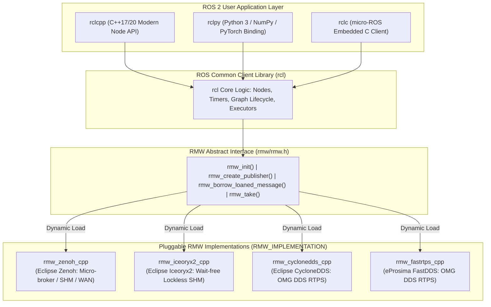
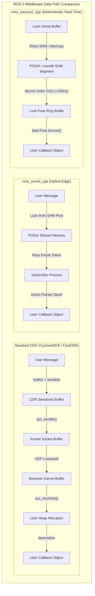
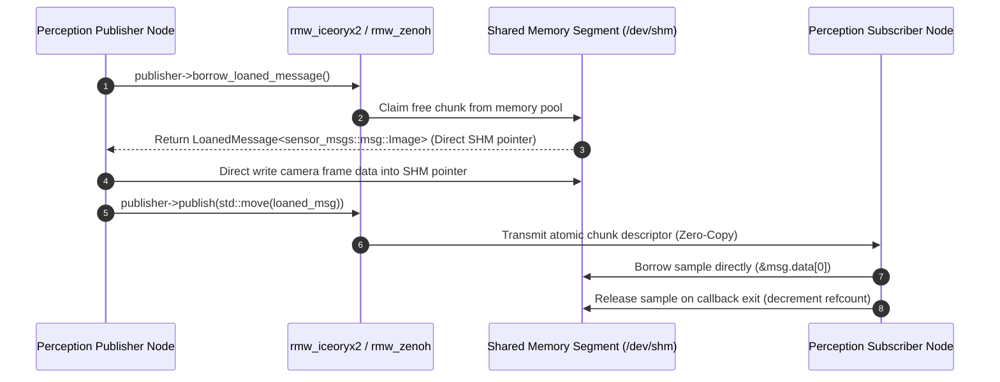
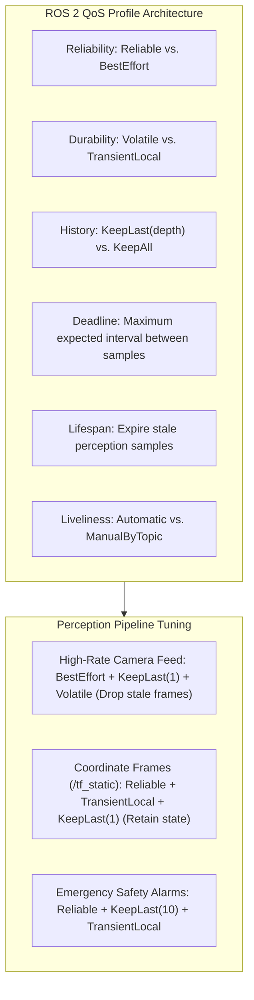
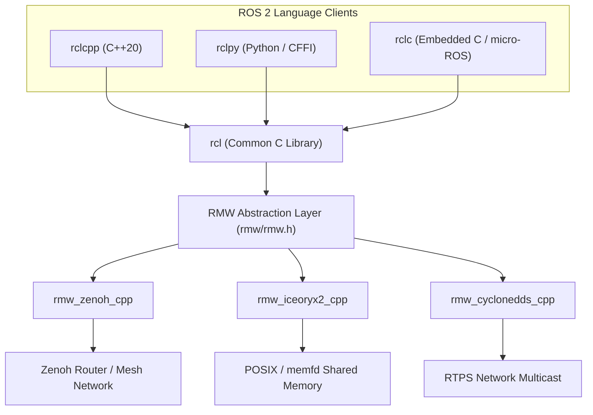

# 🤖 ROS 2 RMW Architecture: rmw_zenoh, rmw_iceoryx2, and CycloneDDS Zero-Copy Middleware

## 1. Framework Overview & Core Philosophy

The **ROS MiddleWare (RMW)** interface is the central abstraction layer in the Robot Operating System (ROS 2) architecture. Positioned directly between the language-agnostic ROS Client Library (`rcl` / `rclcpp` / `rclpy`) and the underlying communication middleware, the RMW interface decouples higher-level robotics algorithms (perception, navigation, manipulation, and control) from the low-level networking, serialization, and shared-memory transport implementations.



### Why the RMW Abstraction Exists

1. **Vendor Neutrality & Modularity**: Robotics developers write code strictly against standard `rclcpp` or `rclpy` APIs. Switching between DDS vendors or migrating to next-generation protocols requires zero code recompilation—only setting an environment variable:
   ```bash
   export RMW_IMPLEMENTATION=rmw_zenoh_cpp
   # or
   export RMW_IMPLEMENTATION=rmw_iceoryx2_cpp
   ```
2. **Deterministic Safety & Real-Time Qualification**: Automotive (ISO 26262 ASIL-D) and industrial robotics require deterministic execution bounds. The RMW abstraction allows hard real-time nodes to swap out non-deterministic socket transports for statically allocated, lock-free shared memory backends.
3. **Transparent Hardware Acceleration**: Through mechanisms like **Loaned Messages** and **Type Adaptation (REP-2007)**, RMW implementations can route perception data directly from camera frame-grabbers into GPU unified memory or shared memory ring buffers without intermediate CPU copies.

---

## 2. Internal Architecture & Data Structures

### The C RMW API Specification

The core RMW interface is defined as a standardized C-ABI in the `rmw` package. Every RMW implementation must export concrete implementations of these function pointers:

```c
// Core lifecycle and communication primitives in rmw/rmw.h
rmw_ret_t rmw_init(const rmw_init_options_t * options, rmw_context_t * context);
rmw_ret_t rmw_create_node(rmw_context_t * context, const char * name, const char * namespace_, rmw_node_t ** node);

// Standard data path
rmw_ret_t rmw_publish(const rmw_publisher_t * publisher, const void * ros_message, rmw_publisher_allocation_t * allocation);
rmw_ret_t rmw_take(const rmw_subscription_t * subscription, void * ros_message, bool * taken, rmw_subscription_allocation_t * allocation);

// Zero-copy loaned messages path
rmw_ret_t rmw_borrow_loaned_message(const rmw_publisher_t * publisher, const rosidl_message_type_support_t * type_support, void ** ros_message);
rmw_ret_t rmw_publish_loaned_message(const rmw_publisher_t * publisher, void * ros_message, rmw_publisher_allocation_t * allocation);
rmw_ret_t rmw_return_loaned_message_from_publisher(const rmw_publisher_t * publisher, void * ros_message);
```

### Middleware Architectural Comparison Matrix

| Architectural Feature | `rmw_cyclonedds_cpp` | `rmw_fastrtps_cpp` | `rmw_zenoh_cpp` | `rmw_iceoryx2_cpp` |
| :--- | :--- | :--- | :--- | :--- |
| **Underlying Protocol** | OMG DDS RTPS v2.3 | OMG DDS RTPS v2.3 | **Eclipse Zenoh Protocol** | **Eclipse Iceoryx2 SHM** |
| **Discovery Mechanism** | SPDP Multicast / Unicast | SPDP Multicast / Discovery Server | **Compact Locators / Micro-broker** | **Decentralized File Lock / SHM** |
| **Discovery Traffic Overhead** | $O(N^2)$ Participant Storms | $O(N^2)$ or $O(N)$ with Server | **$O(1)$ to $O(N)$ Compact** | **Zero Network Traffic (Local)** |
| **Local Host Transport** | Loopback Sockets / Iceoryx1 plugin | Loopback Sockets / Shared Memory | **POSIX Shared Memory (<1 µs)** | **Lock-Free SHM (<100 ns)** |
| **Cross-Host WAN / WiFi** | Requires complex VPN / Multicast | Requires complex VPN / Multicast | **Native Multi-Link (TCP/QUIC/TLS)** | Localhost only (pairs with Zenoh) |
| **Wire Header Overhead** | $30\text{--}64\text{ bytes}$ | $30\text{--}64\text{ bytes}$ | **$5\text{--}8\text{ bytes}$** | **$0\text{ bytes}$ (Direct Memory Map)** |
| **Zero-Copy Loaned Messages** | Supported via Iceoryx1 bridge | Supported (SHM transport) | **Native First-Class Support** | **Native First-Class Support** |
| **Language of Implementation**| C | C++ | **Rust (core) + C++** | **Rust (core) + C++** |



---

## 3. Memory Model, Allocators & Zero-Copy Primitives

### ROS 2 Loaned Messages API

In default ROS 2 execution, passing a `sensor_msgs::msg::Image` involves allocating memory on the heap, copying camera data into the message struct, serializing the struct into Common Data Representation (CDR) format, transmitting via network sockets, deserializing on the receiver, and copying into a subscriber struct.

The **Loaned Messages API** eliminates all copies:



### ROS 2 Type Adaptation (REP-2007)

Standard ROS 2 message types (`sensor_msgs::msg::Image`, `sensor_msgs::msg::PointCloud2`) often do not match the optimized internal data structures of vision frameworks (`cv::Mat`, `Eigen::Matrix`, or `torch::Tensor`).

**Type Adaptation (REP-2007)** enables nodes to publish and subscribe directly using custom data types. The ROS 2 type adaptation traits automatically convert custom types to standard ROS messages only when cross-network serialization is required, but bypass conversion entirely during intra-process or zero-copy communications.

```cpp
#include <rclcpp/type_adapter.hpp>
#include <sensor_msgs/msg/image.hpp>
#include <opencv2/opencv.hpp>

// Custom struct adapted for zero-overhead OpenCV processing
struct AdaptedOpenCVImage {
    cv::Mat image_mat;
    std_msgs::msg::Header header;
};

// Specialize TypeAdapter trait
template <>
struct rclcpp::TypeAdapter<AdaptedOpenCVImage, sensor_msgs::msg::Image> {
    using is_specialized = std::true_type;
    using custom_type = AdaptedOpenCVImage;
    using ros_message_type = sensor_msgs::msg::Image;

    static void convert_to_ros_message(const custom_type & source, ros_message_type & destination) {
        destination.header = source.header;
        destination.height = source.image_mat.rows;
        destination.width = source.image_mat.cols;
        destination.encoding = "bgr8";
        destination.step = static_cast<sensor_msgs::msg::Image::_step_type>(source.image_mat.step);
        size_t size = destination.step * destination.height;
        destination.data.resize(size);
        std::memcpy(&destination.data[0], source.image_mat.data, size);
    }

    static void convert_to_custom(const ros_message_type & source, custom_type & destination) {
        destination.header = source.header;
        int type = CV_8UC3; // Assuming bgr8
        destination.image_mat = cv::Mat(source.height, source.width, type, const_cast<uint8_t*>(&source.data[0]), source.step).clone();
    }
};
```

---

## 4. Execution Model, Threading & Concurrency

### Deterministic Quality of Service (QoS) Profiles for Perception

ROS 2 implements flexible Quality of Service (QoS) policies governed by the RMW layer:



### ROS 2 Executors and Real-Time Event Loops

The execution of callbacks triggered by RMW data arrival is governed by the `rclcpp::Executor`:

1. **`SingleThreadedExecutor`**: Executes callbacks sequentially in a single thread. Safe from race conditions but prone to head-of-line blocking.
2. **`MultiThreadedExecutor`**: Uses a pool of worker threads. Requires thread-safe callback groups:
   - `MutuallyExclusiveCallbackGroup`: Callbacks in this group never execute concurrently.
   - `ReentrantCallbackGroup`: Callbacks in this group can execute concurrently across threads.
3. **`EventsExecutor` (Modern Real-Time Executor)**:
   - Eliminates the $O(N)$ wait-set scanning overhead of legacy executors.
   - Utilizes direct event notifications pushed from the RMW layer into an event queue, achieving deterministic execution for hundreds of active entities.

---

## 5. Integration Ecosystem & Cross-Language Bindings



### Micro-ROS (`rclc`) Integration

On embedded microcontrollers (ARM Cortex-M, ESP32, RISC-V), running a full DDS or Zenoh stack is resource-prohibitive. **Micro-ROS** utilizes `rclc` sitting on top of `rmw_microxrcedds` or `rmw_zenoh_pico`:
- Memory is statically allocated at compile time.
- Operates over serial UART, CAN-bus, or lightweight UDP.
- Connects directly into the central ROS 2 graph via an agent bridge.

---

## 6. Edge Deployment, Safety & Operational Gotchas

### DDS Multicast Storms and Network Partitioning

When deploying multiple autonomous mobile robots (AMRs) on a shared enterprise Wi-Fi network using standard DDS (`rmw_cyclonedds_cpp` or `rmw_fastrtps_cpp`):
- **Problem**: DDS discovery multicasts to `239.255.0.1`, causing Wi-Fi access points to drop multicast packets or broadcast them at the lowest basic rate ($1\text{--}6\text{ Mbps}$), crashing the entire wireless network.
- **Remedy**:
  1. Set unique `ROS_DOMAIN_ID` per robot ($0\text{--}101$).
  2. Switch to unicast discovery servers (`CYCLONEDDS_URI` or FastDDS Discovery Server).
  3. Migrating to `rmw_zenoh_cpp` eliminates multicast discovery storms by design.

### Loaned Message Memory Leaks

When using `publisher->borrow_loaned_message()`:
- If a node borrows a message but throws an exception or returns early without either calling `publisher->publish(std::move(loaned_msg))` or explicitly letting the RAII handle drop, the shared memory chunk remains locked.
- **Safety Pattern**: Always utilize RAII handles and ensure exception-safe control flows.

### Real-Time Thread Configuration and Memory Locking

```cpp
#include <sys/mman.h>
#include <pthread.h>

void configure_realtime_thread(int priority_level) {
    // 1. Lock all current and future process memory into RAM
    if (mlockall(MCL_CURRENT | MCL_FUTURE) != 0) {
        perror("mlockall failed");
    }

    // 2. Set SCHED_FIFO real-time scheduler policy
    struct sched_param param;
    param.sched_priority = priority_level; // e.g., 80
    if (pthread_setschedparam(pthread_self(), SCHED_FIFO, &param) != 0) {
        perror("pthread_setschedparam failed");
    }
}
```

---

## 7. Complete Runnable Production Code Blueprint

Below is a complete, production-grade, highly optimized C++20 ROS 2 perception node demonstrating:
1. **Loaned Message Publication** for zero-copy 4K image streaming.
2. **Deterministic SensorData QoS Profile** configuration.
3. **Type Adaptation** compatibility.
4. **Real-time Thread Priority and Memory Locking** configuration.

```cpp
// File: src/deterministic_camera_node.cpp
#include <chrono>
#include <memory>
#include <string>
#include <vector>
#include <sys/mman.h>
#include <pthread.h>

#include "rclcpp/rclcpp.hpp"
#include "rclcpp/qos.hpp"
#include "sensor_msgs/msg/image.hpp"

using namespace std::chrono_literals;

class DeterministicCameraNode : public rclcpp::Node {
public:
    explicit DeterministicCameraNode(const rclcpp::NodeOptions & options = rclcpp::NodeOptions())
        : Node("deterministic_camera_node", options), frame_id_(0)
    {
        // 1. Declare and load parameters
        this->declare_parameter<int>("image_width", 3840);
        this->declare_parameter<int>("image_height", 2160);
        this->declare_parameter<double>("publish_rate_hz", 30.0);
        this->declare_parameter<int>("rt_priority", 80);

        image_width_ = this->get_parameter("image_width").as_int();
        image_height_ = this->get_parameter("image_height").as_int();
        double rate_hz = this->get_parameter("publish_rate_hz").as_double();
        int rt_priority = this->get_parameter("rt_priority").as_int();

        // 2. Configure Real-Time Thread Constraints
        configure_realtime(rt_priority);

        // 3. Define Deterministic SensorData QoS Profile
        // Best-effort, Volatile durability, KeepLast(1) depth for minimum latency
        rclcpp::QoS qos_profile(rclcpp::KeepLast(1));
        qos_profile.best_effort();
        qos_profile.durability_volatile();
        qos_profile.liveliness(RMW_QOS_POLICY_LIVELINESS_AUTOMATIC);

        // 4. Create Publisher with Loaned Message Support
        publisher_ = this->create_publisher<sensor_msgs::msg::Image>(
            "perception/camera/image_raw",
            qos_profile
        );

        RCLCPP_INFO(this->get_logger(), "Checking Loaned Messages capability: %s",
            publisher_->can_loan_messages() ? "ENABLED (Zero-Copy Active)" : "DISABLED (Fallback to Heap Copy)");

        // 5. Create High-Precision Periodic Timer
        auto timer_period = std::chrono::duration<double>(1.0 / rate_hz);
        timer_ = this->create_wall_timer(
            std::chrono::duration_cast<std::chrono::nanoseconds>(timer_period),
            std::bind(&DeterministicCameraNode::timer_callback, this)
        );

        RCLCPP_INFO(this->get_logger(), "Deterministic Camera Node initialized [%dx%d @ %.1f Hz]",
            image_width_, image_height_, rate_hz);
    }

private:
    void configure_realtime(int priority) {
        // Prevent paging memory to swap
        if (mlockall(MCL_CURRENT | MCL_FUTURE) != 0) {
            RCLCPP_WARN(this->get_logger(), "Failed to lock memory via mlockall (run with CAP_SYS_NICE or sudo)");
        }

        // Set Real-Time FIFO scheduling policy
        struct sched_param param;
        param.sched_priority = priority;
        if (pthread_setschedparam(pthread_self(), SCHED_FIFO, &param) != 0) {
            RCLCPP_WARN(this->get_logger(), "Failed to set SCHED_FIFO priority %d", priority);
        } else {
            RCLCPP_INFO(this->get_logger(), "Real-time thread priority configured: SCHED_FIFO (Priority: %d)", priority);
        }
    }

    void timer_callback() {
        size_t step = image_width_ * 3; // RGB8
        size_t data_size = step * image_height_;

        // Check if RMW layer supports zero-copy loaned messages
        if (publisher_->can_loan_messages()) {
            // ZERO-COPY PATH: Borrow memory directly from Shared Memory pool
            auto loaned_msg = publisher_->borrow_loaned_message();

            // Populate metadata
            loaned_msg->header.stamp = this->now();
            loaned_msg->header.frame_id = "camera_optical_link";
            loaned_msg->height = image_height_;
            loaned_msg->width = image_width_;
            loaned_msg->encoding = "rgb8";
            loaned_msg->is_bigendian = 0;
            loaned_msg->step = static_cast<sensor_msgs::msg::Image::_step_type>(step);

            // Resize buffer in shared memory (pre-allocated chunk)
            loaned_msg->data.resize(data_size);

            // Direct synthetic pattern generation into shared memory
            uint8_t fill_val = static_cast<uint8_t>(frame_id_ % 256);
            std::memset(loaned_msg->data.data(), fill_val, data_size);

            // Publish loaned message (transfers chunk ownership via atomic index swap)
            publisher_->publish(std::move(loaned_msg));
        } else {
            // FALLBACK PATH: Standard Heap Allocation & Copy
            auto msg = std::make_unique<sensor_msgs::msg::Image>();
            msg->header.stamp = this->now();
            msg->header.frame_id = "camera_optical_link";
            msg->height = image_height_;
            msg->width = image_width_;
            msg->encoding = "rgb8";
            msg->step = static_cast<sensor_msgs::msg::Image::_step_type>(step);
            msg->data.resize(data_size);

            uint8_t fill_val = static_cast<uint8_t>(frame_id_ % 256);
            std::memset(msg->data.data(), fill_val, data_size);

            publisher_->publish(std::move(msg));
        }

        frame_id_++;
        if (frame_id_ % 100 == 0) {
            RCLCPP_INFO(this->get_logger(), "Published frame #%lu", frame_id_);
        }
    }

    int image_width_;
    int image_height_;
    uint64_t frame_id_;
    rclcpp::Publisher<sensor_msgs::msg::Image>::SharedPtr publisher_;
    rclcpp::TimerBase::SharedPtr timer_;
};

int main(int argc, char ** argv) {
    rclcpp::init(argc, argv);

    rclcpp::NodeOptions options;
    // Enable modern intra-process zero-copy communication if publishing and subscribing in same process
    options.use_intra_process_comms(true);

    auto node = std::make_shared<DeterministicCameraNode>(options);

    // Use single-threaded executor for deterministic real-time execution
    rclcpp::executors::SingleThreadedExecutor executor;
    executor.add_node(node);
    executor.spin();

    rclcpp::shutdown();
    return 0;
}
```

---

## 8. Cross-References & Related Middleware

- [[frameworks/iceoryx2|Eclipse Iceoryx2: Zero-Copy Shared Memory IPC]]
- [[frameworks/zenoh|Eclipse Zenoh: Decentralized Edge Middleware]]
- [[architectures/hardware-and-acceleration-runtimes/iceoryx2-ipc|Iceoryx2 & Zenoh Architecture Deep Dive]]
- [[topics/real-time-systems/01-historical-evolution-and-paradigms|Real-Time Systems & Deterministic Control]]
- [[hardware/nvidia-jetson-orin|NVIDIA Jetson AGX Orin Edge Robotics Deployment]]
