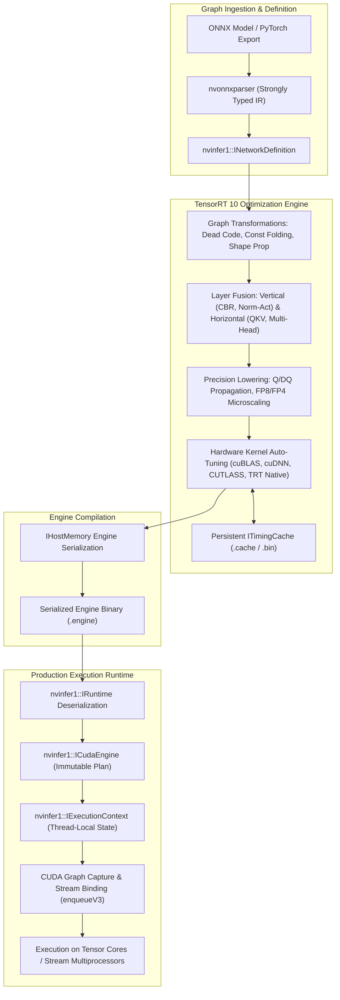
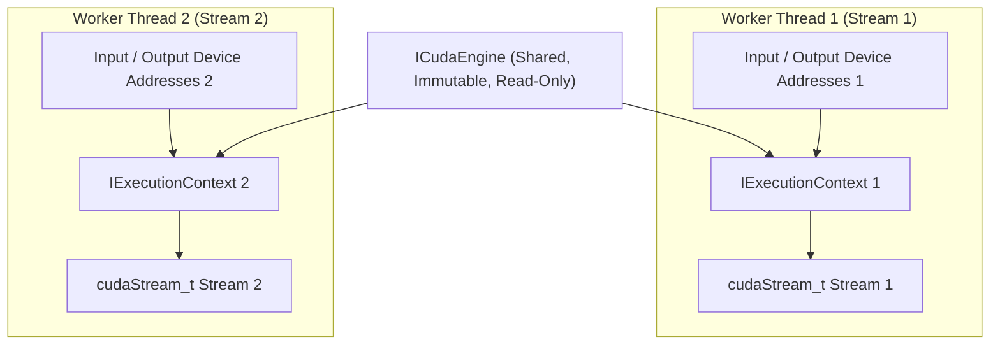

# 🚀 NVIDIA TensorRT 10.x / 10.8+: Deep Learning Inference Compiler & Engine Runtime

## 1. Framework Overview & Core Philosophy

NVIDIA TensorRT is an optimizing compiler and high-performance execution runtime engineered to maximize inference throughput and minimize latency on NVIDIA discrete GPUs (Blackwell, Hopper, Ada Lovelace, Ampere) and embedded SoCs (Jetson AGX Orin, Jetson Thor). Rather than acting as an interpretive execution runtime, TensorRT ingests high-level computation graphs (primarily via ONNX or strong-typed network builders), synthesizes target-specific hardware instruction streams, optimizes memory residency, and serializes the resulting artifact into an immutable executable binary called a **Plan Engine** (`.engine` / `.plan`).

### Evolution from TensorRT 8/9 to TensorRT 10.x Architecture

TensorRT 10.x represents an architectural shift from legacy runtime paradigms:

1. **Strongly-Typed Network Definitions (`NetworkDefinitionCreationFlag::kSTRONGLY_TYPED`)**:
   Legacy TensorRT versions (8.x and earlier) inferred precisions implicitly via builder flags (`BuilderFlag::kFP16`, `BuilderFlag::kINT8`) and external dynamic range calibration caches. TensorRT 10 mandates or defaults to strongly typed graph semantics where data types ($FP32$, $FP16$, $BF16$, $INT8$, $FP8$, $INT4$, $NVFP4$) are statically declared in the graph via explicit Quantize/Dequantize (`Q/DQ`) nodes, matching the PyTorch `torch.export` and ONNX Quantization standards.
2. **Modular Plugin Architecture (`IPluginV3`)**:
   Replaces the monolithic `IPluginV2DynamicExt` with decoupled interfaces: `IPluginV3OneCore` (identity and format capability), `IPluginV3OneBuild` (compile-time shape negotiation and workspace sizing), and `IPluginV3OneRuntime` (execution context and device stream dispatch).
3. **Microscaled Data Formats (FP8 & NVFP4 / MXFP4)**:
   Native support for 8-bit floating-point ($E4M3$ and $E5M2$) and 4-bit microscaling formats ($NVFP4$ with $E2M1$ mantissa/exponent encoding paired with scale factors per 16/32 element block) targeting 4th and 5th Generation Tensor Cores.
4. **Weight-Streaming Execution**:
   Enables foundation models (such as LLMs and large Vision-Language Models) whose parameters exceed physical GPU High Bandwidth Memory (HBM/VRAM) to execute with partial weight residency. The runtime dynamically streams weights from host system DRAM over PCIe Gen5/CXL or NVLink while overlapping computation with asynchronous DMA transfers.



---

## 2. Internal Compilation Pipeline & Graph Representation

The compilation pipeline converts an unoptimized dataflow graph into an optimized execution graph through distinct transformation passes.

### A. Graph Parsing & Intermediate Representation (IR)
TensorRT builds an internal directed acyclic graph (DAG) composed of `ILayer` nodes and `ITensor` edges. When ingesting ONNX models via `nvonnxparser`, the parser maps standard ONNX operators to TensorRT primitives. In strongly typed networks, intermediate tensor shapes are represented symbolically as `DimsExprs` containing constant dimensions and `IDimensionExpr` dynamic variables.

### B. High-Level Graph Rewriting Passes
1. **Constant Folding & Shape Propagation**:
   Static subgraphs (e.g., shape calculation nodes, transpose operations on constant weight tensors) are evaluated at compile time and collapsed into constant weight buffers.
2. **Common Subexpression Elimination (CSE)**:
   Identical computations consuming identical inputs are merged into a single output node.
3. **Dead Node Pruning**:
   Any operation that does not contribute to the declared network output bindings (`markOutput`) is eliminated from the graph.

### C. Layer Fusion Passes
Layer fusion minimizes DRAM/VRAM round-trips by keeping intermediate activations inside Streaming Multiprocessor (SM) registers or shared memory ($L1$ / Scratchpad).

- **Vertical Fusion (Kernel Chaining)**:
  - `Convolution + Bias + Activation (ReLU/SiLU/GELU)` $\to$ Single Fused Kernel (`CBR`).
  - `LayerNorm / RMSNorm + Residual Add + SwiGLU / GELU` $\to$ Single fused transformer sub-block kernel.
  - `Conv2D + Residual Addition` $\to$ Direct accumulation into the residual memory buffer without intermediate staging.
- **Horizontal Fusion (Parallel Branch Merging)**:
  - Multi-head self-attention: Query ($W_q$), Key ($W_k$), and Value ($W_v$) matrix multiplications with identical input activations are merged into a single batched GEMM:
    $$W_{qkv} = \begin{bmatrix} W_q \\ W_k \\ W_v \end{bmatrix}, \quad Y_{qkv} = X \cdot W_{qkv}$$
  - Parallel pointwise convolutions sharing identical inputs are merged into a multi-filter single-launch kernel.
- **Attention Kernel Synthesis**:
  TensorRT matches multi-head attention subgraphs and replaces them with highly optimized FlashAttention-2 / FlashAttention-3 implementations, performing softmax computation entirely within SM shared memory using tiled online softmax algorithms.

```
Vertical Layer Fusion:
[Conv2D] ---> (Activations to VRAM) ---> [BatchNorm] ---> (VRAM) ---> [ReLU] ---> (VRAM)
                          ⬇ (Fused into Single Kernel)
[Fused CBR Kernel: Conv + Bias + ReLU in Register Space] ---> (Activations to VRAM)

Horizontal Layer Fusion:
[Input X] ---> [GEMM W_q] ---> Q
          ---> [GEMM W_k] ---> K   ===>   [Input X] ---> [Fused GEMM W_qkv] ---> [Q, K, V]
          ---> [GEMM W_v] ---> V
```

### D. Kernel Auto-Tuning & Tactic Selection
During the build phase (`builder.build_serialized_network`), TensorRT evaluates available low-level implementations (tactics) for each node or fused cluster:
1. **Tactics Sources**: Native TRT tactics, cuDNN library kernels, cuBLAS/cuBLASLt GEMM algorithms, and CUTLASS templated kernels.
2. **Heuristic & Empirical Profiling**: TensorRT allocates temporary workspace and executes candidate tactics directly on the target GPU across specified profile shapes ($Min$, $Opt$, $Max$), measuring real execution time via CUDA events.
3. **Selection Metric**: The fastest tactic satisfying numerical stability and workspace constraints is recorded into the engine plan.

---

## 3. Memory Model, Allocators & Zero-Copy Primitives

Memory bandwidth and allocation overhead are critical determinants of inference latency. TensorRT employs a dual-tier memory model: **Workspace Allocation** during compilation/execution, and **Tensor Binding Allocation** during runtime dispatch.

```
+-----------------------------------------------------------------------------------+
|                            Physical GPU Memory (VRAM)                             |
+-----------------------------------------------------------------------------------+
|  Serialized Engine (Weights & Graph Layout)  |  Static Weights / Streamed Cache   |
+----------------------------------------------+------------------------------------+
|  Workspace Memory Pool (kWORKSPACE)          |  Reused Across Non-Overlapping     |
|  Managed by TensorRT Execution Engine        |  Layer Lifetimes During Forward    |
+-----------------------------------------------------------------------------------+
|  Device Input/Output Tensors (Allocated by User / IGpuAllocator)                  |
|  - Zero-Copy Pinned Host Memory (Tegra/Jetson Unified Physical Memory)           |
|  - DMA-BUF External Memory (Imported via cudaImportExternalMemory)                |
+-----------------------------------------------------------------------------------+
```

### A. Memory Arenas & Buffer Reuse
TensorRT computes the lifetime of every intermediate activation tensor across the topological execution sequence. If Layer $A$'s output tensor lifetime expires before Layer $C$ begins execution, TensorRT aliases Layer $C$'s output buffer to the same physical VRAM address as Layer $A$. This reduces peak activation memory consumption by $60\%\text{--}80\%$.

### B. Custom Memory Allocators (`IGpuAllocator`)
In production microservices or embedded platforms, calling `cudaMalloc` and `cudaFree` during inference induces synchronization barriers and OS kernel locks. Applications implement `IGpuAllocator` to supply TensorRT with pre-allocated memory pools (e.g., using `cudaMemPool_t` or an external arena):

```cpp
class CustomGpuAllocator : public nvinfer1::IGpuAllocator {
public:
    void* allocate(uint64_t size, uint64_t alignment, uint32_t flags) noexcept override {
        void* ptr = nullptr;
        // Allocate from custom lock-free memory arena or stream-ordered memory pool
        cudaMallocAsync(&ptr, size, m_stream);
        return ptr;
    }
    void deallocate(void* memory) noexcept override {
        cudaFreeAsync(memory, m_stream);
    }
};
```

### C. Zero-Copy Primitives & Embedded Unified Memory (Jetson Orin / Thor)
On discrete GPUs, data must transfer over PCIe (`cudaMemcpyAsync`). On unified memory architectures (NVIDIA Jetson AGX Orin with unified LPDDR5 memory bus), host CPU and GPU share physical DRAM:
- **Pinned Host Memory (`cudaHostAllocMapped`)**: Pinned CPU memory can be mapped directly into the CUDA address space using `cudaHostGetDevicePointer()`. The GPU accesses data over the internal crossbar without performing explicit `cudaMemcpy`.
- **POSIX DMA-BUF Import**: Zero-copy camera pipeline integration via `cudaImportExternalMemory`:

$$\text{V4L2 Camera Buffer / DRM} \xrightarrow{\text{Export File Descriptor}} \text{DMA-BUF} \xrightarrow{\text{cudaImportExternalMemory}} \text{Direct TRT Input Tensor}$$

### D. Weight-Streaming Architecture
For models exceeding available GPU VRAM, TensorRT 10 introduces the Weight Streaming API:
```cpp
// Set budget for weight residency in GPU VRAM (e.g., 4 GiB out of 8 GiB total weights)
size_t streamBudget = 4ULL * 1024 * 1024 * 1024;
context->setWeightStreamingBudget(streamBudget);
```
TensorRT builds an asynchronous pre-fetching pipeline where layer weights for sub-graph $N+1$ are DMA-transferred from host RAM to VRAM while sub-graph $N$ executes on the Tensor Cores.

---

## 4. Execution Model, Threading & Concurrency

### A. Engine vs. Context Threading Contract
- **`ICudaEngine`**: An immutable, thread-safe object representing the compiled model weights and execution metadata. A single `ICudaEngine` can be shared safely across arbitrary host threads.
- **`IExecutionContext`**: A mutable, thread-hostile execution state container. Each context holds its own execution scratchpad, activation allocations, and tensor address bindings. **Thread Rule**: Never invoke `enqueueV3` on the same `IExecutionContext` concurrently from multiple threads. To achieve multi-stream parallel inference, instantiate multiple `IExecutionContext` objects from the single shared `ICudaEngine`.



### B. Modern Asynchronous Dispatch (`enqueueV3`)
TensorRT 10 deprecated legacy index-based buffer bindings (`enqueueV2`) in favor of name-based tensor address specification (`enqueueV3`):
```cpp
// Explicitly map allocated device pointers to tensor names
context->setInputTensorAddress("input_images", d_input_buffer);
context->setOutputTensorAddress("detected_boxes", d_output_boxes);
context->setOutputTensorAddress("class_scores", d_output_scores);

// Non-blocking asynchronous dispatch
bool status = context->enqueueV3(cuda_stream);
```

### C. CUDA Graph Integration
Standard kernel launches incur CPU driver dispatch overhead (~$5\text{--}15\,\mu\text{s}$ per kernel). For complex vision backbones with hundreds of layers, CPU launch latency can dominate execution time. TensorRT models are fully compatible with CUDA Graph capture:

1. **Capture Phase**:
   ```cpp
   cudaStreamBeginCapture(stream, cudaStreamCaptureModeGlobal);
   context->enqueueV3(stream);
   cudaStreamEndCapture(stream, &cuda_graph);
   cudaGraphInstantiate(&graph_exec, cuda_graph, nullptr, nullptr, 0);
   ```
2. **Replay Phase**:
   ```cpp
   // Executed in < 2 microseconds CPU overhead
   cudaGraphLaunch(graph_exec, stream);
   ```

---

## 5. Quantization, Mixed Precision & Kernel Auto-Tuning

### A. Precision Formats & Mathematical Representations

| Precision Format | Bits | Exponent | Mantissa | Dynamic Range ($\approx$) | Primary Target Hardware |
| :--- | :--- | :--- | :--- | :--- | :--- |
| **FP32** | 32 | 8 | 23 | $1.4 \times 10^{-45}$ to $3.4 \times 10^{38}$ | Legacy baseline / Reference |
| **FP16** | 16 | 5 | 10 | $6.1 \times 10^{-5}$ to $6.5 \times 10^{4}$ | Volta, Turing, Ampere, Ada, Hopper |
| **BF16** | 16 | 8 | 7 | $1.2 \times 10^{-38}$ to $3.4 \times 10^{38}$ | Ampere, Ada Lovelace, Hopper, Blackwell |
| **INT8 (PTQ/QAT)** | 8 | 0 | 7 (sign) | $[-128, 127]$ | Turing, Ampere, Ada, Orin |
| **FP8 (E4M3)** | 8 | 4 | 3 | $[-448, 448]$ (Higher Precision) | Ada Lovelace, Hopper, Blackwell (GEMM Weights/Acts) |
| **FP8 (E5M2)** | 8 | 5 | 2 | $[-57344, 57344]$ (Higher Range) | Ada Lovelace, Hopper, Blackwell (Attention/Gradients) |
| **NVFP4 / MXFP4** | 4 | 2 | 1 | Microscaled Block Scales (16/32) | Blackwell (5th Gen Tensor Cores) |

### B. Microscaling Quantization (NVFP4 & MXFP4)
Standard INT4 quantization suffers from severe accuracy degradation due to outliers in activation distributions. TensorRT 10.x natively supports **Microscaling Formats (MX-compliant)**:
- Tensors are divided into small vector blocks (typically 16 or 32 elements).
- Each block shares an 8-bit scale factor ($E8M0$ scale), while individual elements are encoded in 4-bit floating point ($E2M1$).

$$\mathbf{X}_{i, j} = S_{\text{block}} \times \text{Float4}_{i, j}$$

This preserves dynamic range across channels while quadrupling compute density over FP16 on Blackwell Tensor Cores.

### C. Persistent Timing Caches (`ITimingCache`)
Kernel auto-tuning can require tens of minutes for complex models. TensorRT allows serializing the timing cache to disk:
```cpp
// Create and attach persistent timing cache
nvinfer1::ITimingCache* timingCache = config->createTimingCache(cacheData, cacheSize);
config->setTimingCache(*timingCache, false);

// After build, serialize cache for subsequent container builds
nvinfer1::IHostMemory* serializedCache = timingCache->serialize();
write_to_disk("trt_timing.cache", serializedCache->data(), serializedCache->size());
```

---

## 6. Edge Deployment, Safety & Operational Gotchas

### A. Dynamic Shapes & Optimization Profile Traps
When configuring dynamic inputs (e.g., dynamic batch size or image resolution), developers must supply an `IOptimizationProfile`:
```cpp
auto profile = builder->createOptimizationProfile();
profile->setDimensions("input", OptProfileSelector::kMIN, Dims4{1, 3, 384, 384});
profile->setDimensions("input", OptProfileSelector::kOPT, Dims4{4, 3, 640, 640});
profile->setDimensions("input", OptProfileSelector::kMAX, Dims4{8, 3, 1280, 1280});
config->addOptimizationProfile(profile);
```
- **The Optimization Profile Trap**: TensorRT selects kernels tuned *specifically* for the `kOPT` dimensions. If production requests deviate significantly from `kOPT` (e.g., executing batch size 1 when `kOPT` is 8), latency can degrade by $2\times\text{--}3\times$ compared to an engine built with `kOPT` set to 1.
- **Remedy**: Create separate optimization profiles for distinct operational modes or build dedicated engines for specific shape buckets.

### B. Host/Device Synchronization Bottlenecks
Calling synchronous operations inside the inference loop (`cudaMemcpy`, `cudaStreamSynchronize`, `cudaMalloc`) causes CPU-GPU serialization pipeline stalls.
- **Rule**: All input transfers, enqueue calls, and output transfers must be strictly asynchronous (`cudaMemcpyAsync`) bound to a single `cudaStream_t`.
- **Double Buffering (Ping-Pong Streams)**: Use two CUDA streams and two sets of I/O buffers to overlap host-to-device transfer of frame $N+1$ with GPU execution of frame $N$.

### C. Engine Portability & Binary Incompatibility
TensorRT engines are strictly compiled hardware binaries. They are **not** portable across:
1. Different Compute Capabilities (e.g., an engine built on an RTX 4090 `sm_89` will fail to load on an H100 `sm_90` or Jetson AGX Orin `sm_87`).
2. Different TensorRT minor/patch versions (e.g., TRT 10.2 engine binary cannot be loaded by TRT 10.8 runtime).
3. Different CUDA driver/toolkit sub-versions if kernel interfaces shift.

---

## 7. Complete Runnable Production Code Blueprint

The following production C++ implementation demonstrates an end-to-end asynchronous, zero-copy inference pipeline using the modern TensorRT 10.x `enqueueV3` API, custom GPU allocators, and CUDA Graph capture.

```cpp
#include <iostream>
#include <fstream>
#include <vector>
#include <memory>
#include <chrono>
#include <cuda_runtime.h>
#include <NvInfer.h>

#define CHECK_CUDA(call) do { \
    cudaError_t status = (call); \
    if (status != cudaSuccess) { \
        std::cerr << "CUDA Error: " << cudaGetErrorString(status) \
                  << " at " << __FILE__ << ":" << __LINE__ << std::endl; \
        std::exit(EXIT_FAILURE); \
    } \
} while (0)

// Standard TensorRT Logger
class ProductionLogger : public nvinfer1::ILogger {
    void log(Severity severity, const char* msg) noexcept override {
        if (severity <= Severity::kWARNING) {
            std::cout << "[TRT " << int(severity) << "] " << msg << std::endl;
        }
    }
} gLogger;

// RAII Wrapper for CUDA Pinned Host & Device Memory
template<typename T>
struct CudaMemoryBuffer {
    T* host_pinned = nullptr;
    T* device_ptr = nullptr;
    size_t count = 0;
    size_t bytes = 0;

    CudaMemoryBuffer(size_t elements) : count(elements), bytes(elements * sizeof(T)) {
        CHECK_CUDA(cudaHostAlloc(&host_pinned, bytes, cudaHostAllocMapped));
        CHECK_CUDA(cudaHostGetDevicePointer(&device_ptr, host_pinned, 0));
    }

    ~CudaMemoryBuffer() {
        if (host_pinned) {
            cudaFreeHost(host_pinned);
        }
    }
};

class TensorRT10EngineRunner {
private:
    std::unique_ptr<nvinfer1::IRuntime> runtime;
    std::unique_ptr<nvinfer1::ICudaEngine> engine;
    std::unique_ptr<nvinfer1::IExecutionContext> context;
    
    cudaStream_t stream = nullptr;
    cudaGraph_t cuda_graph = nullptr;
    cudaGraphExec_t graph_exec = nullptr;
    bool graph_captured = false;

    // Buffer references
    std::unique_ptr<CudaMemoryBuffer<float>> input_buffer;
    std::unique_ptr<CudaMemoryBuffer<float>> output_buffer;

    const char* INPUT_NAME = "input_images";
    const char* OUTPUT_NAME = "output_logits";
    const size_t INPUT_ELEMENTS = 1 * 3 * 640 * 640;
    const size_t OUTPUT_ELEMENTS = 1 * 84 * 8400; // e.g. YOLOv8/v12 shape

public:
    TensorRT10EngineRunner(const std::string& engine_plan_path) {
        CHECK_CUDA(cudaStreamCreateWithFlags(&stream, cudaStreamNonBlocking));

        // 1. Read Serialized Engine Binary
        std::ifstream file(engine_plan_path, std::ios::binary | std::ios::ate);
        if (!file.is_open()) {
            throw std::runtime_error("Failed to open engine file: " + engine_plan_path);
        }
        std::streamsize size = file.tellg();
        file.seekg(0, std::ios::beg);
        std::vector<char> engine_data(size);
        if (!file.read(engine_data.data(), size)) {
            throw std::runtime_error("Failed to read engine binary data");
        }

        // 2. Deserialize Engine
        runtime.reset(nvinfer1::createInferRuntime(gLogger));
        engine.reset(runtime->deserializeCudaEngine(engine_data.data(), size));
        if (!engine) {
            throw std::runtime_error("Failed to deserialize CUDA Engine");
        }

        // 3. Create Execution Context
        context.reset(engine->createExecutionContext());
        if (!context) {
            throw std::runtime_error("Failed to create IExecutionContext");
        }

        // 4. Allocate Zero-Copy Pinned Unified Buffers
        input_buffer = std::make_unique<CudaMemoryBuffer<float>>(INPUT_ELEMENTS);
        output_buffer = std::make_unique<CudaMemoryBuffer<float>>(OUTPUT_ELEMENTS);

        // 5. Configure Input Dimensions (TensorRT 10.x API)
        context->setInputShape(INPUT_NAME, nvinfer1::Dims4{1, 3, 640, 640});

        // 6. Bind Tensor Memory Addresses to Names
        context->setInputTensorAddress(INPUT_NAME, input_buffer->device_ptr);
        context->setOutputTensorAddress(OUTPUT_NAME, output_buffer->device_ptr);
    }

    ~TensorRT10EngineRunner() {
        if (graph_exec) cudaGraphExecDestroy(graph_exec);
        if (cuda_graph) cudaGraphDestroy(cuda_graph);
        if (stream) cudaStreamDestroy(stream);
    }

    void instantiateCUDAGraph() {
        // Warmup execution before capture
        if (!context->enqueueV3(stream)) {
            throw std::runtime_error("Warmup enqueueV3 execution failed");
        }
        CHECK_CUDA(cudaStreamSynchronize(stream));

        // Begin Graph Capture
        CHECK_CUDA(cudaStreamBeginCapture(stream, cudaStreamCaptureModeGlobal));
        if (!context->enqueueV3(stream)) {
            throw std::runtime_error("enqueueV3 failed during graph capture");
        }
        CHECK_CUDA(cudaStreamEndCapture(stream, &cuda_graph));

        // Instantiate Executable Graph
        CHECK_CUDA(cudaGraphInstantiate(&graph_exec, cuda_graph, nullptr, nullptr, 0));
        graph_captured = true;
    }

    void infer(const std::vector<float>& host_input, std::vector<float>& host_output) {
        // Direct zero-copy copy to mapped pinned memory
        std::memcpy(input_buffer->host_pinned, host_input.data(), input_buffer->bytes);

        if (graph_captured) {
            // Launch captured CUDA Graph (< 2 microseconds CPU dispatch overhead)
            CHECK_CUDA(cudaGraphLaunch(graph_exec, stream));
        } else {
            // Fallback standard asynchronous launch
            if (!context->enqueueV3(stream)) {
                throw std::runtime_error("Asynchronous enqueueV3 execution failed");
            }
        }

        // Synchronize stream for result readiness
        CHECK_CUDA(cudaStreamSynchronize(stream));

        // Copy from mapped output buffer
        host_output.resize(OUTPUT_ELEMENTS);
        std::memcpy(host_output.data(), output_buffer->host_pinned, output_buffer->bytes);
    }
};

int main(int argc, char** argv) {
    if (argc < 2) {
        std::cout << "Usage: ./trt10_runner <model.engine>" << std::endl;
        return 0;
    }

    try {
        std::string engine_path = argv[1];
        std::cout << "Initializing TensorRT 10.x Engine: " << engine_path << std::endl;
        TensorRT10EngineRunner runner(engine_path);

        std::cout << "Instantiating CUDA Graph Execution Pipeline..." << std::endl;
        runner.instantiateCUDAGraph();

        // Prepare dummy input
        std::vector<float> dummy_input(1 * 3 * 640 * 640, 1.0f);
        std::vector<float> output_predictions;

        std::cout << "Running Benchmark Inference Iterations..." << std::endl;
        auto start = std::chrono::high_resolution_clock::now();
        
        const int ITERATIONS = 1000;
        for (int i = 0; i < ITERATIONS; ++i) {
            runner.infer(dummy_input, output_predictions);
        }
        
        auto end = std::chrono::high_resolution_clock::now();
        double elapsed_ms = std::chrono::duration<double, std::milli>(end - start).count();
        
        std::cout << "Completed " << ITERATIONS << " inferences in " << elapsed_ms << " ms." << std::endl;
        std::cout << "Average Latency: " << (elapsed_ms / ITERATIONS) << " ms / frame ("
                  << (1000.0 / (elapsed_ms / ITERATIONS)) << " FPS)" << std::endl;
    } catch (const std::exception& ex) {
        std::cerr << "Fatal Exception: " << ex.what() << std::endl;
        return EXIT_FAILURE;
    }

    return EXIT_SUCCESS;
}
```

---

## 8. Cross-References & Ecosystem Links

- [[architectures/hardware-and-acceleration-runtimes/tensorrt-runtime|TensorRT & Vulkan Hardware Guide]]
- [[docs/hardware-runtimes/01-cuda-tensorrt-runtime|NVIDIA CUDA & TensorRT Runtime Guide]]
- [[docs/edge-ai-quantization-playbook|Edge AI Quantization Playbook (PTQ, QAT, FP8)]]
- [[topics/gpu-deployment/00-gpu-deployment-moc|GPU Deployment Map of Content]]
