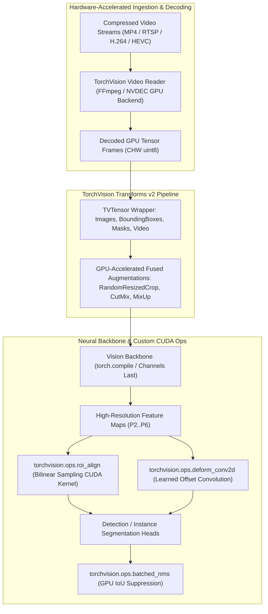

# 👁️ TorchVision: C++/CUDA Vision Operators, Transforms v2, GPU Video I/O & Model Zoo

## 1. Framework Overview & Core Philosophy

**TorchVision** is the official computer vision library for the PyTorch ecosystem. While many developers initially interact with TorchVision solely as a collection of pretrained classification backbones (ResNet, ConvNeXt, Swin, ViT), TorchVision’s true engineering value lies in its **high-performance C++/CUDA operator library, hardware-accelerated Video I/O subsystem, and modern Transforms v2 data pipeline**.

In production detection, segmentation, and video understanding systems, standard Python-level image manipulation and bounding box calculations create severe CPU bottlenecks. TorchVision solves this by providing:
1. **Custom C++/CUDA Kernels**: Highly optimized implementations of fundamental spatial operators: **RoIAlign**, **RoIPool**, **Non-Maximum Suppression (NMS)**, and **Deformable Convolution (DeformConv2d)**.
2. **Transforms v2 (`torchvision.transforms.v2`)**: A unified, tensor-native data augmentation engine utilizing **TVTensors** to apply geometric and photometric transformations simultaneously across images, bounding boxes, segmentation masks, and video frames.
3. **GPU Video Decoding Pipeline**: Hardware-accelerated decoding via FFmpeg / NVIDIA NVDEC bindings, streaming compressed H.264/HEVC frames directly into GPU VRAM.



---

## 2. Core C++/CUDA Operators & Mathematical Formulations

TorchVision registers high-performance C++ and CUDA operators directly into the PyTorch dispatcher (`c10::Dispatcher`), allowing seamless integration with `torch.compile` and AOTAutograd.

### A. RoIAlign (Region of Interest Align)
Standard RoIPool quantizes continuous region proposals into discrete grid bins, introducing spatial misalignments of up to half a pixel—severely degrading pixel-level instance segmentation accuracy.

**RoIAlign** avoids all coordinate quantization:
1. Given a continuous RoI box $[x_1, y_1, x_2, y_2]$ and output bin resolution $H \times W$ (e.g., $7 \times 7$), RoI divides the region into continuous sampling bins.
2. Inside each bin, it computes regular sampling points (typically 4 points per bin).
3. Values at continuous coordinates $(x, y)$ are sampled using **Bilinear Interpolation** from the four nearest feature map pixels:

$$f(x, y) = \sum_{i, j} f(i, j) \cdot \max(0, 1 - |x - i|) \cdot \max(0, 1 - |y - j|)$$

4. The final bin value is computed by averaging or taking the maximum over the sampled points.

```
RoI Bin (Continuous Coordinates):
+-----------------------+
|   (x,y)_1     (x,y)_2 |  <-- Bilinear interpolation sampling points
|                       |      (Zero coordinate quantization)
|   (x,y)_3     (x,y)_4 |
+-----------------------+
```

### B. Non-Maximum Suppression (NMS & Batched NMS)
Given $N$ predicted bounding boxes with confidence scores $S = \{s_1, s_2, \dots, s_N\}$:
1. Sort candidate boxes in descending order of confidence.
2. Select the box $B_{\text{max}}$ with the highest score and suppress any remaining box $B_j$ whose Intersection-over-Union (IoU) exceeds a threshold $\tau_{\text{IoU}}$:

$$\text{IoU}(B_{\text{max}}, B_j) = \frac{\text{Area}(B_{\text{max}} \cap B_j)}{\text{Area}(B_{\text{max}} \cup B_j)} > \tau_{\text{IoU}}$$

3. **Batched NMS**: TorchVision’s `torchvision.ops.batched_nms` prevents cross-class suppression by shifting box coordinates by class offsets ($B' = B + \text{class\_id} \times \text{max\_coordinate}$), executing a single, fused CUDA kernel across all classes simultaneously.

### C. Deformable Convolution v2 (`deform_conv2d`)
Standard 2D convolution samples feature maps across a rigid rectangular grid $\mathcal{R} = \{(-1, -1), (-1, 0), \dots, (1, 1)\}$. **Deformable Convolution** adds learned 2D spatial offsets $\Delta p_k$ and modulation scalars $m_k \in [0, 1]$:

$$y(p_0) = \sum_{k=1}^{K} w_k \cdot m_k \cdot x(p_0 + p_k + \Delta p_k)$$

Because $p_0 + p_k + \Delta p_k$ is fractional, values are sampled via continuous bilinear interpolation, allowing convolutional kernels to adapt their receptive fields to non-rigid objects (e.g., humans, articulated robots, cloth).

---

## 3. Transforms v2 & TVTensors Architecture

Introduced in modern TorchVision, **`torchvision.transforms.v2`** completely redesigns data preprocessing:
- **`tv_tensors` Subclasses**: Wraps raw tensors with semantic types (`tv_tensors.Image`, `tv_tensors.BoundingBoxes`, `tv_tensors.Mask`, `tv_tensors.Video`).
- **Coordinated Geometric Transformation**: When rotating, cropping, or scaling an image, Transforms v2 automatically updates bounding box coordinates and warps segmentation masks with exact mathematical alignment.
- **GPU Batch Execution**: Transforms run directly on GPU batches (`B, C, H, W`), eliminating CPU-to-GPU memory transfer overheads during training.

```python
from torchvision.transforms import v2
from torchvision import tv_tensors
import torch

# 1. Wrap Image and Bounding Box in TVTensors
image = tv_tensors.Image(torch.randint(0, 256, (3, 480, 640), dtype=torch.uint8))
boxes = tv_tensors.BoundingBoxes(
    [[50, 60, 200, 300], [100, 120, 400, 450]],
    format=tv_tensors.BoundingBoxFormat.XYXY,
    canvas_size=(480, 640)
)

# 2. Define Unified Transform Pipeline
transform_pipeline = v2.Compose([
    v2.RandomResizedCrop(size=(384, 384), antialias=True),
    v2.RandomHorizontalFlip(p=0.5),
    v2.ToDtype(torch.float32, scale=True),
    v2.Normalize(mean=[0.485, 0.456, 0.406], std=[0.229, 0.224, 0.225])
])

# 3. Simultaneously Transform Image & Bounding Boxes
transformed_image, transformed_boxes = transform_pipeline(image, boxes)
```

---

## 4. Hardware-Accelerated Video I/O Pipeline

Reading multi-camera video streams (such as autonomous driving datasets or robotics teleoperation logs) using CPU OpenCV (`cv2.VideoCapture`) introduces high CPU load and memory copies.

TorchVision’s Video Reader (`torchvision.io`) interfaces directly with **FFmpeg shared libraries and NVIDIA NVDEC hardware**:
- Ingests compressed H.264/HEVC frames directly into GPU device memory.
- Provides frame-accurate seeking and keyframe caching.
- Emits batched GPU tensors (`N, T, C, H, W`) ready for 3D Video Transformers and Diffusion Models.

---

## 5. Production Code Blueprint: GPU Vision Pipeline with RoIAlign & NMS

```python
#!/usr/bin/env python3
"""
Complete Production Blueprint: TorchVision GPU Vision Pipeline
"""

import torch
import torchvision
import torchvision.ops as ops
from torchvision import tv_tensors

def run_torchvision_pipeline():
    device = "cuda" if torch.cuda.is_available() else "cpu"
    print(f"[TorchVision] Initializing GPU Vision Pipeline on {device}...")

    # 1. Create Synthetic Feature Map and Region Proposals
    batch_size = 2
    channels = 256
    feat_h, feat_w = 64, 64
    feature_map = torch.randn(batch_size, channels, feat_h, feat_w, device=device, dtype=torch.float32)

    # Define Bounding Boxes [batch_idx, x1, y1, x2, y2]
    # Boxes in feature map coordinates
    rois = torch.tensor([
        [0, 10.5, 12.0, 35.2, 40.8],
        [0, 20.0, 25.0, 50.0, 55.0],
        [1, 5.0,  8.0,  30.0, 32.0]
    ], device=device, dtype=torch.float32)

    # 2. Execute GPU RoIAlign Kernel
    print("[TorchVision] Executing Bilinear RoIAlign Kernel...")
    output_size = (7, 7)
    spatial_scale = 1.0 # 1:1 scaling for demonstration
    sampling_ratio = 2

    roi_features = ops.roi_align(
        input=feature_map,
        boxes=rois,
        output_size=output_size,
        spatial_scale=spatial_scale,
        sampling_ratio=sampling_ratio,
        aligned=True # Set aligned=True to eliminate half-pixel offset
    )
    print(f"[TorchVision] RoIAlign Output Shape: {roi_features.shape}") # Shape: (3, 256, 7, 7)

    # 3. Execute Batched Non-Maximum Suppression (Batched NMS)
    print("[TorchVision] Executing Batched GPU NMS Kernel...")
    candidate_boxes = torch.tensor([
        [100.0, 100.0, 200.0, 200.0],
        [105.0, 102.0, 198.0, 202.0], # High overlap with box 0
        [300.0, 300.0, 450.0, 450.0]
    ], device=device)
    scores = torch.tensor([0.95, 0.88, 0.92], device=device)
    category_ids = torch.tensor([0, 0, 1], device=device) # Classes 0 and 1

    keep_indices = ops.batched_nms(
        boxes=candidate_boxes,
        scores=scores,
        idxs=category_ids,
        iou_threshold=0.5
    )
    print(f"[TorchVision] Surviving Box Indices: {keep_indices.tolist()}")
    print("[TorchVision] Pipeline execution completed successfully.")

if __name__ == "__main__":
    run_torchvision_pipeline()
```

---

## 6. Cross-Reference Links
- [[frameworks/pytorch|PyTorch 2.5 / 2.6 Core Compilation Architecture]]
- [[frameworks/lerobot|HuggingFace LeRobot Physical AI Pipeline]]
- [[topics/gpu-deployment/01-historical-evolution-and-paradigms|Tensor Core & GPU Optimization]]
