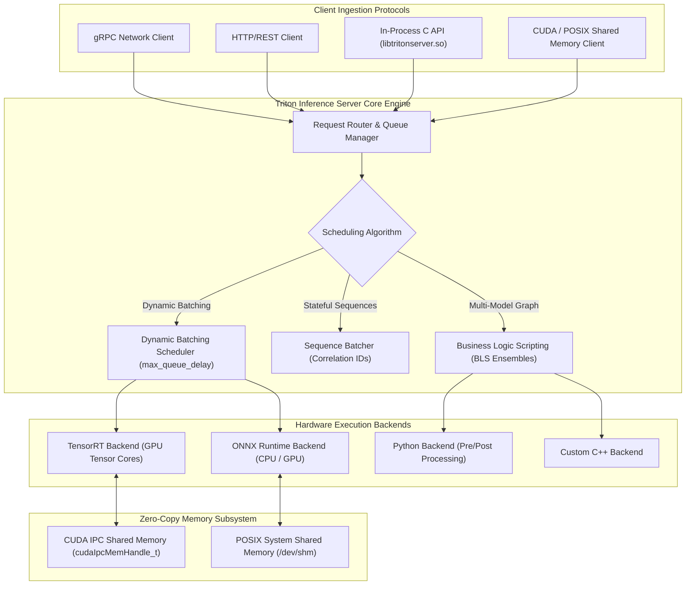

# 🛸 NVIDIA Triton Inference Server: Dynamic Batching, BLS & Zero-Copy IPC Shared Memory

## 1. Framework Overview & Core Philosophy

NVIDIA Triton Inference Server is an enterprise-grade, open-source model serving engine engineered to maximize hardware utilization and minimize serving latency across cloud data centers, on-premise clusters, and edge appliances. Unlike single-framework servers (e.g., TorchServe or TF Serving), Triton’s architecture is **multi-framework, multi-model, and hardware-heterogeneous**:
- **Supported Backends**: TensorRT, ONNX Runtime (CUDA, OpenVINO, DirectML), PyTorch (LibTorch), OpenVINO, vLLM / TensorRT-LLM, DALI (GPU preprocessing), Python backend, and custom C++ backends.
- **Concurrent Heterogeneous Serving**: Simultaneously executes dozens of disparate models on single or multiple GPUs and CPUs, dynamically load-balancing incoming inference requests across independent execution queues.
- **Decoupled Architecture**: Frontends (gRPC, HTTP/REST, and direct in-process C API) interact with backend engines through an asynchronous request scheduler and memory manager.



---

## 2. Internal Compilation Pipeline & Graph Representation

### A. Model Repository Architecture & Declarative Configuration (`config.pbtxt`)
Triton organizes models in a standardized directory hierarchy. Each model folder contains a declarative configuration schema (`config.pbtxt`) defining tensor shapes, data types, scheduling heuristics, and instance counts:

```protobuf
name: "yolov12_detector"
platform: "tensorrt_plan"
max_batch_size: 8

input [
  {
    name: "images"
    data_type: TYPE_FP32
    dims: [ 3, 640, 640 ]
  }
]
output [
  {
    name: "output"
    data_type: TYPE_FP32
    dims: [ 84, 8400 ]
  }
]

dynamic_batching {
  max_queue_delay_microseconds: 2000 # Form batch within 2 ms
  preferred_batch_size: [ 4, 8 ]
}

instance_group [
  {
    count: 2
    kind: KIND_GPU
    gpus: [ 0 ]
  }
]
```

### B. Dynamic Batching Engine
Under high concurrency, individual client requests arrive asynchronously with batch size 1. Launching isolated single-item kernels under-utilizes GPU Tensor Cores ($<15\%$ SM occupancy).
- **Batch Coalescing**: Triton’s dynamic batcher intercepts incoming requests, holding them in a thread-safe queue.
- **Time/Size Thresholds**: The scheduler forms a contiguous batched tensor when either:
  1. The accumulated items reach `preferred_batch_size` (e.g., 4 or 8), or
  2. The elapsed wait time of the oldest queued item reaches `max_queue_delay_microseconds`.
- **Zero-Copy Slicing**: The batcher merges memory slices directly into the backend input buffer, executes a single optimized GEMM/Conv kernel, and automatically splits output tensors back to individual client response promises.

### C. Business Logic Scripting (BLS) & Ensembles
Complex AI pipelines require multi-stage execution (e.g., Image Decode $\to$ Preprocess $\to$ Object Detection $\to$ Feature Crop $\to$ Classification).
- **Legacy Approach**: Client calls Server 4 times over HTTP/gRPC, paying network roundtrips and serialization costs for every intermediate tensor.
- **BLS Approach**: Pipeline logic executes directly inside Triton. BLS scripts (written in Python or C++) call sub-models via in-process memory pointers, keeping intermediate feature maps in GPU VRAM without host transfers:

$$\text{Client Image} \xrightarrow{\text{gRPC}} \text{Triton BLS} \xrightarrow{\text{VRAM Tensor}} \text{Model A (Detection)} \xrightarrow{\text{VRAM Crop}} \text{Model B (Feature Extractor)} \xrightarrow{\text{Result}} \text{Client}$$

---

## 3. Memory Model, Allocators & Zero-Copy Primitives

Network serialization (Protocol Buffers / JSON over TCP) dominates latency for high-resolution video streams. Triton eliminates data movement through two shared memory subsystems.

```
+-----------------------------------------------------------------------------------+
|                        Triton Zero-Copy Memory Topologies                         |
+-----------------------------------------------------------------------------------+
|  CUDA Shared Memory (cudaIpcMemHandle_t)                                          |
|  - Client process allocates GPU VRAM (cudaMalloc)                                 |
|  - Exports CUDA IPC handle to Triton Server                                       |
|  - Triton executes model directly on client's GPU memory with 0 bytes copied      |
+-----------------------------------------------------------------------------------+
|  POSIX System Shared Memory (/dev/shm)                                            |
|  - Shared memory mapped files accessible by client and server processes           |
|  - Eliminates loopback network socket serialization for CPU tensors               |
+-----------------------------------------------------------------------------------+
|  Triton Pinned Memory Pool Allocator                                              |
|  - Pre-allocates pinned host memory buffers to prevent runtime cudaMalloc locks   |
+-----------------------------------------------------------------------------------+
```

### A. CUDA IPC Shared Memory Protocol
1. **Client Setup**:
   - Client allocates device memory: `cudaMalloc(&d_input, size)`.
   - Client gets IPC handle: `cudaIpcGetMemHandle(&ipc_handle, d_input)`.
   - Client registers handle with Triton via `RegisterCudaSharedMemory()`.
2. **Inference Execution**:
   - Client sends an inference request referencing the registered shared memory region name and byte offset.
   - Triton maps the memory directly into its GPU address space (`cudaIpcOpenMemHandle`) and executes the kernel directly on the client's memory.
   - Outputs are written directly into a client-provided output CUDA shared memory buffer.

### B. In-Process C API (`libtritonserver.so`)
For maximum performance in embedded robotics (e.g., ROS 2 nodes) or high-frequency trading, Triton can be linked directly into the host application binary as a C library. This eliminates all inter-process communication, HTTP/gRPC daemons, and OS context switches:

```cpp
#include "triton/core/tritonserver.h"

TRITONSERVER_ServerOptions* server_options = nullptr;
TRITONSERVER_ServerOptionsNew(&server_options);
TRITONSERVER_ServerOptionsSetModelRepositoryPath(server_options, "/opt/models");

TRITONSERVER_Server* server = nullptr;
TRITONSERVER_ServerNew(&server, server_options);
```

---

## 4. Execution Model, Threading & Concurrency

### A. Concurrent Model Execution & Instance Groups
Triton enables concurrent execution of multiple model instances:
- **`instance_group`**: Specifies how many execution contexts of a model should be instantiated on specific GPUs.
- **Hardware Streams**: Each model instance is assigned an independent `cudaStream_t`. If an application configures `count: 4` on GPU 0, Triton executes 4 inference requests in parallel across the GPU’s compute engines, saturating available SMs.

### B. Priority Scheduling
Triton allows tagging requests with priority levels (`PRIORITY_MAX`, `PRIORITY_DEFAULT`, `PRIORITY_MIN`). When compute queues fill, the scheduler preempts lower-priority batch requests to service high-priority real-time frames immediately.

---

## 5. Quantization, Mixed Precision & Kernel Auto-Tuning

### A. Backend Acceleration Matrix

| Backend | Supported Precision Formats | Optimization Mechanisms | Primary Use Case |
| :--- | :--- | :--- | :--- |
| **TensorRT Backend** | FP32, FP16, BF16, INT8, FP8, NVFP4 | Layer fusion, CUDA Graph capture, timing caches | Ultra-low latency GPU serving |
| **ONNX Runtime Backend** | FP32, FP16, INT8 (QDQ / QLinear) | Graph transformers, multi-EP delegation | Cross-platform GPU & CPU serving |
| **vLLM / TensorRT-LLM** | FP16, BF16, INT4 (AWQ/GPTQ), FP8 | PagedAttention, continuous in-flight batching | Generative LLM / VLM serving |
| **DALI Backend** | Hardware NVDEC / JPEG decode | GPU-accelerated video/image pipeline | Direct camera/stream preprocessing |

### B. Model Warmup Specification (`model_warmup`)
To prevent the first incoming customer request from suffering cold-start compilation or memory allocation latency, Triton supports declarative warmup queries:

```protobuf
model_warmup [
  {
    name: "warmup_request_batch_1"
    batch_size: 1
    inputs {
      key: "images"
      value {
        data_type: TYPE_FP32
        dims: [ 3, 640, 640 ]
        zero_data: true
      }
    }
  }
]
```
During startup, Triton generates synthetic requests satisfying the warmup configuration, ensuring all GPU kernels, CUDA graphs, and memory arenas are initialized before marking the server as ready (`/v2/health/ready`).

---

## 6. Edge Deployment, Safety & Operational Gotchas

### A. Dynamic Batching Tail Latency Explosion
If `max_queue_delay_microseconds` is set too high (e.g., 50 ms) on an endpoint with erratic or low query traffic, single requests will stall in the queue waiting for a batch that never arrives, inflating tail latency ($p99$).
- **Rule**: For real-time vision pipelines ($30\text{--}60\,\text{FPS}$), bound `max_queue_delay_microseconds` to $\le 2000\,\mu\text{s}$ ($2\,\text{ms}$) or rely on instance group concurrency rather than aggressive dynamic batching.

### B. VRAM Allocation Conflicts Across Instances
Configuring high instance counts (`count: 8`) across multiple models can easily exceed physical GPU VRAM, triggering out-of-memory crashes (`CUDA error: out of memory`) during concurrent traffic spikes.
- **Remedy**: Calculate static memory footprint:
  $$\text{VRAM}_{\text{total}} = \sum_{m} \left( \text{Weights}_m + \text{Count}_m \times (\text{Workspace}_m + \text{MaxBatch}_m \times \text{Activations}_m) \right)$$

---

## 7. Complete Runnable Production Code Blueprint

The following production Python script demonstrates an ultra-low-latency client interfacing with NVIDIA Triton using **CUDA Shared Memory (`cuda_shm`)**, eliminating all network serialization overhead for high-resolution vision inference.

```python
import numpy as np
import cupy as cp
import tritonclient.grpc as grpcclient
import tritonclient.utils.cuda_shared_memory as cudashm
import time

class TritonCudaSharedMemoryPipeline:
    def __init__(self, server_url: str = "localhost:8001", model_name: str = "yolov12_detector"):
        self.server_url = server_url
        self.model_name = model_name

        print(f"Connecting to Triton Inference Server at {self.server_url}...")
        self.client = grpcclient.InferenceServerClient(url=self.server_url)

        if not self.client.is_server_live():
            raise RuntimeError("Triton server is not live!")
        if not self.client.is_model_ready(self.model_name):
            raise RuntimeError(f"Model {self.model_name} is not ready on server!")

        # Model Tensor Dimensions
        self.input_shape = (1, 3, 640, 640)
        self.input_bytes = int(np.prod(self.input_shape) * 4) # FP32 = 4 bytes
        self.output_shape = (1, 84, 8400)
        self.output_bytes = int(np.prod(self.output_shape) * 4)

        # 1. Allocate Raw GPU Memory via CuPy
        print("Allocating Device Memory for CUDA Shared Memory IPC...")
        self.d_input = cp.zeros(self.input_shape, dtype=cp.float32)
        self.d_output = cp.zeros(self.output_shape, dtype=cp.float32)

        # 2. Create and Register CUDA Shared Memory Handles with Triton
        self.shm_in_name = "input_shm_region"
        self.shm_out_name = "output_shm_region"

        # Cleanup existing regions if present
        try:
            self.client.unregister_cuda_shared_memory(self.shm_in_name)
            self.client.unregister_cuda_shared_memory(self.shm_out_name)
        except Exception:
            pass

        # Create handles
        self.shm_in_handle = cudashm.create_shared_memory_region(
            self.shm_in_name, self.input_bytes, device_id=0
        )
        self.shm_out_handle = cudashm.create_shared_memory_region(
            self.shm_out_name, self.output_bytes, device_id=0
        )

        # Register with Server
        self.client.register_cuda_shared_memory(
            self.shm_in_name, cudashm.get_raw_hash(self.shm_in_handle), self.input_bytes, device_id=0
        )
        self.client.register_cuda_shared_memory(
            self.shm_out_name, cudashm.get_raw_hash(self.shm_out_handle), self.output_bytes, device_id=0
        )

        # 3. Configure Pre-Bound Triton Inference Inputs/Outputs
        self.inputs = [grpcclient.InferInput("images", self.input_shape, "FP32")]
        self.inputs[0].set_shared_memory(self.shm_in_name, self.input_bytes)

        self.outputs = [grpcclient.InferRequestedOutput("output")]
        self.outputs[0].set_shared_memory(self.shm_out_name, self.output_bytes)

        print("Zero-Copy CUDA Shared Memory Pipeline Initialized.")

    def infer_zero_copy(self, gpu_frame: cp.ndarray) -> cp.ndarray:
        """
        Executes zero-copy inference. The input frame resides on GPU;
        Triton reads directly from client GPU memory without PCIe or network copies.
        """
        # Copy GPU frame directly into pre-registered shared memory buffer
        cudashm.set_shared_memory_region(self.shm_in_handle, [gpu_frame.get()])

        # Issue non-blocking RPC to trigger inference on pre-bound GPU pointers
        response = self.client.infer(
            model_name=self.model_name,
            inputs=self.inputs,
            outputs=self.outputs
        )

        # Read output directly from shared memory buffer
        output_data = cudashm.get_contents_as_numpy(
            self.shm_out_handle, "FP32", self.output_shape
        )
        return output_data

    def cleanup(self):
        print("Cleaning up CUDA Shared Memory handles...")
        try:
            self.client.unregister_cuda_shared_memory(self.shm_in_name)
            self.client.unregister_cuda_shared_memory(self.shm_out_name)
            cudashm.destroy_shared_memory_region(self.shm_in_handle)
            cudashm.destroy_shared_memory_region(self.shm_out_handle)
        except Exception as e:
            print(f"Cleanup note: {e}")

if __name__ == "__main__":
    print("Triton Zero-Copy CUDA Shared Memory Blueprint Initialized.")
    # In production, connect to live running Triton instance:
    # pipeline = TritonCudaSharedMemoryPipeline("localhost:8001", "yolov12_detector")
    # frame = cp.random.randn(1, 3, 640, 640, dtype=cp.float32)
    # result = pipeline.infer_zero_copy(frame)
```

---

## 8. Cross-References & Ecosystem Links

- [[frameworks/tensorrt|NVIDIA TensorRT 10.x Deep Dive]]
- [[frameworks/onnxruntime|ONNX Runtime Engine & Execution Providers]]
- [[topics/gpu-deployment/00-gpu-deployment-moc|GPU Deployment Map of Content]]
- [[topics/real-time-systems/00-real-time-systems-moc|Real-Time Systems & High-Throughput Serving]]
