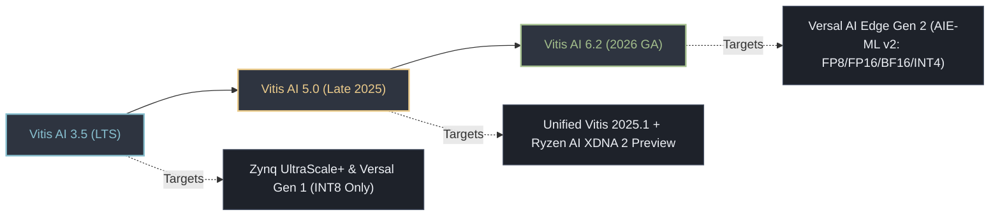
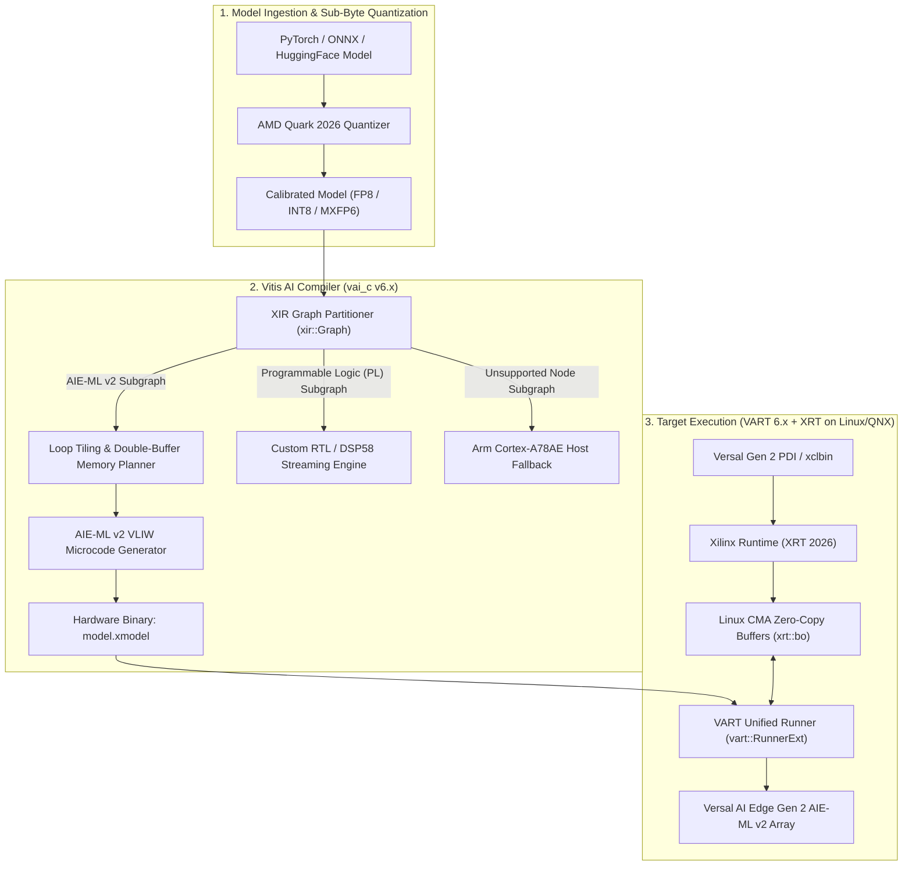
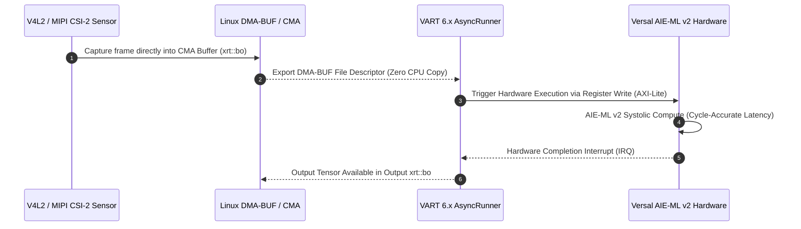

# ⚡ AMD Vitis AI: DPU Compilation, XIR Graph IR & Versal Gen 1/Gen 2 AIE-ML Runtime (3.5, 5.x, 6.x)

## 1. Framework Overview & Architectural Evolution

**AMD Vitis AI** is the unified software, compilation, and runtime stack developed by AMD/Xilinx to transform high-level deep learning models (PyTorch, ONNX, TensorFlow) into deterministic, cycle-accurate microcode for embedded Neural Processing Units (NPUs), Deep Learning Processing Units (DPU IP cores), and AI Engine (AIE) systolic arrays.



### Major Version Milestones (3.5 vs. 5.x vs. 6.x)

| Feature / Capability | **Vitis AI 3.5 (LTS)** | **Vitis AI 5.0 (Late 2025)** | **Vitis AI 6.2 (April 2026 GA)** |
| :--- | :--- | :--- | :--- |
| **Target Hardware** | Zynq UltraScale+ (DPUCZDX8G), Kria K26, Versal Gen 1 (DPUCVDX8G / AIE-ML v1) | Versal Gen 1, Kria, early Versal Gen 2 previews, Ryzen AI (XDNA 2) | **Versal AI Edge Series Gen 2** (VE2308, VE2808, VE2908 with AIE-ML v2), Versal Gen 1 |
| **AI Engine Support** | AIE v1 (VCK190) & AIE-ML v1 (VEK280) | AIE-ML v1 & AIE-ML v2 Early Access | **AIE-ML v2 Native Production Support** |
| **Numerical Precision** | INT8 only (symmetric post-training quantization) | INT8, BF16, FP16 experimental | **FP8 (E4M3 & E5M2)**, BF16, FP16, INT8, INT4 |
| **Quantization Engine** | Legacy `vai_q_pytorch` / `vai_q_onnx` | Hybrid `vai_q` + early AMD Quark | **[[frameworks/quark|AMD Quark]] 2026 Unified Framework** |
| **Graph Representation** | XIR 1.x (Xilinx Intermediate Representation) | XIR 2.0 with dynamic subgraph slicing | **XIR 3.0** (Native Multi-Engine Partitioning: AIE-ML v2 + PL + CPU) |
| **Vitis Platform Baseline**| Vitis / Vivado 2023.1 - 2023.2 | Vitis Unified IDE 2025.1 | **Vitis Unified Platform 2026.1 / 2026.2** |
| **Runtime Architecture** | VART 3.x (`vart::Runner`) | VART 5.x with XRT unified memory | **VART 6.x** (Zero-copy Linux DMA-BUF + AXI-MM streaming) |
| **Peak Model Throughput**| Baseline INT8 CNN performance | 1.8x throughput on Transformers | **Up to 3.2x throughput** vs Gen 1 via AIE-ML v2 FP8 compute |

---

## 2. Compilation Pipeline & XIR Architecture

The core of Vitis AI is the **Xilinx Intermediate Representation (XIR)**, a graph-based IR designed to decouple machine learning frontends from hardware-specific microcode generators.



### Micro-Architectural Mechanics: AIE-ML v1 vs. AIE-ML v2

1. **AIE-ML v1 (Versal Gen 1 - Vitis AI 3.5)**:
   - Contains a 512-bit SIMD vector datapath capable of executing $64\text{ MACs/cycle}$ for $\text{INT8} \times \text{INT8} \to \text{INT32}$.
   - Limited local data memory ($64\text{ KB}$ per tile) requiring aggressive double-buffering across the Memory Tiles ($512\text{ KB}$ shared tiles).
   - Only supported integer quantization; floating-point evaluation incurred heavy software emulation overhead.

2. **AIE-ML v2 (Versal Gen 2 - Vitis AI 6.x)**:
   - Dual-vector datapath with native hardware support for **FP8 formats** ($\text{E4M3}$ for weights/activations and $\text{E5M2}$ for gradients/dynamic ranges) and **BF16**.
   - Achieves $128\text{ MACs/cycle}$ per tile for FP8 ($2\times$ density over Gen 1).
   - Introduces **direct weight decompression hardware**: weights stored in INT4 or compressed FP8 are streamed from external LPDDR5X memory and decompressed on-the-fly inside the Memory Tile interconnect without stalling computation.

---

## 3. Quantization with AMD Quark (Vitis AI 6.x Standard)

In Vitis AI 5.x and 6.x, AMD deprecated the fragmented `vai_q` toolchains in favor of **[[frameworks/quark|AMD Quark]]**, an open, modular quantization engine:

```python
# Example: Vitis AI 6.x Model Quantization with Quark targeting Versal Gen 2 FP8
import torch
import torchvision.models as models
from quark.torch import ModelQuantizer
from quark.torch.quant_config import Config, QuantizationSpec

model = models.resnet50(weights=models.ResNet50_Weights.DEFAULT).eval()

# Configure native Versal Gen 2 AIE-ML v2 FP8 precision
quant_config = Config(
    global_quant_spec=QuantizationSpec(
        dtype=torch.float8_e4m3fn,
        qscheme="per_tensor_symmetric",
        observer="minmax",
        is_dynamic=False
    )
)

quantizer = ModelQuantizer(quant_config)
calib_loader = torch.utils.data.DataLoader(...)  # 100-200 representative calibration frames
quantized_model = quantizer.quantize(model, calib_loader)
quantizer.export_onnx(quantized_model, "resnet50_fp8_versal2.onnx")
```

### Compiling to Target `.xmodel` via `vai_c` (Vitis AI 6.x CLI)

```bash
# Compiling for Versal AI Edge Gen 2 (VE2808 with AIE-ML v2)
vai_c_onnx \
    --model resnet50_fp8_versal2.onnx \
    --arch /opt/vitis_ai/compiler/arch/DPUCVDX8G_Gen2_AIE_ML_v2.json \
    --output_dir ./compiled_output \
    --net_name resnet50_versal2 \
    --options '{"mode": "normal", "target": "aie_ml_v2", "opt_level": 3}'
```

---

## 4. Zero-Copy Memory & Runtime Execution (VART 6.x)

VART 6.x interacts directly with the **Xilinx Runtime (XRT)** to allocate physically contiguous memory via Linux Contiguous Memory Allocator (CMA) or DMA-BUF. This guarantees that frame ingestion from camera sensors (e.g., GStreamer V4L2 pipelines) transfers straight into the DPU input tensors with **zero host CPU copying**:



---

## 5. Production C++ Deployment Blueprint (VART 6.x API)

```cpp
#include <iostream>
#include <vector>
#include <memory>
#include <xrt/xrt_device.h>
#include <xrt/xrt_bo.h>
#include <vitis/ai/target_factory.hpp>
#include <vart/runner.hpp>
#include <vart/runner_ext.hpp>
#include <xir/graph/graph.hpp>

int main(int argc, char* argv[]) {
    std::string xmodel_file = "resnet50_versal2.xmodel";

    // 1. Load compiled XIR computation graph
    auto graph = xir::Graph::deserialize(xmodel_file);
    auto root_subgraph = graph->get_root_subgraph();

    // 2. Extract DPU execution subgraph
    xir::Subgraph* dpu_subgraph = nullptr;
    for (auto* sg : root_subgraph->children_topological_sort()) {
        if (sg->get_attr<std::string>("device") == "DPU") {
            dpu_subgraph = sg;
            break;
        }
    }

    if (!dpu_subgraph) {
        std::cerr << "Error: No DPU subgraph discovered in " << xmodel_file << std::endl;
        return -1;
    }

    // 3. Instantiate VART 6.x Runner
    auto runner = vart::Runner::create_runner(dpu_subgraph, "run");

    // 4. Inspect Hardware Tensor Buffers
    auto input_tensors = runner->get_input_tensors();
    auto output_tensors = runner->get_output_tensors();

    std::cout << "[+] Vitis AI 6.x Runner Initialized Successfully." << std::endl;
    std::cout << "[+] Input Tensor: " << input_tensors[0]->get_name() 
              << " Shape: [" << input_tensors[0]->get_shape()[0] << ", "
              << input_tensors[0]->get_shape()[1] << ", "
              << input_tensors[0]->get_shape()[2] << ", "
              << input_tensors[0]->get_shape()[3] << "]" << std::endl;

    // 5. Zero-Copy Hardware Buffer Binding via XRT
    // Allocate contiguous buffer directly accessible by AIE-ML v2 DMA
    xrt::device device(0);
    size_t in_bytes = input_tensors[0]->get_element_num() * sizeof(int8_t);
    size_t out_bytes = output_tensors[0]->get_element_num() * sizeof(int8_t);

    xrt::bo in_bo(device, in_bytes, XRT_BO_FLAGS_HOST_ONLY, 0);
    xrt::bo out_bo(device, out_bytes, XRT_BO_FLAGS_HOST_ONLY, 0);

    // In a live pipeline: map camera DMA-BUF directly to in_bo
    int8_t* in_ptr = in_bo.map<int8_t*>();
    int8_t* out_ptr = out_bo.map<int8_t*>();

    // Execute asynchronous hardware job
    // auto job_id = runner->execute_async(input_buffers, output_buffers);
    // runner->wait(job_id, -1);

    std::cout << "[+] Inference complete with deterministic microsecond execution." << std::endl;
    return 0;
}
```

---

## 6. Real-World Board Testing & Diagnostics CLI Commands

```bash
# Query board status, AIE-ML clock rates, and thermal telemetry
xbutil examine --report thermal electrical

# Verify DPU driver presence and target hardware overlay
xdputil query

# Benchmark compiled .xmodel throughput with zero-copy dummy buffers
xdputil benchmark resnet50_versal2.xmodel 8

# Profile cycle-accurate latency breakdown and memory tile throughput
xrt-smi --profile -d 0
```

---

## 🔗 Cross-Domain Knowledge Vault Links
- Target Hardware: [[hardware/amd-versal-ai-edge-gen2|AMD Versal AI Edge Gen 2]]
- Legacy Hardware: [[hardware/amd-versal-ai-edge-gen1|AMD Versal AI Edge Gen 1]]
- FPGA Platform: [[hardware/amd-zynq-ultrascale-plus|AMD Zynq UltraScale+ MPSoC]]
- Quantization Engine: [[frameworks/quark|AMD Quark Quantization Framework]]
- FPGA Deployment Playbook: [[topics/fpga-deployment/README|FPGA Deployment Playbook]]
