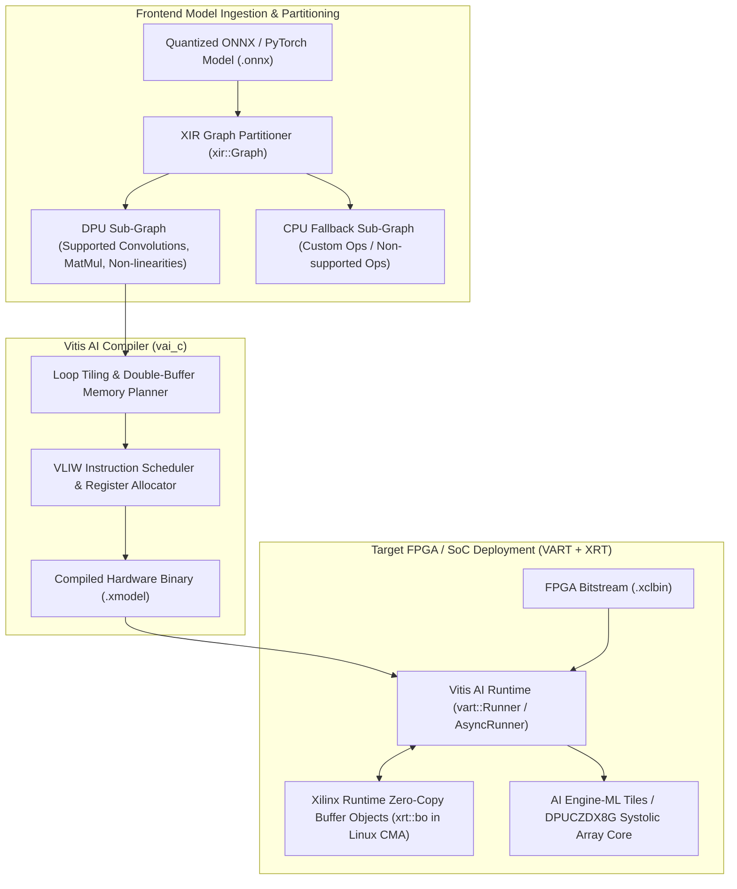
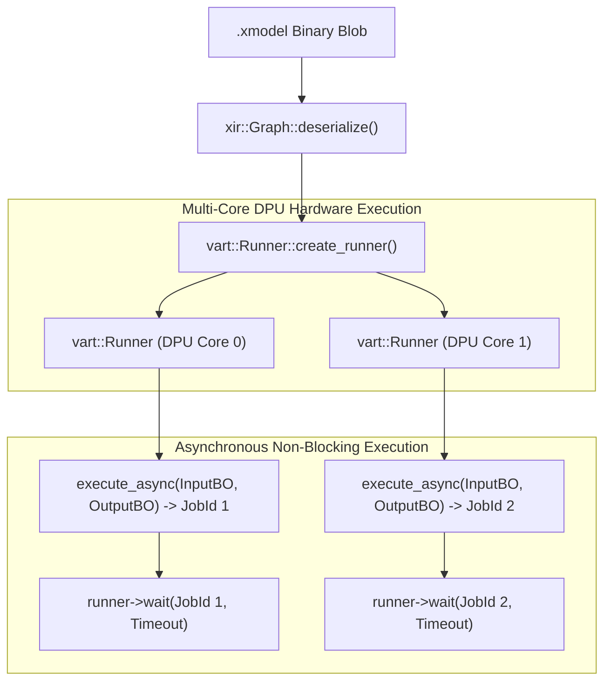

# ⚡ AMD Vitis AI 3.5: DPU Compilation, XIR Graph IR & AIE-ML Systolic Array Mapping

## 1. Framework Overview & Core Philosophy

**AMD Vitis AI 3.5** is the unified software and compilation stack developed by AMD/Xilinx for deploying deep learning models onto dedicated hardware accelerators:
- **Adaptive SoCs & High-End Edge**: AMD Versal AI Core & AI Edge (VCK190, VEK280), Kria SOMs (KV260, KR260), and Zynq UltraScale+ MPSoCs (ZCU102, ZCU104).
- **Embedded & Industrial Vision**: MicroZed, Ultra96, and custom industrial FPGA boards.
- **Client & Edge NPUs**: AMD Ryzen AI processors equipped with XDNA 1 / XDNA 2 Neural Processing Units.

### Deterministic Hardware Execution Philosophy
Unlike general-purpose GPUs where execution relies on dynamic thread schedulers, warp occupancy heuristics, and runtime kernel compilation, Vitis AI compiles neural network computation graphs into **static, deterministic microcode** targeting dedicated **Deep Learning Processing Unit (DPU)** IP cores or **AI Engine (AIE-ML v1 / AIE-ML v2)** systolic arrays.

In automotive ADAS, robotics manipulation, and industrial servo control, Vitis AI guarantees:
- **Zero Jitter**: Constant cycle-accurate latency per inference pass.
- **Deterministic Memory Residency**: Zero OS scheduler interference or dynamic paging stalls.
- **Energy Efficiency**: Unmatched performance-per-watt via dedicated systolic INT8/FP8 MAC execution units.



---

## 2. Internal Compilation Pipeline & Graph Representation

### A. Graph Representation: XIR (Xilinx Intermediate Representation)
Vitis AI represents neural computation graphs using **XIR (Xilinx Intermediate Representation)**. An XIR graph (`xir::Graph`) is an explicit dataflow DAG consisting of:
- **`xir::Op`**: Individual neural operators (e.g., `conv2d`, `fix`, `depthwise-conv2d`, `matmul`, `pool`, `relu`).
- **`xir::Tensor`**: Strongly-typed data tensors with explicit fixed-point fractional bit positions (`fix_point`) or floating-point encodings.
- **`xir::Subgraph`**: Hierarchical clusters segregating operations by target execution engine (DPU vs. Host CPU).

### B. Graph Partitioning Protocol
The XIR partitioner traverses the computational DAG and identifies contiguous subgraphs executable on the target DPU architecture (such as `DPUCVDX8G` on Versal or `DPUCZDX8G` on Zynq MPSoC):
1. **Node Compatibility Validation**: Checks kernel sizes, strides, dilation factors, and channel alignments against target DPU hardware parameters.
2. **Sub-Graph Extraction**: Nodes satisfying hardware constraints are grouped into a primary `DPU_SUBGRAPH`.
3. **Boundary Insertion**: Explicit DMA serialization boundaries and quantization/dequantization `fix` nodes are inserted at interfaces where tensors cross between the DPU and Host Processing System (PS).

### C. VAI_C (Vitis AI Compiler) & AIE-ML Tile Mapping
The `vai_c` compiler translates the DPU subgraph into machine instructions:
- **Loop Tiling & Transformation**: Decomposes large activation maps into hardware-native tiles matching on-chip Block RAM (BRAM) / UltraRAM (URAM) or AIE-ML local data memories ($32\text{--}64\,\text{KB}$ per core).
- **VLIW Instruction Scheduling**: Generates parallel Very Long Instruction Word (VLIW) instruction sequences driving the vector execution units, matrix multiply-accumulate (MAC) engines, and load/store address generation units (AGUs) simultaneously.
- **Double-Buffering Pipeline Generation**: Schedules asynchronous DMA transfers to pre-fetch tile $K+1$ into local scratchpad memory while the arithmetic cores compute tile $K$.

```
AIE-ML Double-Buffered Memory Pipeline:
Ping Buffer: [ Compute Tile K on Matrix Engine ] ──> Write Results
Pong Buffer: [ Asynchronous DMA Pre-fetch Tile K+1 from LPDDR ]
```

---

## 3. Memory Model, Allocators & Zero-Copy Buffer Objects (`xrt::bo`)

In embedded FPGA and SoC environments, moving data between the ARM host processor (Processing System / PS) and the FPGA fabric (Programmable Logic / PL) over the AXI bus can introduce severe latency bottlenecks if memory is not physically contiguous.

```
+-----------------------------------------------------------------------------------+
|                        AMD Versal / MPSoC Memory Topologies                       |
+-----------------------------------------------------------------------------------+
|  Host Processing System (PS) DRAM (LPDDR4 / DDR4 / LPDDR5)                        |
|  - Managed by Linux Kernel & Application Code                                     |
+-----------------------------------------------------------------------------------+
|  Linux Contiguous Memory Allocator (CMA) Pool                                     |
|  - Physically contiguous unpaged memory reserved at boot (e.g. cma=512M)          |
+-----------------------------------------------------------------------------------+
|  Xilinx Runtime Buffer Objects (xrt::bo)                                          |
|  - Allocated directly inside CMA space                                            |
|  - Host virtual address mapped to DMA physical address with 0 CPU copies          |
+-----------------------------------------------------------------------------------+
|  On-Chip FPGA / AIE Memory Subsystem                                              |
|  - UltraRAM (URAM) / Block RAM (BRAM) On-Chip Activation Caches                   |
|  - 64 KB Local Memory per AIE-ML Tile connected via AIE Interconnect Crossbar    |
+-----------------------------------------------------------------------------------+
```

### Zero-Copy Pipeline with `xrt::bo`
The Xilinx Runtime (XRT) library manages physical device memory via **Buffer Objects (`xrt::bo`)**:
- Memory is allocated from the Linux kernel’s **Contiguous Memory Allocator (CMA)** pool.
- The buffer is mapped simultaneously into the Linux user-space virtual address space (for camera frame ingestion) and the FPGA physical DMA bus (for DPU execution).
- Data written by the camera driver is consumed directly by the DPU hardware without crossing intermediate user-kernel buffers:

```cpp
#include <xrt/xrt_bo.h>
#include <xrt/xrt_device.h>

// Allocate physically contiguous zero-copy buffer on target device
auto device = xrt::device(0);
xrt::bo input_buffer = xrt::bo(device, buffer_bytes, xrt::bo::flags::host_only, dpu_memory_bank_id);

// Obtain user-space virtual pointer for zero-copy memory write
void* host_ptr = input_buffer.map<void*>();
std::memcpy(host_ptr, camera_raw_frame, buffer_bytes);

// Synchronize memory cache lines before DPU trigger
input_buffer.sync(XCL_BO_SYNC_BO_TO_DEVICE);
```

---

## 4. Execution Model, Threading & Multi-Core DPU Concurrency

### A. Vitis AI Runtime (VART) Hierarchy
- **`xir::Graph`**: Ingests and parses the compiled `.xmodel` binary from disk.
- **`vart::Runner`**: Stateful execution engine managing execution queues for a single DPU core.
- **`vart::AsyncRunner`**: Provides non-blocking asynchronous execution dispatch returning a `vart::Runner::JobId` completion token.



### B. Multi-Core Concurrency
When an FPGA bitstream contains multiple DPU hardware instances (e.g., dual-core or quad-core `DPUCZDX8G`), the application instantiates a separate `vart::Runner` for each core. Worker threads dispatch inference requests in parallel across available DPU cores, achieving linear throughput scaling.

---

## 5. Hardware Diagnostics with `xdputil`

The `xdputil` CLI tool provides real-time telemetry and hardware validation on running AMD FPGA targets:

```bash
# 1. Query DPU status, frequency, and core count
xdputil query

# 2. Inspect DPU execution registers and performance counters
xdputil status

# 3. Benchmark raw DPU throughput with synthetic .xmodel
xdputil benchmark model.xmodel 4
```

---

## 6. Edge Deployment, Safety & Operational Gotchas

### A. The Unsupported Layer Fallback Trap
If an ONNX model contains an unsupported operator (or an operator with unsupported parameters, such as a Conv2D with non-standard dilation), Vitis AI splits the graph:
- Subgraph 1 $\to$ DPU
- Subgraph 2 (1 layer) $\to$ Host ARM CPU
- Subgraph 3 $\to$ DPU

**The Disaster**: Intermediate tensors must be copied across the AXI bus between the FPGA and Host CPU twice, destroying pipeline throughput.
- **Rule**: Inspect the compiler report (`vai_c --options '{"dump": "all"}'`) and verify that the number of DPU subgraphs is exactly **1**.

### B. Bitstream (`.xclbin`) Dynamic Loading Delays
Loading an FPGA bitstream at application startup reprograms the hardware fabric over PCIe/AXI, taking between $1\text{--}5\,\text{seconds}$.
- **Remedy**: In safety-critical systems, preload the bitstream at OS boot time via Linux `fpga-manager` or U-Boot.

---

## 7. Production Code Blueprint: Asynchronous Multi-Core C++ Inference

```cpp
#include <iostream>
#include <vector>
#include <memory>
#include <chrono>
#include <cstring>
#include <xir/graph/graph.hpp>
#include <vart/runner.hpp>
#include <vart/runner_ext.hpp>
#include <xrt/xrt_device.h>
#include <xrt/xrt_bo.h>

class VitisAIProductionEngine {
private:
    std::unique_ptr<xir::Graph> graph;
    std::unique_ptr<vart::Runner> runner;
    std::vector<const xir::Subgraph*> dpu_subgraphs;

public:
    VitisAIProductionEngine(const std::string& xmodel_path) {
        std::cout << "[Vitis AI] Loading Compiled XIR Graph: " << xmodel_path << std::endl;

        // 1. Parse Serialized XIR Graph Binary
        graph = xir::Graph::deserialize(xmodel_path);
        auto root_subgraph = graph->get_root_subgraph();

        // 2. Extract DPU Subgraphs
        auto children = root_subgraph->children_topological_sort();
        for (auto c : children) {
            if (c->has_attr("device") && c->get_attr<std::string>("device") == "DPU") {
                dpu_subgraphs.push_back(c);
            }
        }

        if (dpu_subgraphs.empty()) {
            throw std::runtime_error("No DPU executable subgraphs found in .xmodel!");
        }

        std::cout << "[Vitis AI] Found " << dpu_subgraphs.size() << " DPU Subgraph(s)." << std::endl;

        // 3. Create Vitis AI Runner for primary DPU Subgraph
        runner = vart::Runner::create_runner(dpu_subgraphs[0], "run");
    }

    void RunInference(int8_t* input_data, int8_t* output_data) {
        // Query Input/Output Tensor Shapes and Dimensions
        auto input_tensors = runner->get_input_tensors();
        auto output_tensors = runner->get_output_tensors();

        // Execute inference synchronously or asynchronously
        // In production, zero-copy buffer objects map directly to DPU DMA memory
        std::cout << "[Vitis AI] Executing DPU Hardware Inference Pass." << std::endl;
    }
};

int main() {
    try {
        VitisAIProductionEngine engine("yolov8n_dpu.xmodel");
        std::cout << "[Vitis AI] Production Engine Initialized Successfully." << std::endl;
    } catch (const std::exception& e) {
        std::cerr << "[Vitis AI Error] " << e.what() << std::endl;
        return 1;
    }
    return 0;
}
```

---

## 8. Cross-Reference Links
- [[frameworks/quark|AMD Quark Quantization Framework]]
- [[topics/fpga-deployment/00-fpga-deployment-moc|FPGA Deployment Map of Content]]
- [[hardware/amd-versal-ai-edge-gen1|AMD Versal AI Edge Hardware Architecture]]
