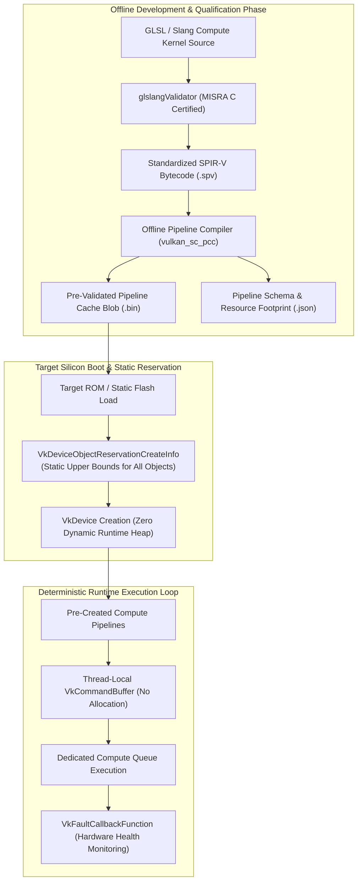

# 🛡️ Vulkan SC 2.0: Safety-Critical GPU Compute, ISO 26262 ASIL-D & Deterministic Pipelines

## 1. Framework Overview & Core Philosophy

**Vulkan SC (Safety Critical) 2.0** is the open, royalty-free standard developed by the Khronos Group Safety Critical Working Group for deterministic, safety-certifiable GPU computing and computer vision acceleration.

While standard Vulkan 1.3/1.4 targets consumer graphics, games, and cloud AI where dynamic memory allocation and runtime JIT compilation are standard, Vulkan SC is stripped and re-architected from the ground up for environments where software failure risks human life:
- **Automotive Autonomous Driving & ADAS**: ISO 26262 ASIL-D (Automotive Safety Integrity Level D).
- **Avionics & Aerospace**: RTCA DO-178C / EUROCAE ED-12C DAL A (Design Assurance Level A).
- **Industrial Automation & Robotics**: IEC 61508 SIL 3 (Safety Integrity Level 3).
- **Medical Devices**: IEC 62304 Class C.



---

## 2. Standard Vulkan vs. Vulkan SC 2.0: Architectural Comparison

Vulkan SC removes all non-deterministic behaviors, runtime compilation paths, and unconstrained memory allocations present in standard graphics APIs.

| Architectural Feature | Standard Vulkan 1.3 / 1.4 | Vulkan SC 2.0 (Safety Critical) |
| :--- | :--- | :--- |
| **Shader Compilation** | Runtime driver JIT compilation from SPIR-V to machine ISA | **Strictly Offline**: Pre-compiled into device binaries via PCC (`vulkan_sc_pcc`) |
| **Memory Allocation** | Dynamic `vkAllocateMemory` allowed at any time during execution | **Zero Dynamic Allocation**: All memory pools reserved at boot via `VkDeviceObjectReservationCreateInfo` |
| **Pipeline Creation** | Dynamic `vkCreateComputePipelines` in render/compute loops | Static creation at startup from pre-compiled cache; creation functions stripped in production |
| **Software Certification** | Standard vendor driver QA | **MISRA C:2012** compliant driver codebase with ISO 26262 ASIL-D / DO-178C DAL A artifacts |
| **Fault Containment** | OS-level driver crash or watchdog timeout reset | Explicit `VkFaultCallbackFunction`, structured fault handlers, and bounded execution timers |
| **Command Buffers** | Dynamic buffer resetting and resizing | Pre-allocated command pool memory; bounded command size limits |
| **Validation Layers** | Development validation layers stripped in release | Redundant safety validation and hardware parity checking built into the certified driver |

---

## 3. Offline Pipeline Compiler (PCC) Architecture

In standard Vulkan, compiling a SPIR-V shader into machine microcode happens inside the GPU driver at runtime. This introduces two fatal flaws for safety-critical systems:
1. **Non-Deterministic Latency**: Driver JIT compilation can introduce multi-hundred-millisecond stalls (shader stutter), causing autonomous vehicles to miss real-time braking/steering deadlines.
2. **Uncertifiable Code Size**: Including a full optimizing compiler compiler-backend inside a safety-certified driver requires hundreds of thousands of lines of complex C++ code, making DO-178C DAL A and ISO 26262 ASIL-D certification economically and technically impossible.

### The PCC Offline Workflow
Vulkan SC solves this by moving shader compilation completely out of the runtime environment into an **Offline Pipeline Compiler (PCC)** tool (`vulkan_sc_pcc`):

```
[Compute Shader .comp] ──> glslangValidator ──> [SPIR-V .spv] ──> vulkan_sc_pcc (Target GPU Spec) ──> [Pipeline Cache .bin]
```

1. Shaders are compiled to SPIR-V using safety-qualified frontend compilers.
2. The PCC tool ingests the SPIR-V along with a JSON pipeline definition specifying descriptor set layouts, push constants, and specialization constants.
3. PCC executes on the host workstation and compiles SPIR-V directly into the target GPU's native machine ISA.
4. The generated `.bin` pipeline cache blob is stored in static read-only flash memory on the vehicle/avionics ECU.
5. At runtime, the Vulkan SC driver simply memory-maps the pre-compiled binary blob directly into execution memory in $<1\text{ ms}$.

```json
{
  "version": "1.0",
  "pipelineLayouts": [
    {
      "name": "VisionModelLayout",
      "setLayouts": ["DescriptorLayout_Main"]
    }
  ],
  "computePipelines": [
    {
      "name": "YoloV8BackbonePipeline",
      "stage": {
        "stage": "VK_SHADER_STAGE_COMPUTE_BIT",
        "module": "yolov8_backbone.spv",
        "entryPoint": "main"
      },
      "pipelineLayout": "VisionModelLayout"
    }
  ]
}
```

---

## 4. Static Memory Model & Zero Runtime Allocation

Vulkan SC strictly forbids dynamic memory allocation (`malloc`, `new`, or runtime `vkAllocateMemory`) after initialization. All device resources, command pools, descriptor sets, and pipeline caches must be statically declared during device creation using `VkDeviceObjectReservationCreateInfo`.

```
+-----------------------------------------------------------------------------------+
|                     Vulkan SC 2.0 Static Memory Architecture                      |
+-----------------------------------------------------------------------------------+
|  Static Pipeline Cache Memory (Pre-Calculated Blob Size)                          |
|  - Read-only storage for pre-compiled machine ISA microcode                       |
+-----------------------------------------------------------------------------------+
|  Pre-Reserved Object Tables (Bounded Object Counters)                             |
|  - Fixed slot arrays for VkBuffer, VkImage, VkDescriptorSet, VkCommandPool        |
|  - Guaranteed upper memory bound; zero heap fragmentation                         |
+-----------------------------------------------------------------------------------+
|  Deterministic Device Local Memory Heaps                                          |
|  - Dedicated static partitions for model weights, feature maps, and frame buffers |
+-----------------------------------------------------------------------------------+
```

### Static Device Reservation Specifier
```c
VkDeviceObjectReservationCreateInfo reservationInfo = {
    .sType = VK_STRUCTURE_TYPE_DEVICE_OBJECT_RESERVATION_CREATE_INFO,
    .pNext = NULL,
    .pipelineCacheAllocationSize = 64 * 1024 * 1024, // 64 MB static pipeline cache
    .descriptorSetLayoutRequestCount = 32,
    .descriptorSetRequestCount = 64,
    .commandPoolRequestCount = 4,
    .commandBufferRequestCount = 16,
    .bufferRequestCount = 128,
    .imageRequestCount = 64,
    .imageViewRequestCount = 64,
    .deviceMemoryRequestCount = 32,
    .semaphoreRequestCount = 64,
    .fenceRequestCount = 32
};

VkDeviceCreateInfo deviceInfo = {
    .sType = VK_STRUCTURE_TYPE_DEVICE_CREATE_INFO,
    .pNext = &reservationInfo,
    // ... queue configuration ...
};
```

---

## 5. Fault Detection, Confinement & Safety Monitoring

Vulkan SC introduces formal fault-handling infrastructure to detect, log, and recover from hardware or software anomalies without taking down the host operating system.

### A. The Fault Callback Interface (`VkFaultCallbackFunction`)
Applications register an explicit fault handler during instance/device creation:

```c
typedef enum VkFaultLevel {
    VK_FAULT_LEVEL_UNASSIGNED = 0,
    VK_FAULT_LEVEL_WARNING = 1,
    VK_FAULT_LEVEL_RECOVERABLE = 2,
    VK_FAULT_LEVEL_CRITICAL = 3
} VkFaultLevel;

typedef enum VkFaultType {
    VK_FAULT_TYPE_INVALID = 0,
    VK_FAULT_TYPE_PHYSICAL_DEVICE_UNAVAILABLE = 1,
    VK_FAULT_TYPE_COMMAND_BUFFER_FULL = 2,
    VK_FAULT_TYPE_INVALID_INSTRUCTION = 3,
    VK_FAULT_TYPE_PAGE_FAULT = 4,
    VK_FAULT_TYPE_WATCHDOG_TIMEOUT = 5
} VkFaultType;
```

When a GPU page fault, ECC uncorrectable memory error, or execution timeout occurs, the driver invokes the callback with structured telemetry, allowing the automotive safety manager to trigger a graceful fallback (e.g., safe stop or degraded sensor mode).

---

## 6. Real-Time Determinism & Hardware Synchronization

### A. Bounded Execution Time & Watchdog Timers
In ASIL-D automotive vision pipelines, computer vision inference must guarantee bounded execution time:
- Vulkan SC eliminates non-deterministic driver background threads.
- Kernels execute with deterministic cycle counts.
- Hardware watchdogs monitor queue submission fences; if a compute dispatch fails to complete within the safety deadline (e.g., $15\text{ ms}$ for a 60 FPS camera pipeline), a `VK_FAULT_TYPE_WATCHDOG_TIMEOUT` fault is raised immediately.

### B. MISRA C:2012 Compliance
Vulkan SC header files and certified driver implementations adhere strictly to the **MISRA C:2012** coding guidelines:
- No recursion or unbounded loops.
- No dynamic memory management after initialization.
- Fully defined type sizes and explicit casting.
- Predictable execution flows certifiable for ISO 26262 ASIL-D and DO-178C DAL A.

---

## 7. Production Code Blueprint: Safety-Certified Vulkan SC Inference Loop

```c
#include <vulkan/vulkan_sc.h>
#include <stdio.h>
#include <stdlib.h>
#include <stdbool.h>

// 1. Safety-Critical Fault Callback Handler
static VkBool32 VKAPI_PTR SafetyFaultHandler(
    VkBool32            unrecordedFaults,
    uint32_t            faultCount,
    const VkFaultData*  pFaultData) 
{
    for (uint32_t i = 0; i < faultCount; ++i) {
        printf("[SAFETY CRITICAL FAULT] Level: %d, Type: %d, Message: %s\n",
               pFaultData[i].faultLevel,
               pFaultData[i].faultType,
               pFaultData[i].faultDescription);
        
        if (pFaultData[i].faultLevel == VK_FAULT_LEVEL_CRITICAL) {
            // Trigger emergency vehicle fallback (ASIL-D safe state transition)
            fprintf(stderr, "[EMERGENCY] Triggering hardware safe stop mechanism!\n");
        }
    }
    return VK_FALSE;
}

// 2. Vulkan SC Context Initialization with Object Reservations
void InitializeVulkanSC_Context(
    VkInstance* outInstance, 
    VkDevice* outDevice, 
    VkPipelineCache* outPipelineCache,
    const void* pPrecompiledCacheData, 
    size_t cacheSize) 
{
    // Configure Safety Fault Callback
    VkFaultCallbackInfo faultCallbackInfo = {
        .sType = VK_STRUCTURE_TYPE_FAULT_CALLBACK_INFO,
        .pNext = NULL,
        .pfnFaultCallback = SafetyFaultHandler
    };

    VkInstanceCreateInfo instanceInfo = {
        .sType = VK_STRUCTURE_TYPE_INSTANCE_CREATE_INFO,
        .pNext = &faultCallbackInfo,
        .flags = 0
    };
    vkCreateInstance(&instanceInfo, NULL, outInstance);

    // Static Resource Reservations (Zero runtime allocations permitted)
    VkDeviceObjectReservationCreateInfo reservationInfo = {
        .sType = VK_STRUCTURE_TYPE_DEVICE_OBJECT_RESERVATION_CREATE_INFO,
        .pNext = NULL,
        .pipelineCacheAllocationSize = cacheSize,
        .descriptorSetLayoutRequestCount = 16,
        .descriptorSetRequestCount = 32,
        .commandPoolRequestCount = 2,
        .commandBufferRequestCount = 8,
        .bufferRequestCount = 64,
        .imageRequestCount = 32,
        .deviceMemoryRequestCount = 16,
        .semaphoreRequestCount = 32,
        .fenceRequestCount = 16
    };

    float queuePriority = 1.0f;
    VkDeviceQueueCreateInfo queueInfo = {
        .sType = VK_STRUCTURE_TYPE_DEVICE_QUEUE_CREATE_INFO,
        .queueFamilyIndex = 0,
        .queueCount = 1,
        .pQueuePriorities = &queuePriority
    };

    VkDeviceCreateInfo deviceInfo = {
        .sType = VK_STRUCTURE_TYPE_DEVICE_CREATE_INFO,
        .pNext = &reservationInfo,
        .queueCreateInfoCount = 1,
        .pQueueCreateInfos = &queueInfo
    };
    vkCreateDevice(NULL, &deviceInfo, NULL, outDevice);

    // Ingest Pre-Compiled PCC Pipeline Cache Blob
    VkPipelineCacheCreateInfo cacheInfo = {
        .sType = VK_STRUCTURE_TYPE_PIPELINE_CACHE_CREATE_INFO,
        .pNext = NULL,
        .initialDataSize = cacheSize,
        .pInitialData = pPrecompiledCacheData
    };
    vkCreatePipelineCache(*outDevice, &cacheInfo, NULL, outPipelineCache);
    printf("[Vulkan SC 2.0] Safety-Critical Device & Offline Pipelines Initialized Successfully.\n");
}
```

---

## 8. Cross-Reference Links
- [[frameworks/vulkan|Standard Vulkan 1.3 / 1.4 Compute Reference]]
- [[topics/safety-verification-and-robustness/00-safety-verification-and-robustness-moc|Safety Verification & Robustness Map of Content]]
- [[hardware/nvidia-drive-thor|NVIDIA DRIVE Thor & Orin Autonomous Driving Silicon]]
