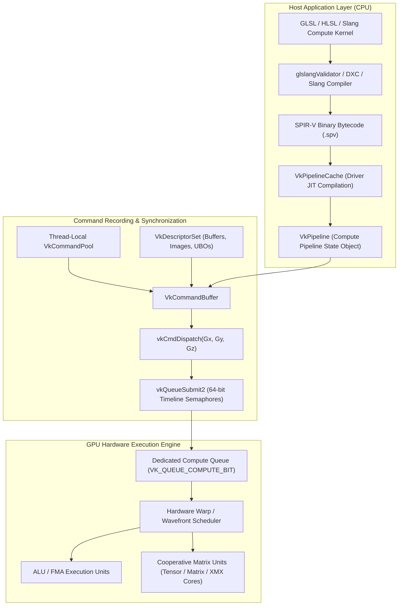
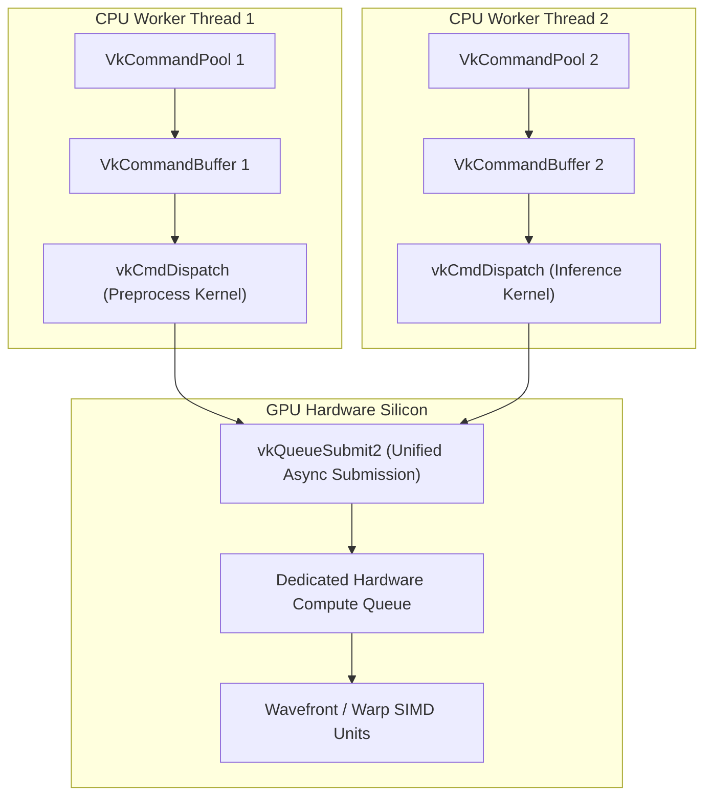

# 🚀 Vulkan 1.3 / 1.4 Compute: Explicit GPU Acceleration, SPIR-V & Cooperative Matrix

## 1. Framework Overview & Core Philosophy

The **Vulkan API** (Vulkan 1.3 / 1.4) is the industry standard for explicit, low-overhead, vendor-agnostic GPU computing maintained by the Khronos Group. Unlike proprietary closed ecosystems (NVIDIA CUDA/TensorRT, Apple Metal, AMD ROCm/HIP), Vulkan executes identically across diverse hardware silicon architectures:
- **Desktop & Datacenter GPUs**: NVIDIA Ada Lovelace / Blackwell (Tensor Cores), AMD RDNA3 / RDNA4 / CDNA (Matrix Accelerators), Intel Arc Xe / Xe2 (XMX Matrix Engines).
- **Mobile & Embedded SoCs**: ARM Mali-G720 / Immortalis, Qualcomm Adreno 700 / 800 series, Apple Silicon (via MoltenVK translation), and edge boards such as the Raspberry Pi 5 VideoCore VII.

Vulkan eliminates runtime driver heuristics, hidden background threads, and implicit memory management. Every memory allocation, synchronization barrier, pipeline compilation, and command submission is declared explicitly by application code, unlocking predictable latency and maximum hardware utilization.



---

## 2. Compilation Pipeline & SPIR-V Intermediate Representation

### A. SPIR-V Intermediate Representation
Vulkan compute shaders are authored in high-level shading languages (GLSL, HLSL, or Slang) and compiled ahead-of-time into **SPIR-V (Standard Portable Intermediate Representation)** bytecode.

```
Neural Network Layer (GEMM / Conv) ──> Slang / GLSL Compute Shader ──> glslangValidator / Slang ──> SPIR-V (.spv)
```

In SPIR-V, compute execution grids are partitioned into **Workgroups** and **Invocations**:
- A kernel declares its local workgroup dimensions: `layout(local_size_x = 16, local_size_y = 16, local_size_z = 1) in;`
- Execution units map directly to physical SIMD lockstep execution units:
  - **NVIDIA**: Warps (32 threads).
  - **AMD RDNA**: Wavefronts (Wave32 or Wave64).
  - **Intel Arc**: Subgroups (8, 16, or 32 invocations).
  - **ARM Mali**: Warps (16 threads).

### B. Specialization Constants (`VkSpecializationInfo`)
To maximize hardware micro-architectural throughput without runtime shader recompilation from raw text strings, Vulkan provides **Specialization Constants**:
- Constants (such as tile sizes $M_{\text{tile}}, N_{\text{tile}}, K_{\text{tile}}$, loop unroll bounds, or activation types) are assigned constant IDs in SPIR-V.
- At pipeline creation (`vkCreateComputePipelines`), the application passes a `VkSpecializationInfo` structure containing target-specific numeric constants.
- The GPU driver optimizes register allocation, unrolls inner loops, and folds constants directly into hardware machine ISA instructions.

```cpp
// Specialization constant map entries
VkSpecializationMapEntry entries[3] = {
    { .constantID = 0, .offset = 0 * sizeof(uint32_t), .size = sizeof(uint32_t) }, // TILE_M
    { .constantID = 1, .offset = 1 * sizeof(uint32_t), .size = sizeof(uint32_t) }, // TILE_N
    { .constantID = 2, .offset = 2 * sizeof(uint32_t), .size = sizeof(uint32_t) }  // TILE_K
};

uint32_t tileData[3] = { 16, 16, 16 };
VkSpecializationInfo specInfo = {
    .mapEntryCount = 3,
    .pMapEntries = entries,
    .dataSize = sizeof(tileData),
    .pData = tileData
};
```

### C. Cooperative Matrix (`VK_KHR_cooperative_matrix`)
Vulkan 1.3 / 1.4 exposes hardware-accelerated tensor cores and matrix engines across vendors via the unified `VK_KHR_cooperative_matrix` extension:
- Cooperative matrices represent 2D matrix tiles partitioned across invocations of a subgroup.
- Kernels perform matrix multiply-accumulate (MMA) operations directly in physical register files:
  $$C = A \cdot B + C$$
- The driver compiler lowers `coopMatMulAdd()` directly to vendor ISA instructions:
  - NVIDIA: `mma.sync.aligned.m16n8k16` (Tensor Cores).
  - AMD: `v_mfma_f32_16x16x16f16` (Matrix Cores).
  - Intel: `dpas` (Dot Product Accumulate Systolic).

```glsl
#version 450
#extension GL_KHR_cooperative_matrix : enable
#extension GL_EXT_shader_explicit_arithmetic_types_float16 : enable

layout(local_size_x = 32, local_size_y = 1, local_size_z = 1) in;

layout(set = 0, binding = 0) readonly buffer BufA { float16_t dataA[]; };
layout(set = 0, binding = 1) readonly buffer BufB { float16_t dataB[]; };
layout(set = 0, binding = 2) buffer BufC { float16_t dataC[]; };

// 16x16x16 tile cooperative matrices in FP16 precision
f16coopmat<16, 16, 16, gl_ScopeSubgroup> matA;
f16coopmat<16, 16, 16, gl_ScopeSubgroup> matB;
f16coopmat<16, 16, 16, gl_ScopeSubgroup> matC;

void main() {
    coopMatLoad(matA, dataA, offsetA, strideA, gl_MatrixLayoutRowMajor);
    coopMatLoad(matB, dataB, offsetB, strideB, gl_MatrixLayoutRowMajor);
    coopMatLoad(matC, dataC, offsetC, strideC, gl_MatrixLayoutRowMajor);
    
    matC = coopMatMulAdd(matA, matB, matC);
    
    coopMatStore(matC, dataC, offsetC, strideC, gl_MatrixLayoutRowMajor);
}
```

---

## 3. Memory Model, Allocations & Zero-Copy DMA-BUF

Vulkan exposes complete control over physical GPU memory topologies through memory heap indices and property flags.

```
+-----------------------------------------------------------------------------------+
|                        Physical Device Memory Architecture                        |
+-----------------------------------------------------------------------------------+
|  VK_MEMORY_PROPERTY_DEVICE_LOCAL_BIT (Dedicated High-Bandwidth VRAM / HBM)        |
|  - Ultra-fast on-device memory for neural weights, KV-caches, and activations     |
|  - Direct GPU access; staging buffer required for CPU upload                      |
+-----------------------------------------------------------------------------------+
|  VK_MEMORY_PROPERTY_HOST_VISIBLE_BIT | HOST_COHERENT_BIT (Host Staging Memory)   |
|  - CPU-mappable memory via vkMapMemory for inference inputs and telemetry outputs |
+-----------------------------------------------------------------------------------+
|  VK_KHR_external_memory_fd & Linux DMA-BUF (Zero-Copy Camera / Sensor Ingestion)  |
|  - Linux file descriptor import maps V4L2 / GStreamer frames to VkImage / VkBuffer|
|  - Direct ISP-to-GPU execution with zero CPU memory copies                        |
+-----------------------------------------------------------------------------------+
```

### A. Memory Type Query Algorithm
When creating buffers or textures, the application queries hardware memory requirements and selects the optimal index:

```cpp
uint32_t findMemoryTypeIndex(VkPhysicalDevice physicalDevice, uint32_t typeFilter, VkMemoryPropertyFlags properties) {
    VkPhysicalDeviceMemoryProperties memProperties;
    vkGetPhysicalDeviceMemoryProperties(physicalDevice, &memProperties);

    for (uint32_t i = 0; i < memProperties.memoryTypeCount; ++i) {
        if ((typeFilter & (1 << i)) && (memProperties.memoryTypes[i].propertyFlags & properties) == properties) {
            return i;
        }
    }
    throw std::runtime_error("Failed to find suitable Vulkan memory type index!");
}
```

### B. Linux Zero-Copy DMA-BUF Import (`VK_KHR_external_memory_fd`)
In high-performance edge vision and robotics systems, camera frames captured by V4L2/DRM hardware ISPs reside in Linux DMA buffers (`dma_buf`). Vulkan imports these memory buffers directly without copying data through user-space RAM:

```cpp
// 1. Ingest DMA-BUF file descriptor from V4L2 camera driver
int dma_buf_fd = v4l2_buffer.m.fd;

// 2. Configure external memory import structure
VkImportMemoryFdInfoKHR importFdInfo = {
    .sType = VK_STRUCTURE_TYPE_IMPORT_MEMORY_FD_INFO_KHR,
    .pNext = nullptr,
    .handleType = VK_EXTERNAL_MEMORY_HANDLE_TYPE_OPAQUE_FD_BIT,
    .fd = dma_buf_fd
};

VkMemoryAllocateInfo allocInfo = {
    .sType = VK_STRUCTURE_TYPE_MEMORY_ALLOCATE_INFO,
    .pNext = &importFdInfo,
    .allocationSize = frame_size_bytes,
    .memoryTypeIndex = deviceLocalMemoryTypeIndex
};

VkDeviceMemory importedCameraMemory;
vkAllocateMemory(device, &allocInfo, nullptr, &importedCameraMemory);
vkBindImageMemory(device, cameraVkImage, importedCameraMemory, 0);
```

---

## 4. Execution Model, Multi-Queue Threading & Synchronization

### A. Lock-Free Command Recording Architecture
Vulkan separates command generation from hardware execution:
- **Thread-Local Command Pools**: Each CPU worker thread allocates a `VkCommandPool` with `VK_COMMAND_POOL_CREATE_RESET_COMMAND_BUFFER_BIT`. Worker threads record `vkCmdDispatch` calls concurrently into distinct `VkCommandBuffer` instances without mutex locks.
- **Dedicated Compute & Transfer Queues**: Modern GPUs expose independent hardware queue engines for Compute (`VK_QUEUE_COMPUTE_BIT`) and DMA Transfer (`VK_QUEUE_TRANSFER_BIT`), allowing model weight streaming to overlap with compute kernel execution.



### B. 64-Bit Timeline Semaphores (`VK_KHR_timeline_semaphore`)
Vulkan 1.3+ replaces fragile binary semaphores with monotonically increasing 64-bit **Timeline Semaphores**:
- Host CPU threads and GPU queues can wait on or signal exact numeric counter values.
- Multi-stage pipelines (Pre-process $\to$ Neural Forward $\to$ Post-process) synchronize asynchronously without waking the CPU:

```cpp
VkTimelineSemaphoreSubmitInfo timelineInfo = {
    .sType = VK_STRUCTURE_TYPE_TIMELINE_SEMAPHORE_SUBMIT_INFO,
    .waitSemaphoreValueCount = 1,
    .pWaitSemaphoreValues = &waitValue,      // Wait for Frame N-1 complete (e.g., 42)
    .signalSemaphoreValueCount = 1,
    .pSignalSemaphoreValues = &signalValue   // Signal Frame N complete (e.g., 43)
};
```

---

## 5. Low-Precision Arithmetic & Subgroup Operations

Vulkan provides explicit hardware extensions for low-precision deep learning inference:
- **`VK_KHR_shader_float16_int8`**: Enables native 16-bit floating-point (`float16_t`) and 8-bit integer (`int8_t`) arithmetic in shaders, halving register usage and doubling SIMD instruction throughput.
- **`VK_KHR_shader_integer_dot_product`**: Maps 4-way 8-bit integer dot products directly to hardware instructions (equivalent to NVIDIA `dp4a`, ARM `SDOT`, x86 `VNNI`):
  $$D = \sum_{k=0}^{3} (A_k \times B_k) + C$$
- **Subgroup Shuffle / Arithmetic (`VK_KHR_shader_subgroup_arithmetic`)**: Enables cross-lane register reductions (`subgroupAdd()`, `subgroupMax()`, `subgroupShuffle()`) without intermediate Shared/L1 memory round trips.

---

## 6. Edge Deployment & Operational Gotchas

### A. Memory Barrier & Synchronization Hazards
Unlike higher-level abstractions, Vulkan requires explicit memory and execution barriers:
- **Hazard**: If compute dispatch $N+1$ reads from a storage buffer written by dispatch $N$ without an intervening pipeline barrier, a **Read-After-Write (RAW)** race condition occurs, resulting in intermittent NaN outputs or corrupted bounding boxes under high GPU clock loads.
- **Remedy**: Insert a `VkMemoryBarrier2` specifying `srcStageMask = VK_PIPELINE_STAGE_2_COMPUTE_SHADER_BIT`, `srcAccessMask = VK_ACCESS_2_SHADER_STORAGE_WRITE_BIT`, `dstStageMask = VK_PIPELINE_STAGE_2_COMPUTE_SHADER_BIT`, and `dstAccessMask = VK_ACCESS_2_SHADER_STORAGE_READ_BIT`.

### B. Subgroup Size Portability
Subgroup execution widths differ across silicon vendors:
- **NVIDIA**: 32 invocations.
- **AMD RDNA**: 32 or 64 invocations (configurable via `VK_EXT_subgroup_size_control`).
- **Intel Arc**: 8, 16, or 32 invocations.
- **Rule**: Never hardcode reduction loops to assume 32 threads. Query `VkPhysicalDeviceSubgroupProperties.subgroupSize` dynamically or use `gl_SubgroupSize` inside shaders.

---

## 7. Production Code Blueprint: Compute Dispatch with Pipeline Cache

```cpp
#include <vulkan/vulkan.h>
#include <vector>
#include <iostream>
#include <stdexcept>

class VulkanComputeEngine {
private:
    VkInstance instance;
    VkPhysicalDevice physicalDevice;
    VkDevice device;
    VkQueue computeQueue;
    uint32_t computeQueueFamilyIndex;
    VkPipelineCache pipelineCache;

public:
    VulkanComputeEngine() {
        // 1. Initialize Vulkan Instance
        VkApplicationInfo appInfo = {
            .sType = VK_STRUCTURE_TYPE_APPLICATION_INFO,
            .pApplicationName = "VulkanComputeInference",
            .applicationVersion = VK_MAKE_VERSION(1, 0, 0),
            .apiVersion = VK_API_VERSION_1_3
        };

        VkInstanceCreateInfo instanceInfo = {
            .sType = VK_STRUCTURE_TYPE_INSTANCE_CREATE_INFO,
            .pApplicationInfo = &appInfo
        };
        if (vkCreateInstance(&instanceInfo, nullptr, &instance) != VK_SUCCESS) {
            throw std::runtime_error("Failed to create Vulkan 1.3 instance!");
        }

        // 2. Select Physical Device with Compute Queue
        uint32_t deviceCount = 0;
        vkEnumeratePhysicalDevices(instance, &deviceCount, nullptr);
        std::vector<VkPhysicalDevice> devices(deviceCount);
        vkEnumeratePhysicalDevices(instance, &deviceCount, devices.data());
        physicalDevice = devices[0];

        // 3. Query Compute Queue Family
        uint32_t queueFamilyCount = 0;
        vkGetPhysicalDeviceQueueFamilyProperties(physicalDevice, &queueFamilyCount, nullptr);
        std::vector<VkQueueFamilyProperties> queueProps(queueFamilyCount);
        vkGetPhysicalDeviceQueueFamilyProperties(physicalDevice, &queueFamilyCount, queueProps.data());

        for (uint32_t i = 0; i < queueFamilyCount; ++i) {
            if (queueProps[i].queueFlags & VK_QUEUE_COMPUTE_BIT) {
                computeQueueFamilyIndex = i;
                break;
            }
        }

        // 4. Create Logical Device
        float queuePriority = 1.0f;
        VkDeviceQueueCreateInfo queueInfo = {
            .sType = VK_STRUCTURE_TYPE_DEVICE_QUEUE_CREATE_INFO,
            .queueFamilyIndex = computeQueueFamilyIndex,
            .queueCount = 1,
            .pQueuePriorities = &queuePriority
        };

        VkPhysicalDeviceVulkan13Features features13 = {
            .sType = VK_STRUCTURE_TYPE_PHYSICAL_DEVICE_VULKAN_1_3_FEATURES,
            .synchronization2 = VK_TRUE
        };

        VkDeviceCreateInfo deviceInfo = {
            .sType = VK_STRUCTURE_TYPE_DEVICE_CREATE_INFO,
            .pNext = &features13,
            .queueCreateInfoCount = 1,
            .pQueueCreateInfos = &queueInfo
        };
        vkCreateDevice(physicalDevice, &deviceInfo, nullptr, &device);
        vkGetDeviceQueue(device, computeQueueFamilyIndex, 0, &computeQueue);

        // 5. Create Pipeline Cache for Rapid Warm Restarts
        VkPipelineCacheCreateInfo cacheInfo = {
            .sType = VK_STRUCTURE_TYPE_PIPELINE_CACHE_CREATE_INFO
        };
        vkCreatePipelineCache(device, &cacheInfo, nullptr, &pipelineCache);
        std::cout << "[Vulkan Compute] Initialized explicit Vulkan 1.3 compute context." << std::endl;
    }

    ~VulkanComputeEngine() {
        vkDestroyPipelineCache(device, pipelineCache, nullptr);
        vkDestroyDevice(device, nullptr);
        vkDestroyInstance(instance, nullptr);
    }
};
```

---

## 8. Cross-Reference Links
- [[frameworks/vulkan-sc|Vulkan SC 2.0 Safety-Critical Architecture]]
- [[frameworks/apache-tvm|Apache TVM Unity & SPIR-V Code Generation]]
- [[topics/gpu-deployment/01-historical-evolution-and-paradigms|Tensor Core & Matrix Accelerator Architectures]]
