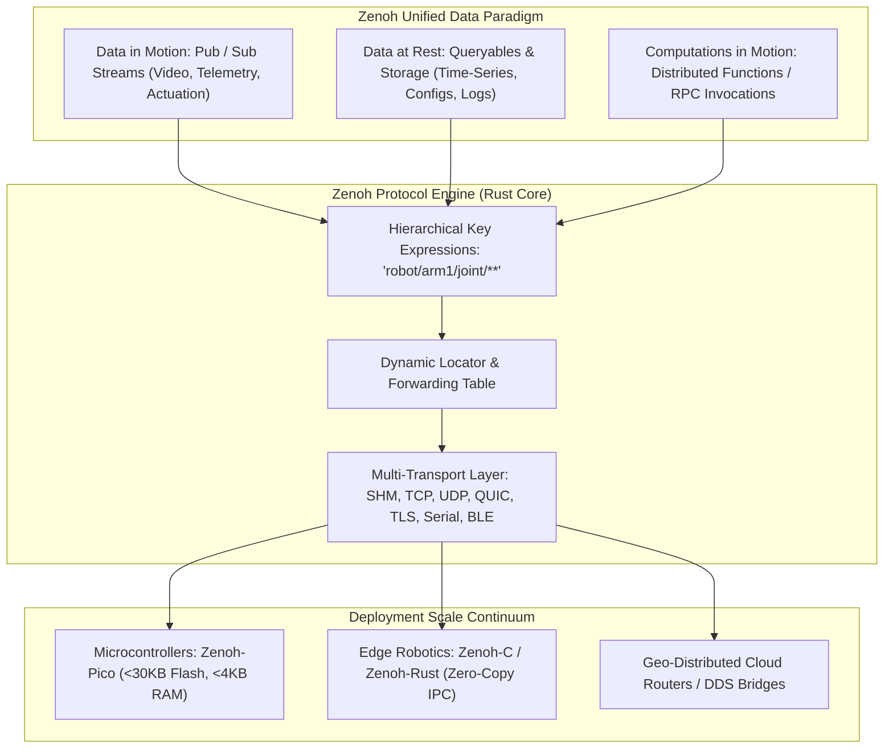
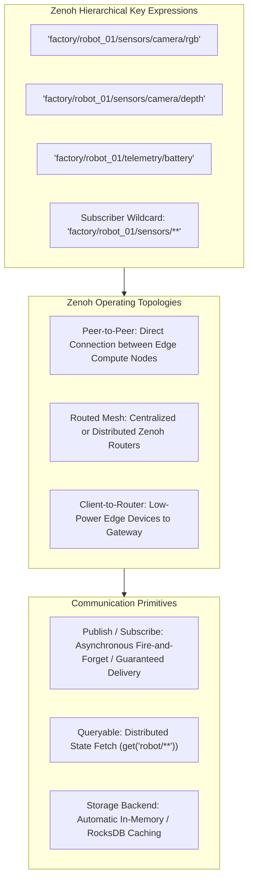
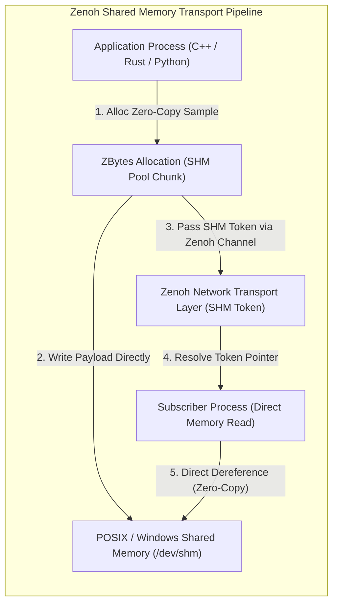
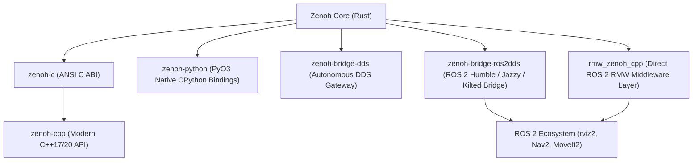

# 🌐 Eclipse Zenoh & Zenoh-Pico: Decentralized Edge-to-Cloud Communication Framework

## 1. Framework Overview & Core Philosophy

**Eclipse Zenoh** (pronounced */zeno/*) is an ultra-low-overhead, zero-copy, highly scalable communication protocol and networking middleware designed for the Edge-to-Cloud continuum, autonomous robotics, vehicular communication (V2X), and Industrial IoT.

Traditional distributed middleware standards—most notably the OMG Data Distribution Service (DDS)—were designed in an era dominated by wired Local Area Networks (LAN) with reliable multicast primitives. When deployed across modern heterogeneous networks (unreliable Wi-Fi, 5G cellular, satellite uplinks, lossy multi-hop meshes, and resource-constrained microcontrollers), DDS suffers from major architectural limitations:
1. **$O(N^2)$ Discovery Storms**: DDS Simple Participant Discovery Protocol (SPDP) broadcasts participant and endpoint discovery packets across the entire subnet. As node count ($N$) grows, discovery traffic consumes all available network bandwidth.
2. **Heavyweight Wire Protocol**: RTPS (Real-Time Publish-Subscribe) introduces 30--64 bytes of header overhead per data packet, severely penalizing constrained IoT uplinks.
3. **Impedance Mismatch with Data Paradigms**: DDS supports only *data in motion* (Publish/Subscribe). Storing historical sensor streams or querying current state (*data at rest*) or invoking dynamic computations (*computations in motion*) requires layering external databases, REST APIs, or RPC protocols on top.



Zenoh unifies **Data in Motion**, **Data at Rest**, and **Computations in Motion** into a single protocol governed by hierarchical **Key Expressions** (`KeyExpr`). It achieves:
- **5 Bytes Minimum Wire Overhead**: Compared to 30+ bytes in DDS RTPS or 100+ bytes in HTTP/REST.
- **10x Throughput over DDS over Wireless Networks**: Eliminates multicast discovery storms by using compact locators, point-to-point dynamic resolution, and batch-coalescing algorithms.
- **Zero-Copy Local Shared Memory (SHM)**: In-process and cross-process communication on the same edge device operates at native memory bus speed via shared memory backends.
- **Extreme Portability**: Scales from cloud datacenter routers running in Rust to 8-bit/32-bit microcontrollers (ESP32, STM32, ARM Cortex-M) running **Zenoh-Pico** in ANSI C99.

---

## 2. Internal Architecture & Data Structures

Zenoh decouples network routing from application addressing through an elegant set of core primitives.



### Key Expressions and Numerical Mapping (`Numerical IDs`)

In Zenoh, resources are addressed via URL-like UTF-8 strings known as **Key Expressions** (`KeyExpr`):
- `robot/chassis/lidar/points` (Exact path)
- `robot/*/camera/*` (Single-level wildcards)
- `robot/**` (Multi-level recursive wildcard)

Sending full UTF-8 strings in every packet header would waste bandwidth. Zenoh resolves this using **Resource Declarations and Numerical IDs**:
1. During session establishment or first publication, a node registers a Key Expression with its connected peer or router.
2. The router assigns a compact numerical ID (e.g., `id: 42`, encoded via LEB128 variable-length integers).
3. All subsequent data packets transmit only the compact integer identifier, reducing routing overhead to 1--2 bytes.

### Core Interaction Primitives

1. **Publish/Subscribe (`put` / `declare_subscriber`)**:
   - Publishers emit data chunks associated with a `KeyExpr`.
   - Subscribers receive matching packets matching their wildcard criteria.
   - Congestion control modes: `Drop` (real-time latest-is-best) or `Block` (reliable queuing).
2. **Query/Queryable (`get` / `declare_queryable`)**:
   - Queriers emit a `get("robot/config/**")` request across the mesh.
   - Any registered `Queryable` matching the expression evaluates the query and responds with zero, one, or multiple `Reply` payloads.
   - Supports parameter filtering (e.g., `"robot/telemetry?since=1712000000&limit=10"`).
3. **Storage & Caching (`zenoh-plugin-storage-manager`)**:
   - Transparently intercepts `put` streams matching configured key expressions and stores the latest state into memory, RocksDB, SQLite, or InfluxDB.
   - Automatically answers `get` queries when original publishers are offline or sleeping.

### Zenoh-Pico: Embedded C Architecture for Microcontrollers

**Zenoh-Pico** is a pure ANSI C99 implementation tailored for severely constrained microcontrollers:
- Footprint: **$<30\text{ KB}$ Flash**, **$<4\text{ KB}$ Static RAM**.
- Operates without dynamic heap allocation (`malloc`/`free`) by configuring fixed static buffer pools at compile time.
- Implements a non-blocking single-threaded cooperative event loop (`z_poll()`) easily integrated into FreeRTOS tasks, Zephyr OS threads, or bare-metal `main()` loops.
- Connects directly to full Zenoh routers over low-bandwidth physical interfaces: UART Serial, SPI, BLE, or 6LoWPAN.

---

## 3. Memory Model, Allocators & Zero-Copy Primitives

Zenoh optimizes data transit through hierarchical memory buffers and zero-copy shared memory extensions.



### Buffer Abstractions: `ZBytes` and `ZBuf`

At the Rust core level, payload management is handled by zero-cost slicing types:
- **`ZBytes`**: Represents an immutable or reference-counted contiguous/chunked byte payload. Implements `Clone` via atomic pointer bumping without copying underlying memory buffers.
- **`ZBuf`**: A segmented buffer structure (scatter-gather vector) allowing network headers to be prepended and transport footers to be appended without copying or reallocating the underlying payload memory.

### Shared Memory Transport (`zenoh-transport-shm`)

When two Zenoh nodes reside on the same physical host:
1. The transport layer automatically detects local peer locality.
2. Large payloads exceeding a configurable threshold (e.g., $>64\text{ KB}$) bypass the loopback network stack entirely.
3. Payloads are placed into a POSIX shared memory ring buffer, and only a tiny **Shared Memory Descriptor Token** (containing the SHM segment ID, byte offset, and length) is routed through the Zenoh control plane.
4. The receiving process maps the token directly to its local virtual memory address space, achieving constant sub-microsecond latency.

---

## 4. Execution Model, Threading & Concurrency

### Asynchronous Reactor Model (Tokio & Actor Routing)

Zenoh's Rust runtime is structured around the `tokio` multi-threaded asynchronous runtime:
- **Transport Drivers**: Asynchronous I/O polling tasks (`epoll` on Linux, `kqueue` on macOS/iOS, `IOCP` on Windows) multiplex thousands of concurrent TCP/UDP/QUIC connections over a minimal set of worker threads.
- **Actor Routing Pipelines**: Incoming packets are processed through lock-free bounded channels (`crossbeam-channel` / `flume`).
- **Batching & Coalescing Engine**: To maximize throughput over high-bandwidth links (such as 10GbE or 5G), the router coalesces multiple small payloads destined for the same next-hop locator into a single network frame, reducing OS interrupt overhead by up to $80\%$.

```
[ Incoming Network Interfaces (TCP / UDP / QUIC / SHM) ]
                           │
                           ▼
          [ Async I/O Multiplexer (Tokio epoll) ]
                           │
                           ▼
             [ Batching & Coalescing Engine ]
                           │
                           ▼
     [ Lock-Free Demuxer & KeyExpr Route Matching ]
                           │
        ┌──────────────────┴──────────────────┐
        ▼                                     ▼
[ Local Subscribers ]               [ Outgoing Transports ]
(Shared Memory Zero-Copy)           (WAN / Cellular / Cloud)
```

### Transport Protocols and Multi-Link Routing

Zenoh abstracts underlying L4/L3 network links:
- **Reliable Stream**: TCP, TLS, QUIC, WebSocket (for browser web-frontends).
- **Datagram & Multicast**: UDP Unicast, UDP Multicast (for local subnet zero-config discovery).
- **Serial & Hardware Bus**: Raw Serial UART (for direct microcontroller-to-computer connections), CAN-FD tunnels.

**Multi-Link Load Balancing & Failover**: Zenoh sessions can bind across multiple network interfaces simultaneously (e.g., Wi-Fi + LTE + Ethernet). The transport scheduler can split traffic across interfaces, prioritize high-bandwidth data over Wi-Fi, and failover mission-critical telemetry to LTE within milliseconds when Wi-Fi signal degrades.

---

## 5. Integration Ecosystem & Cross-Language Bindings



### Direct ROS 2 Middleware: `rmw_zenoh`

`rmw_zenoh` is an official, first-class ROS 2 middleware implementation maintained by the Open Source Robotics Foundation (OSRF) and ZettaScale:
- Replaces DDS entirely in ROS 2 systems.
- Eliminates the need for a separate ROS 2 daemon or discovery server.
- Connects ROS 2 nodes directly across wide-area networks (WAN) and multi-robot fleets without complex VPN tunnels or DDS routing services.

### Zero-Touch DDS Bridging: `zenoh-bridge-dds`

For existing legacy robotics systems running FastDDS or CycloneDDS:
1. `zenoh-bridge-dds` joins the local DDS domain as a participant.
2. It automatically snoops all active DDS topics, serializes DDS CDR payloads, and maps them to Zenoh Key Expressions (`dds/<domain_id>/<topic_name>`).
3. Bridges deployed across remote robot fleets connect via Zenoh routers over encrypted WAN links, reconstructing native DDS messages on the remote side.

---

## 6. Edge Deployment, Safety & Operational Gotchas

### Network Roaming, Handover & Mobile Robotics

In warehouse autonomous mobile robots (AMRs) and outdoor rovers, switching between Wi-Fi access points or transitioning from Wi-Fi to cellular causes frequent IP address changes and socket disconnections.

**Zenoh Resilience Mechanisms**:
- **Session Continuity**: Zenoh sessions maintain persistent logical IDs. If an underlying TCP/UDP socket disconnects, the session enters an ephemeral reconnection grace period (configurable: 5--60s).
- **State Resynchronization**: Upon reconnecting on a new IP address, Zenoh automatically negotiates sequence numbers and retransmits missed guaranteed packets without restarting publisher/subscriber endpoints.

### Query Storms and Key Expression Wildcard Traps

Querying overly broad wildcards (e.g., `get("**")` or `get("factory/**")`) across a large mesh can trigger thousands of edge devices to respond simultaneously, causing severe bandwidth exhaustion (a **Query Storm**).

**Best Practices**:
- Restrict query scope to explicit namespaces: `get("factory/line1/robot_03/telemetry")`.
- Configure query timeouts (`timeout_ms: 2000`) and target constraints (`target: QueryTarget::BestMatching`).
- Enable server-side pagination and response limits in high-scale queryable nodes.

### Zenoh-Pico Microcontroller Resource Management

When deploying `zenoh-pico` on microcontrollers (e.g., ESP32-S3 or STM32H7):
- **Buffer Exhaustion**: Ensure `Z_CONFIG_MAX_BUFFER_SIZE` matches maximum expected packet size. Receiving a packet larger than the static RX buffer will cause dropped frames.
- **Keepalive Tuning**: Configure `z_lease_duration` and `z_keepalive` appropriately; on high-latency cellular IoT uplinks (NB-IoT / LTE-M), setting lease times too low causes unnecessary disconnect cycles.

---

## 7. Complete Runnable Production Code Blueprint

Below is a complete, production-grade, asynchronous Rust application demonstrating:
1. Initializing a high-performance Zenoh session configured for local shared memory and peer-to-peer discovery.
2. Publishing high-frequency sensor telemetry over structured Key Expressions.
3. Implementing an asynchronous **Queryable** that answers queries for historical telemetry and device diagnostics.
4. Subscribing to wildcard streams with non-blocking sample processing.

```rust
// File: src/main.rs
//! Complete Production Blueprint: Eclipse Zenoh Robot Telemetry & Queryable System
//! 
//! Demonstrates:
//! - Session creation with custom JSON/TOML configuration
//! - Structured Publisher emitting JSON/binary telemetry
//! - High-throughput Wildcard Subscriber
//! - Distributed Asynchronous Queryable handling remote state queries

use std::error::Error;
use std::sync::atomic::{AtomicBool, Ordering};
use std::sync::Arc;
use std::time::Duration;

use serde::{Deserialize, Serialize};
use zenoh::config::Config;
use zenoh::prelude::r#async::*;

/// Production Robot Telemetry Data Structure
#[derive(Debug, Clone, Serialize, Deserialize)]
pub struct RobotTelemetry {
    pub robot_id: String,
    pub timestamp_ms: u64,
    pub battery_voltage: f32,
    pub cpu_temperature_c: f32,
    pub linear_velocity_mps: f32,
    pub angular_velocity_radps: f32,
    pub status: String,
}

#[tokio::main]
async fn main() -> Result<(), Box<dyn Error>> {
    // 1. Configure Zenoh Session
    let mut config = Config::default();
    
    // Enable local Shared Memory (SHM) transport for sub-microsecond local IPC
    config.insert_json5("transport/shared_memory/enabled", "true")?;
    
    // Configure mode to Peer (Peer-to-Peer without requiring a centralized router)
    config.insert_json5("mode", "\"peer\"")?;

    println!("[System] Opening Zenoh Session...");
    let session = Arc::new(zenoh::open(config).res().await?);
    println!("[System] Zenoh Session established. Zenoh ID: {}", session.zid());

    let running = Arc::new(AtomicBool::new(true));
    let r_sig = running.clone();

    tokio::spawn(async move {
        tokio::signal::ctrl_c().await.expect("Failed to listen for Ctrl+C");
        println!("\n[System] Shutdown signal received. Closing Zenoh pipelines...");
        r_sig.store(false, Ordering::SeqCst);
    });

    // 2. Spawn Asynchronous Queryable Task (Answers dynamic queries for device state)
    let query_session = session.clone();
    let query_handle = tokio::spawn(async move {
        let key_expr = "fleet/robot_01/diagnostics";
        println!("[Queryable] Registering Queryable on Key Expression: '{}'", key_expr);
        
        let queryable = query_session
            .declare_queryable(key_expr)
            .res()
            .await
            .expect("Failed to declare queryable");

        while let Ok(query) = queryable.recv_async().await {
            let selector = query.selector();
            println!("[Queryable] Received Query for Selector: '{}'", selector);

            // Synthesize diagnostic reply payload
            let reply_data = serde_json::json!({
                "robot_id": "robot_01",
                "firmware_version": "v2.6.4-prod",
                "uptime_seconds": 86400,
                "active_alarms": [],
                "shm_enabled": true
            });

            let sample_bytes = serde_json::to_vec(&reply_data).unwrap();
            let sample = Sample::new(query.key_expr().clone(), sample_bytes);

            // Send reply back to the remote querier
            if let Err(e) = query.reply(Ok(sample)).res().await {
                eprintln!("[Queryable] Failed to send query reply: {:?}", e);
            }
        }
    });

    // 3. Spawn Asynchronous Wildcard Subscriber Task
    let sub_session = session.clone();
    let sub_handle = tokio::spawn(async move {
        let wildcard_expr = "fleet/**/telemetry";
        println!("[Subscriber] Declaring Subscriber on wildcard: '{}'", wildcard_expr);

        let subscriber = sub_session
            .declare_subscriber(wildcard_expr)
            .res()
            .await
            .expect("Failed to declare subscriber");

        while let Ok(sample) = subscriber.recv_async().await {
            let key = sample.key_expr.as_str();
            let payload_slice = sample.payload.contiguous();

            match serde_json::from_slice::<RobotTelemetry>(&payload_slice) {
                Ok(telem) => {
                    println!(
                        "[Subscriber] [RECV] Key: '{}' | Robot: {} | Batt: {:.2}V | Temp: {:.1}°C | Status: {}",
                        key, telem.robot_id, telem.battery_voltage, telem.cpu_temperature_c, telem.status
                    );
                }
                Err(e) => {
                    eprintln!("[Subscriber] Failed to deserialize payload from '{}': {:?}", key, e);
                }
            }
        }
    });

    // 4. Main Publisher Loop (Streams Telemetry at 10 Hz)
    let pub_key_expr = "fleet/robot_01/telemetry";
    println!("[Publisher] Declaring Publisher on Key Expression: '{}'", pub_key_expr);
    let publisher = session
        .declare_publisher(pub_key_expr)
        .res()
        .await?;

    let mut sequence: u64 = 0;
    let mut interval = tokio::time::interval(Duration::from_millis(100)); // 10 Hz

    println!("[Publisher] Beginning telemetry streaming loop...");
    while running.load(Ordering::Relaxed) {
        interval.tick().await;

        let now_ms = std::time::SystemTime::now()
            .duration_since(std::time::UNIX_EPOCH)?
            .as_millis() as u64;

        let telemetry = RobotTelemetry {
            robot_id: "robot_01".to_string(),
            timestamp_ms: now_ms,
            battery_voltage: 24.8 - (sequence as f32 * 0.001),
            cpu_temperature_c: 42.5 + ((sequence % 10) as f32 * 0.3),
            linear_velocity_mps: 1.25,
            angular_velocity_radps: 0.05,
            status: "OPERATIONAL_AUTONOMOUS".to_string(),
        };

        let encoded_payload = serde_json::to_vec(&telemetry)?;

        // Zero-copy publication of payload buffer
        publisher.put(encoded_payload).res().await?;
        sequence += 1;

        // Periodically perform an active Query to demonstrate Querier functionality
        if sequence % 50 == 0 {
            let query_target = "fleet/robot_01/diagnostics";
            println!("[Main/Querier] Executing active Query: '{}'...", query_target);
            
            let replies = session.get(query_target).res().await?;
            while let Ok(reply) = replies.recv_async().await {
                match reply.sample {
                    Ok(sample) => {
                        let text = String::from_utf8_lossy(&sample.payload.contiguous());
                        println!("[Main/Querier] Received Reply: {}", text);
                    }
                    Err(err) => {
                        eprintln!("[Main/Querier] Received Error Reply: {:?}", err);
                    }
                }
            }
        }
    }

    println!("[System] Cleaning up and closing session...");
    session.close().res().await?;
    query_handle.abort();
    sub_handle.abort();

    println!("[System] Graceful exit complete.");
    Ok(())
}
```

---

## 8. Cross-References & Related Middleware

- [[architectures/hardware-and-acceleration-runtimes/iceoryx2-ipc|Iceoryx2 & Zenoh Architecture Deep Dive]]
- [[frameworks/iceoryx2|Eclipse Iceoryx2: Zero-Copy Shared Memory IPC]]
- [[frameworks/ros2-rmw|ROS 2 RMW Ecosystem & rmw_zenoh]]
- [[hardware/nvidia-jetson-orin|NVIDIA Jetson AGX Orin Edge Deployment]]
- [[topics/real-time-systems/01-historical-evolution-and-paradigms|Real-Time Systems & Determinism]]
