# ⚙️ Hardware Platforms & Silicon Acceleration MOC

A comprehensive Map of Content categorizing silicon compute paradigms, hardware accelerators, memory architectures, and safety certifications for edge, robotics, automotive, and datacenter computer vision. Every platform is maintained in an independent, dedicated note.

---

## 🗺️ Silicon Typology Taxonomy

```mermaid
graph TD
    classDef default fill:#1E222A,stroke:#4C566A,stroke-width:1px,color:#ECEFF4;
    classDef target fill:#2E3440,stroke:#88C0D0,stroke-width:2px,color:#88C0D0;

    MOC["Hardware Acceleration MOC"] --> FPGAs["Adaptive SoCs & FPGAs"]:::target
    MOC --> GPUs["Edge & Datacenter GPUs"]:::target
    MOC --> NPUs["Neural Processing Units"]:::target
    MOC --> Safety["Safety & Avionics Compute"]:::target
    MOC --> Alternative["Alternative & Neuromorphic"]:::target

    FPGAs --> V1["[[hardware/amd-versal-ai-edge-gen1|AMD Versal Gen 1]]"]
    FPGAs --> V2["[[hardware/amd-versal-ai-edge-gen2|AMD Versal Gen 2]]"]
    FPGAs --> Zynq["[[hardware/amd-zynq-ultrascale-plus|AMD Zynq UltraScale+]]"]

    GPUs --> Orin["[[hardware/nvidia-jetson-orin|NVIDIA Jetson Orin]]"]
    GPUs --> JThor["[[hardware/nvidia-jetson-thor|NVIDIA Jetson Thor]]"]
    GPUs --> DThor["[[hardware/nvidia-drive-thor|NVIDIA DRIVE Thor]]"]
    GPUs --> Blackwell["[[hardware/nvidia-blackwell-b200|NVIDIA Blackwell B200]]"]

    NPUs --> IntelNPU["[[hardware/intel-npu|Intel NPU 4 & 5]]"]
    NPUs --> IntelXeon["[[hardware/intel-xeon-amx|Intel Xeon 6 AMX]]"]
    NPUs --> Ethos85["[[hardware/arm-ethos-u85|Arm Ethos-U85]]"]
    NPUs --> Ethos65["[[hardware/arm-ethos-u65|Arm Ethos-U65]]"]
    NPUs --> QcomNPU["[[hardware/qualcomm-hexagon-npu|Qualcomm Hexagon NPU]]"]

    Safety --> ArmA78AE["[[hardware/arm-cortex-a78ae|Arm Cortex-A78AE]]"]
    Safety --> ArmR52["[[hardware/arm-cortex-r52|Arm Cortex-R52]]"]
    Safety --> ArmNeoverse["[[hardware/arm-neoverse-v3ae|Arm Neoverse V3AE]]"]
    Safety --> CoreAVI["[[hardware/coreavi-cots-safety-hardware|CoreAVI DO-254 Hardware]]"]

    Alternative --> Loihi["[[hardware/intel-loihi-2|Intel Loihi 2]]"]
    Alternative --> SynSense["[[hardware/synsense-speck|SynSense Speck & Xylo]]"]
    Alternative --> Tenstorrent["[[hardware/tenstorrent-wormhole-blackhole|Tenstorrent Wormhole]]"]
    Alternative --> Esperanto["[[hardware/esperanto-et-soc-1|Esperanto ET-SoC-1]]"]
```



---

## 📑 Hardware Architecture Notes

1. **Adaptive Silicon & FPGAs**:
   - [[hardware/amd-versal-ai-edge-gen1|AMD Versal AI Edge Gen 1]] (AIE-ML v1, NoC, PL fabric, Cortex-A72/R5F)
   - [[hardware/amd-versal-ai-edge-gen2|AMD Versal AI Edge Gen 2]] (AIE-ML v2, FP8/FP4 microscaling, Cortex-A78AE, Mali-G78AE)
   - [[hardware/amd-zynq-ultrascale-plus|AMD Zynq UltraScale+ MPSoC]] (DPUCZDX8G, DSP48E2, UltraRAM, Cortex-A53)

2. **NVIDIA GPU Platforms**:
   - [[hardware/nvidia-jetson-orin|NVIDIA Jetson Orin]] (Ampere GPU, Tensor Cores 3rd gen, NVDLA 2.0, PVA v2, Cortex-A78AE)
   - [[hardware/nvidia-jetson-thor|NVIDIA Jetson Thor]] (Blackwell GPU, 1000 TFLOPS, Transformer Engine v2, Neoverse V3AE)
   - [[hardware/nvidia-drive-thor|NVIDIA DRIVE Thor]] (Dual Blackwell GPU, 2000 TFLOPS, ASIL-D Safety Island)
   - [[hardware/nvidia-blackwell-b200|NVIDIA Blackwell B200 / GB200]] (Dual-Die 208B Transistors, NVLink 5, 2nd-gen Transformer Engine)

3. **Intel Client & Datacenter Silicon**:
   - [[hardware/intel-npu|Intel NPU 4 & NPU 5]] (Meteor Lake, Lunar Lake, Arrow Lake, Level Zero driver)
   - [[hardware/intel-xeon-amx|Intel Xeon 6th Gen with AMX]] (Tile Matrix Multiply TMUL, AVX-512 VNNI)

4. **Arm Safety Cores & Micro-NPUs**:
   - [[hardware/arm-cortex-a78ae|Arm Cortex-A78AE Split-Lock CPU Core]] (Split-Lock mode, ISO 26262 ASIL-D, Out-of-Order execution)
   - [[hardware/arm-cortex-r52|Arm Cortex-R52 Real-Time Lockstep Core]] (Hard real-time dual-core lockstep, microsecond interrupt latency)
   - [[hardware/arm-neoverse-v3ae|Arm Neoverse V3AE Automotive Server Core]] (Server-class automotive CPU, SVE2, AMBA CHI coherent interconnect)
   - [[hardware/arm-ethos-u85|Arm Ethos-U85 Micro-NPU]] (Edge vision & ViT acceleration, up to 4 TOPS INT8/INT4)
   - [[hardware/arm-ethos-u65|Arm Ethos-U65 Micro-NPU]] (IoT and MCU vision trigger, 512 MAC engine)

5. **Avionics & Certified DO-254 COTS**:
   - [[hardware/coreavi-cots-safety-hardware|CoreAVI DO-254 / DO-178C DAL A Hardware Architectures]] (AMD Embedded Radeon, NXP i.MX8, VkCoreSC)

6. **Alternative & Emerging Typologies**:
   - [[hardware/qualcomm-hexagon-npu|Qualcomm Hexagon NPU]] (Fused scalar/vector/tensor, 45–200+ TOPS, QNN SDK)
   - [[hardware/intel-loihi-2|Intel Loihi 2 Neuromorphic Processor]] (Asynchronous event-driven spiking compute, microsecond latency)
   - [[hardware/synsense-speck|SynSense Speck & Xylo Dynamic Vision Processor]] (Sub-milliwatt DVS event stream direct processing)
   - [[hardware/tenstorrent-wormhole-blackhole|Tenstorrent Wormhole & Blackhole RISC-V AI]] (Tensix cores, 2D mesh NoC, TT-Metalium)
   - [[hardware/esperanto-et-soc-1|Esperanto ET-SoC-1 Massive RISC-V Architecture]] (1,088 energy-efficient 64-bit RISC-V tensor cores)

---

## 🔮 Obsidian Dynamic Dataview Index

```dataview
TABLE type AS "Typology", domain AS "Domain", updated AS "Updated"
FROM "hardware"
WHERE file.name != "README" AND file.name != "00-hardware-moc"
SORT file.name ASC
```
