# ⚡ Hardware Platforms & Silicon Acceleration Vault

An exhaustive, modular technical repository documenting edge, automotive, datacenter, and safety-critical hardware architectures through August 2026. Every silicon technology and computing platform is documented in a dedicated, standalone reference guide.

---

## 🗺️ Silicon Typology & Compute Hierarchy

```mermaid
graph TD
    classDef default fill:#1E222A,stroke:#4C566A,stroke-width:1px,color:#ECEFF4;
    classDef fpga fill:#2E3440,stroke:#88C0D0,stroke-width:2px,color:#88C0D0;
    classDef gpu fill:#2E3440,stroke:#A3BE8C,stroke-width:2px,color:#A3BE8C;
    classDef npu fill:#2E3440,stroke:#EBCB8B,stroke-width:2px,color:#EBCB8B;
    classDef safety fill:#2E3440,stroke:#BF616A,stroke-width:2px,color:#BF616A;
    classDef alt fill:#2E3440,stroke:#B48EAD,stroke-width:2px,color:#B48EAD;

    Root["Silicon Architecture Typologies"] --> FPGAs["Adaptive SoCs & FPGAs"]:::fpga
    Root --> GPUs["High-Performance & Edge GPUs"]:::gpu
    Root --> NPUs["Neural Processing Units"]:::npu
    Root --> Safety["Safety & Avionics Silicon"]:::safety
    Root --> Emerging["Emerging & Alternative AI Silicon"]:::alt

    FPGAs --> V1["[[hardware/amd-versal-ai-edge-gen1|AMD Versal AI Edge Gen 1]]"]
    FPGAs --> V2["[[hardware/amd-versal-ai-edge-gen2|AMD Versal AI Edge Gen 2]]"]
    FPGAs --> Zynq["[[hardware/amd-zynq-ultrascale-plus|AMD Zynq UltraScale+ MPSoC]]"]

    GPUs --> Orin["[[hardware/nvidia-jetson-orin|NVIDIA Jetson Orin]]"]
    GPUs --> JThor["[[hardware/nvidia-jetson-thor|NVIDIA Jetson Thor]]"]
    GPUs --> DThor["[[hardware/nvidia-drive-thor|NVIDIA DRIVE Thor]]"]
    GPUs --> B200["[[hardware/nvidia-blackwell-b200|NVIDIA Blackwell B200 / GB200]]"]

    NPUs --> IntelNPU["[[hardware/intel-npu|Intel NPU 4 & NPU 5]]"]
    NPUs --> IntelXeon["[[hardware/intel-xeon-amx|Intel Xeon 6th Gen with AMX]]"]
    NPUs --> ArmEthos85["[[hardware/arm-ethos-u85|Arm Ethos-U85 Micro-NPU]]"]
    NPUs --> ArmEthos65["[[hardware/arm-ethos-u65|Arm Ethos-U65 Micro-NPU]]"]
    NPUs --> QcomNPU["[[hardware/qualcomm-hexagon-npu|Qualcomm Hexagon NPU]]"]

    Safety --> ArmA78AE["[[hardware/arm-cortex-a78ae|Arm Cortex-A78AE Split-Lock]]"]
    Safety --> ArmR52["[[hardware/arm-cortex-r52|Arm Cortex-R52 Real-Time Lockstep]]"]
    Safety --> ArmNeoverse["[[hardware/arm-neoverse-v3ae|Arm Neoverse V3AE Automotive Server]]"]
    Safety --> CoreAVI["[[hardware/coreavi-cots-safety-hardware|CoreAVI DO-254 / DAL A Silicon]]"]

    Emerging --> Loihi["[[hardware/intel-loihi-2|Intel Loihi 2 Neuromorphic]]"]
    Emerging --> SynSense["[[hardware/synsense-speck|SynSense Speck & Xylo SNN]]"]
    Emerging --> Tenstorrent["[[hardware/tenstorrent-wormhole-blackhole|Tenstorrent Wormhole & Blackhole]]"]
    Emerging --> Esperanto["[[hardware/esperanto-et-soc-1|Esperanto ET-SoC-1 RISC-V]]"]
```

---

## 📊 Comprehensive Hardware Comparison Matrix (Updated August 2026)

| Platform | Typology | Core Compute Architecture | Memory Subsystem & Bandwidth | Peak AI Precision & Throughput | Typical TDP / Thermal Envelope | Functional Safety Certification | Primary Target Application |
| :--- | :--- | :--- | :--- | :--- | :--- | :--- | :--- |
| **[[hardware/amd-versal-ai-edge-gen1|Versal AI Edge Gen 1]]** | Adaptive SoC | Dual A72 + Dual R5F + AIE-ML v1 + PL | LPDDR4X / DDR4 @ 34 GB/s + NoC | 45–150 TOPS INT8 / BFLOAT16 | 15W – 75W | IEC 61508 / ISO 26262 ASIL-B | Industrial vision, smart cameras, medical imaging |
| **[[hardware/amd-versal-ai-edge-gen2|Versal AI Edge Gen 2]]** | Adaptive SoC | Octa A78AE + Dual R52 + AIE-ML v2 + Mali-G78AE | LPDDR5X-8533 @ 136 GB/s + NoC | Up to 400+ TOPS (FP4/FP8 microscaling) | 20W – 100W | ISO 26262 ASIL-D (Integrated) | Autonomous mobile robots, level 2+/3 ADAS |
| **[[hardware/amd-zynq-ultrascale-plus|Zynq UltraScale+]]** | FPGA MPSoC | Quad A53 + Dual R5 + DPUCZDX8G Soft IP | DDR4 / LPDDR4 @ 19.2 GB/s | 1.2–10 TOPS INT8 (PL-bounded) | 5W – 25W | IEC 61508 SIL 3 / ISO 26262 ASIL-C | Harsh edge vision, legacy industrial upgrades |
| **[[hardware/nvidia-jetson-orin|Jetson Orin]]** | Embedded GPU/SoC | 12x Cortex-A78AE + Ampere GPU + Dual DLA 2.0 | 256-bit LPDDR5 @ 204.8 GB/s (UMA) | 275 TOPS INT8 / 138 TFLOPS FP16 | 15W – 75W (Configurable) | ISO 26262 ASIL-D System-Level Ready | Autonomous robots, edge analytics, smart cities |
| **[[hardware/nvidia-jetson-thor|Jetson Thor]]** | Robotics Supercomputer | Blackwell GPU + Neoverse V3AE ARM + TE v2 | 256-bit LPDDR5X @ 270+ GB/s (UMA) | 1,000 TFLOPS (FP4/FP8 NVFP4) | 40W – 100W | ISO 26262 ASIL-D Capable | Humanoid robotics, physical AI foundation models |
| **[[hardware/nvidia-drive-thor|DRIVE Thor]]** | Automotive SoC | Dual Blackwell GPU + Neoverse V3AE + ASIL-D Island | LPDDR5X-9600 @ 300+ GB/s (UMA) | Up to 2,000 TFLOPS FP4/FP8 | 60W – 130W | ISO 26262 ASIL-D Hardware Safety Island | End-to-end VLM autonomous driving, cockpit fusion |
| **[[hardware/nvidia-blackwell-b200|Blackwell B200]]** | Datacenter GPU | Dual-Die Blackwell (208B Transistors) + NVLink 5 | 192GB HBM3e @ 8.0 TB/s | 20 PFLOPS FP4 / 10 PFLOPS FP8 | 700W – 1000W | Datacenter Reliability (RAS Engine) | Foundation model pre-training, multi-camera fleet inference |
| **[[hardware/intel-npu|Intel NPU 4 & 5]]** | Client/Edge NPU | Neural Compute Engine (Matrix + Vector Arrays) | Shared LPDDR5X System Memory (Level Zero) | 48+ NPU TOPS (Lunar Lake / Arrow Lake) | 0.5W – 4W (NPU Sub-Plane) | Commercial Client / Edge Workstation | Real-time eye tracking, super-resolution, background blur |
| **[[hardware/intel-xeon-amx|Intel Xeon 6 AMX]]** | Datacenter CPU | P-Cores with Advanced Matrix Extensions (TMUL) | 8-Channel DDR5-6400 @ 409 GB/s | ~200+ TFLOPS INT8/BF16 per socket | 150W – 350W | Mission-Critical Server RAS | Zero-GPU inference pipelines, real-time audio/speech |
| **[[hardware/arm-cortex-a78ae|Arm Cortex-A78AE]]** | Automotive CPU Core | Split-Lock High-Performance Out-of-Order CPU | Direct L3 Cache Snoop + AMBA AXI5 | Deterministic Multi-Threaded Processing | 2W – 10W per cluster | ISO 26262 ASIL-D in Lock mode (Split mode: ASIL-B) | Autonomous vehicle host processing, Linux robot OS |
| **[[hardware/arm-cortex-r52|Arm Cortex-R52]]** | Real-Time Safety Core | In-Order Hard Real-Time Dual-Core Lockstep | Tightly-Coupled Memory (TCM) + Fast MPU | Microsecond Interrupt Latency | 0.5W – 2W | ISO 26262 ASIL-D & IEC 61508 SIL 3 Native | Drive-by-wire supervisors, functional safety monitors |
| **[[hardware/arm-neoverse-v3ae|Arm Neoverse V3AE]]** | Automotive Server CPU | Server-Class High-Throughput Neoverse Core + SVE2 | High-Bandwidth AMBA CHI Coherent Interconnect | High-Throughput Point Cloud / Sensor Preprocessing | 15W – 60W | ISO 26262 ASIL-D Automotive Ready | Central autonomous driving compute clusters |
| **[[hardware/arm-ethos-u85|Arm Ethos-U85]]** | Edge Micro-NPU | 2048 MAC Engine + Native Weight Decompression | Direct Streaming AXI Master / On-Chip SRAM | Up to 4 TOPS INT8 / INT4 (Transformer Ready) | 100mW – 500mW | ISO 26262 ASIL-B / SIL 2 Capable | Edge vision sensors, microcontroller ViT execution |
| **[[hardware/arm-ethos-u65|Arm Ethos-U65]]** | IoT Micro-NPU | 512 MAC Engine + Circular SRAM Buffer | Low-Power AXI Interface to Cortex-M/A | Up to 1 TOP INT8 (CNN Acceleration) | 50mW – 250mW | Industrial SIL 2 Capable | Smart home vision triggers, wake-up word cameras |
| **[[hardware/coreavi-cots-safety-hardware|CoreAVI COTS Safety]]** | Avionics / Safety GPU | AMD Embedded Radeon E9171 / NXP i.MX8 Modules | ECC-Protected GDDR5 / LPDDR4 | Certified DAL-A Graphics & GPGPU Compute | 10W – 50W | DO-254 / DO-178C DAL A & ISO 26262 ASIL-D | Primary flight displays, certifiable airborne synthetic vision |
| **[[hardware/qualcomm-hexagon-npu|Qualcomm Hexagon]]** | Mobile/Edge NPU | Fused Scalar, Vector (HVX), and Matrix (HTP) | Dedicated TCM (Tightly Coupled Memory) + LPDDR5X | 45 TOPS (X Elite) / 200+ TOPS (Ride Flex) | 1W – 15W | ISO 26262 ASIL-D (Automotive variants) | Cockpit monitoring, drone SLAM, on-device assistant VLM |
| **[[hardware/intel-loihi-2|Intel Loihi 2]]** | Neuromorphic SNN | 128 Asynchronous Spiking Neuromorphic Cores | 192KB Local SRAM per Core (Distributed Mesh) | Event-Driven (100–1000x energy efficiency) | 10mW – 100mW | Research / Industrial Pilot Prototype | Low-latency optical flow from DVS, ultra-fast tactile slip |
| **[[hardware/synsense-speck|SynSense Speck & Xylo]]** | Dynamic Vision SNN | Integrated Dynamic Vision Sensor (DVS) + SNN Core | Ultra-Low-Leakage Static RAM | Continuous Sub-Milliwatt Vision Processing | 1mW – 20mW | Ultra-Low Power Industrial Sensors | Always-on gesture recognition, micro-drone obstacle evasion |
| **[[hardware/tenstorrent-wormhole-blackhole|Tenstorrent Wormhole]]** | RISC-V AI Accelerator | 2D Torus Mesh of Tensix Cores + Baby-RISC Nodes | GDDR6 / HBM @ 512 GB/s + Bidirectional NoC | Up to 400+ TFLOPS BF16/FP8 (Wormhole/Blackhole) | 75W – 300W | Open Standard / Industrial Edge | Sovereign AI infrastructure, modular scale-out vision |
| **[[hardware/esperanto-et-soc-1|Esperanto ET-SoC-1]]** | RISC-V Massive Core | 1,088 Energy-Efficient 64-bit RISC-V Tensor Cores | 8-Channel LPDDR4X + Low-Power Mesh NoC | ~100+ TOPS Low-Power Recommendation & Vision | 20W – 40W | Low-Power Datacenter Edge | High-density rack inference, multi-stream surveillance |

---

## 📂 Vault Organization & Dedicated Files

- **Map of Content**: [[hardware/00-hardware-moc|00-hardware-moc.md]]
- **Adaptive Silicon & FPGAs**:
  - [[hardware/amd-versal-ai-edge-gen1|AMD Versal AI Edge Gen 1]]
  - [[hardware/amd-versal-ai-edge-gen2|AMD Versal AI Edge Gen 2]]
  - [[hardware/amd-zynq-ultrascale-plus|AMD Zynq UltraScale+ MPSoC]]
- **NVIDIA GPU Platforms**:
  - [[hardware/nvidia-jetson-orin|NVIDIA Jetson Orin]]
  - [[hardware/nvidia-jetson-thor|NVIDIA Jetson Thor]]
  - [[hardware/nvidia-drive-thor|NVIDIA DRIVE Thor]]
  - [[hardware/nvidia-blackwell-b200|NVIDIA Blackwell B200 / GB200]]
- **Intel Processors & NPUs**:
  - [[hardware/intel-npu|Intel NPU 4 & NPU 5]]
  - [[hardware/intel-xeon-amx|Intel Xeon 6th Gen with AMX]]
- **ARM Silicon & Functional Safety**:
  - [[hardware/arm-cortex-a78ae|Arm Cortex-A78AE Split-Lock CPU Core]]
  - [[hardware/arm-cortex-r52|Arm Cortex-R52 Real-Time Lockstep Core]]
  - [[hardware/arm-neoverse-v3ae|Arm Neoverse V3AE Automotive Server Core]]
  - [[hardware/arm-ethos-u85|Arm Ethos-U85 Micro-NPU]]
  - [[hardware/arm-ethos-u65|Arm Ethos-U65 Micro-NPU]]
- **Avionics & Safety-Critical COTS**:
  - [[hardware/coreavi-cots-safety-hardware|CoreAVI DO-254 / DO-178C DAL A Hardware Architectures]]
- **Emerging & Alternative Typologies**:
  - [[hardware/qualcomm-hexagon-npu|Qualcomm Hexagon NPU]]
  - [[hardware/intel-loihi-2|Intel Loihi 2 Neuromorphic Processor]]
  - [[hardware/synsense-speck|SynSense Speck & Xylo Dynamic Vision Processor]]
  - [[hardware/tenstorrent-wormhole-blackhole|Tenstorrent Wormhole & Blackhole RISC-V AI]]
  - [[hardware/esperanto-et-soc-1|Esperanto ET-SoC-1 Massive RISC-V Architecture]]

---

## 🔗 Cross-Domain Knowledge Vault Links
- Software Frameworks: [[frameworks/README|Frameworks & Software Runtimes Vault]]
- GPU Deployment Playbook: [[topics/gpu-deployment/README|GPU Deployment Playbook]]
- FPGA Deployment Playbook: [[topics/fpga-deployment/README|FPGA Deployment Playbook]]
- Real-Time Systems: [[topics/real-time-systems/README|Real-Time Perception Playbook]]
- Sensor Fusion: [[topics/sensor-fusion/README|Sensor Fusion Playbook]]
