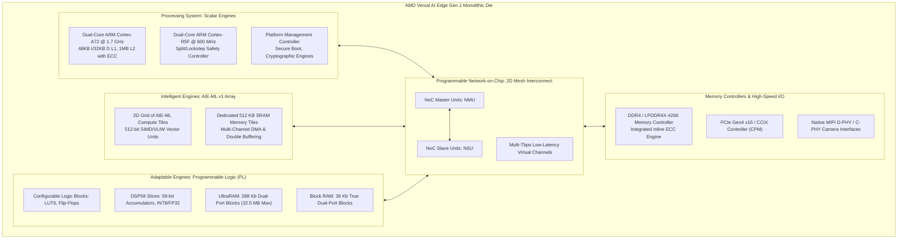
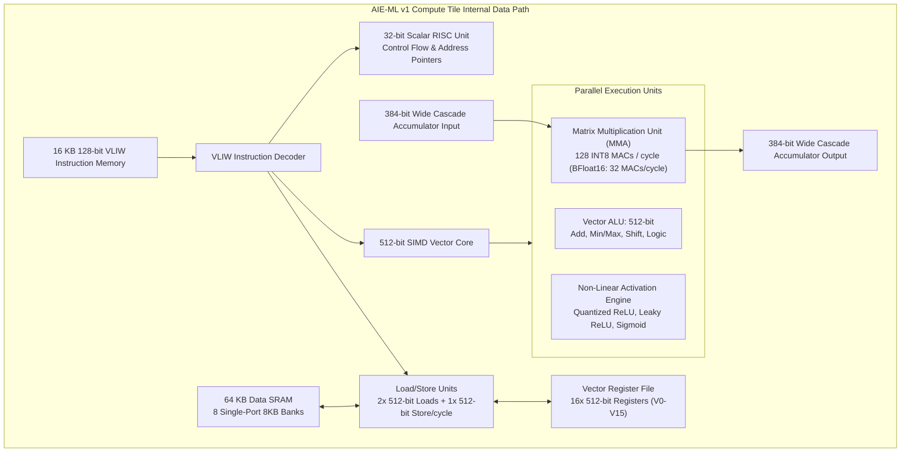
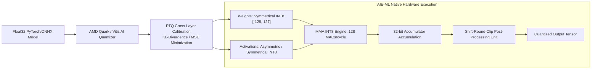
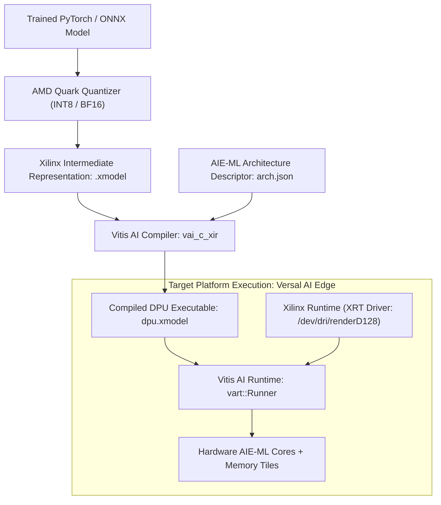
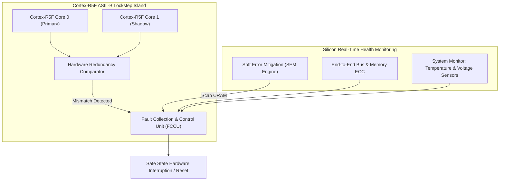

# ⚡ AMD Versal AI Edge Gen 1: Architecture, AIE-ML v1 & Heterogeneous Compute

## 1. Executive Summary & Hardware Typology

The **AMD Versal AI Edge Gen 1** series represents the first commercial implementation of AMD/Xilinx's **Adaptive Compute Acceleration Platform (ACAP)** targeted directly at safety-critical edge AI, robotics, automated driving (ADAS), and industrial vision workloads. Built on a TSMC 7nm FinFET manufacturing process, Versal AI Edge Gen 1 merges scalar processing engines (ARM Cortex-A72 application cores and Cortex-R5F real-time cores), adaptable hardware engines (programmable logic fabric and DSP58 slices), and intelligent engines (**AIE-ML v1** tiles) onto a unified die connected via a high-bandwidth, multi-terabit **Programmable Network-on-Chip (NoC)**.



### Hardware Typology Matrix: Key Part Numbers

| Part Number | AIE-ML Tiles | MEM Tiles (Total SRAM) | DSP58 Slices | System Logic Cells | UltraRAM / BRAM | Peak INT8 Performance | Typical Thermal Power | Target Applications |
| :--- | :--- | :--- | :--- | :--- | :--- | :--- | :--- | :--- |
| **VE2302** | 34 | 8 (4.0 MB) | 464 | 328K | 7.0 MB / 4.4 MB | 45 TOPS | 15W - 25W | Edge Cameras, Industrial Robotics, Smart Sensors |
| **VE2802** | 304 | 38 (19.0 MB) | 1,056 | 1,280K | 28.1 MB / 14.2 MB | 315 TOPS | 45W - 75W | Multi-Camera Perception, ADAS Central Compute |
| **VC1902** | 400 (AIE-v1) | 0 (No MEM Tiles) | 1,968 | 1,968K | 32.5 MB / 19.1 MB | 133 TOPS | 65W - 100W | Prime Infrastructure, Telecom Basebands, Medical |

---

## 2. Compute Core & Memory Hierarchy

Versal AI Edge Gen 1 solves the traditional "memory wall" in embedded heterogeneous systems by replacing point-to-point AXI bus routing with an integrated multi-tier hierarchical memory architecture paired with a high-throughput **2D Mesh NoC**.

```mermaid
flowchart LR
    subgraph External_Memory ["External Memory Subsystem"]
        DRAM["LPDDR4X-4266 / DDR4-3200<br/>34.1 GB/s per 64-bit channel"]
    end

    subgraph On_Chip_Network ["Programmable NoC: 2D Multi-Terabit Mesh"]
        NOC_CORE["AXI-MM Packetized Protocol<br/>Dedicated Physical Routing Channels"]
    end

    subgraph Memory_Tile_Tier ["Intermediate Memory Tier: MEM Tiles"]
        MEM_SRAM["512 KB SRAM Banks per Tile<br/>Multi-Bank Conflict-Free Crossbar<br/>8 x 64 KB Sub-Banks"]
    end

    subgraph Compute_Tile_Tier ["AIE-ML Compute Tile Local Memory"]
        AIE_MEM["64 KB Local Data SRAM<br/>16 KB Program Memory<br/>Single-Cycle Core Access"]
    end

    subgraph Vector_Register_Tier ["Register File & Accumulator"]
        VREG["16 x 512-bit Vector Registers<br/>8 x 1024-bit Accumulator Registers"]
    end

    DRAM <-->|100+ GB/s Aggregate| NOC_CORE
    NOC_CORE <-->|Direct AXI-Stream / Memory Mapped| MEM_SRAM
    MEM_SRAM <-->|Direct Tile Interconnect| AIE_MEM
    AIE_MEM <-->|Load / Store Units: 2x 512b/cycle| VREG
```



### Die Layout and Memory Specifications

1. **Host Processing System (PS)**:
   - Dual-core **ARM Cortex-A72** 64-bit scalar cluster running up to 1.7 GHz with a dedicated 48 KB Instruction / 32 KB Data L1 cache per core and a shared 1 MB L2 cache with ECC protection.
   - Dual-core **ARM Cortex-R5F** real-time processor running up to 600 MHz with 32 KB Instruction / 32 KB Data tightly coupled memory (TCM) per core, capable of operating in asymmetric multiprocessing (AMP) or lockstep (SIL-3/ASIL-B) mode.

2. **Programmable Network-on-Chip (NoC)**:
   - A dedicated 2D multi-layer routing mesh spanning the entire die. The NoC decouples physical pin locations from internal logic blocks and can transport over **1 Tbps per horizontal/vertical line**.
   - Interfaces via standard AXI4 protocols through specialized NoC Master Units (NMU) and NoC Slave Units (NSU), supporting end-to-end Quality of Service (QoS) bandwidth reservation and latency limits.

3. **Memory Tiles (MEM Tiles)**:
   - Positioned directly adjacent to the AIE-ML array (present on VE-series parts like VE2302 and VE2802).
   - Each MEM Tile provides **512 KB of high-speed SRAM** arranged as eight 64 KB banks. MEM Tiles bridge the high latency of off-chip DRAM and the restricted capacity of individual AIE tile local memories (64 KB).
   - Features autonomous multi-channel Direct Memory Access (DMA) engines with hardware address generators capable of 2D/3D tensor reshaping, strided fetching, zero-padding, and circular buffer management without interrupting the compute tiles.

4. **Programmable Logic (PL) Memory**:
   - **UltraRAM (URAM)**: Synchronous 288-kilobit (4,096 words x 72 bits) dual-port SRAM blocks delivering single-cycle access. Large arrays can be chained together without pipeline routing penalties to create 10-30 MB on-chip feature map buffers.
   - **Block RAM (BRAM)**: 36-kilobit true dual-port RAM operating up to 750 MHz for FIFO buffers and small lookup tables.

---

## 3. Micro-Architectural Mechanics & Data Paths

### AIE-ML v1 Compute Tile Architecture

The **AIE-ML v1** tile is specifically engineered for deep learning matrix multiplication, convolution, and non-linear activation functions. Unlike the standard AIE v1 (found in VC1902, optimized for complex 5G wireless DSP), AIE-ML v1 replaces complex floating-point hardware with dedicated integer and fixed-point **Matrix Multiply Accelerators (MMA)**.



### Data Path Operations and Systolic Cascading

- **Matrix Multiply Accumulate (MMA) Engine**:
  - In each clock cycle at 1.25 GHz, an AIE-ML v1 tile performs:
    - **128 INT8 x INT8 multiplications** accumulated into 32-bit accumulators ($128 \times 2 = 256\text{ operations/cycle}$).
    - **64 INT16 x INT16 multiplications** accumulated into 64-bit accumulators.
    - **32 BFloat16 x BFloat16 multiplications** accumulated into single-precision IEEE 754 FP32 accumulators.
- **Hardware Accumulator Cascade Streams**:
  - Tiles are interconnected by dedicated **384-bit wide direct hardware cascade buses**. This enables adjacent AIE tiles to stream partial accumulator results horizontally across the row with zero register file or SRAM overhead, forming high-throughput systolic 1D/2D arrays.
- **VLIW Instruction Width**:
  - The 128-bit VLIW instruction word encodes up to six operations per clock cycle:
    1. Vector MAC / MMA operation.
    2. Vector ALU / shift / logic operation.
    3. Load 1 (512-bit from local/neighboring SRAM).
    4. Load 2 (512-bit from local/neighboring SRAM).
    5. Store (512-bit to local/neighboring SRAM).
    6. Scalar address generation / branch operation.

---

## 4. Numerical Precision & Quantization

Versal AI Edge Gen 1 focuses on high-efficiency integer arithmetic for inference, while retaining support for floating-point formats to accommodate sensitive regression heads and scientific sensor fusion.



### Arithmetic Precision Specifications

| Format | Representation | Dynamic Range | Hardware Unit | Peak Operations/Cycle/Tile |
| :--- | :--- | :--- | :--- | :--- |
| **INT8** | S7 (Signed 8-bit Integer) | $[-128, 127]$ | MMA v1 Engine | 256 Ops (128 MACs) |
| **INT4** | S3 (Signed 4-bit Integer) | $[-8, 7]$ | Emulated via INT8 Vector ALU | 256 Ops (Packed execution) |
| **INT16** | S15 (Signed 16-bit Integer) | $[-32768, 32767]$ | MMA v1 Engine | 128 Ops (64 MACs) |
| **BFloat16** | 1 sign, 8 exponent, 7 mantissa | $\sim 10^{-38}$ to $10^{38}$ | MMA v1 Engine | 64 Ops (32 MACs) |
| **FP32** | IEEE 754 Single Precision | $\sim 10^{-38}$ to $10^{38}$ | Scalar / Vector ALU | 8 Ops (Non-MMA Vector ALU) |

---

## 5. Software Stack, SDKs & Driver Interface

The software pipeline maps high-level deep learning graphs (ONNX, PyTorch, TensorFlow) down to compiled `.xclbin` bitstreams and `.xmodel` binaries executed by the **Vitis AI Runtime (VART)**.



### Compiler Toolchain Commands & Workflows

1. **Quantization with AMD Quark / Vitis AI**:
```bash
# Quantize float32 model to calibrated INT8 format
vai_q_pytorch --model model.py \
              --weights weights.pth \
              --input_shape 1,3,640,640 \
              --calib_dataset calib_data/ \
              --output_dir ./quantized_output/
```

2. **Compilation targeting Versal AI Edge AIE-ML**:
```bash
# Compile quantized XIR graph to native AIE-ML instructions
vai_c_xir --xmodel ./quantized_output/quantized.xmodel \
          --arch /opt/vitis_ai/compiler/arch/DPUCVDX8G/VE2802/arch.json \
          --output_dir ./compiled_output/ \
          --net_name yolov8_versal_ve2802
```

3. **Runtime Board Inspection via `xbutil`**:
```bash
# Query Versal ACAP hardware status, temperatures, and clock frequencies
xbutil examine --report thermal,electrical,clock,memory

# Validate AIE-ML array operational state and column utilization
xbutil examine --report aie
```

4. **Host C++ Zero-Copy Execution Pattern**:
```cpp
#include <vart/runner.hpp>
#include <xir/graph.hpp>
#include <xrt/xrt_bo.h>

// Instantiate graph and DPU runner
auto graph = xir::Graph::deserialize("yolov8_versal_ve2802.xmodel");
auto root = graph->get_root_subgraph();
auto dpu_subgraphs = root->get_children();

auto runner = vart::Runner::create_runner(dpu_subgraphs[0], "run");

// Zero-copy host-device memory allocation via XRT Buffer Objects (BO)
auto device = xrt::device(0);
auto input_tensor = runner->get_input_tensors()[0];
size_t input_bytes = input_tensor->get_data_size();

auto input_bo = xrt::bo(device, input_bytes, XRT_BO_FLAGS_HOST_ONLY, 0);
auto host_ptr = input_bo.map<uint8_t*>();

// Populate input buffer and sync to AIE Memory Tiles via NoC
std::memcpy(host_ptr, preprocessed_image.data, input_bytes);
input_bo.sync(XCL_BO_SYNC_BO_TO_DEVICE);

// Execute asynchronous inference
auto job_id = runner->execute_async({input_tensor_data}, {output_tensor_data});
runner->wait(job_id.first, -1);
```

---

## 6. Functional Safety, Real-Time Latency & Thermal Profiles

### Functional Safety Architecture (ISO 26262 & IEC 61508)
- **Cortex-R5F Safety Island**: Operates in dual-core lockstep with cycle-by-cycle comparator logic and Fault Collection and Control Unit (FCCU). Achieves **ISO 26262 ASIL-B / SIL-2** compliance directly on the SoC.
- **Soft Error Mitigation (SEM)**: Hardened hardware controller scanning configuration RAM (CRAM) for single-event upsets (SEU) caused by cosmic radiation, with real-time Error Correcting Code (ECC) single-bit correction and double-bit detection.
- **Memory Protection**: End-to-end parity and ECC protection across all L1/L2 caches, NoC packets, MEM Tiles, UltraRAM, and external LPDDR4 interfaces.



### Real-World Latency & Thermal Power Profiles

| Configuration Target | Clock Frequencies | Power Envelope | Model: YOLOv8m (640x640) Latency | Batch Size | Energy Efficiency |
| :--- | :--- | :--- | :--- | :--- | :--- |
| **VE2302 (Low-Power)** | AIE: 1.0 GHz, PL: 250 MHz | **12.5 W** | 14.8 ms | 1 | 5.4 FPS/Watt |
| **VE2302 (Nominal)** | AIE: 1.25 GHz, PL: 300 MHz | **19.8 W** | 9.2 ms | 1 | 5.5 FPS/Watt |
| **VE2802 (Balanced)** | AIE: 1.25 GHz, PL: 333 MHz | **48.0 W** | 2.1 ms | 1 | 9.9 FPS/Watt |
| **VE2802 (Max Performance)** | AIE: 1.35 GHz, PL: 400 MHz | **72.0 W** | 1.4 ms | 4 | 19.8 FPS/Watt |

---

## 7. Comparative Platform Matrix

| Dimension | AMD Versal AI Edge Gen 1 (VE2802) | NVIDIA Jetson AGX Orin (64GB) | AMD Zynq UltraScale+ (ZU7EV) |
| :--- | :--- | :--- | :--- |
| **Silicon Architecture** | 7nm ACAP (Heterogeneous Multi-Engine) | 8nm Monolithic GPU-SoC | 16nm MPSoC (FPGA + Quad Cortex-A53) |
| **AI Compute Engine** | 304x AIE-ML v1 VLIW/SIMD Tiles | 2048-core Ampere GPU + 2x NVDLA 2.0 | Synthesized Soft DPU (DPUCZDX8G) |
| **Peak INT8 Throughput** | 315 TOPS | 275 Sparse TOPS (138 Dense) | 8.2 TOPS (Triple-core B4096) |
| **On-Chip High-Speed SRAM** | 19.0 MB MEM Tiles + 28.1 MB UltraRAM | 4.0 MB L3 + 2.0 MB L2 Cache | 3.4 MB UltraRAM + 1.8 MB BRAM |
| **Memory Bandwidth** | 68.2 GB/s (2x LPDDR4X) + 1 Tbps NoC | 204.8 GB/s (256-bit LPDDR5) | 19.2 GB/s (64-bit DDR4-2400) |
| **Custom I/O & Preprocessing** | Hardened MIPI + Ultra-low latency PL logic | Fixed-function ISP + PVA v2 | Programmable Logic fabric + VCU Codec |
| **Safety Certification** | ISO 26262 ASIL-B / SIL-2 | ISO 26262 ASIL-D (Functional Safety) | IEC 61508 SIL-3 / ASIL-C Ready |
| **Typical Board Power** | 45W - 75W | 15W - 60W | 15W - 25W |
| **Primary Strength** | Deterministic pipeline latency, sensor fusion in PL | Raw GPU tensor throughput, CUDA ecosystem | Low cost, hardened multi-stream 4K VCU |
| **Primary Limitation** | Complex heterogeneous toolchain (Vivado + Vitis) | Higher non-deterministic latency jitter | Restricted compute throughput for Transformers |

---

## 8. Cross-References & Related Frameworks

- [[docs/hardware-runtimes/04-vitis-ai-versal-npu-runtime|AMD Vitis AI & Versal NPU Runtime Architecture]]
- [[architectures/hardware-and-acceleration-runtimes/vitis-ai-dpu|Vitis AI & FINN Compiler Pipelines]]
- [[hardware/amd-versal-ai-edge-gen2|AMD Versal AI Edge Gen 2 Reference Architecture]]
- [[hardware/amd-zynq-ultrascale-plus|AMD Zynq UltraScale+ MPSoC Reference]]
- [[topics/fpga-deployment/00-fpga-deployment-moc|FPGA Deployment & Hardware Synthesis]]
