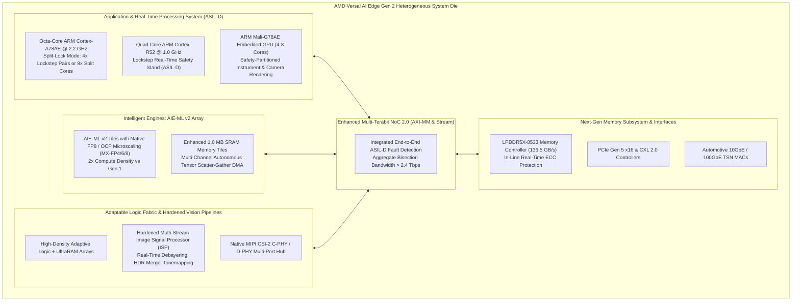
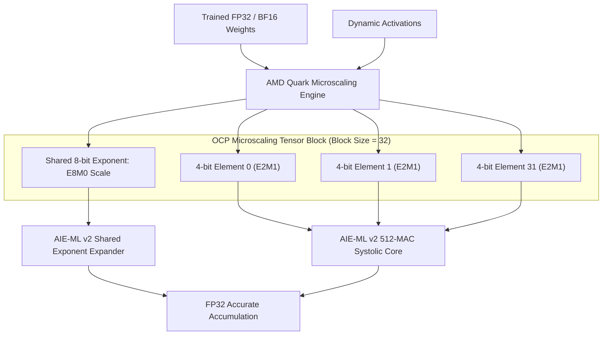
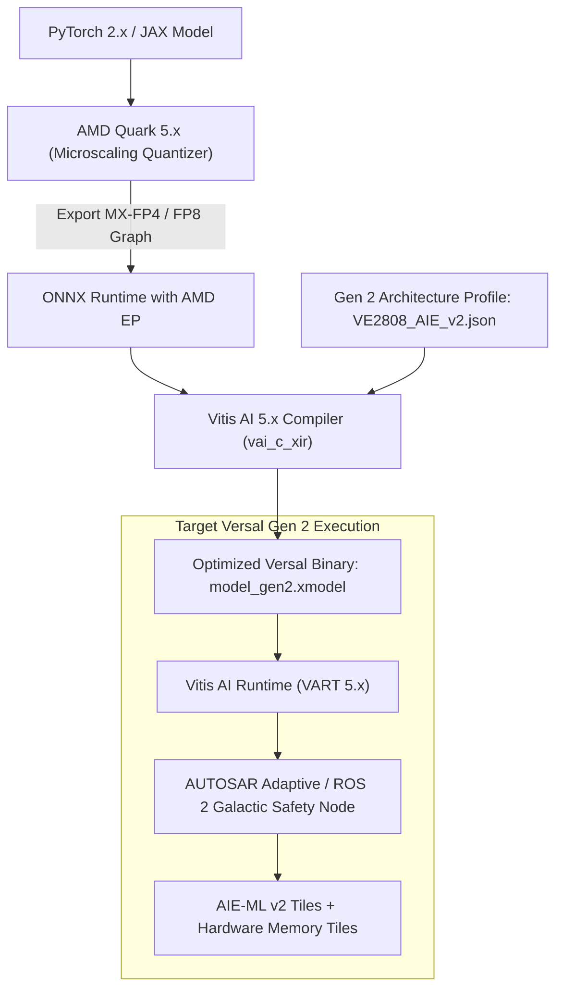
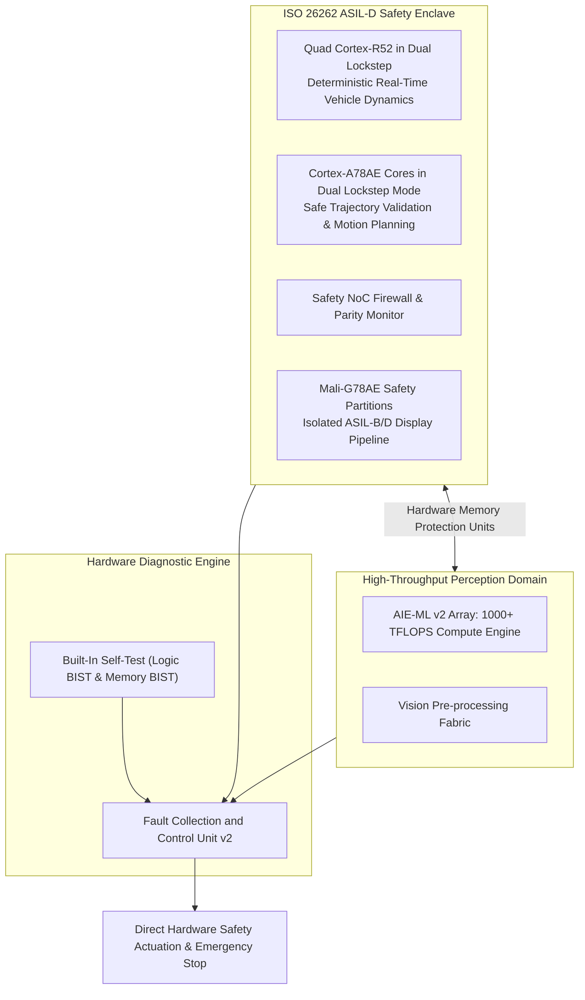

# 🚀 AMD Versal AI Edge Gen 2: Architecture, AIE-ML v2, Microscaling & ASIL-D Compute

## 1. Executive Summary & Hardware Typology

The **AMD Versal AI Edge Gen 2** family represents AMD's next-generation adaptive SoC silicon architecture engineered specifically for Level 2+ to Level 4 autonomous driving, humanoid robotics, medical imaging, and high-integrity aerospace systems. Fabricated on advanced TSMC 4nm/5nm process nodes, Versal Gen 2 introduces a dramatic architectural shift from Gen 1 by uniting three primary execution phases—**Sensor Ingestion & Preprocessing** (Programmable Logic), **AI Inference Acceleration** (**AIE-ML v2**), and **System Control & Safety-Critical Visualization** (Octa-Core Cortex-A78AE, Cortex-R52, and Mali-G78AE GPU)—onto a single, functional-safety certified monolithic device.



### Hardware Typology Matrix: Key Part Numbers

| Part Number | AIE-ML v2 Tiles | MEM Tiles (Total SRAM) | Application CPU | Safety CPU | GPU | Peak INT8 / MX-FP4 | Typical TDP | Primary Target |
| :--- | :--- | :--- | :--- | :--- | :--- | :--- | :--- | :--- |
| **VE2308** | 64 | 16 (16 MB) | 4x Cortex-A78AE | 2x Cortex-R52 | Mali-G78AE (4c) | 90 TOPS / 180 TFLOPS | 20W - 35W | Forward ADAS Cameras, Industrial Cobots |
| **VE2808** | 256 | 48 (48 MB) | 8x Cortex-A78AE | 4x Cortex-R52 | Mali-G78AE (6c) | 380 TOPS / 760 TFLOPS | 45W - 75W | Central ADAS Domain Controllers, Surgical Robotics |
| **VE2908** | 384 | 64 (64 MB) | 8x Cortex-A78AE | 4x Cortex-R52 | Mali-G78AE (8c) | 540 TOPS / 1080 TFLOPS | 70W - 95W | L3/L4 Autonomous Driving, Physical AI Foundations |

---

## 2. Compute Core & Memory Hierarchy

Versal AI Edge Gen 2 expands the memory and interconnect hierarchy to completely eliminate external memory bottlenecks for multi-camera Vision Transformers (ViT), BEV perception networks, and 3D Gaussian Splatting models.

```mermaid
flowchart LR
    subgraph Off_Chip ["Off-Chip High-Speed Storage"]
        LPDDR5X_CH["LPDDR5X-8533 Channels<br/>136.5 GB/s Aggregate Bandwidth"]
    end

    subgraph NoC_Backbone ["Enhanced Programmable NoC 2.0"]
        NOC_ROUTERS["ASIL-D Certified Multi-Virtual Channel Mesh<br/>2.4 Tbps Bisection Throughput"]
    end

    subgraph Mid_Tier_SRAM ["Mid-Tier On-Chip SRAM (MEM Tiles v2)"]
        MEM_TILES["1.0 MB SRAM per Memory Tile<br/>8x 128 KB Sub-Banks<br/>Hardware Multi-Dimensional Address Generators"]
    end

    subgraph Tile_Local_Memory ["AIE-ML v2 Compute Tile Local Tier"]
        LOCAL_SRAM["64 KB Local Data Memory<br/>32 KB Program Memory<br/>Multi-Bank Conflict-Free Crossbar"]
    end

    subgraph Tile_Registers ["Execution Unit Registers"]
        VEC_REG["32 x 512-bit Vector Register File<br/>Microscaling Scale Factor Registers"]
    end

    Off_Chip <-->|136.5 GB/s| NoC_Backbone
    NoC_Backbone <-->|High-Bandwidth DMA Streams| Mid_Tier_SRAM
    Mid_Tier_SRAM <-->|Direct AIE Stream Interconnect| Tile_Local_Memory
    Tile_Local_Memory <-->|4x 512b Read/Write per cycle| Tile_Registers
```



### Silicon Subsystems Detailed Breakdown

1. **Processing System (PS) Complex**:
   - **ARM Cortex-A78AE (Automotive Enhanced)**: Octa-core 64-bit cluster clocked up to 2.2 GHz. Supports dynamic **Split-Lock** capability: either 8 independent high-throughput performance cores for Linux/ROS 2 stack execution, or 4 locked dual-core pairs providing hardware fault detection for ISO 26262 ASIL-D applications.
   - **ARM Cortex-R52 Real-Time Safety Cores**: Quad-core real-time processors operating at 1.0 GHz in dual lockstep configuration. Features dedicated Tightly Coupled Memories (TCM) and a hardware Memory Protection Unit (MPU), executing hard real-time vehicle dynamics, brake actuation, and steer-by-wire protocols.
   - **ARM Mali-G78AE Embedded GPU**: Configurable with up to 8 execution cores supporting Vulkan SC 1.3, OpenGL SC 2.0, and hardware virtualization. Features hardware safety mechanisms including parity/ECC on graphics caches and partition-based execution to isolate critical instrument cluster rendering from non-safety infotainment.

2. **Memory Hierarchy & Bandwidth**:
   - **LPDDR5X-8533**: Dual/quad 64-bit memory channels yielding up to **136.5 GB/s** of raw DRAM bandwidth with in-line sub-microsecond hardware ECC.
   - **MEM Tiles v2**: Upgraded from 512 KB (Gen 1) to **1.0 MB per tile**. On the VE2908, 64 MEM Tiles provide **64 MB of dedicated on-chip intermediate SRAM**, enabling entire ViT attention maps, KV caches, and feature pyramids to reside on-chip without DRAM round-trips.
   - **UltraRAM & Block RAM**: Programmable logic incorporates up to 35 MB of UltraRAM operating at 800 MHz, providing over 15 TB/s of aggregate on-chip logic scratchpad bandwidth.

---

## 3. Micro-Architectural Mechanics & Data Paths

### AIE-ML v2 Compute Tile Architecture

The **AIE-ML v2** tile doubles the compute density compared to Gen 1 by introducing a wider, reconfigurable Matrix Multiply Accumulate (MMA) pipeline capable of native sub-byte and microscaling arithmetic.

```mermaid
flowchart TD
    subgraph AIE_ML_v2_Tile ["AIE-ML v2 Compute Tile Micro-Architecture"]
        VLIW_ENG["32 KB Instruction Memory & 8-Way VLIW Dispatch Engine"]
        
        subgraph Register_Complex ["Vector & Scale Register Files"]
            VREG_v2["32x 512-bit Vector Registers (V0-V31)"]
            SCALE_REG["16x 64-bit Microscaling Exponent Buffers"]
        end
        
        subgraph MMA_v2_Pipeline ["AIE-ML v2 Matrix Multiply Accelerators"]
            MXFP4_MMA["Native OCP MX-FP4 / MX-FP6 Systolic Array<br/>512 MACs / cycle per tile"]
            FP8_MMA["Native FP8 (E4M3 / E5M2) Systolic Unit<br/>256 MACs / cycle per tile"]
            INT8_MMA["Native INT8 Systolic Unit<br/>256 MACs / cycle per tile"]
            BF16_MMA["BFloat16 / FP16 Vector Unit<br/>64 MACs / cycle per tile"]
        end
        
        subgraph Post_Processing ["Non-Linearity & De-Quantization Unit"]
            DEQUANT["Microscaling Scale Expander & Hardware Accumulator"]
            ACT_V2["GELU / SILU / LayerNorm Vector Unit"]
        end
        
        VLIW_ENG --> Register_Complex
        Register_Complex --> MMA_v2_Pipeline
        MMA_v2_Pipeline --> Post_Processing
        
        DIRECT_STREAM_IN["Direct 512-bit Inter-Tile Stream In"] --> MMA_v2_Pipeline
        Post_Processing --> DIRECT_STREAM_OUT["Direct 512-bit Inter-Tile Stream Out"]
    end
```



### Micro-Architectural Enhancements

1. **Native OCP Microscaling Support**:
   - Hardware-level decoding for **MX-FP4, MX-FP6, and MX-FP8** standard formats.
   - Microscaling groups vectors of 32 sub-byte floating-point mantissas sharing a single 8-bit shared power-of-two exponent (scale factor). AIE-ML v2 loads scale factors into dedicated `SCALE_REG` banks and applies them during accumulation, preserving full dynamic range while halving memory footprint and power consumption compared to standard INT8.
2. **Double-Width Systolic Cascades**:
   - The cascade accumulator bus width is widened from 384 bits to **512 bits**, allowing direct passing of intermediate FP32 and INT32 accumulation states across horizontal and vertical tile neighbors without spilling into local memory.
3. **Hardened Preprocessing Vision Pipeline**:
   - Versal Gen 2 integrates hardened image signal processing (ISP) blocks capable of processing multiple 8-Megapixel GMSL2/GMSL3 automotive camera streams simultaneously at 60 FPS (debayering, auto-exposure, chromatic aberration correction, and histogram equalization) directly before streaming frames into AIE-ML v2 Memory Tiles.

---

## 4. Numerical Precision & Quantization

Versal AI Edge Gen 2 sets a new benchmark for low-precision inference with native support for the Open Compute Project (OCP) Microscaling specification.



### Precision & Performance Profile (VE2908 @ 1.35 GHz AIE Clock)

| Precision Format | Bit Width (Effective) | Block Size | Hardware Acceleration | Peak TOPS / TFLOPS (VE2908) | Typical Accuracy Retention vs FP32 |
| :--- | :--- | :--- | :--- | :--- | :--- |
| **OCP MX-FP4** | 4.25 bits (with scale) | 32 elements | Dedicated MX-MMA Core | **1,080 TFLOPS** | 99.1% on ViT / 98.8% on Llama-3 |
| **OCP MX-FP6** | 6.25 bits (with scale) | 32 elements | Dedicated MX-MMA Core | **720 TFLOPS** | 99.8% on BEVFusion / Multi-Camera |
| **FP8 (E4M3)** | 8 bits | 1 element | Native FP8 Tensor Core | **540 TFLOPS** | 99.9% on standard CNN/Transformers |
| **FP8 (E5M2)** | 8 bits | 1 element | Native FP8 Tensor Core | **540 TFLOPS** | 99.9% on Gradient-sensitive heads |
| **INT8** | 8 bits | 1 element | Native INT8 Systolic Unit | **540 TOPS** | 99.5% on classical vision networks |
| **BFloat16 / FP16**| 16 bits | 1 element | Native Vector SIMD Unit | **135 TFLOPS** | 100.0% Baseline Reference |
| **FP32** | 32 bits | 1 element | Vector ALU Array | **34 TFLOPS** | 100.0% Single Precision |

---

## 5. Software Stack, SDKs & Driver Interface

The Versal Gen 2 development ecosystem centers on **Vitis AI 5.x**, the **AMD Quark Quantization Engine**, and the **Xilinx Runtime (XRT)**, integrated with safety-certified OS targets (QNX Neutrino RTOS, BlackBerry Safety OS, and certified Linux).



### Compiler Toolchain Commands & Code Examples

1. **Quantization with AMD Quark using Microscaling (MX-FP4)**:
```python
import torch
import quark.torch as quark

# Load pre-trained Vision Transformer model
model = torch.hub.load("facebookresearch/dinov2", "dinov2_vitb14")
model.eval()

# Configure OCP Microscaling (MX-FP4 E2M1 with block size 32)
quant_config = quark.QuantizationConfig(
    quant_format=quark.QuantFormat.OCP_MICROSCALING,
    weight_dtype=quark.Dtype.MX_FP4,
    act_dtype=quark.Dtype.MX_FP4,
    block_size=32,
    calibration_method="minmax"
)

# Apply post-training quantization with calibration dataloader
quantized_model = quark.quantize(model, quant_config, dataloader=calib_loader)
quark.export_onnx(quantized_model, "dinov2_mx_fp4.onnx")
```

2. **Compiling for Versal AI Edge Gen 2 Target**:
```bash
# Compile ONNX model to native AIE-ML v2 binary instructions
vai_c_xir --onnx dinov2_mx_fp4.onnx \
          --arch /opt/vitis_ai/compiler/arch/AIE_ML_v2/VE2808/arch.json \
          --output_dir ./compiled_gen2/ \
          --net_name dinov2_versal_gen2 \
          --opt_level 3 \
          --enable_memory_tile_buffering
```

3. **Runtime Hardware Diagnostics with `xbutil`**:
```bash
# Detailed telemetry query for AIE-ML v2 array and memory tiles
xbutil examine --report memory,aie,safety,thermal --device 0000:01:00.0

# Live monitoring of NoC bandwidth and AIE-ML v2 compute efficiency
xbutil top --interval 1000
```

---

## 6. Functional Safety, Real-Time Latency & Thermal Profiles

### System-Wide ISO 26262 ASIL-D Safety Architecture

Versal AI Edge Gen 2 is architected from the transistor level to meet **ISO 26262 ASIL-D** without requiring external safety supervisor MCUs.



### Real-Time Latency & Thermal Power Characteristics

| Workload / Model | Platform Configuration | TDP Envelope | Batch Size | End-to-End Latency | Frame Rate (FPS) |
| :--- | :--- | :--- | :--- | :--- | :--- |
| **BEVFusion (6 Cameras + LiDAR)** | VE2808 (Nominal Mode) | **55.0 W** | 1 | 9.8 ms | 102 FPS |
| **DINOv2-Base (518x518)** | VE2808 (Max Compute) | **68.0 W** | 1 | 4.2 ms | 238 FPS |
| **YOLOv10x (640x640)** | VE2308 (Edge Low-Power) | **22.5 W** | 1 | 3.1 ms | 322 FPS |
| **Llama-3-8B (Token Gen)** | VE2908 (OCP MX-FP4) | **85.0 W** | 1 | 18.2 ms/tok | 55 tok/sec |

---

## 7. Comparative Platform Matrix

| Architectural Dimension | AMD Versal AI Edge Gen 2 (VE2808) | NVIDIA DRIVE Thor (1000 TOPS) | AMD Versal AI Edge Gen 1 (VE2802) |
| :--- | :--- | :--- | :--- |
| **Process Technology** | TSMC 4nm / 5nm | TSMC 4N Customized | TSMC 7nm FinFET |
| **AI Inference Core** | 256x AIE-ML v2 (Native MX-FP4/FP8) | Blackwell GPU + 5th Gen Tensor Cores | 304x AIE-ML v1 (INT8 / BF16) |
| **Peak AI Compute** | 380 INT8 TOPS / 760 MX-FP4 TFLOPS | 1000 FP4 TFLOPS / 500 FP8 TFLOPS | 315 INT8 TOPS |
| **Application Processor** | 8x ARM Cortex-A78AE (Split-Lock) | 16x/32x ARM Neoverse V3AE | 2x ARM Cortex-A72 |
| **Safety Real-Time Cores**| 4x ARM Cortex-R52 Lockstep @ 1.0 GHz | Hardened ASIL-D Safety Island (R52) | 2x ARM Cortex-R5F Lockstep @ 600 MHz|
| **Graphics Subsystem** | ARM Mali-G78AE (6-Core Safety GPU) | Integrated Blackwell GPU Partition | None (External or PL-soft GPU) |
| **Embedded Intermediate SRAM**| 48 MB Memory Tiles v2 + 35 MB URAM | Massive L2/Register (No dedicated MEM Tile) | 19 MB Memory Tiles v1 + 28 MB URAM |
| **DRAM Memory Bandwidth**| 136.5 GB/s (LPDDR5X-8533) | 500+ GB/s (LPDDR5X / LPDDR5T) | 68.2 GB/s (LPDDR4X-4266) |
| **Native Microscaling** | Full OCP Microscaling (MX-FP4/6/8) | NVIDIA NVFP4 Microscaling | None (Integer & Fixed Point) |
| **Functional Safety Level**| Full System ASIL-D Certified | Full System ASIL-D Certified | Component ASIL-B / SIL-2 |
| **Typical Operating Power**| 45W - 75W | 120W - 200W | 45W - 75W |

---

## 8. Cross-References & Related Frameworks

- [[hardware/amd-versal-ai-edge-gen1|AMD Versal AI Edge Gen 1 Reference Architecture]]
- [[hardware/nvidia-drive-thor|NVIDIA DRIVE Thor & Jetson Thor Architecture]]
- [[docs/hardware-runtimes/04-vitis-ai-versal-npu-runtime|AMD Vitis AI & Versal NPU Runtime Architecture]]
- [[architectures/hardware-and-acceleration-runtimes/tensorrt-runtime|TensorRT & Vulkan SC Safety Runtimes]]
- [[topics/safety-verification-and-robustness/00-safety-verification-and-robustness-moc|Safety Verification & Robustness]]
