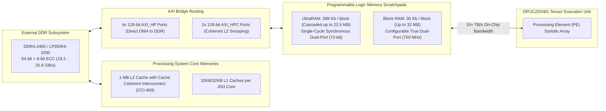
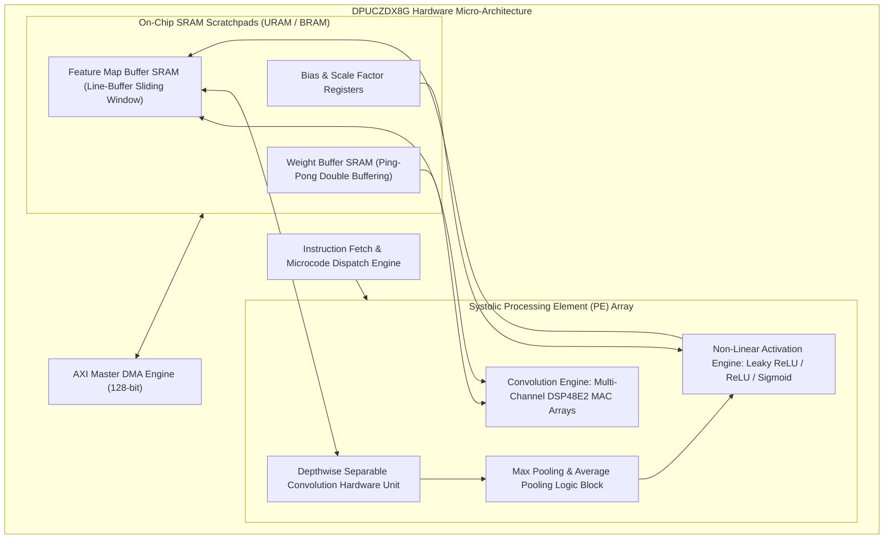
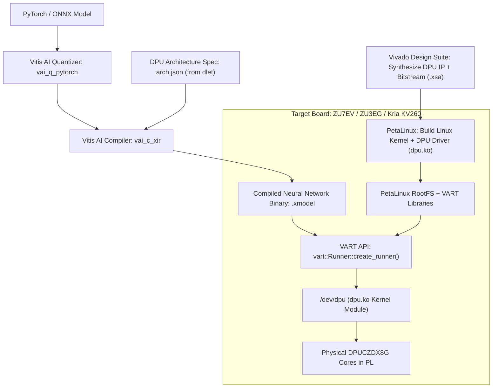
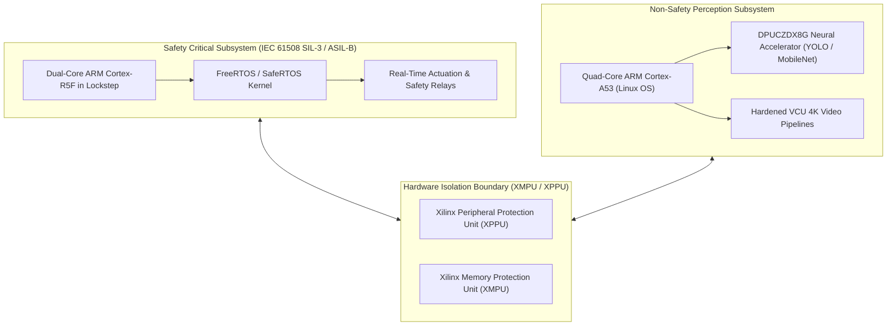

# 🛡️ AMD Zynq UltraScale+ MPSoC: Architecture, DPUCZDX8G & Embedded Vision

## 1. Executive Summary & Hardware Typology

The **AMD Zynq UltraScale+ MPSoC** (Multi-Processor System-on-Chip) is an industry-standard heterogeneous edge platform deployed in millions of smart cameras, industrial drones, surgical robots, and avionics systems. Fabricated on TSMC's 16nm FinFET process, Zynq UltraScale+ unites a multi-core 64-bit ARM Processing System (PS) with high-density 16nm UltraScale+ Programmable Logic (PL).

On the EV series (such as the ZU7EV and ZU5EV), the silicon integrates a hardened **Video Codec Unit (VCU)** capable of simultaneous multi-channel 4K60 H.264/H.265 video compression. When paired with the **DPUCZDX8G** (Deep Learning Processor Unit) soft IP core synthesized into the PL fabric, the platform provides deterministic, sub-10ms neural network inference without requiring host GPU acceleration.

```mermaid
flowchart TD
    subgraph Zynq_MPSoC_Die ["AMD Zynq UltraScale+ MPSoC Architecture"]
        subgraph Processing_System ["Processing System (PS)"]
            APU["Application Processing Unit (APU)<br/>Quad-Core ARM Cortex-A53 @ 1.5 GHz<br/>32KB/32KB L1, 1MB Shared L2 with ECC"]
            RPU["Real-Time Processing Unit (RPU)<br/>Dual-Core ARM Cortex-R5F @ 600 MHz<br/>Split / Lockstep Safety Controller"]
            GPU["ARM Mali-400 MP2 GPU @ 667 MHz<br/>OpenGL ES 2.0 2D/3D Rendering Engine"]
            VCU_BLOCK["Hardened Video Codec Unit (VCU - EV Parts)<br/>Simultaneous 4K60 H.264 / H.265 Encode & Decode"]
            PS_DDR["DDR4 / LPDDR4 Memory Controller<br/>32/64-bit with Real-Time In-Line ECC"]
        end

        subgraph Interconnect_Buses ["High-Performance PS-PL AXI Interconnect"]
            HPC["AXI_HPC: High Performance Coherent (CCI-400 Cache SNOOP)"]
            HP["AXI_HP: High Performance Non-Coherent (Direct to DRAM)"]
            HPM["AXI_HPM: Master Control Interface (Configuration & CSRs)"]
            ACP["AXI_ACP: Accelerator Coherency Port (L2 Cache Shared)"]
        end

        subgraph Programmable_Logic ["Programmable Logic (PL Fabric)"]
            DPU_CORE["DPUCZDX8G Neural Processing Unit<br/>Configurable B512 to B4096 Systolic Arrays"]
            DSP48["DSP48E2 Slices: 27x18 Multiplier, 48-bit Accumulator"]
            URAM_BLOCK["UltraRAM (URAM): 288 Kb High-Density Memory Blocks"]
            BRAM_BLOCK["Block RAM (BRAM): 36 Kb Dual-Port Scratchpads"]
            VISION_IP["Custom PL Preprocessing: Color Correction, Resizers, Warping"]
        end
    end

    Processing_System <--> Interconnect_Buses
    Interconnect_Buses <--> Programmable_Logic
```



### Hardware Typology Matrix: Key Part Numbers

| Part Number | ARM Cores (APU / RPU) | Logic Cells | DSP48E2 Slices | UltraRAM (MB) | Block RAM (MB) | Hardened VCU (H.264/H.265) | Typical DPU Throughput | TDP Envelope |
| :--- | :--- | :--- | :--- | :--- | :--- | :--- | :--- | :--- |
| **ZU3EG** | 4x A53 / 2x R5F | 154K | 360 | 0.0 MB | 7.6 MB | No | 1.2 TOPS (1x B1152) | 5W - 10W |
| **ZU5EV** | 4x A53 / 2x R5F | 256K | 1,248 | 4.5 MB | 5.2 MB | **Yes (4K60)** | 4.1 TOPS (1x B4096) | 12W - 18W |
| **ZU7EV** | 4x A53 / 2x R5F | 504K | 1,728 | 13.5 MB | 11.0 MB | **Yes (4K60)** | 8.2 TOPS (2x B4096) | 18W - 28W |
| **ZU9EG** | 4x A53 / 2x R5F | 599K | 2,520 | 0.0 MB | 32.1 MB | No | 10.5 TOPS (3x B3136) | 20W - 35W |
| **ZU11EG** | 4x A53 / 2x R5F | 653K | 2,928 | 22.5 MB | 21.1 MB | No | 12.0 TOPS (3x B4096) | 25W - 45W |

---

## 2. Compute Core & Memory Hierarchy

The Zynq UltraScale+ memory hierarchy bridges scalar software execution on the ARM cores with hardware-accelerated streaming pipelines instantiated in the FPGA fabric.



### Die Layout and Memory Specifications

1. **Processing System (PS) Architecture**:
   - **Application Processing Unit (APU)**: Quad-core ARM Cortex-A53 running up to 1.5 GHz. Includes 32 KB instruction and 32 KB data L1 caches per core and a shared 1 MB L2 cache with ECC protection.
   - **Real-Time Processing Unit (RPU)**: Dual-core ARM Cortex-R5F running up to 600 MHz. Features 32 KB I-TCM and 32 KB D-TCM per core, configurable in dual-lockstep mode for IEC 61508 SIL-3 and ISO 26262 ASIL-B safety applications.
   - **Cache Coherency Interconnect (CCI-400)**: Manages full hardware cache coherency between the APU's L2 cache and hardware accelerators connected via the AXI_HPC and AXI_ACP interfaces.

2. **Programmable Logic (PL) High-Density Memories**:
   - **UltraRAM (URAM)**: Available on ZU4, ZU5, ZU7, and ZU11 parts. Each block holds 288 Kbits (4096 words $\times$ 72 bits) with built-in byte-write enable and pipeline registers. UltraRAM blocks can be cascaded vertically to form deep feature map buffers with zero routing congestion.
   - **Block RAM (BRAM)**: 36 Kbit dual-port synchronous memory blocks running at up to 750 MHz, utilized for weight caching and layer activation double-buffering.

3. **Hardened Video Codec Unit (VCU)** (EV Series):
   - Multi-standard hardware video engine supporting simultaneous encoding and decoding of up to 4K @ 60 FPS (or 8 streams of 1080p @ 60 FPS) in HEVC/H.265 (Main, Main-10) and AVC/H.264 (High, Main) formats.
   - Direct memory access path to DDR4 via dedicated AXI ports, bypassing the ARM CPU cores entirely.

---

## 3. Micro-Architectural Mechanics & Data Paths

### DPUCZDX8G Soft IP Architecture

The **DPUCZDX8G** is AMD/Xilinx's dedicated deep learning processor soft IP core synthesized directly into the Zynq UltraScale+ FPGA fabric. It is parameterizable across various compute configurations (designated B512, B800, B1024, B1152, B1600, B2304, B3136, and B4096, representing peak operations per clock cycle).



### Processing Element (PE) Mechanics & DSP48E2 Mapping

- **DSP48E2 Utilization**:
  - Each DSP48E2 slice features a $27 \times 18$ bit two's complement multiplier followed by a 48-bit accumulator. In DPU configurations, two INT8 multiplications are packed into a single DSP48E2 slice using SIMD arithmetic modes, doubling arithmetic density.
- **Data Flow Parallelism**:
  - The DPU parallelizes computation across three dimensions:
    1. **Pixel Parallelism ($P_p$)**: Number of output feature map pixels computed simultaneously.
    2. **Input Channel Parallelism ($I_c$)**: Number of input feature channels processed in parallel.
    3. **Output Channel Parallelism ($O_c$)**: Number of output filter channels evaluated concurrently.
  - For a **B4096** core running at 333 MHz:
    $$\text{Peak Compute} = 4096 \times 333\,\text{MHz} = 2.73\,\text{TOPS (per core)}$$
  - Multiple DPU cores (up to 3 cores on ZU7EV or 4 cores on ZU11EG) can operate in parallel to achieve over 8 to 11 INT8 TOPS.

---

## 4. Numerical Precision & Quantization

The DPUCZDX8G IP operates on a hardware-native **INT8 symmetrical fixed-point quantization** scheme with per-layer power-of-two fractional scaling (designated `Fix_Point` in Vitis AI).

```mermaid
flowchart LR
    FloatModel["PyTorch / ONNX Float32 Model"] --> Quantizer["vai_q_pytorch / vai_q_onnx"]
    Quantizer --> Calib["Calibration via Representative Dataset (500-1000 images)"]
    Calib --> ScaleFactors["Compute Layer Scaling Factors: 2^(-pos)"]
    ScaleFactors --> DPU_Model["Compiled DPU Fixed-Point xmodel"]
    
    subgraph DPU_Math ["Hardware DPU Arithmetic"]
        DPU_Model --> INT8_MULT["DSP48E2 INT8 Multiplier"]
        INT8_MULT --> INT32_ACC["32-bit Accumulator"]
        INT32_ACC --> HW_SHIFT["Hardware Bit-Shift & Saturation Unit"]
        HW_SHIFT --> INT8_ACT["INT8 Activation Output"]
    end
```



### Supported Numerical Formats

| Format | Representation | Bit Allocation | Target Layer Types | Hardware Implementation |
| :--- | :--- | :--- | :--- | :--- |
| **INT8 (Fix8)** | Signed Fixed-Point | 1 sign, 7 mantissa + power-of-2 pos | Conv2D, Dense, DepthwiseConv, ResNet Add | Hardened DSP48E2 Slices |
| **INT16 (Fix16)** | Signed Fixed-Point | 1 sign, 15 mantissa + power-of-2 pos | Regression Heads, 3D Pose, Depth Maps | Multi-cycle DSP48E2 chaining |
| **INT4 (Experimental)** | Packed Integer | 1 sign, 3 mantissa | Supported via FINN custom HLS bitstreams | CLB LUT Logic Arrays |

---

## 5. Software Stack, SDKs & Driver Interface

The Zynq UltraScale+ software stack spans the **Vivado Design Suite** (for hardware bitstream synthesis), **PetaLinux/Yocto** (for BSP and Linux kernel generation), and **Vitis AI** (for neural graph compilation and runtime execution).



### Toolchain Commands & Operational CLI

1. **Extract Architecture Configuration from Vivado Hardware Export**:
```bash
# Extract the exact DPU configuration arch.json from the hardware handoff file
dlet -f system.xsa
# Generates arch.json containing target DPU type, finger-print, and PE count
```

2. **Compiling Quantized Graph for Zynq DPU**:
```bash
# Compile quantized xmodel targeting ZU7EV dual-core B4096 DPU
vai_c_xir --xmodel ./quantized_model.xmodel \
          --arch ./arch.json \
          --output_dir ./compiled_output/ \
          --net_name yolov5s_zu7ev
```

3. **DPU Query and Health Check on Target Board via `xdputil`**:
```bash
# Query active DPU hardware configuration, frequency, and core topology
xdputil query

# Output excerpt:
# {
#   "DPU IP Version": "v4.1.0",
#   "Target": "DPUCZDX8G_ISA0_B4096_MAX_BG2",
#   "Core Count": 2,
#   "DPU Frequency": "333 MHz",
#   "Memory Type": "UltraRAM + BRAM"
# }

# Measure raw hardware performance and latency on target
xdputil benchmark compiled_output/yolov5s_zu7ev.xmodel 100
```

4. **Zero-Copy Pipeline Integration with GStreamer & VCU**:
```bash
# Hardware-accelerated pipeline: Capture 4K MIPI -> VCU H.264 Decode -> DPU Inference
gst-launch-1.0 v4l2src device=/dev/video0 ! \
    video/x-raw, width=3840, height=2160, format=NV12 ! \
    vvas_xfilter kernels-config=kernel_crop_resize.json ! \
    vvas_xinfer model-path=yolov5s_zu7ev.xmodel ! \
    vvas_xoverlay ! \
    kmssink bus-id="fd4a0000.display" sync=false
```

---

## 6. Functional Safety, Real-Time Latency & Thermal Profiles

### Safety & Isolation Domains
- **Cortex-R5F Lockstep Safety Processing**: The RPU can be configured in dual-core lockstep with built-in logic comparison units, achieving **IEC 61508 SIL-3 and ISO 26262 ASIL-B/C** compliance.
- **Hardware Isolation (XMPU / XPPU)**: Xilinx Memory Protection Units (XMPU) and Xilinx Peripheral Protection Units (XPPU) enforce hardware isolation between non-secure Linux user space running on the Cortex-A53 cores and safety-critical RTOS tasks running on the Cortex-R5F cores.
- **PL Soft Error Mitigation (SEM)**: Hardened PL controller continuously checks configuration memory integrity using cyclic redundancy checks (CRC) and ECC.



### Latency & Thermal Envelopes

| Platform Target | DPU Core Config | Clock Frequency | Power Envelope | Model: ResNet-50 (224x224) Latency | Model: YOLOv5s (640x640) Latency |
| :--- | :--- | :--- | :--- | :--- | :--- |
| **ZU3EG / Kria KV260** | 1x B1152 | 300 MHz | **7.5 W** | 11.2 ms (89 FPS) | 28.5 ms (35 FPS) |
| **ZU5EV** | 1x B4096 | 333 MHz | **14.0 W** | 4.1 ms (244 FPS) | 12.8 ms (78 FPS) |
| **ZU7EV** | 2x B4096 | 333 MHz | **22.0 W** | 2.1 ms (476 FPS) | 6.4 ms (156 FPS) |
| **ZU11EG** | 3x B4096 | 350 MHz | **32.0 W** | 1.4 ms (714 FPS) | 4.3 ms (232 FPS) |

---

## 7. Comparative Platform Matrix

| Architectural Feature | AMD Zynq UltraScale+ (ZU7EV) | NVIDIA Jetson Xavier NX | AMD Versal AI Edge (VE2302) |
| :--- | :--- | :--- | :--- |
| **Silicon Technology** | 16nm TSMC MPSoC | 12nm TSMC GPU-SoC | 7nm TSMC ACAP |
| **Compute Engines** | Quad A53 + Dual R5F + DPU Soft IP | 6-core Carmel ARM + Volta GPU + 2x NVDLA | Dual A72 + Dual R5F + 34x AIE-ML v1 |
| **Peak INT8 Throughput** | 8.2 TOPS (2x B4096 DPU) | 21 INT8 TOPS (GPU + NVDLA) | 45 INT8 TOPS |
| **Video Processing** | Hardened 4K60 H.264/H.265 VCU | Hardened NVDEC / NVENC 4K60 | PL-based Video Codec / External |
| **On-Chip High-Speed RAM** | 13.5 MB UltraRAM + 11 MB BRAM | 512 KB L2 + 6.0 MB L3 Cache | 4.0 MB Memory Tiles + 7.0 MB URAM |
| **I/O Determinism** | Nanosecond-level FPGA Pin-to-Pin | PCIe / OS Driver Stack Dependent | Nanosecond-level FPGA Pin-to-Pin |
| **Safety Certification** | IEC 61508 SIL-3 / ISO 26262 ASIL-B | ISO 26262 ASIL-B System Capability | ISO 26262 ASIL-B / SIL-2 |
| **Typical Operating Power** | 15W - 25W | 10W - 20W | 15W - 25W |
| **Primary Strength** | Custom sensor interfacing + 4K VCU | Mature CUDA/TensorRT software | High AI density with AIE-ML tiles |
| **Primary Limitation** | Lower TOPS/Watt for dense Transformers | Lack of adaptable logic for custom I/O | Complex multi-domain compilation |

---

## 8. Cross-References & Related Frameworks

- [[hardware/amd-versal-ai-edge-gen1|AMD Versal AI Edge Gen 1 Reference Architecture]]
- [[architectures/hardware-and-acceleration-runtimes/vitis-ai-dpu|Vitis AI & FINN FPGA Compiler Toolchains]]
- [[docs/hardware-runtimes/04-vitis-ai-versal-npu-runtime|AMD Vitis AI & Versal NPU Runtime Architecture]]
- [[topics/fpga-deployment/00-fpga-deployment-moc|FPGA Deployment & Hardware Synthesis]]
- [[topics/real-time-systems/00-real-time-systems-moc|Real-Time Systems & Hardware Determinism]]
