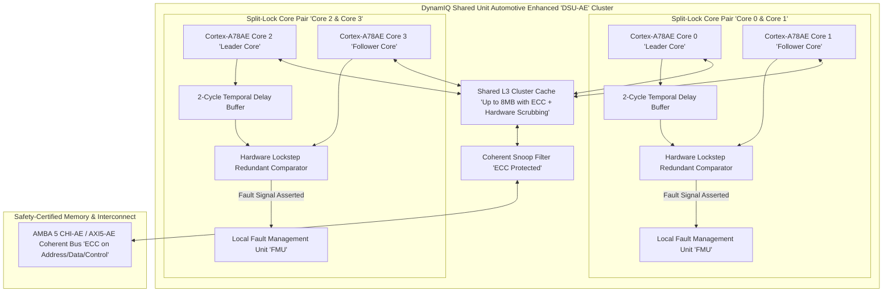
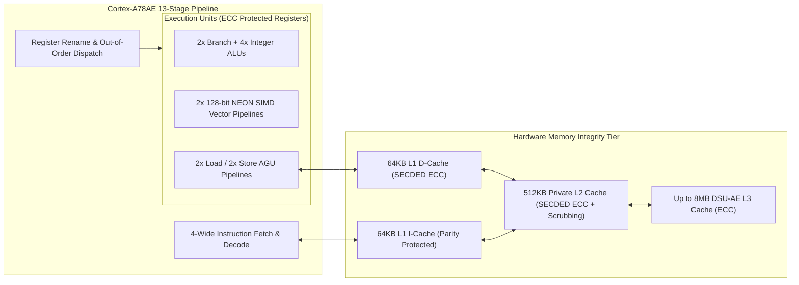
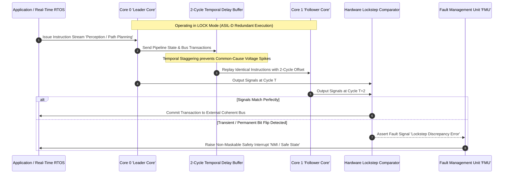
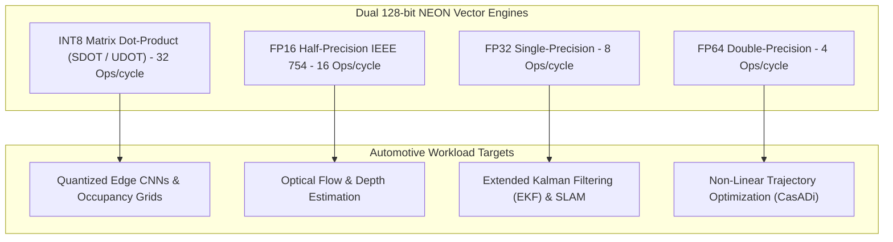
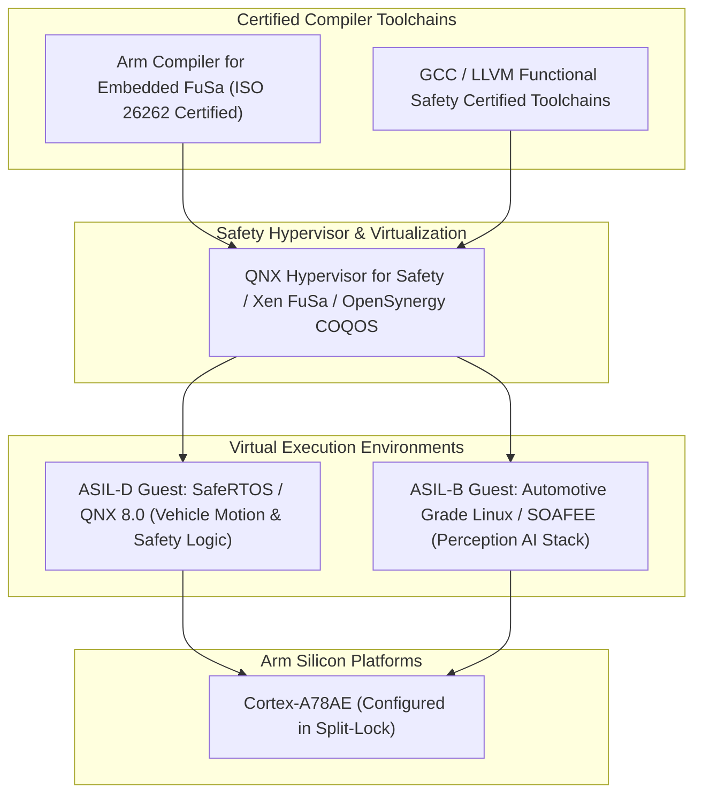

# 🛡️ Arm Cortex-A78AE: Split-Lock Architecture, Hybrid Clusters & ISO 26262 ASIL-D Microarchitecture

## 1. Executive Summary & Hardware Typology

The **Arm Cortex-A78AE** (Automotive Enhanced) is a high-performance, 64-bit application processor built upon the Armv8.2-A architecture, designed specifically to meet the dual demands of multi-gigahertz compute throughput and mathematically verifiable functional safety in autonomous vehicles, avionics, industrial robotics, and medical robotics.

The architectural centerpiece of the Cortex-A78AE is Arm's patented **Split-Lock technology**. Split-Lock enables dynamic silicon reconfiguration between two distinct operating modes:
1. **Split Mode (ASIL-B / QM)**: Cores operate independently to maximize multi-threaded computational throughput for vision perception, sensor fusion, and digital cockpit graphics.
2. **Lock Mode (ISO 26262 ASIL-D / IEC 61508 SIL 3)**: Core pairs operate in cycle-synchronized, temporally staggered dual-core lockstep (DCLS) to guarantee deterministic fault detection and fail-operational vehicle control.



### Cortex-A78AE Key Specifications Matrix

| Parameter / Dimension | Specification Detail |
| :--- | :--- |
| **Architecture Profile** | Armv8.2-A (64-bit AArch64 / AArch32) with Safety Extensions |
| **Execution Pipeline** | 13-stage out-of-order superscalar execution pipeline (4-wide decode / 6-wide dispatch) |
| **Safety Integrity Level** | **ISO 26262 ASIL-D (Lock Mode)** / **ASIL-B (Split Mode)** / IEC 61508 SIL 3 |
| **Branch Predictor** | Dual-branch target predictor with zero-cycle branch bubble suppression |
| **Vector SIMD Engine** | Dual 128-bit NEON Advanced SIMD units with INT8 dot-product instructions (`SDOT`/`UDOT`) |
| **L1 Cache Hierarchy** | 64KB Instruction (Parity/ECC) + 64KB Data (SECDED ECC) per core |
| **L2 Cache Hierarchy** | 256KB to 512KB private L2 cache per core (SECDED ECC with scrubbing) |
| **L3 Cache Hierarchy (DSU-AE)**| 1MB to 8MB shared cluster cache with inline SECDED ECC |
| **Target Clock Frequency** | 1.8 GHz – 2.8 GHz on advanced FinFET nodes (7nm / 5nm / 4nm) |
| **Power Dissipation** | 1.5 W – 3.5 W per core under full vector/integer load |

---

## 2. Compute Core & Memory Hierarchy

The Cortex-A78AE compute pipeline implements end-to-end hardware integrity across every register file, instruction queue, execution port, and cache tier.



### Memory & Cache Protection Architecture
1. **End-to-End SECDED ECC**: All internal RAM structures—including branch target buffers (BTB), micro-operation (uOp) caches, physical register files (PRF), translation lookaside buffers (TLBs), and L1/L2/L3 caches—incorporate Single Error Correction, Double Error Detection (SECDED) ECC.
2. **Deterministic Hardware Scrubbing**: The DSU-AE contains dedicated background scrubbing units that systematically read through L2 and L3 cache tags and data banks at programmable intervals, preventing multi-bit latent fault accumulation caused by cosmic ray single-event upsets (SEUs).
3. **AMBA 5 CHI-AE & AXI5-AE Bus Protection**: Communication between the CPU cluster and SoC interconnect features parity and ECC on address, data, and control lines, guaranteeing data integrity from CPU register writeback down to physical DRAM controllers.

---

## 3. Micro-Architectural Mechanics: Split-Lock Technology

The defining feature of the Cortex-A78AE is its ability to operate in either Split Mode or Lock Mode without requiring separate physical silicon revisions.



### Split-Lock Operational Rules & Fault Containment
1. **Temporal Delay (Staggering)**: In Lock Mode, Core 1 executes the exact instruction stream of Core 0 delayed by exactly 2 clock cycles. This temporal separation ensures that localized environmental disturbances—such as sudden voltage drop transients, localized thermal spikes, or particle strikes—cannot corrupt both pipelines simultaneously in an identical manner.
2. **Cycle-Accurate Comparison Logic**: The hardware comparator continuously samples all external interface boundaries:
   - Instruction fetch addresses and responses.
   - Load/store data transactions and coherency snoops.
   - Exception vectors and architectural register updates.
   - Any single-bit mismatch asserts a hardware fault signal to the local Fault Management Unit (FMU) within one clock cycle.
3. **Split Mode Operation**: In Split Mode, the comparator and delay buffer are electronically isolated. Both cores execute distinct operating system threads, doubling multi-core processing throughput for ASIL-B or non-safety applications.

---

## 4. Numerical Precision & SIMD Vector Capabilities

The Cortex-A78AE integrates two 128-bit NEON Advanced SIMD vector pipelines per core, enabling efficient local execution of spatial transforms, computer vision pre-processing, and quantized neural networks.



### Mathematical Formulation of `SDOT` / `UDOT` Instructions
The `SDOT` instruction computes four signed 8-bit integer multiplications and accumulates the result into a 32-bit destination vector element:
$$\text{Dest}[i] = \text{Dest}[i] + \sum_{k=0}^{3} \text{Src1}[4i + k] \cdot \text{Src2}[4i + k]$$
- Across two 128-bit NEON units, each Cortex-A78AE core delivers **32 INT8 operations per clock cycle**, delivering up to **89.6 GOPS of INT8 compute per core at 2.8 GHz**.

---

## 5. Software Stack, RTOS & Toolchains

Deployment on Cortex-A78AE leverages safety-certified compilers, hypervisors, and real-time operating systems compliant with ISO 26262.



### Practical C Driver Implementation: Split-Lock Status & FMU Interrupt Service Routine

```c
#include <stdint.h>
#include <stdbool.h>

// DynamIQ Shared Unit - Automotive Enhanced (DSU-AE) Control Registers
#define DSU_AE_CLUSTER_CTRL       ((volatile uint32_t*)0x1E000000)
#define DSU_AE_SPLITLOCK_STATUS   ((volatile uint32_t*)0x1E000004)
#define DSU_AE_FMU_ERR_RECORD     ((volatile uint32_t*)0x1E000100)

#define SPLITLOCK_MODE_LOCK       (0x1 << 0)
#define SPLITLOCK_STATUS_LOCKED   (0x1 << 1)
#define FMU_ERROR_DETECTED        (0x1 << 31)

// Query Split-Lock Status and Assert ASIL-D Redundant State
bool verify_cluster_lockstep_mode(void) {
    uint32_t status = *DSU_AE_SPLITLOCK_STATUS;
    
    // Check if Core Pair 0/1 is running in Lock Mode
    if ((status & SPLITLOCK_STATUS_LOCKED) == 0) {
        // System is in Split Mode (ASIL-B). Transition to Lock Mode requires cold reset.
        return false;
    }
    return true;
}

// Fault Management Unit Interrupt Service Routine (FMU ISR)
void __attribute__((interrupt("FIQ"))) FMU_Safety_ISR(void) {
    uint32_t error_record = *DSU_AE_FMU_ERR_RECORD;
    
    if (error_record & FMU_ERROR_DETECTED) {
        // Step 1: Log Fault Identity (Core ID, Cache Slice, Comparator Discrepancy)
        uint32_t faulty_core = (error_record >> 4) & 0xF;
        
        // Step 2: Trigger Hardware Safe State Transition (Brake-to-Stop / Safe Stop)
        *((volatile uint32_t*)0x1A000020) = 0xDEADBEEF;
        
        // Step 3: Enter Infinite Trap Loop pending Hardware Watchdog Reset
        while (1) {
            __asm__ volatile("wfi");
        }
    }
}
```

---

## 6. Functional Safety Metrics & Thermal Profiles

### ISO 26262 ASIL-D Target Metrics & Compliance

| Safety Metric | ISO 26262 ASIL-D Mandate | Cortex-A78AE Achievement |
| :--- | :--- | :--- |
| **Single-Point Fault Metric (SPFM)** | $\ge 99.0\%$ | **$> 99.4\%$** (via Hardware Lockstep Comparators) |
| **Latent Fault Metric (LFM)** | $\ge 90.0\%$ | **$> 93.5\%$** (via Periodic STL Execution & MBIST) |
| **Probabilistic Metric for Random Hardware Failures (PMHF)**| $< 10 \text{ FIT}$ ($10^{-8}/\text{hour}$) | **$< 1.5 \text{ FIT}$** |
| **Diagnostic Test Interval (DTI)** | $< 100 \text{ ms}$ (Fault Handling Time Interval)| **$< 10 \text{ ms}$** scheduled diagnostic slices |

---

## 7. Comparative Architecture Matrix

| Architectural Dimension | Arm Cortex-A78AE | Arm Cortex-A76AE | Arm Cortex-A720AE | Infineon TriCore TC4x |
| :--- | :--- | :--- | :--- | :--- |
| **Architecture ISA** | Armv8.2-A (64-bit) | Armv8.2-A (64-bit) | Armv9.2-A (64-bit) | TriCore v1.8 (VLIW/RISC) |
| **Safety Capability** | **ASIL-D (Lock) / ASIL-B (Split)** | ASIL-D (Lock) / ASIL-B (Split) | ASIL-D (Lock) / ASIL-B (Split) | ASIL-D (Static Lockstep) |
| **Pipeline Style** | 13-Stage Out-of-Order | 11-Stage Out-of-Order | 10-Stage Out-of-Order | 5-Stage In-Order (Scalar) |
| **Vector Processing** | 2x 128-bit NEON SIMD | 2x 128-bit NEON SIMD | 2x 128-bit SVE2 / NEON | Parallel Processing Unit (PPU) |
| **L3 Cache Support** | Up to 8MB DSU-AE | Up to 4MB DSU-AE | Up to 16MB DSU-120AE | Integrated SRAM Pools |
| **Typical Target SoC** | NVIDIA Orin, Versal Edge Gen2 | Renesas R-Car V3H, Telechips | Next-Gen SDV SoCs | AURIX TC49x Powertrain ECU |
| **Primary Advantage** | High single-thread throughput + Split-Lock | Established automotive deployment | Higher energy efficiency + SVE2 | Ultra-fast interrupt determinism |

---

## 8. Cross-References & Related Frameworks

- [[hardware/arm-cortex-r52|Arm Cortex-R52 Real-Time Lockstep Safety Core]]
- [[hardware/arm-neoverse-v3ae|Arm Neoverse V3AE Server-Grade Automotive CPU]]
- [[hardware/nvidia-jetson-orin|NVIDIA Jetson Orin Reference Architecture]]
- [[hardware/amd-versal-ai-edge-gen2|AMD Versal AI Edge Gen 2 Architecture]]
- [[topics/safety-verification-and-robustness/00-safety-verification-and-robustness-moc|Safety Verification & Robustness]]
