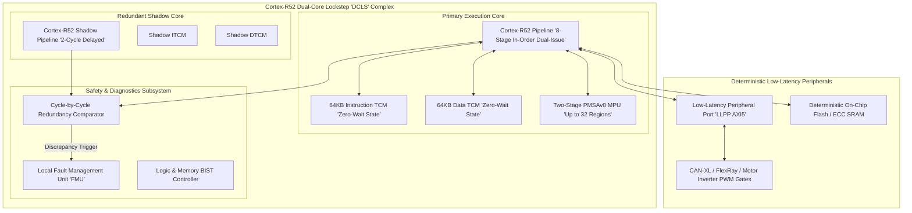
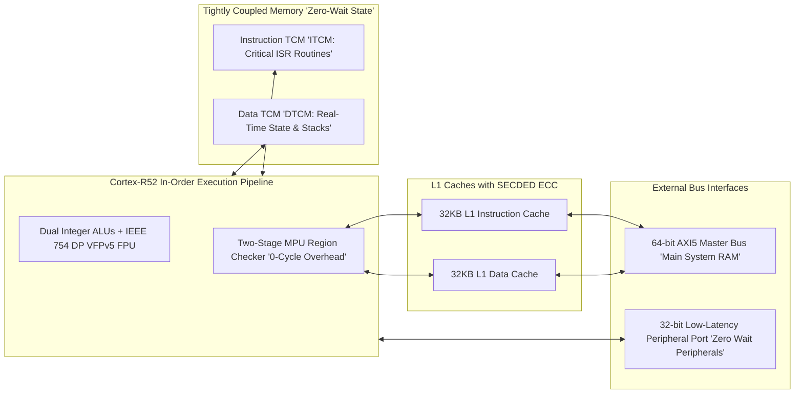
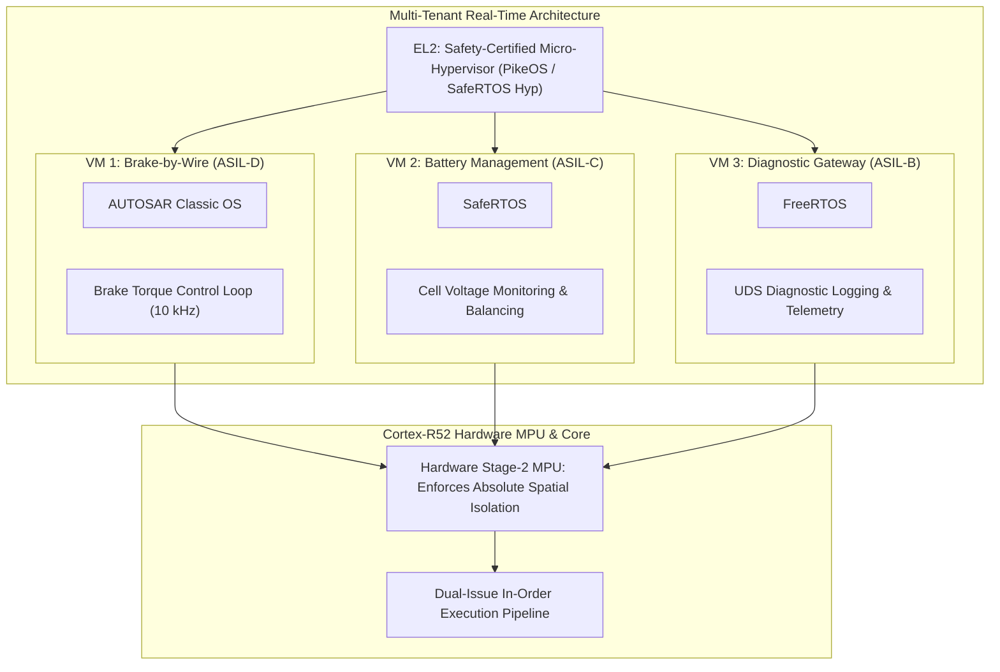
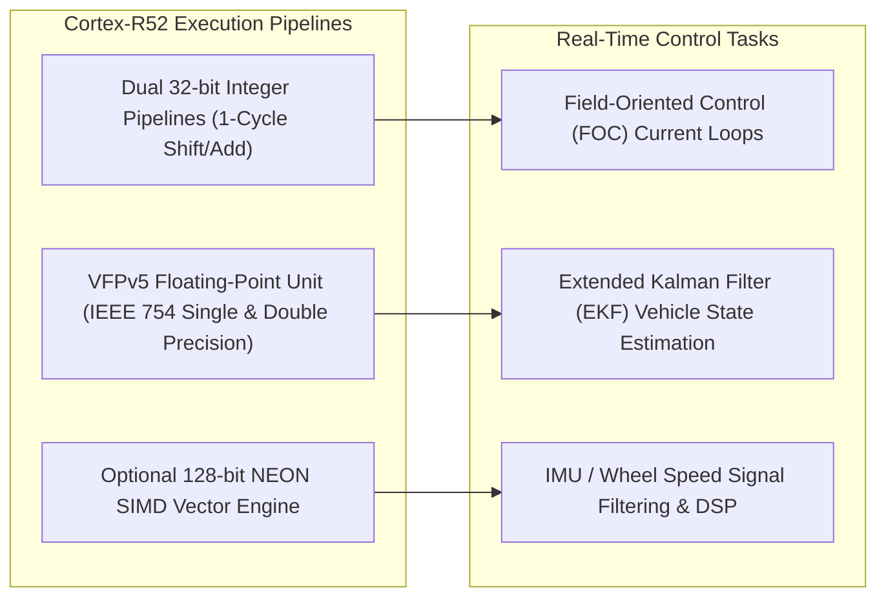
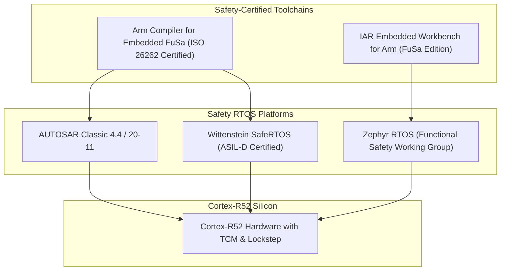

# ⏱️ Arm Cortex-R52: Hard Real-Time Lockstep Safety Core, MPU & Fast Interrupt Handling

## 1. Executive Summary & Hardware Typology

The **Arm Cortex-R52** is the industry-standard hard real-time, safety-certified processor core based on the **Armv8-R (32-bit)** architecture. Engineered specifically to satisfy the most demanding requirements of **ISO 26262 ASIL-D** and **IEC 61508 SIL 3** safety-critical systems, the Cortex-R52 delivers cycle-deterministic execution, hardware-enforced virtualization, ultra-fast interrupt latency, and dual-core redundant lockstep (DCLS) fault detection.

In modern automotive and robotics architectures—including brake-by-wire, steer-by-wire, inverter gate drivers, and autonomous safety supervisor islands—the Cortex-R52 acts as the hardened execution core that validates trajectory commands generated by high-throughput application processors (e.g. Neoverse V3AE, Cortex-A78AE, Blackwell GPUs) before commanding physical actuators.



### Cortex-R52 Architectural Specifications

| Architectural Parameter | Technical Specification |
| :--- | :--- |
| **Instruction Set Architecture** | Armv8-R (32-bit A32 / T32 instruction sets) |
| **Pipeline Microarchitecture** | 8-stage in-order, dual-issue superscalar pipeline |
| **Safety Certification** | **ISO 26262 ASIL-D / IEC 61508 SIL 3 Ready** |
| **Fault Detection Mechanism** | Dual-Core Lockstep (DCLS) with temporal staggering (2 clock cycles) |
| **Virtualization Support** | Hardware Virtualization (EL2 Hypervisor Mode, Stage 1 + Stage 2 MPU) |
| **Tightly Coupled Memory (TCM)**| Up to 1MB Instruction TCM (ITCM) and 1MB Data TCM (DTCM) |
| **L1 Cache Hierarchy** | Optional 16KB–64KB I-Cache and 16KB–64KB D-Cache with SECDED ECC |
| **Memory Protection Unit (MPU)** | PMSAv8 architecture: Stage 1 (up to 32 regions) + Stage 2 (up to 32 regions) |
| **Interrupt Latency** | **$< 12 \text{ clock cycles}$** (Direct Fast Interrupt / LLPP interface) |
| **Typical Target Frequency** | 0.8 GHz – 1.4 GHz on 16nm / 7nm / 5nm FinFET |
| **Power Dissipation** | **$50\text{ mW} - 250\text{ mW}$** per core |

---

## 2. Compute Core & Memory Hierarchy

The memory subsystem of the Cortex-R52 is designed to eliminate cache miss penalties and bus arbitration jitter that compromise hard real-time deadlines.



### Memory Hierarchy Mechanics
1. **Tightly Coupled Memories (TCMs)**:
   - ITCM and DTCM are dedicated static RAM blocks tied directly into the core's execution stages.
   - Access to TCMs bypasses cache tag lookups and bus arbitration, guaranteeing **single-cycle zero-wait-state access**. Critical Interrupt Service Routines (ISRs) and motor control PID loops reside in TCM to guarantee sub-microsecond determinism.
2. **Two-Stage Memory Protection Unit (PMSAv8)**:
   - **Stage 1 MPU**: Defines memory permissions (Read/Write/Execute, Privileged vs. Unprivileged) for guest tasks.
   - **Stage 2 MPU**: Enables an EL2 safety hypervisor to enforce spatial memory isolation between independent virtualized operating systems (e.g. AUTOSAR Classic and SafeRTOS) running on the same core.
3. **Low-Latency Peripheral Port (LLPP)**:
   - A dedicated 32-bit bus interface that bypasses the main SoC coherent interconnect, allowing the CPU to read sensor registers and trigger actuator PWM controllers with deterministic, single-cycle latency.

---

## 3. Micro-Architectural Mechanics & Fast Interrupt Handling

### Real-Time Hardware Virtualization (EL2 Hypervisor Mode)

Unlike traditional microcontrollers that require software context switches with unpredictable execution jitter, the Cortex-R52 implements hardware-assisted virtualization natively in silicon.



- **Zero-Overhead Partitioning**: A memory violation or illegal instruction executed in VM 3 (Diagnostic Gateway) causes a hardware Stage-2 MPU fault handled directly by the EL2 Hypervisor without interrupting the 10 kHz control cycle of VM 1 (Brake-by-Wire).

---

## 4. Numerical Precision & Floating-Point Capabilities

The Cortex-R52 integrates an IEEE 754 compliant **Vector Floating Point v5 (VFPv5)** unit delivering single-precision (FP32) and double-precision (FP64) hardware arithmetic.



### Arithmetic Execution Throughput

| Operation | Precision | Cycles per Instruction | Issue Capability | Target Real-Time Routine |
| :--- | :--- | :--- | :--- | :--- |
| **`VADD.F32` / `VSUB.F32`** | FP32 (Single) | 1 cycle throughput | Dual-Issue capable | Kinematic transformation matrices |
| **`VMUL.F32` / `VFMA.F32`** | FP32 (Single) | 1 cycle throughput | Dual-Issue capable | Quaternion rotation & state estimation |
| **`VDIV.F32` / `VSQRT.F32`**| FP32 (Single) | 6–10 cycles (Non-blocking)| Pipelined | Vector normalization |
| **`VFMA.F64`** | FP64 (Double) | 2 cycles throughput | Single-Issue | High-precision geodetic coordinates |

---

## 5. Software Stack & Toolchains

The Cortex-R52 software ecosystem centers on certified RTOS implementations (AUTOSAR Classic, SafeRTOS, PikeOS, INTEGRITY-178), certified C/C++ compilers (Arm Compiler for Embedded FuSa), and MISRA-C compliant firmware.



### Production C Driver: Fast Interrupt Handler & MPU Region Setup

```c
#include <stdint.h>
#include <stdbool.h>

// Cortex-R52 System Control Coprocessor Registers (CP15)
#define MPU_TYPE_REG            "p15, 0, %0, c0, c0, 4"
#define PRBAR_REG               "p15, 0, %0, c6, c3, 0"  // Protection Region Base Address
#define PRLAR_REG               "p15, 0, %0, c6, c3, 1"  // Protection Region Limit Address
#define PRSELR_REG              "p15, 0, %0, c6, c2, 1"  // Protection Region Selection

// Configure Stage-1 MPU Region for Tightly Coupled Memory (ITCM)
void configure_itcm_mpu_region(uint32_t region_num, uint32_t base_addr, uint32_t limit_addr) {
    // Select MPU Region
    __asm__ volatile("mcr " PRSELR_REG : : "r"(region_num));

    // Program Base Address (Read/Write Privileged, Execute Allowed)
    uint32_t prbar = (base_addr & ~0x3F) | (0x0 << 2) | (0x0 << 1); // Normal Memory, Shareable
    __asm__ volatile("mcr " PRBAR_REG : : "r"(prbar));

    // Program Limit Address and Enable Region
    uint32_t prlar = (limit_addr & ~0x3F) | (0x1 << 0); // Enable Region Bit
    __asm__ volatile("mcr " PRLAR_REG : : "r"(prlar));

    // Memory Barrier to enforce MPU settings immediately
    __asm__ volatile("dsb sy; isb" ::: "memory");
}

// Low-Latency Fast Interrupt Service Routine (FIQ) for Motor PWM Trip
void __attribute__((interrupt("FIQ"), section(".itcm_code"))) FIQ_Motor_Protection_ISR(void) {
    // Read Actuator Over-Current Register via LLPP (Deterministic 1-Cycle Access)
    volatile uint32_t* const pwm_trip_reg = (volatile uint32_t*)0xF0002010;
    
    // Assert Instant Hardware Inverter Gate Disable
    *pwm_trip_reg = 0x00000000;
    
    // Clear Peripheral Interrupt Flag
    *((volatile uint32_t*)0xF0002014) = 0x1;
}
```

---

## 6. Safety, Real-Time & Thermal Envelopes

### ISO 26262 ASIL-D Quantitative Safety Metrics

| Metric | ISO 26262 ASIL-D Target | Cortex-R52 Silicon Achievement |
| :--- | :--- | :--- |
| **Single-Point Fault Metric (SPFM)** | $\ge 99.0\%$ | **$> 99.6\%$** (via Cycle-Accurate DCLS Comparators) |
| **Latent Fault Metric (LFM)** | $\ge 90.0\%$ | **$> 94.2\%$** (via Hardware Logic BIST & Memory BIST) |
| **Probabilistic Metric for Random Hardware Failures (PMHF)**| $< 10 \text{ FIT}$ ($10^{-8}/\text{hr}$) | **$< 0.8 \text{ FIT}$** |
| **Worst-Case Execution Time (WCET) Jitter** | $< 100 \text{ ns}$ | **$< 5 \text{ ns}$** (when executing out of ITCM) |

---

## 7. Comparative Architecture Matrix

| Architectural Dimension | Arm Cortex-R52 | Arm Cortex-R82 | Arm Cortex-M7 | Infineon TriCore TC39x |
| :--- | :--- | :--- | :--- | :--- |
| **Instruction Architecture** | Armv8-R (32-bit) | Armv8-R64 (64-bit) | Armv7-M (32-bit) | TriCore v1.6.2 (VLIW/RISC) |
| **Pipeline Type** | 8-Stage In-Order Dual-Issue | 10-Stage Out-of-Order | 6-Stage In-Order Dual-Issue | 6-Stage Superscalar |
| **Safety Integrity Level** | **ISO 26262 ASIL-D / SIL 3** | **ISO 26262 ASIL-D / SIL 3** | ASIL-B / ASIL-D (External DCLS)| **ISO 26262 ASIL-D** |
| **Virtualization Support** | Hardware Stage 1 + Stage 2 MPU| Full MMU + Virtualization | None (Single MPU) | Memory Protection Units (MPU) |
| **Tightly Coupled Memory** | Dedicated ITCM + DTCM | Dedicated TCMs | Dedicated ITCM + DTCM | Dedicated Local SRAM (DSPR/PSPR)|
| **Power Dissipation** | **$50\text{ mW} - 250\text{ mW}$** | $150\text{ mW} - 600\text{ mW}$ | $20\text{ mW} - 100\text{ mW}$ | $1.0\text{ W} - 3.0\text{ W}$ |
| **Target Application** | Steer/Brake-by-Wire, Motor FOC | Real-Time Linux Storage / Gateway| Body Electronics, Sensor Nodes | Engine, Inverter, Chassis Control |

---

## 8. Cross-References & Related Frameworks

- [[hardware/arm-cortex-a78ae|Arm Cortex-A78AE Application Processor]]
- [[hardware/arm-neoverse-v3ae|Arm Neoverse V3AE Automotive Server CPU]]
- [[hardware/nvidia-drive-thor|NVIDIA DRIVE Thor Automotive Superchip]]
- [[topics/real-time-systems/00-real-time-systems-moc|Real-Time Systems & Determinism]]
- [[topics/safety-verification-and-robustness/00-safety-verification-and-robustness-moc|Safety Verification & Robustness]]
