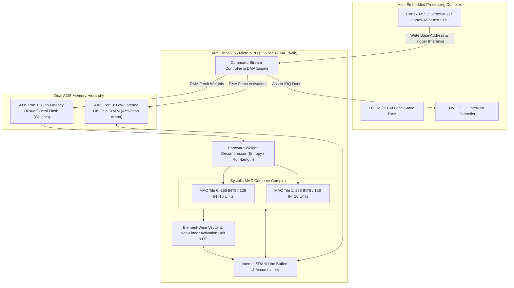
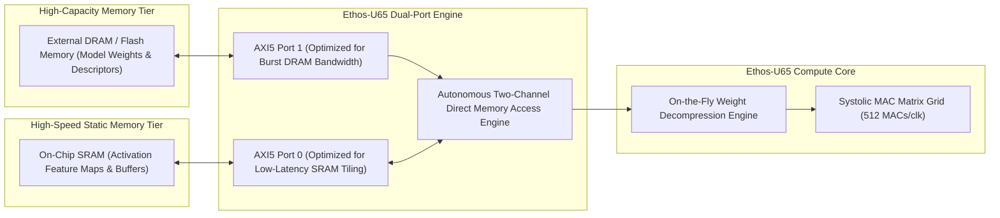
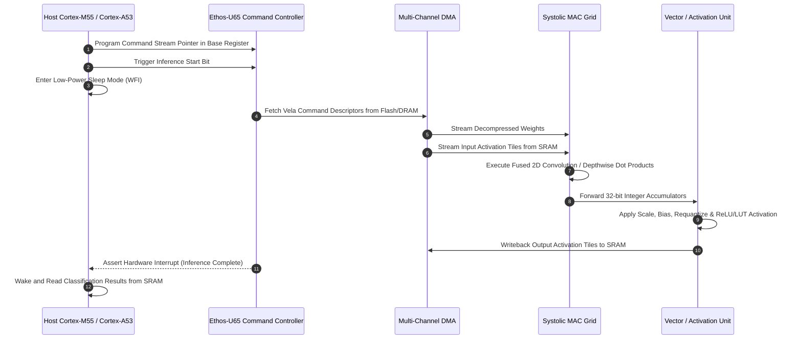
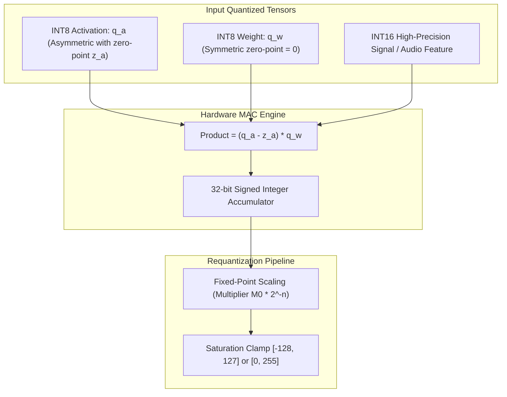
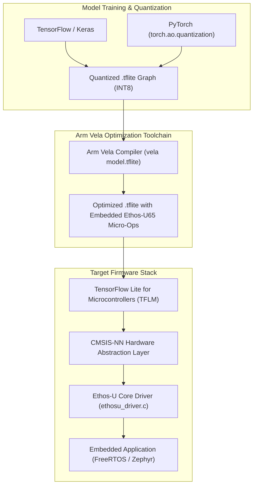

# 📟 Arm Ethos-U65: Micro-NPU for Embedded Edge, Microcontrollers & IoT Acceleration

## 1. Executive Summary & Hardware Typology

The **Arm Ethos-U65** is Arm's second-generation **Micro-NPU (uNPU)**, engineered to extend deep learning acceleration beyond tightly-constrained on-chip SRAM systems into rich embedded edge devices equipped with external DRAM. Co-designed to operate alongside Cortex-M (Cortex-M55, Cortex-M85), Cortex-R (Cortex-R52, Cortex-R82), and Cortex-A application cores (Cortex-A53, Cortex-A35), the Ethos-U65 provides up to **1.0 INT8 TOPS** of compute throughput within a **$50\text{ mW} - 250\text{ mW}$** power envelope.

The Ethos-U65 addresses embedded computer vision (object classification, face detection, optical character recognition), smart voice interfaces (keyword spotting, beamforming), and industrial vibration diagnostics by integrating a hardware weight decompression pipeline, dedicated line buffers, and dual AXI5 bus interfaces optimized for high-latency external memory architectures.



### Ethos-U65 Hardware Configurations Matrix

| Hardware Parameter | Ethos-U65-256 Configuration | Ethos-U65-512 Configuration |
| :--- | :--- | :--- |
| **Compute Units (MACs/cycle)**| 256 MACs per clock cycle | **512 MACs per clock cycle** |
| **Peak INT8 Throughput (at 1 GHz)**| 0.512 TOPS | **1.024 TOPS** |
| **Peak INT16 Throughput (at 1 GHz)**| 0.256 TOPS | **0.512 TOPS** |
| **Numerical Data Types** | INT8, INT16 (Symmetric / Asymmetric)| INT8, INT16 (Symmetric / Asymmetric) |
| **System Bus Interface** | Dual 64-bit / 128-bit AXI5 Master Interfaces| Dual 64-bit / 128-bit AXI5 Master Interfaces|
| **DRAM Support** | Fully optimized for LPDDR4/DDR3/DRAM | Fully optimized for LPDDR4/DDR3/DRAM |
| **Target Operating Frequency** | 200 MHz – 1.0 GHz | 200 MHz – 1.0 GHz |
| **Active Power Dissipation** | 50 mW – 120 mW | 100 mW – 250 mW |
| **Energy Efficiency** | $\sim 6.0 \text{ INT8 TOPS/W}$ | $\sim 7.5 \text{ INT8 TOPS/W}$ |

---

## 2. Compute Core & Memory Hierarchy

The principal microarchitectural innovation of the Ethos-U65 compared to the earlier Ethos-U55 is its **Dual AXI5 Bus Interface**, specifically tailored to manage systems with heterogeneous memory tiers (fast on-chip SRAM alongside high-capacity external DRAM).



### Dual-Bus Memory Bandwidth Management
1. **Port 0 (Low-Latency SRAM)**: Dedicated to reading and writing intermediate activation tensors. Because activation feature maps are read and updated frequently across fused convolutional layers, routing them through local SRAM avoids high DRAM energy penalties.
2. **Port 1 (High-Latency DRAM / Flash)**: Configured with large burst buffers to stream compressed weights from external memory directly into the weight decompression hardware.
3. **Hardware Weight Decompression**: Weights compressed via run-length and variable-length entropy coding are decompressed in real time, reducing external DRAM memory traffic by up to $60\%$.

---

## 3. Micro-Architectural Mechanics & Data Paths

The execution model of the Ethos-U65 is fully autonomous and asynchronous, freeing the host processor to enter low-power sleep states during inference.



---

## 4. Numerical Precision & Quantization

The Ethos-U65 executes integer arithmetic supporting 8-bit and 16-bit integer activations and weights with internal 32-bit accumulation.



---

## 5. Software Stack, CMSIS-NN & Toolchains

The software toolchain converts standard neural network graphs into Vela-optimized command binaries that execute via the lightweight Ethos-U core driver.



### Production Toolchain Recipe & C Driver Integration

```bash
# Compile INT8 MobileNetV2 for Ethos-U65 with 512 MACs
vela models/mobilenet_v2_int8.tflite \
    --accelerator-config ethos-u65-512 \
    --system-config Ethos_U65_Dual_AXI \
    --memory-mode Dedicated_Sram \
    --arena-cache-size 524288 \
    --output-dir build/vela_output/
```

```c
#include "ethosu_driver.h"
#include <stdint.h>
#include <stdbool.h>

#define ETHOS_U65_BASE_ADDR     0x40080000
static struct ethosu_driver ethosu_drv;

// Initialize Ethos-U65 Hardware Driver
bool init_ethos_u65(void) {
    // Initialize controller with hardware clock gating enabled
    if (ethosu_init(&ethosu_drv, (void*)ETHOS_U65_BASE_ADDR, NULL, 0, 1, 1) != 0) {
        return false;
    }
    return true;
}

// Execute pre-compiled Vela command stream
bool execute_u65_inference(const uint8_t* command_stream, size_t cmd_size) {
    // Soft reset and run command stream
    if (ethosu_invoke(&ethosu_drv, command_stream, cmd_size, NULL, 0, NULL, 0) != 0) {
        return false;
    }
    return true;
}
```

---

## 6. Functional Safety, Real-Time Latency & Thermal Profiles

- **Cycle Determinism**: Absence of dynamic speculative execution or multi-level hardware cache replacement algorithms guarantees cycle-level execution time repeatability.
- **Power Consumption**: Dissipates between **$50\text{ mW} - 120\text{ mW}$** in 256-MAC configurations at 500 MHz, and up to **$250\text{ mW}$** in 512-MAC configurations at 1.0 GHz.
- **Thermal Footprint**: Operates in plastic QFN/BGA packaging without heatsinks across automotive temperature ranges (-40°C to 125°C).

---

## 7. Comparative Architecture Matrix

| Metric / Feature | Arm Ethos-U65 | Arm Ethos-U55 | Arm Ethos-U85 | NXP eIQ Neutron NPU |
| :--- | :--- | :--- | :--- | :--- |
| **Generation** | 2nd Generation | 1st Generation | 3rd Generation | Proprietary NXP Gen 1 |
| **Max Compute (MACs/cycle)**| **512 MACs/clk** | 256 MACs/clk | **2048 MACs/clk** | 256 MACs/clk |
| **Peak INT8 Throughput** | **1.024 TOPS** | 0.512 TOPS | **4.096 TOPS** | 0.5 TOPS |
| **External DRAM Support** | **Yes (Dual AXI5 Ports)** | No (SRAM-bound only) | Yes (Dual High-BW AXI5)| Limited |
| **Numeric Precision** | INT8, INT16 | INT8, INT16 | INT4, INT8, INT16 | INT8, INT16, FP16 |
| **Transformer Operators** | Basic Element-Wise | None (CPU Fallbacks) | **Native 2D MatMul & Softmax**| Limited |
| **Active Power Dissipation** | **$50\text{ mW} - 250\text{ mW}$** | $15\text{ mW} - 120\text{ mW}$ | $20\text{ mW} - 450\text{ mW}$ | $50\text{ mW} - 200\text{ mW}$ |
| **Primary Deployment** | Smart Cameras, Gateway IoT | Smart Watches, Wearables | Edge Vision, TinyVLM | MCX-N94x Microcontrollers |

---

## 8. Cross-References & Related Frameworks

- [[hardware/arm-ethos-u85|Arm Ethos-U85 Edge Transformer NPU]]
- [[hardware/arm-cortex-r52|Arm Cortex-R52 Real-Time Safety Core]]
- [[hardware/intel-npu|Intel NPU 4 & 5 Architecture]]
- [[docs/edge-ai-quantization-playbook|TinyML Quantization & Compression Playbook]]
