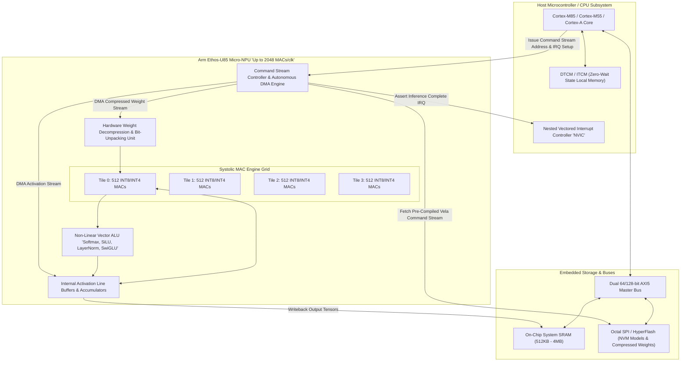
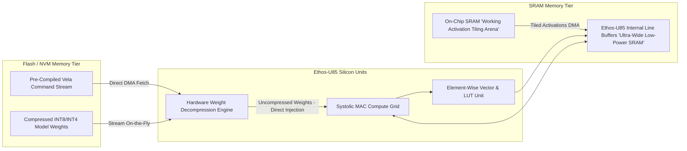
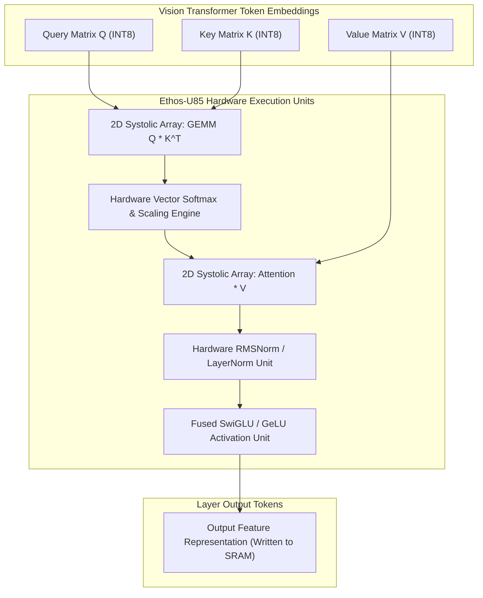
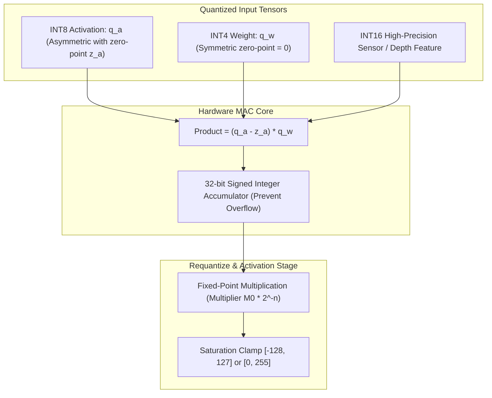
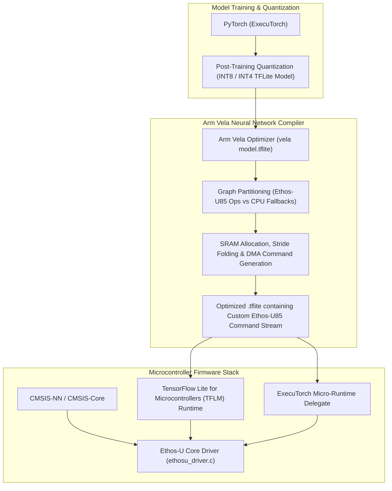

# 👁️ Arm Ethos-U85: Micro-NPU for Edge Vision, Transformers & 4 TOPS Embedded AI Acceleration

## 1. Executive Summary & Hardware Typology

The **Arm Ethos-U85** is Arm's third-generation, highest-performance **Micro-NPU (uNPU)**, engineered to bring native **Vision Transformer (ViT)** acceleration, 2D Matrix Multiplication (GEMM), and sub-watt deep learning to microcontrollers (Cortex-M55, Cortex-M85) and embedded application processors (Cortex-A320, Cortex-A520).

Operating within a thermal envelope of **$20\text{ mW} - 450\text{ mW}$**, the Ethos-U85 scales from 128 up to **2048 Multiply-Accumulate (MAC) units per clock cycle**. Running at 1.0 GHz, the 2048-MAC configuration delivers **4.0 INT8 TOPS** and **8.0 INT4 TOPS**, representing a $4\times$ throughput increase and $20\%$ higher energy efficiency over the preceding Ethos-U65 generation.



### Ethos-U85 Hardware Configurations Matrix

| Metric / Parameter | Ethos-U85-128 | Ethos-U85-512 | Ethos-U85-1024 | Ethos-U85-2048 |
| :--- | :--- | :--- | :--- | :--- |
| **Compute Units (MACs/cycle)**| 128 MACs/clk | 512 MACs/clk | 1024 MACs/clk | **2048 MACs/clk** |
| **Peak INT8 Throughput (at 1 GHz)**| 0.256 TOPS | 1.024 TOPS | 2.048 TOPS | **4.096 TOPS** |
| **Peak INT4 Throughput (at 1 GHz)**| 0.512 TOPS | 2.048 TOPS | 4.096 TOPS | **8.192 TOPS** |
| **Supported Precisions** | INT8, INT16 | INT8, INT16, INT4 | INT8, INT16, INT4 | **INT4, INT8, INT16** |
| **Transformer Operators** | Softmax, LayerNorm | Softmax, RMSNorm, GEMM| Native ViT / SwiGLU | **Full ViT & TinyVLM Pipeline** |
| **System Bus Interface** | 64-bit AXI5 | 64-bit AXI5 | 128-bit AXI5 | **Dual 128-bit AXI5 Interfaces** |
| **Typical Power Dissipation** | 20 mW – 50 mW | 80 mW – 150 mW | 150 mW – 280 mW | **200 mW – 450 mW** |
| **Energy Efficiency** | $\sim 10 \text{ TOPS/W}$ | $\sim 11.5 \text{ TOPS/W}$ | $\sim 12 \text{ TOPS/W}$ | **Up to 12.5 INT8 TOPS/W (25 INT4 TOPS/W)**|

---

## 2. Compute Core & Memory Hierarchy

The Ethos-U85 is architected to eliminate off-chip memory traffic, which represents the single largest power consumer in battery-powered edge vision devices.



### Memory Bandwidth Optimization Mechanics
1. **On-the-Fly Hardware Weight Decompression**:
   - Neural network weights are compressed offline by the **Arm Vela Compiler** using run-length and Huffman-based entropy coding.
   - During inference, the Ethos-U85 hardware decompression engine streams packed weights directly from external Flash storage into the MAC registers, decompressing in silicon at bus speed without intermediate SRAM buffering. This reduces off-chip memory traffic by up to **$65\%$**.
2. **Double-Buffering & Spatial Activation Tiling**:
   - The compiler tiles feature maps into spatial blocks ($H_t \times W_t \times C_t$) sized to fit within small internal SRAM partitions. While the MAC array processes Tile $N$, the autonomous DMA engine pre-fetches activations for Tile $N+1$.
3. **Weight-Only INT4 Quantization**:
   - Native support for 4-bit integer weights enables executing quantized Vision Transformers (ViT) and tiny Vision-Language Models (TinyVLM) within microcontrollers containing $\le 2\text{ MB}$ Flash storage.

---

## 3. Micro-Architectural Mechanics: Native Transformer Acceleration

While earlier micro-NPUs focused exclusively on 2D convolutions, the Ethos-U85 incorporates specialized hardware execution units for Transformer attention layers.



- **Hardware Softmax & Normalization**: The vector engine computes non-linear mathematical operations (exponential functions, reciprocal square roots for LayerNorm/RMSNorm) via high-precision Look-Up Tables (LUTs) with linear interpolation, eliminating CPU round-trips.

---

## 4. Numerical Precision & Quantization

The mathematical execution pipeline of Ethos-U85 handles asymmetric and symmetric quantized integer formats with 32-bit accumulation.



### Quantization Mathematical Formulation
For standard quantized convolutional and fully-connected layers, the floating-point operation $Y = X \cdot W + B$ is realized in Ethos-U85 hardware as:
$$q_y = z_y + \text{QuantizeMultiplier}\left( \sum_{k} (q_{x, k} - z_x) \cdot q_{w, k} + b_k \right)$$
- **Accumulator Bit-Width**: 32-bit signed integers ($[-2^{31}, 2^{31}-1]$).
- **Scale Computation**: High-precision fixed-point multiplication using 32-bit scale multipliers with bit shifts, eliminating floating-point division hardware.

---

## 5. Software Stack, Vela Compiler & Toolchains

The software compilation pipeline translates PyTorch, TensorFlow Lite, and ExecuTorch models into optimized Ethos-U85 command streams.



### Practical Toolchain Usage: Compiling for Ethos-U85

```bash
# Install Arm Vela Compiler
pip install ethos-u-vela

# Compile INT8/INT4 TFLite Model for Ethos-U85 2048-MAC Configuration
vela models/vit_tiny_patch16_int8.tflite \
    --accelerator-config ethos-u85-2048 \
    --system-config Ethos_U85_High_Performance \
    --memory-mode Shared_Sram \
    --arena-cache-size 1048576 \
    --output-dir build/vela_output/

# Inspect Vela Memory Optimization & Operator Distribution Report
cat build/vela_output/vit_tiny_patch16_int8_vela_summary.csv
```

---

## 6. Functional Safety, Real-Time Latency & Thermal Profiles

### Determinism and Power Metrics
- **Cycle-Accurate Worst-Case Execution Time (WCET)**: Because Ethos-U85 operates exclusively with statically scheduled scratchpad SRAM line buffers (no non-deterministic hardware cache eviction policies), inference runtimes are cycle-deterministic to within $\pm 0.1\%$.
- **Active Power Dissipation**: $180\text{ mW} - 450\text{ mW}$ at 1.0 GHz (2048 MACs).
- **Sleep & Standby Leakage**: Automatic autonomous clock-gating drops consumption to $< 50\ \mu\text{W}$ immediately when the command queue is drained.

---

## 7. Comparative Architecture Matrix

| Metric / Parameter | Arm Ethos-U85 | Arm Ethos-U65 | STMicroelectronics STM32N6 (Neural-ART) | NXP eIQ Neutron NPU (MCX-N94x) |
| :--- | :--- | :--- | :--- | :--- |
| **Compute Core Type** | Micro-NPU Co-Processor | Micro-NPU Co-Processor | Integrated Proprietary Neural-ART NPU | Embedded Neutron NPU Architecture |
| **Peak Throughput** | **4.0 TOPS INT8 / 8.0 TOPS INT4** | 1.0 TOPS INT8 | ~0.6 TOPS INT8 | ~0.5 TOPS INT8 |
| **Transformer Native Acceleration**| **Yes (Softmax, RMSNorm, SwiGLU)**| Limited (Element-wise vector) | No (Layer-by-Layer CPU Fallbacks) | Limited (Basic GEMM) |
| **Numeric Formats** | **INT4, INT8, INT16** | INT8, INT16 | INT8, INT16 | INT8, INT16, FP16 |
| **Tightly Coupled Host Core** | Cortex-M55 / Cortex-M85 / A320 | Cortex-M55 / Cortex-A53 | Dual Cortex-M55 | Dual Cortex-M33 |
| **Compiler & Toolchain** | **Arm Vela + CMSIS-NN / ExecuTorch**| Arm Vela + CMSIS-NN | STM32Cube.AI | NXP eIQ Toolkit + TFLM |
| **Typical Power Envelope** | **$20\text{ mW} - 450\text{ mW}$** | $50\text{ mW} - 250\text{ mW}$ | $100\text{ mW} - 350\text{ mW}$ | $50\text{ mW} - 200\text{ mW}$ |
| **Target Application** | Micro Edge Vision, TinyVLM, Smart Audio| Smart Home, Voice Recognition | Industrial Smart Cameras, Robotics | Wearable Sensors, Predictive Maintenance |

---

## 8. Cross-References & Related Frameworks

- [[hardware/arm-ethos-u65|Arm Ethos-U65 Microcontroller NPU]]
- [[hardware/arm-cortex-a78ae|Arm Cortex-A78AE Application Processor]]
- [[hardware/intel-npu|Intel NPU 4 & 5 Architecture]]
- [[docs/edge-ai-quantization-playbook|TinyML Quantization & Compression Playbook]]
