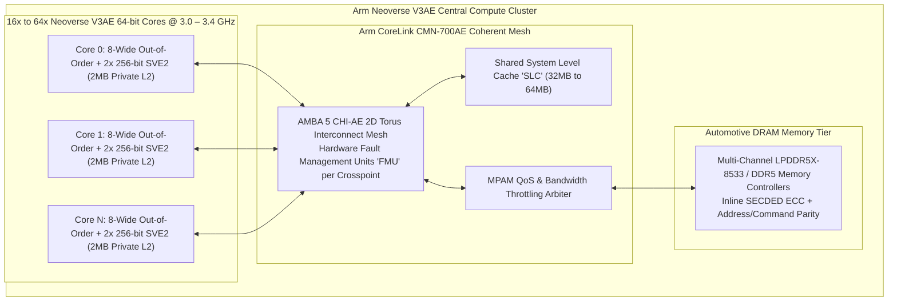
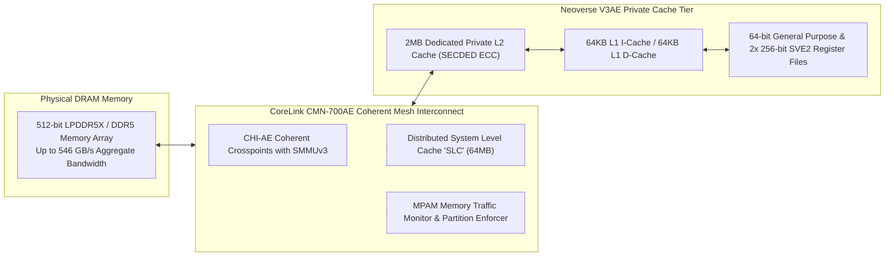
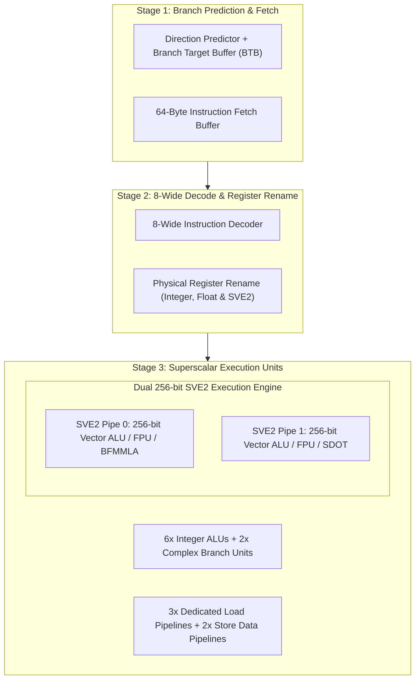
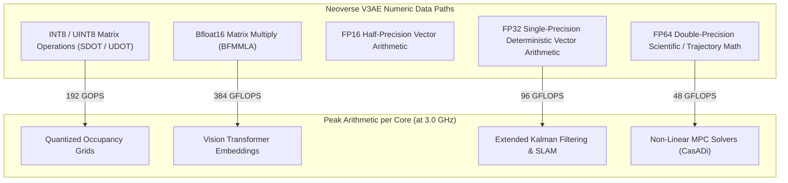
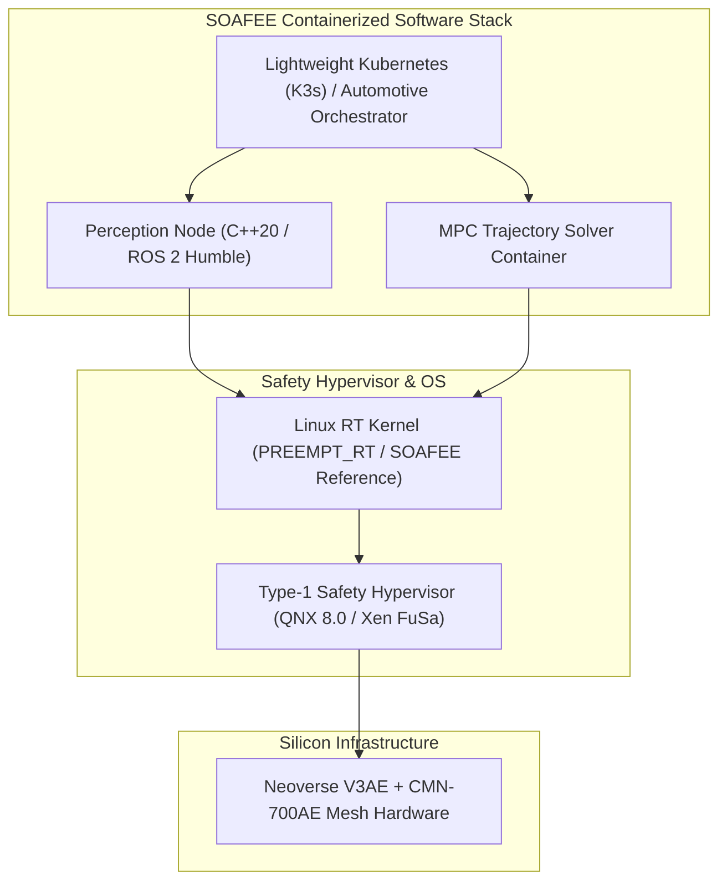

# 🏎️ Arm Neoverse V3AE: Automotive Server-Class High-Throughput CPU, SVE2 & AMBA CHI Architecture

## 1. Executive Summary & Hardware Typology

The **Arm Neoverse V3AE** (Automotive Enhanced) brings server-class datacenter processing capabilities directly into centralized automotive supercomputers, Software-Defined Vehicles (SDVs), and autonomous driving domain controllers. Built upon the **Armv9.2-A** architecture, the Neoverse V3AE provides the high single-thread integer performance, scalable vector processing, and memory bandwidth necessary to orchestrate complex physical AI stacks, vision-language foundation models, and multi-sensor fusion graphs.

The Neoverse V3AE incorporates dual 256-bit **Scalable Vector Extension 2 (SVE2)** pipelines per core, high-bandwidth **AMBA 5 Coherent Hub Interface (CHI)** mesh networking, **Memory System Resource Partitioning and Monitoring (MPAM)**, and hardware-level **ISO 26262 ASIL-D functional safety decomposition** and Reliability, Availability, and Serviceability (RAS) features.



### Neoverse V3AE Architecture Specification Matrix

| Architectural Dimension | Specification Detail |
| :--- | :--- |
| **Instruction Set Architecture** | Armv9.2-A (64-bit AArch64) with Automotive Enhanced FuSa Extensions |
| **Execution Pipeline** | 8-wide decode / 8-wide dispatch out-of-order superscalar pipeline |
| **Vector SIMD Engine** | **Dual 256-bit SVE2 vector pipelines per core** (512-bit aggregate SIMD) |
| **Matrix Vector Operations** | Native `BFMMLA` (Bfloat16 Matrix Multiply) & `SDOT`/`UDOT` (INT8) |
| **L1 Cache Hierarchy** | 64KB Instruction (Parity) + 64KB Data (SECDED ECC) per core |
| **L2 Cache Hierarchy** | 1MB to 2MB private L2 cache per core (SECDED ECC with autonomous scrubbing) |
| **System Level Cache (SLC)**| Up to 64MB distributed across the CoreLink CMN-700AE mesh |
| **Interconnect Interface** | AMBA 5 CHI-AE (Coherent Hub Interface with Functional Safety parity/ECC) |
| **Safety Certification** | **ISO 26262 ASIL-D Systematic / ASIL-D Decomposition Capable** |
| **Hardware QoS / Partitioning**| Arm MPAM (Memory System Resource Partitioning and Monitoring) |
| **Target Clock Frequency** | 2.5 GHz – 3.4 GHz on TSMC 4N / 3nm FinFET |
| **Power Dissipation** | 15 W – 45 W per 8-core cluster |

---

## 2. Compute Core & Memory Hierarchy

In high-end autonomous driving systems, CPU cores must ingest tens of gigabytes of camera, LiDAR, and radar features per second while executing high-frequency planning and prediction nodes. Neoverse V3AE relies on the **AMBA 5 CHI-AE** coherent mesh and **MPAM** to eliminate resource contention.



### Memory System Resource Partitioning and Monitoring (MPAM)
1. **Cache Partitioning**: MPAM assigns distinct Partitions (PARTIDs) to virtual machines (VMs) and process groups. Safety-critical perception processes (e.g. 3D bounding box tracking) are allocated dedicated ways in the System Level Cache (SLC), preventing infotainment apps or background telemetry services from causing cache thrashing.
2. **DRAM Bandwidth Throttling**: MPAM monitors real-time bus transactions. If a non-safety virtual machine attempts to flood the memory interconnect, the hardware throttle restricts its memory request rate, guaranteeing memory bandwidth to ASIL-D camera ingest pipelines.

---

## 3. Micro-Architectural Mechanics & SVE2 Execution

The Neoverse V3AE features a wide execution engine capable of issuing 8 instructions per cycle into a deep out-of-order execution window.



### Scalable Vector Extension 2 (SVE2) Vector Math
Neoverse V3AE implements SVE2 with a vector length ($VL$) of 256 bits (32 bytes) per pipeline. With two execution pipelines per core, each core processes 512 bits of vector data every clock cycle:
- **`BFMMLA` (Bfloat16 Matrix Multiply-Accumulate)**: Computes a matrix multiplication of $2 \times 4$ and $4 \times 2$ BF16 matrices, accumulating into a $2 \times 2$ single-precision (FP32) matrix result.
  $$\text{Throughput} = 64 \text{ BF16 MACs per core per cycle}$$
- **`SDOT` / `UDOT` (INT8 Dot Product)**: Computes four-element integer dot products:
  $$\text{Throughput} = 64 \text{ INT8 Operations per core per cycle}$$

---

## 4. Numerical Precision & Arithmetic Throughput

The Neoverse V3AE provides full hardware support for integer, floating-point, and mixed-precision matrix representations.



### Arithmetic Performance per Core at 3.0 GHz

| Instruction / Format | Precision | Elements / Cycle / Core | Peak Throughput per Core | Target Automotive Application |
| :--- | :--- | :--- | :--- | :--- |
| **`BFMMLA`** | BF16 Input $\rightarrow$ FP32 Acc | 64 MACs/cycle | **384 GFLOPS** | Bird's-Eye-View (BEV) Vision Transformers |
| **`SDOT` / `UDOT`** | INT8 Input $\rightarrow$ INT32 Acc | 64 Ops/cycle | **192 GOPS** | 3D Voxel Grid Classification |
| **`FMLA.F32`** | FP32 (Single Precision) | 16 FLOPs/cycle | **96 GFLOPS** | Kinematics & Point Cloud Alignment |
| **`FMLA.F64`** | FP64 (Double Precision) | 8 FLOPs/cycle | **48 GFLOPS** | High-Precision Trajectory Optimization |

---

## 5. Software Stack, SOAFEE & Toolchains

The Neoverse V3AE software stack centers around the **SOAFEE (Scalable Open Architecture for Embedded Edge)** initiative, standardizing containerized cloud-native development for automotive silicon.



### High-Performance C++ SVE2 Vector Optimization Example

```cpp
#include <arm_sve.h>
#include <vector>
#include <iostream>

// Vectorized Point Cloud Coordinate Transformation using SVE2 Intrinsics
void transform_point_cloud_sve2(const float* __restrict in_x,
                                const float* __restrict in_y,
                                const float* __restrict in_z,
                                float* __restrict out_x,
                                float* __restrict out_y,
                                float* __restrict out_z,
                                const float rot_matrix[3][3],
                                size_t num_points) {
    size_t i = 0;
    svbool_t pg = svwhilelt_b32(i, num_points);

    svfloat32_t r00 = svdup_f32(rot_matrix[0][0]);
    svfloat32_t r01 = svdup_f32(rot_matrix[0][1]);
    svfloat32_t r02 = svdup_f32(rot_matrix[0][2]);

    while (svptest_any(svptrue_b32(), pg)) {
        // Load X, Y, Z coordinates into 256-bit vector registers
        svfloat32_t vx = svld1_f32(pg, &in_x[i]);
        svfloat32_t vy = svld1_f32(pg, &in_y[i]);
        svfloat32_t vz = svld1_f32(pg, &in_z[i]);

        // Compute rotated X' = r00*x + r01*y + r02*z via fused multiply-accumulate
        svfloat32_t v_out_x = svmul_f32_z(pg, vx, r00);
        v_out_x = svmla_f32_m(pg, v_out_x, vy, r01);
        v_out_x = svmla_f32_m(pg, v_out_x, vz, r02);

        // Store result back to memory
        svst1_f32(pg, &out_x[i], v_out_x);

        i += svcntw();
        pg = svwhilelt_b32(i, num_points);
    }
}
```

---

## 6. Functional Safety, Real-Time & Thermal Envelopes

### ISO 26262 ASIL-D Decomposition & Reliability
- **Systematic Safety**: Developed to ISO 26262 ASIL-D systematic capability.
- **Random Hardware Fault Handling**: Deploys localized hardware Fault Management Units (FMUs) across each core, cache slice, and CHI mesh crosspoint to signal faults to an external real-time safety island (e.g. Cortex-R52).
- **Thermal Dissipation**: Operating at 3.0 GHz, an 8-core Neoverse V3AE cluster consumes between **$25\text{ W} - 35\text{ W}$**, making it suitable for automotive liquid-cooled domain controllers.

---

## 7. Comparative Architecture Matrix

| Architectural Dimension | Arm Neoverse V3AE | Arm Neoverse V2 | Arm Cortex-A78AE | Intel Xeon 6th Gen (Redwood Cove) |
| :--- | :--- | :--- | :--- | :--- |
| **Target Market** | Central Automotive Server / SDV | Cloud & Datacenter Hyperscale | Automotive Domain Controller | Datacenter & Edge Server |
| **ISA Profile** | Armv9.2-A (FuSa Enhanced) | Armv9.0-A | Armv8.2-A | x86-64 (AVX-512 / AMX) |
| **Decode / Dispatch Width** | **8-Wide** | 8-Wide | 4-Wide / 6-Wide | 6-Wide / 8-Wide |
| **Vector Processing** | **2x 256-bit SVE2** | 4x 128-bit SVE2 | 2x 128-bit NEON | 2x 512-bit AVX-512 |
| **Matrix Vector Engine** | Native `BFMMLA` (BF16) | Native `BFMMLA` (BF16) | None (Scalar / NEON dot) | Intel AMX TMUL (BF16/INT8) |
| **Interconnect Fabric** | AMBA 5 CHI-AE Mesh | AMBA 5 CHI Mesh | DynamIQ DSU-AE | 2D Torus Coherent Mesh |
| **Memory QoS Mechanism** | Arm MPAM Hardware Throttling | Arm MPAM | None | Intel RDT (Resource Director) |
| **Typical Target SoC** | NVIDIA DRIVE Thor, Next-Gen SDV| NVIDIA Grace Superchip | NVIDIA Orin, Versal Gen2 | Intel Xeon 6900P |

---

## 8. Cross-References & Related Frameworks

- [[hardware/nvidia-drive-thor|NVIDIA DRIVE Thor Automotive Superchip]]
- [[hardware/arm-cortex-a78ae|Arm Cortex-A78AE Application Processor]]
- [[hardware/arm-cortex-r52|Arm Cortex-R52 Real-Time Safety Core]]
- [[hardware/intel-xeon-amx|Intel Xeon 6th Gen AMX Datacenter Processor]]
- [[topics/safety-verification-and-robustness/00-safety-verification-and-robustness-moc|Safety Verification & Robustness]]
