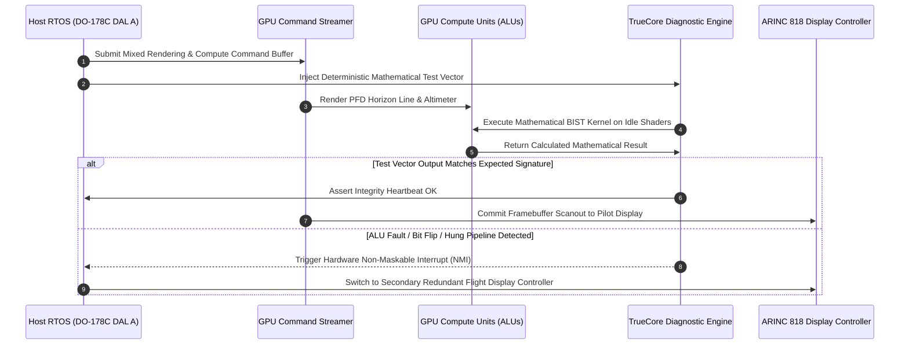
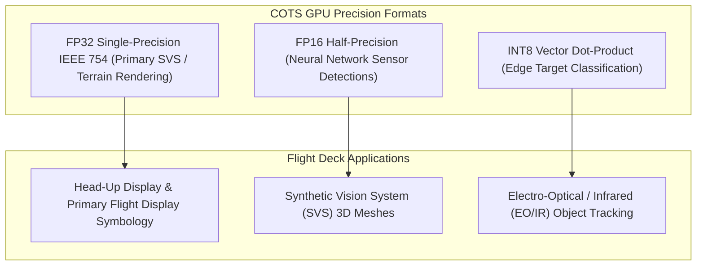
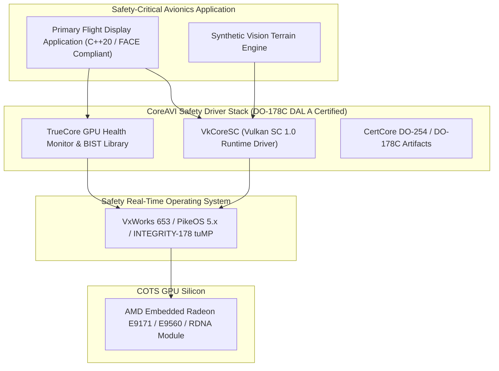

# ✈️ CoreAVI COTS Safety Hardware: DO-254 DAL A, VkCoreSC & Avionics GPU Architectures

## 1. Executive Summary & Hardware Typology

**CoreAVI Safety Hardware & Graphics Architectures** bridge the gap between commercial off-the-shelf (COTS) high-performance GPUs and the stringent safety certification standards of civil avionics (**FAA/EASA DO-254 / DO-178C Design Assurance Level A - DAL A**), military defense (DEF STAN 00-056), and automotive platforms (**ISO 26262 ASIL-D**).

In modern integrated flight decks (e.g. Primary Flight Displays [PFD], Synthetic Vision Systems [SVS], and Head-Up Displays [HUD]) and autonomous airborne defense systems, custom display generators designed with ASIC or FPGA logic are prohibitively expensive and incapable of running complex neural perception models. CoreAVI solves this by enveloping proven silicon—such as **AMD Embedded Radeon (E9171 MCM, E9260, E9560)**, **NXP i.MX8 QuadMax**, and **discrete GCN/RDNA architectures**—within a safety layer comprising hardware monitoring IP (**TrueCore / CertCore**), board-level DO-254 design data packages, and safety-critical graphics/compute driver suites (**VkCoreSC**, **ArgusCore SC**, and **ComputeCore**).

```mermaid
flowchart TD
    subgraph DO_254_Board ["DO-254 DAL A Certified 3U VPX / XMC Hardware Architecture"]
        subgraph Host_CPU_Complex ["Mission Computer Host Processor"]
            HOST_CPU["PowerPC T2080 / ARM Cortex-A72 / Intel Xeon-D<br/>Running DO-178C DAL A RTOS 'VxWorks 653 / PikeOS / INTEGRITY-178'"]
        end

        subgraph PCIe_Safety_Bridge ["Safety-Enforced PCIe Bridge & DMA Controller"]
            PCIE_GUARD["PCIe Gen 3 Safety Switch with DMA Address Window Clamping<br/>Hardware-Enforced Spatial Separation"]
        end

        subgraph COTS_GPU_Subsystem ["COTS GPU Core Complex 'AMD Embedded Radeon / NXP i.MX8'"]
            GPU_CORE["GCN / RDNA Compute Units 'CU' Array<br/>Graphics Rendering & OpenCL / Vulkan SC Compute"]
            VRAM_ECC["Dedicated 4GB GDDR5 / LPDDR4 with ECC & Parity Checking"]
            DISPLAY_CTRL["Hardened Display Controllers 'ARINC 818, DVI, DisplayPort'"]
        end

        subgraph TrueCore_Safety_IP ["CoreAVI TrueCore Hardware Diagnostic Controller"]
            BIST_ENGINE["Continuous Background Built-In Self-Test 'BIST'"]
            REG_CHECK["Register & Shader Core ALU Integrity Checker"]
            HANG_WATCHDOG["Hardware Command Streamer Watchdog & Hang Interrupter"]
        end
    end

    Host_CPU_Complex <--> PCIe_Safety_Bridge
    PCIe_Safety_Bridge <--> COTS_GPU_Subsystem
    TrueCore_Safety_IP <--> COTS_GPU_Subsystem
    TrueCore_Safety_IP -->|Hardware Interrupt / Fault Line| Host_CPU_Complex
```



### Hardware Typology Matrix: Safety GPU Profiles

| Platform / Silicon Module | GPU Architecture | Compute Units / Shaders | Memory Configuration | Peak FP32 Throughput | DO-254 / DO-178C Level | Thermal TDP | Typical Form Factor |
| :--- | :--- | :--- | :--- | :--- | :--- | :--- | :--- |
| **AMD Embedded E9171 MCM** | GCN 4th Gen (Polaris) | 8 CUs (512 Shaders) | 4 GB GDDR5 Integrated | **1.2 TFLOPS** | DO-254 DAL A / DO-178C DAL A | 25W – 40W | Rugged XMC / 3U OpenVPX |
| **AMD Embedded E9260** | GCN 4th Gen (Polaris) | 14 CUs (896 Shaders) | 4 GB GDDR5 (128-bit) | **2.2 TFLOPS** | DO-254 DAL A / DO-178C DAL A | 50W | 3U VPX Conduction-Cooled |
| **AMD Embedded E9560** | GCN 4th Gen (Polaris) | 36 CUs (2304 Shaders)| 8 GB GDDR5 (256-bit) | **5.7 TFLOPS** | DO-254 DAL A / DO-178C DAL A | 95W | 6U VPX Airborne Radar / SVS |
| **NXP i.MX8 QuadMax** | Dual Vivante GC7000 | 8 Vector Shaders | 8 GB LPDDR4 (Shared) | **64 GFLOPS** | DO-254 DAL A / ASIL-D | 10W – 15W | Cockpit Display Unit (CDU) |
| **Discrete RDNA2/3 Safety** | RDNA 2/3 Embedded | Up to 32 CUs + RT | 8 GB – 16 GB GDDR6 | **10.0+ TFLOPS** | DO-254 DAL A Ready | 45W – 100W | 3U SOSA-Aligned Avionics Blades |

---

## 2. Compute Core & Memory Hierarchy

Avionics systems mandate deterministic latency and strict spatial and temporal memory partitioning to prevent a fault in a mission computer or map rendering service from corrupting the Primary Flight Display (PFD).

```mermaid
flowchart LR
    subgraph Host_Memory_Domain ["Host RTOS Memory Domain 'DO-178C DAL A'"]
        DAL_A_BUF["Critical PFD Framebuffer & ARINC 653 Partition"]
        DAL_C_BUF["Non-Critical Sensor Map Overlay Partition"]
    end

    subgraph PCIe_Memory_Firewall ["Hardware PCIe Translation & Protection"]
        IOMMU_GUARD["Hardware IOMMU / Window Clamping Registers"]
    end

    subgraph GPU_Dedicated_VRAM ["COTS GPU Physical VRAM (ECC Protected)"]
        FRAME_A["Protected Framebuffer 0 'DAL A Primary'"]
        FRAME_B["Protected Framebuffer 1 'DAL A Redundant'"]
        TEXTURE_MEM["Texture & Shader Working Memory"]
    end

    subgraph GPU_Core_Engines ["GPU Compute Units 'CU'"]
        CU_ARRAY["SIMD Vector Pipelines & TrueCore Diagnostic Hooks"]
    end

    Host_Memory_Domain <--> PCIe_Memory_Firewall
    PCIe_Memory_Firewall <--> GPU_Dedicated_VRAM
    GPU_Dedicated_VRAM <--> CU_ARRAY
```



### Memory Isolation & Safety Mechanisms
1. **DMA Window Clamping**: The PCIe bridge logic restricts the GPU bus master from writing outside explicitly registered host physical memory bounds, mitigating COTS DMA engine runaway faults.
2. **SECDED ECC VRAM**: Integrated or discrete GDDR5/GDDR6 memory incorporates SECDED ECC to detect and correct single-event upsets caused by high-altitude cosmic radiation.
3. **Partitioned Display Output**: Display controllers support multiple hardware layers with independent alpha channels, allowing DAL A flight-critical symbology to overlay DAL C synthetic vision video without memory mixing.

---

## 3. Micro-Architectural Mechanics: TrueCore Diagnostic Engine

COTS GPUs lack internal lockstep execution logic. CoreAVI solves this by injecting the **TrueCore** software and hardware diagnostic suite, which continuously validates the GPU's execution integrity without noticeable rendering performance degradation.



### TrueCore Safety Diagnostic Mechanisms
1. **Mathematical ALU BIST**: Executes certified trigonometric and vector instruction sequences across idle shader cores every frame, validating that ALUs compute correct mathematical outputs to within single-bit accuracy.
2. **Register File Scrubbing**: Verifies that GPU internal general-purpose registers (GPRs) and state registers maintain deterministic data without bit flips.
3. **Command Streamer Watchdog**: Monitors the GPU hardware ring buffer. If a complex shader causes a hardware hang, TrueCore interrupts the host CPU within $< 16.6\text{ ms}$ (1 frame period at 60 Hz).

---

## 4. Numerical Precision & Shader Capabilities

COTS avionics GPUs execute graphics and compute shaders using deterministic IEEE 754 floating-point operations.



---

## 5. Software Stack, VkCoreSC & Vulkan SC 1.0 Interface

CoreAVI's driver suite replaces consumer drivers with deterministic, safety-certified runtimes compliant with **Vulkan SC 1.0** (Safety Critical) and **OpenGL SC 1.0/2.0**.



### Production C++ Vulkan SC Pipeline Setup with Safety Verification

```cpp
#include <vulkan/vulkan_sc.h>
#include <iostream>
#include <stdexcept>

// Initialize Vulkan SC Instance for DO-178C DAL A Execution
VkDevice init_vulkan_sc_safety_device(VkInstance instance, VkPhysicalDevice physicalDevice) {
    // Vulkan SC mandates offline pipeline cache creation (Zero runtime shader compilation)
    VkDeviceQueueCreateInfo queueCreateInfo = {};
    queueCreateInfo.sType = VK_STRUCTURE_TYPE_DEVICE_QUEUE_CREATE_INFO;
    queueCreateInfo.queueFamilyIndex = 0;
    queueCreateInfo.queueCount = 1;
    float queuePriority = 1.0f;
    queueCreateInfo.pQueuePriorities = &queuePriority;

    // Configure Safety Object Reservation
    VkDeviceObjectReservationCreateInfo memReservation = {};
    memReservation.sType = VK_STRUCTURE_TYPE_DEVICE_OBJECT_RESERVATION_CREATE_INFO;
    memReservation.pipelineCacheCreateInfoCount = 1;
    memReservation.pipelinePoolSizeCount = 16;
    memReservation.commandPoolRequestCount = 4;

    VkDeviceCreateInfo createInfo = {};
    createInfo.sType = VK_STRUCTURE_TYPE_DEVICE_CREATE_INFO;
    createInfo.pNext = &memReservation;
    createInfo.queueCreateInfoCount = 1;
    createInfo.pQueueCreateInfos = &queueCreateInfo;

    VkDevice device;
    if (vkCreateDevice(physicalDevice, &createInfo, nullptr, &device) != VK_SUCCESS) {
        throw std::runtime_error("Failed to initialize Vulkan SC safety device");
    }

    return device;
}
```

---

## 6. Thermal, Conduction-Cooling & Form Factors

- **Form Factors**: Available in 3U and 6U OpenVPX (VITA 65 / SOSA aligned) and XMC mezzanine form factors (VITA 42/61).
- **Conduction Cooling**: Designed for sealed, fanless avionics enclosures operating across extreme temperature ranges (**$-40^\circ\text{C}$ to $+85^\circ\text{C}$** baseplate temperature).
- **DO-160G Qualification**: Certified for high-altitude decompression ($55,000\text{ ft}$), severe vibration, mechanical shock ($40\text{g}$), and electromagnetic compatibility.

---

## 7. Comparative Safety GPU Architecture Matrix

| Architectural Dimension | AMD Embedded E9171 MCM | AMD Embedded E9560 | NXP i.MX8 QuadMax | NVIDIA AGX Orin Industrial |
| :--- | :--- | :--- | :--- | :--- |
| **GPU Architecture** | GCN 4th Gen (Polaris) | GCN 4th Gen (Polaris) | Dual Vivante GC7000 | Ampere GPU (16 SMs) |
| **Compute Units / Shaders** | 8 CUs (512 Shaders) | 36 CUs (2304 Shaders)| 8 Shaders | 2048 CUDA Cores |
| **Peak FP32 Throughput** | **1.2 TFLOPS** | **5.7 TFLOPS** | 64 GFLOPS | 5.3 TFLOPS (FP32) |
| **Safety Integrity Level** | **DO-254 / DO-178C DAL A** | **DO-254 / DO-178C DAL A** | **DO-254 DAL A / ASIL-D**| ISO 26262 ASIL-D Ready |
| **Safety IP Layer** | CoreAVI TrueCore / VkCoreSC| CoreAVI TrueCore / VkCoreSC| CoreAVI TrueCore / VkCoreSC| NVIDIA DRIVE OS Safety |
| **Memory Configuration** | 4GB GDDR5 (Integrated MCM) | 8GB GDDR5 (Discrete) | 8GB LPDDR4 (Shared) | 64GB LPDDR5 (Unified) |
| **Thermal Power (TDP)** | **25W – 40W** | 95W | 10W – 15W | 15W – 75W |
| **Target Deployment** | Fighter Jet HUD / PFD | Airborne SVS / Sensor Fusion | Cockpit Display Units (CDU)| Autonomous Military AMRs |

---

## 8. Cross-References & Related Frameworks

- [[hardware/arm-cortex-r52|Arm Cortex-R52 Real-Time Lockstep Safety Core]]
- [[hardware/amd-versal-ai-edge-gen2|AMD Versal AI Edge Gen 2 Architecture]]
- [[topics/safety-verification-and-robustness/00-safety-verification-and-robustness-moc|Safety Verification & Robustness]]
- [[architectures/hardware-and-acceleration-runtimes/tensorrt-runtime|TensorRT & Vulkan SC Runtimes]]
