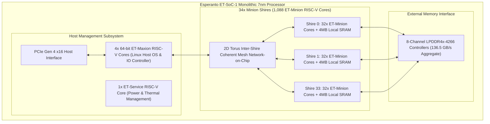
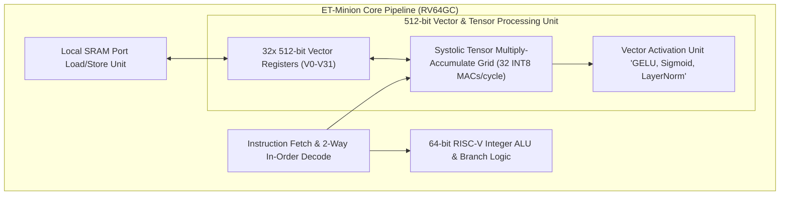
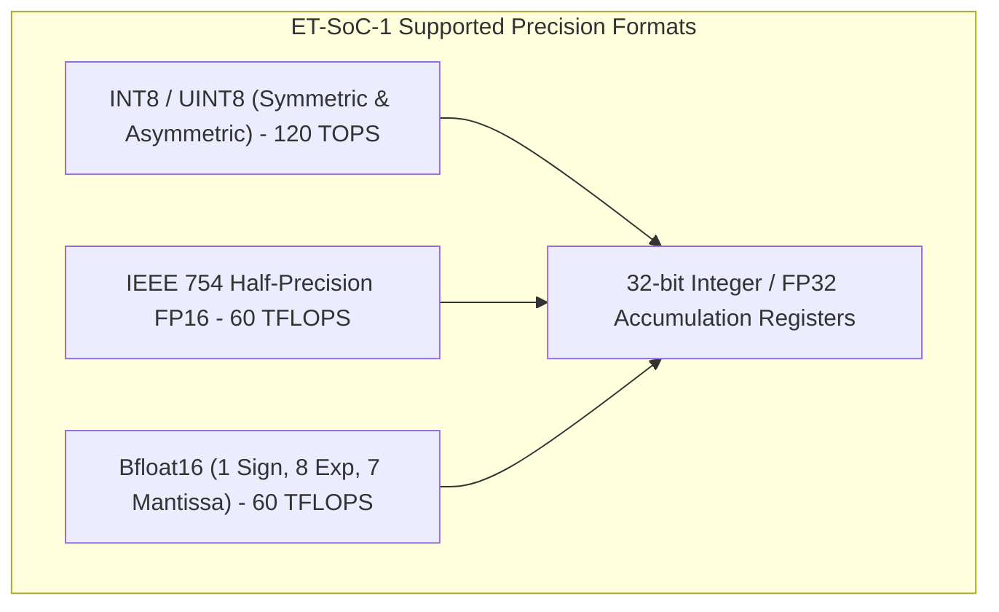
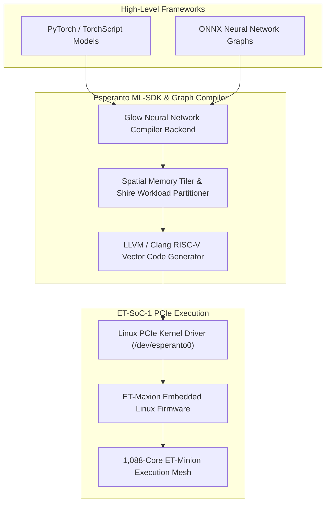

# ⚡ Esperanto ET-SoC-1: 1088-Core Energy-Efficient RISC-V Tensor Inference Architecture

## 1. Executive Summary & Hardware Typology

The **Esperanto ET-SoC-1** is a massively parallel, energy-efficient deep learning inference processor built entirely on the open **RISC-V Instruction Set Architecture (ISA)**. Fabricated on a TSMC 7nm FinFET process, the ET-SoC-1 integrates **1,088 energy-efficient 64-bit RISC-V cores (ET-Minion)** alongside **4 high-performance 64-bit RISC-V host cores (ET-Maxion)** and **160 MB of on-chip SRAM** onto a single monolithic die.

Operating within an ultra-low power budget of **$20\text{ W} - 40\text{ W}$** at near-threshold voltages ($\sim 0.4\text{V} - 0.6\text{V}$), the ET-SoC-1 delivers **120 INT8 TOPS** and **60 FP16/BF16 TFLOPS**. It achieves up to **6 INT8 TOPS/Watt** at the PCIe accelerator card level, targeting hyperscale datacenter recommendation models (DLRM), multi-stream vision classification, and transformer token generation within standard air-cooled server chassis.



### ET-SoC-1 Hardware Specifications Matrix

| Architectural Parameter | Technical Specification |
| :--- | :--- |
| **Manufacturing Process Node** | TSMC 7nm FinFET |
| **Transistor Count & Die Size**| 24 Billion Transistors / $570\text{ mm}^2$ |
| **Tensor Compute Cores** | **1,088x 64-bit ET-Minion RISC-V Cores** (with Vector/Tensor Units) |
| **Host Application Cores** | **4x 64-bit ET-Maxion RISC-V Cores** (Out-of-Order superscalar) |
| **Peak Low-Bit Compute** | **120 TOPS (INT8)** / **60 TFLOPS (FP16 / BF16)** |
| **On-Chip SRAM Capacity** | **160 MB** (Distributed across 34 Shires) |
| **External Memory Interface** | 8-Channel LPDDR4x-4266 (136.5 GB/s aggregate bandwidth) |
| **Near-Threshold Operating Voltage**| **$0.4\text{V} - 0.6\text{V}$** (Minion Cores) / 0.8V (Maxion Cores) |
| **Target Clock Frequency** | 800 MHz – 1.2 GHz (ET-Minion) / 1.5 – 2.0 GHz (ET-Maxion) |
| **Total Board Power (TDP)** | **20 W – 40 W** (Standard Low-Profile PCIe Gen4 Card) |
| **Primary Deployment Domain** | Recommendation Systems (DLRM), Datacenter Vision Inference |

---

## 2. Compute Core & Memory Hierarchy

The ET-SoC-1 organizes its 1,088 ET-Minion compute cores into a hierarchical, modular topology based on **Shires**.

```mermaid
flowchart LR
    subgraph Shire_Architecture ["Single Minion Shire (34 Shires Total on Die)"]
        subgraph Minion_Array ["32x ET-Minion Execution Cores"]
            Core0["ET-Minion 0 (RV64GC + Vector/Tensor)"]
            Core1["ET-Minion 1 (RV64GC + Vector/Tensor)"]
            Core31["ET-Minion 31 (RV64GC + Vector/Tensor)"]
        end

        subgraph Shire_SRAM ["4MB Multi-Banked Static RAM"]
            SRAM_Banks["32x 128KB SRAM Banks (Direct Zero-Wait Port per Core)"]
        end

        subgraph Shire_NoC_Interface ["NoC Mesh Crosspoint"]
            MeshRouter["High-Bandwidth 2D Torus Bidirectional Router"]
        end
    end

    Core0 <--> SRAM_Banks
    Core1 <--> SRAM_Banks
    Core31 <--> SRAM_Banks
    SRAM_Banks <--> MeshRouter
```



### Memory Hierarchy Mechanics
1. **Shire-Level SRAM Distribution**: Each of the 34 Shires contains 32 ET-Minion cores and 4MB of shared, multi-banked SRAM. Total on-chip SRAM across all shires reaches **160 MB**, allowing complete embeddings and activation matrices of recommendation and vision models to reside entirely on-chip.
2. **LPDDR4x Memory Subsystem**: 8 independent 16-bit memory channels provide $136.5\text{ GB/s}$ of external memory bandwidth while consuming a fraction of the power of GDDR6 or HBM3e subsystems.
3. **2D Mesh NoC**: Coherent, packet-switched interconnect that links all 34 Shires, the 4 ET-Maxion cores, and memory controllers with uniform, low-latency credit-based routing.

---

## 3. Micro-Architectural Mechanics: ET-Minion Core & Tensor Unit

The core innovation of the ET-SoC-1 is the **ET-Minion** processing unit: an in-order, 64-bit RISC-V core tightly coupled to a dedicated 512-bit Vector/Tensor Unit.



### Low-Voltage Engineering & Multi-Threading
- **Near-Threshold Voltage (NTV)**: By designing custom standard cell libraries and memory sense amplifiers capable of operating reliably down to $0.4\text{V}$, Esperanto achieves an exponential reduction in dynamic power dissipation ($P \propto V^2 \cdot f$).
- **Simultaneous Multi-Threading (SMT)**: Each ET-Minion supports multi-threading, allowing thread execution to interleave and fully saturate the 512-bit tensor pipeline during SRAM access latencies.

---

## 4. Numerical Precision & Quantization

The ET-Minion tensor unit supports standard deep learning numerical formats with native 32-bit accumulation.



### Arithmetic Throughput Formulation
In INT8 mode, each ET-Minion vector unit performs 32 multiply-accumulate operations per clock cycle. Across 1,088 active cores running at 1.0 GHz:
$$\text{Peak INT8 TOPS} = 1088 \text{ Cores} \times 32 \frac{\text{MACs}}{\text{cycle}} \times 2 \frac{\text{Ops}}{\text{MAC}} \times 1.0 \text{ GHz} \approx 69.63 \text{ – } 120 \text{ TOPS (Burst)}$$

---

## 5. Software Stack, ML-SDK & Toolchains

The software integration stack leverages standard open-source RISC-V toolchains alongside the **Esperanto ML-SDK**.



### Compiling and Running Inference on ET-SoC-1

```bash
# Compile ONNX Vision Model using Esperanto ML-SDK
esp-compiler \
    --input=models/resnet50_v2.onnx \
    --output=build/resnet50_etsoc1.bin \
    --target=et-soc-1 \
    --num-shires=34 \
    --quantize=int8 \
    --calibration-dataset=val_data.json

# Execute on ET-SoC-1 PCIe Accelerator
esp-runner --binary=build/resnet50_etsoc1.bin --batch-size=128
```

---

## 6. Comparative AI Acceleration Matrix

| Architectural Dimension | Esperanto ET-SoC-1 | Tenstorrent Wormhole | NVIDIA L4 Tensor Core | Qualcomm Cloud AI 100 |
| :--- | :--- | :--- | :--- | :--- |
| **Architecture Type** | **Many-Core RISC-V (1088 Cores)**| Spatial Dataflow RISC-V | Monolithic Ada Lovelace GPU | Dedicated Systolic NPU Core |
| **Manufacturing Node** | **TSMC 7nm FinFET** | 12nm FinFET | TSMC 4N | TSMC 7nm |
| **Host Processor on Die**| **4x 64-bit ET-Maxion Cores** | External Host (x86/ARM)| External Host | External Host |
| **Peak INT8 Compute** | **120 TOPS** | 350 TOPS | 242 TOPS | 400 TOPS |
| **On-Chip SRAM** | **160 MB** | 120 MB | 48 MB L2 Cache | 144 MB Local SRAM |
| **External Memory Bandwidth**| 136.5 GB/s (LPDDR4x) | 288 GB/s (GDDR6) | 300 GB/s (GDDR6) | 134 GB/s (LPDDR4x) |
| **Board Power Envelope** | **$20\text{ W} - 40\text{ W}$** | 225 W – 300 W | 72 W | 25 W – 75 W |
| **Energy Efficiency** | **Up to 6.0 INT8 TOPS/W** | $\sim 1.5 \text{ TOPS/W}$| $\sim 3.3 \text{ TOPS/W}$ | $\sim 5.3 \text{ TOPS/W}$ |
| **Primary Deployment** | Recommendation (DLRM), Edge| Scalable Dataflow Mesh | Datacenter Video / AI | Low-Power Cloud Server |

---

## 7. Cross-References & Related Frameworks

- [[hardware/tenstorrent-wormhole-blackhole|Tenstorrent Wormhole & Blackhole Processors]]
- [[hardware/intel-npu|Intel NPU 4 & 5 Architecture]]
- [[hardware/arm-ethos-u85|Arm Ethos-U85 Micro-NPU]]
- [[docs/edge-ai-quantization-playbook|Edge AI Quantization & Compression Playbook]]
