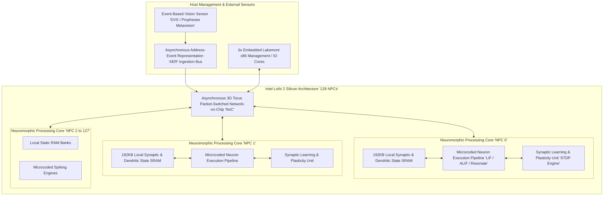
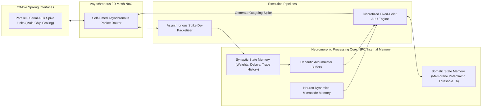
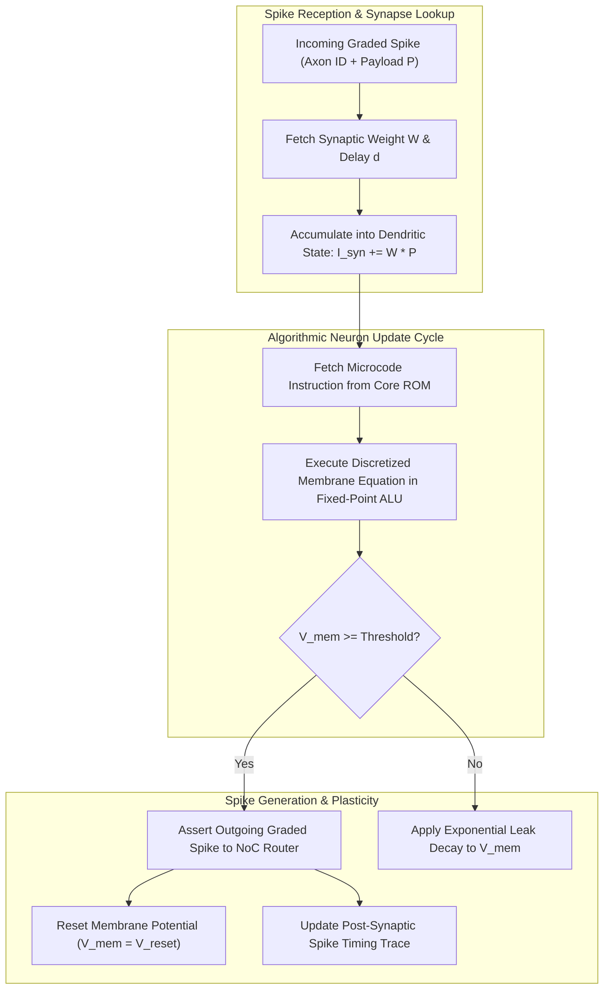
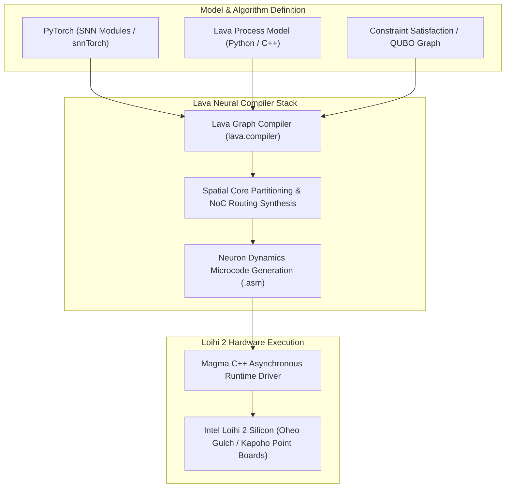

# 🧠 Intel Loihi 2: Asynchronous Neuromorphic Spiking Neural Processor & Microcode Architecture

## 1. Executive Summary & Hardware Typology

**Intel Loihi 2** is Intel's second-generation **Neuromorphic Spiking Neural Network (SNN)** processor, fabricated on a pre-production Intel 4 / Intel 3 process node. Designed to transcend the von Neumann memory wall and the continuous power dissipation of synchronous frame-based accelerators, Loihi 2 processes information using **asynchronous, event-driven spike messages**.

Loihi 2 integrates **128 Neuromorphic Processing Cores (NPCs)** alongside 6 embedded Lakemont x86 management cores on a single monolithic die. It scales up to **1,000,000 programmable spiking neurons** and **120,000,000 synaptic connections**, introducing **Graded Spikes (up to 32-bit payloads)**, fully **microcoded neuron dynamics**, and an asynchronous 3D Network-on-Chip (NoC) interconnect operating at sub-millisecond response latencies and active power envelopes between **$5\text{ mW} - 250\text{ mW}$**.



### Intel Loihi 2 Architecture Specifications Matrix

| Architectural Parameter | Technical Specification |
| :--- | :--- |
| **Manufacturing Process Node** | Intel 4 / Intel 3 (Extreme Ultraviolet Lithography EUV) |
| **Silicon Die Size** | $31\text{ mm}^2$ monolithic silicon die |
| **Neuromorphic Processing Cores (NPCs)**| **128 Cores per Die** |
| **Embedded Control Processors** | 6x 32-bit Lakemont x86 cores with local TCM SRAM |
| **Neuron Capacity** | Up to **1,000,000 Programmable Spiking Neurons per chip** |
| **Synapse Capacity** | Up to **120,000,000 Synaptic Connections per chip** |
| **Interconnect Topology** | Asynchronous 3D Mesh / Torus Network-on-Chip (NoC) |
| **Spike Signaling Format** | Binary Spikes $\{0, 1\}$ and **Graded Spikes (up to 32-bit payloads)** |
| **Neuron Programmability** | Fully programmable microcode instruction set (Fixed-Point ALU) |
| **On-Chip SRAM Capacity** | **24.5 MB Aggregate** (192 KB dedicated SRAM per NPC) |
| **Synaptic Plasticity** | Hardware-accelerated Spike-Timing-Dependent Plasticity (STDP) |
| **Active Power Envelope** | **$5\text{ mW} - 250\text{ mW}$** (Static leakage $< 1\text{ mW}$) |

---

## 2. Compute Core & Memory Hierarchy

Loihi 2 completely eliminates off-chip DRAM access during inference and learning. Every NPC core integrates dedicated static memory for synaptic weights, axonal delays, and neuron membrane states.



### Memory Locality & Asynchronous Routing
1. **In-Memory Computing**: Synaptic weights reside in static SRAM directly adjacent to the dendritic accumulation ALU. When an incoming spike packet arrives, the core updates only the specific synapses addressed by the spike, consuming zero dynamic energy on inactive connections.
2. **Asynchronous 3D Mesh Interconnect**: Spike packets traverse a clockless, self-timed router mesh. Because there is no global clock synchronization, spikes propagate across the silicon fabric with point-to-point transit times under **$50\text{ nanoseconds}$**.

---

## 3. Micro-Architectural Mechanics: Microcoded Neuron Models & Graded Spikes

### Microcoded Neuron Pipeline

Unlike Loihi 1, which featured hardwired Leaky Integrate-and-Fire (LIF) equations, Loihi 2 introduces a programmable microcode execution engine. Developers can implement arbitrary non-linear differential equations (e.g. Adaptive LIF, Resonate-and-Fire, Izhikevich, Multi-Compartment Dendrites).



### Mathematical Formulation of Discretized Neuron Dynamics
A standard Adaptive Leaky Integrate-and-Fire (ALIF) neuron discretized for Loihi 2 fixed-point microcode executes:
$$V[t] = \alpha_v \cdot V[t-1] + I_{\text{syn}}[t] - \theta[t-1] \cdot S[t-1]$$
$$\theta[t] = \alpha_\theta \cdot \theta[t-1] + \beta \cdot S[t-1]$$
$$S[t] = \begin{cases} 1 & \text{if } V[t] \ge \theta[t] \\ 0 & \text{otherwise} \end{cases}$$
- Where $\alpha_v$ and $\alpha_\theta$ are fixed-point exponential decay constants, $\theta[t]$ is the dynamic adaptive threshold, and $S[t]$ is the emitted spike event.

### Graded Spikes (32-Bit Payloads)
Loihi 2 supports **Graded Spikes**, where a spike packet carries an integer or fixed-point payload $P \in [-2^{31}, 2^{31}-1]$ in addition to the destination axon ID. This enables high-dynamic-range sensory fusion and exact algorithmic message-passing (e.g. Graph Optimization, Quadratic Unconstrained Binary Optimization [QUBO], Kalman filter propagation) without requiring high-frequency spike rate coding.

---

## 4. Software Stack, Intel Lava Framework & Deployment

Loihi 2 applications are developed using the **Intel Lava Framework (`lava-nc`)**, an open-source, modular Python and C++ software stack for neuromorphic computing.



### Practical Lava Python Implementation Example

```python
import numpy as np
from lava.magma.core.process.process import AbstractProcess
from lava.magma.core.process.ports.ports import InPort, OutPort
from lava.proc.lif.process import LIF
from lava.proc.dense.process import Dense

# Instantiate a 3-Layer Spiking Neural Network on Loihi 2 Target
class NeuromorphicVisionPipeline:
    def __init__(self, num_inputs=1024, num_hidden=512, num_outputs=10):
        # Layer 1: Input projection layer
        self.dense1 = Dense(weights=np.random.randn(num_hidden, num_inputs) * 0.1)
        self.lif_hidden = LIF(shape=(num_hidden,), vth=10.0, du=0.1, dv=0.2)
        
        # Layer 2: Output classification layer
        self.dense2 = Dense(weights=np.random.randn(num_outputs, num_hidden) * 0.1)
        self.lif_out = LIF(shape=(num_outputs,), vth=5.0, du=0.1, dv=0.2)
        
        # Connect Asynchronous Spike Ports
        self.dense1.a_out.connect(self.lif_hidden.a_in)
        self.lif_hidden.s_out.connect(self.dense2.s_in)
        self.dense2.a_out.connect(self.lif_out.a_in)

# Model compiles to Loihi 2 microcode via lava.magma.core.run_configs.Loihi2HwCfg
```

---

## 5. Latency, Energy & Neuromorphic Benchmarks

- **Synaptic Energy Efficiency**: Consumes **$< 1.0\text{ pJ}$ per synaptic transmission**, compared to $50 - 500\text{ pJ}$ per MAC operation on standard GPUs.
- **Latency**: Event-driven reaction time from sensory spike injection to output actuation is **$< 500\ \mu\text{s}$**.
- **Static Power**: Clockless asynchronous design eliminates dynamic clock distribution trees, dropping idle leakage to $< 1\text{ mW}$.

---

## 6. Comparative Neuromorphic Processor Matrix

| Architectural Dimension | Intel Loihi 2 | Intel Loihi 1 | SynSense Speck | BrainChip Akida AKD1000 |
| :--- | :--- | :--- | :--- | :--- |
| **Fabrication Node** | Intel 4 / Intel 3 EUV | 14nm FinFET | 55nm / 22nm Mixed | 28nm CMOS |
| **Neuron Capacity** | **1,000,000 Neurons** | 128,000 Neurons | 320,000 Neurons | 1,200,000 Neurons |
| **Synapse Capacity** | **120,000,000 Synapses**| 130,000,000 Synapses| ~320,000 Synapses | ~10,000,000 Synapses |
| **Spike Payload** | **Graded Spikes (32-bit)**| Binary Spikes $\{0, 1\}$ | Binary Spikes $\{0, 1\}$ | 1-bit, 2-bit, 4-bit Spikes |
| **Neuron Model** | **Microcoded (Programmable)**| Fixed LIF Equations | Fixed Recurrent SNN | Fixed Digital SNN |
| **Active Power** | **$5\text{ mW} - 250\text{ mW}$** | $20\text{ mW} - 1.0\text{ W}$ | **$1\text{ mW} - 8\text{ mW}$** | $100\text{ mW} - 1.0\text{ W}$ |
| **Integrated Sensor** | No (External DVS/AER) | No (External DVS/AER) | **Integrated $128\times 128$ DVS**| No (External Sensor) |
| **Software Stack** | **Intel Lava Framework** | NxSDK | Rockpool / Samna | MetaTF / Akida SDK |

---

## 7. Cross-References & Related Frameworks

- [[hardware/synsense-speck|SynSense Speck Sub-Milliwatt Vision Processor]]
- [[hardware/intel-npu|Intel NPU 4 & 5 Client Architecture]]
- [[topics/real-time-systems/00-real-time-systems-moc|Real-Time Systems & Determinism]]
- [[topics/safety-verification-and-robustness/00-safety-verification-and-robustness-moc|Safety Verification & Robustness]]
