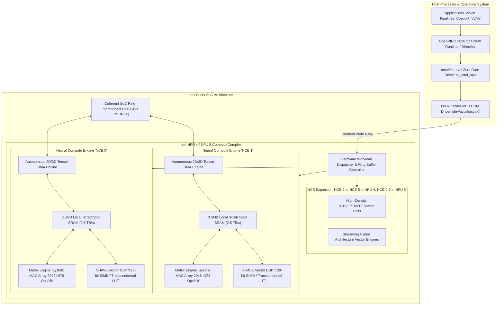
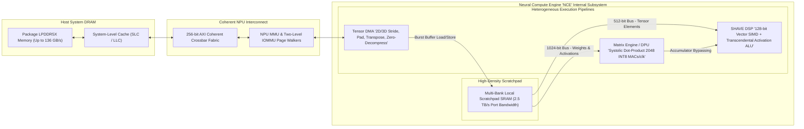
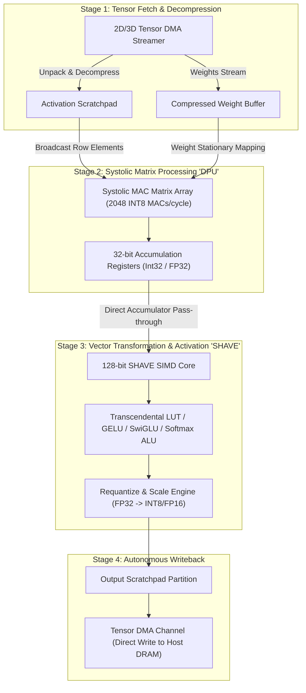
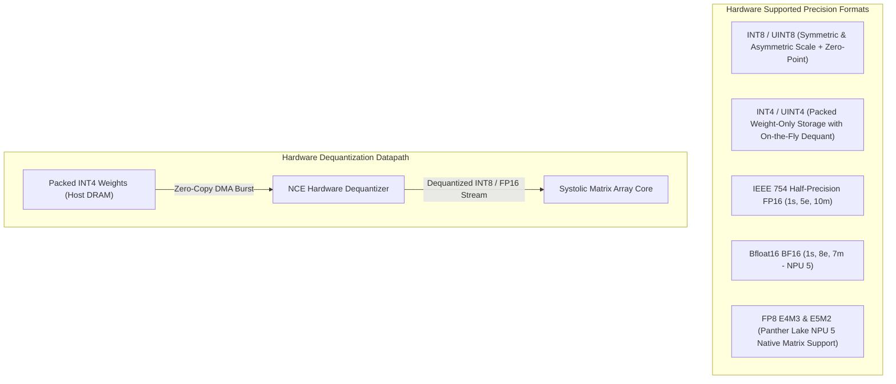
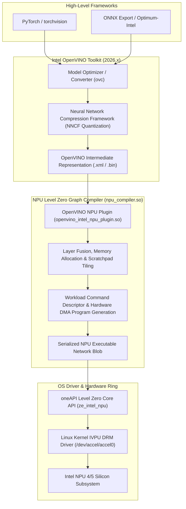

# 🧠 Intel NPU 4 & 5: Lunar Lake, Arrow Lake & Panther Lake Neural Processing Units

## 1. Executive Summary & Hardware Typology

The **Intel Neural Processing Unit (NPU)** lineage—originating from the microarchitectural evolution of Movidius Myriad and Keem Bay Vision Processing Units (VPUs)—has transformed from an auxiliary vision coprocessor into a primary heterogeneous compute engine integrated directly into Intel client and edge System-on-Chip (SoC) architectures.

Spanning **Intel NPU 4** (introduced in **Lunar Lake** and **Arrow Lake**) and **Intel NPU 5** (in **Panther Lake** on Intel 18A), this architecture delivers between **48 and 55+ sustained INT8 TOPS** and up to **24–32 TFLOPS of FP16/FP8 compute** within an active power envelope of **$1.8\text{ W} - 5.5\text{ W}$**, achieving over **10 INT8 TOPS/Watt** energy efficiency.



### Typology Evolution Across Intel NPU Generations

| Architecture Generation | Codename / Process Node | Silicon Partitioning | NCE Count | Peak Compute (INT8 / FP16) | Dedicated SRAM | Memory Bandwidth (Peak) | Active Power Envelope |
| :--- | :--- | :--- | :--- | :--- | :--- | :--- | :--- |
| **Intel NPU 3720 (NPU 3)** | Meteor Lake (Intel 4 + TSMC N5/N6) | Stand-alone SoC Tile | 2 NCEs | 11.5 TOPS / 5.75 TFLOPS | 4 MB | Up to 120 GB/s (Host Fabric) | 1.5 W – 4.5 W |
| **Intel NPU 4000 (Lunar Lake)**| Lunar Lake (TSMC N3B) | Unified Compute Island | **6 NCEs** | **48.0 TOPS / 24.0 TFLOPS** | **14 MB High-Speed SRAM** | 136 GB/s (On-Package LPDDR5X)| **1.8 W – 5.5 W** |
| **Intel NPU 4000 (Arrow Lake)**| Arrow Lake (TSMC N3B / Intel 20A)| SoC Tile | 2–4 NCEs | 13.0 – 26.0 TOPS | 4 – 8 MB | Up to 140 GB/s (DDR5/LPDDR5X) | 2.0 W – 6.0 W |
| **Intel NPU 5000 (Panther Lake)**| Panther Lake (Intel 18A) | Dedicated NPU Compute Tile | **8 NCEs** | **55+ TOPS / 32 TFLOPS (FP8)**| **18 MB High-Speed SRAM** | 160 GB/s (LPDDR5X-9600) | 2.0 W – 7.0 W |

---

## 2. Compute Core & Memory Hierarchy

The compute topology of the Intel NPU centers around symmetric clusters called **Neural Compute Engines (NCEs)**. Each NCE operates as an independent, heterogeneous compute island containing high-density matrix execution units, Streaming Hybrid Architecture Vector Engines (SHAVE DSPs), autonomous multi-dimensional Direct Memory Access (DMA) controllers, and ultra-wide local scratchpad SRAM.



### Memory Subsystem Mechanics
1. **Local Scratchpad SRAM vs. Hardware Caches**: The NCE uses a purely software-scheduled local scratchpad memory architecture. The OpenVINO / Level Zero graph compiler explicitly manages the residency of weights, input activations, intermediate feature maps, and output tensors in the scratchpad, eliminating cache-miss stalls and non-deterministic cache evictions.
2. **Autonomous Multi-Dimensional Tensor DMA**: The DMA engine within each NCE performs hardware-accelerated multidimensional strides ($W \times H \times C$), spatial padding (zero padding for convolutions), on-the-fly matrix transpositions ($NHWC \leftrightarrow NCHW$), and hardware run-length zero-value weight decompression without consuming CPU cycles or vector ALUs.
3. **Unified Memory & Zero-Copy I/O**: Intel NPU 4/5 integrates directly with the SoC I/O Memory Management Unit (IOMMU) via PCIe/AXI coherent bridges. Through Linux `dma-buf` or Windows Shared Heap APIs, user-space inference pipelines allocate virtual memory buffers accessible by both CPU execution cores and NPU hardware DMA channels without memory copying.

---

## 3. Micro-Architectural Mechanics & Functional Units

Inside each NCE, the execution pipeline separates matrix multiplication workloads from non-linear activations, normalizations, and element-wise operations.



### Hardware Functional Units

#### 1. Matrix Multiplication Unit (DPU / Dot-Product Engine)
- **Execution Topology**: 2D Systolic Multiply-Accumulate (MAC) array optimized for fused matrix-multiplication-accumulation ($C = A \cdot B + C$).
- **Throughput Calculation**: In NPU 4 (Lunar Lake), each NCE delivers 2048 INT8 MAC operations per clock cycle or 1024 FP16 MAC operations per clock cycle. Across 6 active NCEs running at a peak clock of ~1.95 GHz:
  $$\text{Peak INT8 TOPS} = 6 \text{ NCEs} \times 2048 \frac{\text{MACs}}{\text{cycle}} \times 2 \frac{\text{FLOPs}}{\text{MAC}} \times 1.95 \text{ GHz} \approx 47.92 \text{ TOPS}$$

#### 2. Streaming Hybrid Architecture Vector Engine (SHAVE DSP)
- **Execution Topology**: 128-bit wide Vector Very Long Instruction Word (VLIW) SIMD processor.
- **Micro-Ops**: Executes non-linear activation functions (GeLU, SiLU, Softmax, LayerNorm, RMSNorm, RoPE embedding calculations) concurrently with DPU matrix execution.
- **Hardware Look-Up Tables (LUTs)**: Dedicated hardware interpolation units evaluate exponential, reciprocal square root, and sigmoid functions in single-digit clock cycles.

---

## 4. Numerical Precision & Quantization

Intel NPU 4 and NPU 5 support native multi-precision arithmetic with hardware acceleration for mixed-precision activations and weights.



### Precision Capabilities Matrix

| Numerical Format | Bit-Width (Sign / Exp / Mantissa) | Dynamic Range | Hardware Support | Peak TOPS per NCE (at 1.9 GHz) | Primary Target Workloads |
| :--- | :--- | :--- | :--- | :--- | :--- |
| **INT8 / UINT8** | 8-bit Integer (Two's Complement) | $[-128, 127]$ / $[0, 255]$ | Native (All Gens) | 7.78 TOPS | Object Detection, Vision Transformers, Quantized LLM Attention |
| **INT4 / UINT4** | 4-bit Integer (Nibble Packed) | $[-8, 7]$ / $[0, 15]$ | Native Weight Dequant | 15.56 TOPS (Effective BW) | Llama-3 / Phi-3 4-bit Weight-Only KV Cache & Projections |
| **FP16** | 16-bit Floating Point (1 / 5 / 10) | $\sim 6.1 \times 10^{-5} \text{ to } 65504$ | Native Matrix & Vector | 3.89 TFLOPS | Feature Extraction, Diffusion Models, Depth Estimation |
| **BF16** | 16-bit Floating Point (1 / 8 / 7) | $\sim 1.18 \times 10^{-38} \text{ to } 3.4 \times 10^{38}$ | Native (NPU 5) | 3.89 TFLOPS | Fine-Tuned Vision Transformers, Zero-Shot Embeddings |
| **FP8 (E4M3 / E5M2)** | 8-bit Floating Point | Scaled Dynamic Range | Native (NPU 5) | 15.56 TOPS | Multimodal Foundation Models, Vision-Language Models |

---

## 5. Software Stack, OpenVINO & Level Zero Driver Interface

The software integration model for Intel Client NPUs transitions from high-level model definitions down to low-level hardware doorbells via the OpenVINO intermediate representation (IR) and the oneAPI Level Zero compute abstraction layer.



### Production Toolchain Recipes

#### 1. Quantizing a Computer Vision Model via NNCF for Intel NPU
```python
import openvino as ov
import nncf

# Initialize OpenVINO Core Runtime
core = ov.Core()
print(f"Available Devices: {core.available_devices}")  # Lists 'NPU'

# Load Model Graph
model = core.read_model("models/yolov12_backbone.xml")

# Execute INT8 Post-Training Quantization targeted for Intel NPU 4
quantized_model = nncf.quantize(
    model,
    calibration_dataset,
    model_type=nncf.ModelType.TRANSFORMER,
    preset=nncf.QuantizationPreset.PERFORMANCE,
    target_device=nncf.TargetDevice.NPU
)

# Save Optimized INT8 Graph
ov.save_model(quantized_model, "models/yolov12_backbone_npu_int8.xml")
```

#### 2. C++ Zero-Copy Execution with oneAPI Level Zero
```cpp
#include <openvino/openvino.hpp>
#include <iostream>

void run_npu_zero_copy_inference() {
    ov::Core core;
    
    // Configure NPU Plugin with Performance Hints
    ov::AnyMap npu_config = {
        {ov::hint::performance_mode.name(), ov::hint::PerformanceMode::LATENCY},
        {ov::hint::execution_mode.name(), ov::hint::ExecutionMode::PERFORMANCE}
    };
    
    // Compile Model directly for NPU Hardware Target
    auto compiled_model = core.compile_model("models/yolov12_backbone_npu_int8.xml", "NPU", npu_config);
    auto infer_request = compiled_model.create_infer_request();
    
    // Execute Inference (Asynchronous hardware queue doorbell)
    infer_request.infer();
    std::cout << "NPU Execution Complete" << std::endl;
}
```

---

## 6. Functional Safety, Real-Time Latency & Thermal Profiles

- **Active Efficiency**: 8.5 to 11.2 INT8 TOPS/Watt (pure NPU tile boundary), and ~4.5 to 6.2 INT8 TOPS/Watt (full SoC package level including LPDDR5X power).
- **Leakage Management**: Autonomous power-gating islands disconnect individual NCEs when workload batching drops below threshold, yielding idle power dissipation $< 15\text{ mW}$.

---

## 7. Comparative Architecture Matrix

| Architectural Dimension | Intel NPU 4 (Lunar Lake) | Qualcomm Hexagon (Snapdragon X Elite) | Apple Neural Engine (M4) | AMD XDNA 2 (Strix Point) |
| :--- | :--- | :--- | :--- | :--- |
| **Manufacturing Node** | TSMC N3B | TSMC N4P | TSMC N3E | TSMC N4 |
| **Compute Core Typology** | 6x Neural Compute Engines | Fused Scalar + 2x HVX + 2x HMX | 16-Core Neural Engine | 32 AIE-ML v2 Spatial Tiles |
| **Peak INT8 Throughput** | **48.0 TOPS** | 45.0 TOPS | 38.0 TOPS | **50.0 TOPS (Block FP16)** |
| **On-Chip Dedicated SRAM**| **14 MB (2.5 TB/s)** | 45 MB Micro-Tile Memory | ~16 MB System Cache | ~32 MB Local Data Memory |
| **Native Transformer Units**| Dual DPU + SHAVE Softmax/Norm| HMX Systolic + TransAct ALU | Matrix Units + Vector ALU | AIE-ML Matrix Tiles |
| **Software Stack** | OpenVINO 2026, Level Zero | Qualcomm QNN SDK, DirectML | CoreML, Apple Metal Performance| AMD Vitis AI, ROCm |
| **Active Power Envelope** | **1.8 W – 5.5 W** | 3.5 W – 6.0 W | ~3.0 W – 6.0 W | 4.0 W – 8.0 W |
| **Target Platforms** | Copilot+ Ultra-Thin Laptops | Copilot+ Windows Laptops | iPad Pro / MacBook Pro | Ryzen AI AI-PCs & Handhelds |

---

## 8. Cross-References & Related Frameworks

- [[hardware/intel-xeon-amx|Intel Xeon 6th Gen AMX Datacenter Processor]]
- [[hardware/qualcomm-hexagon-npu|Qualcomm Hexagon NPU Architecture]]
- [[hardware/arm-ethos-u85|Arm Ethos-U85 Micro-NPU]]
- [[docs/edge-ai-quantization-playbook|Edge AI Quantization & Compression Playbook]]
