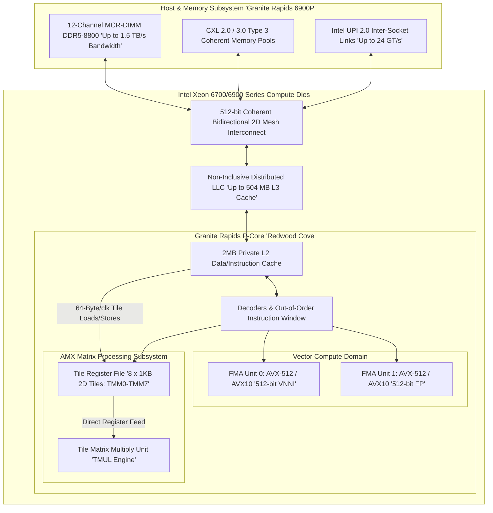
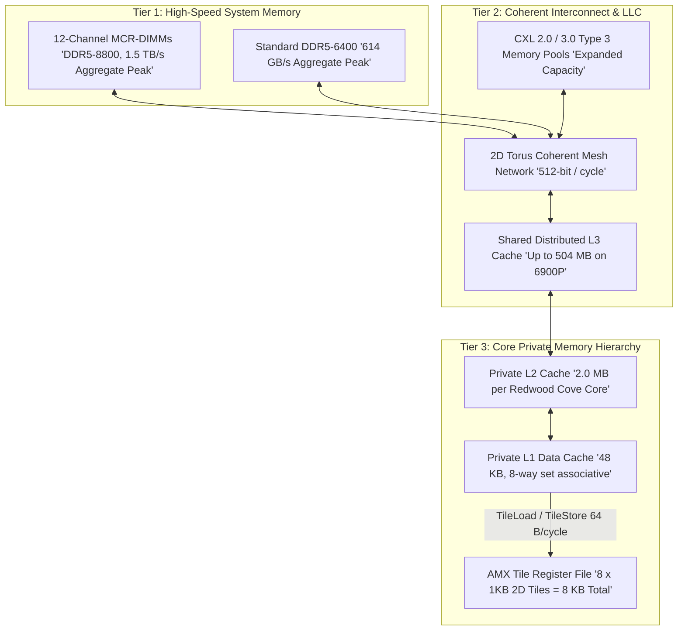
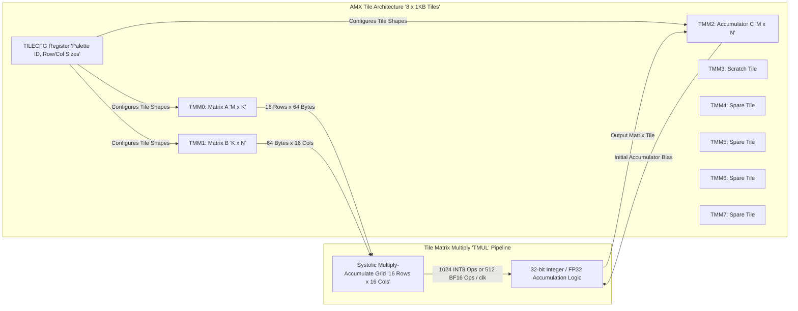
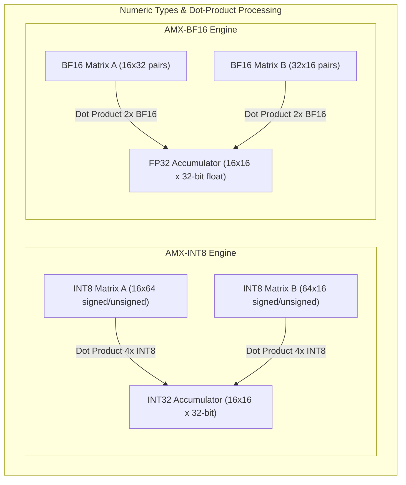
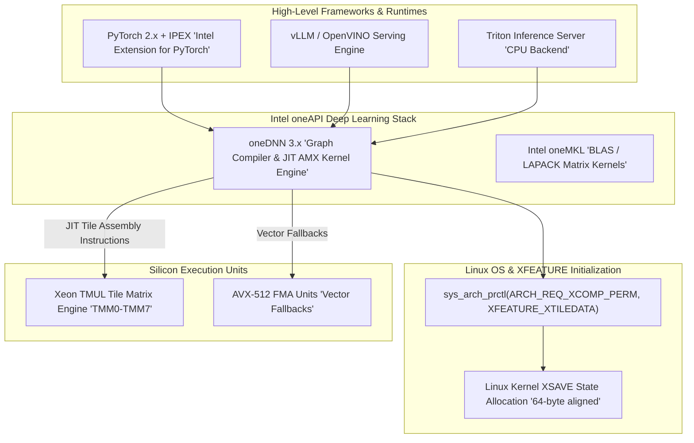

# 🏢 Intel Xeon 6th Gen: AMX TMUL Matrix Acceleration & Datacenter AI Architecture

## 1. Executive Summary & Hardware Typology

The introduction of **Intel Advanced Matrix Extensions (Intel AMX)** across modern server processors—culminating in the **Intel Xeon 6th Gen** family (**Granite Rapids** with Redwood Cove P-cores and **Sierra Forest** with Sierra Glen E-cores)—transforms the datacenter x86-64 CPU from a traditional scalar/vector processor into a hybrid general-purpose compute core and dense tensor acceleration engine.

Intel AMX introduces a two-dimensional register file (8 $\times$ 1KB **Tile Registers**) and an autonomous hardware **Tile Matrix Multiply (TMUL)** systolic execution engine directly into each physical CPU core. Operating alongside **12-Channel MCR-DIMM DDR5-8800** memory delivering up to **1.5 TB/s** of bandwidth and **CXL 2.0/3.0 Type 3** coherent memory expansion, a dual-socket Xeon 6900P system delivers over **3,140 INT8 TOPS** and **1,570 TFLOPS of BF16/FP16 compute**, enabling single-node hosting and serving of massive Vision-Language-Action (VLA) models and multi-stream computer vision pipelines without discrete accelerator dependencies.



### Xeon Generational AI & Vector Compute Progression

| Microarchitecture / Platform | Codename | Core Composition | Max Cores per Socket | Matrix Engine (AMX) | Memory Subsystem & Bandwidth | Peak BF16 Compute per Socket | Peak INT8 Inference per Socket |
| :--- | :--- | :--- | :--- | :--- | :--- | :--- | :--- |
| **4th Gen Xeon Scalable** | Sapphire Rapids | Golden Cove (P-core) | 60 Cores | AMX-BF16, AMX-INT8, TMUL v1 | 8-Channel DDR5-4800 (307 GB/s) | 36.8 TFLOPS | 73.7 TOPS |
| **5th Gen Xeon Scalable** | Emerald Rapids | Raptor Cove (P-core) | 64 Cores | AMX-BF16, AMX-INT8, TMUL v1 | 8-Channel DDR5-5600 (358 GB/s) | 45.0 TFLOPS | 90.0 TOPS |
| **6th Gen Xeon 6700E/6900E** | Sierra Forest | Sierra Glen (E-core) | Up to 288 Cores | AVX-IFMA, AVX-VNNI (No AMX) | 8/12-Ch DDR5-6400 (614 GB/s) | 18.4 TFLOPS (FP32) | 147.0 TOPS |
| **6th Gen Xeon 6900P** | Granite Rapids-AP | Redwood Cove (P-core)| **Up to 128 Cores** | **AMX-BF16, AMX-INT8, AMX-FP16, TMUL v2** | **12-Ch MCR-DIMM (1.5 TB/s)** | **786.0 TFLOPS** | **1,572.0 TOPS** |

---

## 2. Compute Core & Memory Hierarchy

The memory subsystem of Xeon 6 Granite Rapids is architected to eliminate memory-wall bottlenecks for continuous batching generative inference and high-throughput multi-stream computer vision.



### Key Memory Enhancements in Granite Rapids
1. **Multiplexer Combined Ranks (MCR) DIMM Support**: MCR-DIMMs incorporate a host-side buffer logic device that multiplexes two simultaneous DDR5 memory ranks, effectively doubling the interface clock frequency to DDR5-8800 and delivering **$1.5\text{ TB/s}$** of sustained memory bandwidth across 12 channels.
2. **Private L2 Cache Doubling**: The Redwood Cove P-core features 2MB of dedicated L2 data cache (compared to 1.25MB on Sapphire Rapids), reducing L3 access contention during continuous matrix tile reloading.
3. **CXL 2.0 Heterogeneous Tiering**: Native Compute Express Link (CXL 2.0 Type 3) enables attaching hundreds of gigabytes of coherent, low-latency pooled memory, allowing hosting 70B+ parameter Vision-Language-Action (VLA) models in single-socket host memory.

---

## 3. Micro-Architectural Mechanics: Tile Architecture & TMUL Engine

Intel AMX introduces an extensible, stateful two-dimensional register architecture decoupled from legacy 1D vector registers (XMM/YMM/ZMM).



### Tile Register File & TMUL Specification
- **Tile Architecture**: AMX exposes 8 two-dimensional registers designated `TMM0` through `TMM7`.
- **Capacity**: Each tile holds up to 16 rows by 64 bytes (1024 bytes). The entire tile register file totals 8 KB per physical core.
- **Dynamic Configuration (`LDTILECFG`)**: Before tile execution, software loads a 64-byte configuration structure into `TILECFG` via the `LDTILECFG` instruction. This dynamically programs the active height (rows: 1 to 16) and width (bytes per row: 1 to 64) for each `TMM` register.

### AMX Instruction Set & Execution Mechanics
1. **`TDPBF16PS` (Dot Product Bfloat16 Pairs to Single-Precision)**:
   Multiplies packed pairs of BF16 values in `TMM_A` by packed pairs of BF16 values in `TMM_B`, accumulates the products into single-precision floating-point (FP32) elements in `TMM_C`:
   $$C_{i, j} = C_{i, j} + \sum_{k=0}^{31} A_{i, k} \cdot B_{k, j}$$
   - **Throughput**: 512 BF16 FLOPs per core clock cycle.
2. **`TDPBSSD` / `TDPBSUD` / `TDPBUSD` / `TDPBUUD` (Dot Product INT8 to INT32)**:
   Computes four-element dot products of signed/unsigned 8-bit integers from `TMM_A` and `TMM_B` and accumulates into 32-bit integers in `TMM_C`:
   $$C_{i, j} = C_{i, j} + \sum_{k=0}^{63} A_{i, k} \cdot B_{k, j}$$
   - **Throughput**: 1024 INT8 Operations per core clock cycle (2048 INT8 Ops/cycle on dual-TMUL cores).
3. **`TDPFP16PS` (Dot Product FP16 to FP32)**:
   Introduced in Granite Rapids, enables native IEEE half-precision matrix multiplication for specialized vision decoders.

---

## 4. Numerical Precision & Arithmetic Throughput

AMX units operate natively in INT8, FP16, and BF16 with internal 32-bit accumulation to prevent numerical overflow and maintain parity with FP32 baseline models.



### Detailed Arithmetic Capabilities

| Extension | Input Precision A / B | Accumulator Precision | Max Elements / Cycle / Core | Relative Speedup vs AVX-512 VNNI | Target Workload |
| :--- | :--- | :--- | :--- | :--- | :--- |
| **AMX-INT8** | INT8 / UINT8 | INT32 (Signed 32-bit) | 1024 Ops/cycle | $\sim 4.0\times - 5.5\times$ | Quantized Vision Backbones, ResNet, YOLOv12, INT8 Transformer Layers |
| **AMX-BF16** | Bfloat16 (1/8/7) | FP32 (IEEE Single Precision) | 512 FLOPs/cycle | $\sim 8.0\times$ (vs AVX-512 FP32) | Vision Transformers (ViT, DINOv2), LLM Token Generation, Diffusion |
| **AMX-FP16** | FP16 (1/5/10) | FP32 (IEEE Single Precision) | 512 FLOPs/cycle | $\sim 8.0\times$ (vs AVX-512 FP32) | Medical Imaging, Spectral Vision, High-Precision Depth Estimation |
| **AVX-512 VNNI**| INT8 / UINT8 | INT32 | 256 Ops/cycle | Baseline ($1.0\times$) | Legacy Kernels, Point-wise Post-Processing, Irregular Tensor Ops |

---

## 5. Software Stack, IPEX & C Intrinsics

Deployment on Intel Xeon AMX requires initializing the OS kernel extended state management (`XSAVE` and `arch_prctl`) and utilizing libraries optimized for TMUL tile scheduling (Intel oneDNN, Intel Extension for PyTorch, OpenVINO).



### Complete C Intrinsics Example: AMX-BF16 Matrix Multiplication

```c
#include <stdio.h>
#include <stdlib.h>
#include <stdint.h>
#include <stdbool.h>
#include <unistd.h>
#include <sys/syscall.h>
#include <immintrin.h>

#define ARCH_REQ_XCOMP_PERM     0x1023
#define XFEATURE_XTILEDATA      18

// 64-byte Tile Configuration Structure
typedef struct __tile_config {
    uint8_t  palette_id;
    uint8_t  start_row;
    uint8_t  reserved_0[14];
    uint16_t colsb[16];          // Column sizes in bytes
    uint8_t  rows[16];           // Row counts
} __tilecfg;

// Enable Linux Kernel Permission for AMX Extended State (XSAVE)
bool init_amx_system() {
    if (syscall(SYS_arch_prctl, ARCH_REQ_XCOMP_PERM, XFEATURE_XTILEDATA) != 0) {
        perror("Failed to request AMX XTILEDATA permissions");
        return false;
    }
    return true;
}

// Compute C = A * B + C using AMX-BF16 Intrinsics
void amx_bf16_gemm(const void* mat_a, const void* mat_b, void* mat_c, int stride_bytes) {
    __tilecfg cfg = {0};
    cfg.palette_id = 1;
    cfg.start_row = 0;

    // Configure TMM0 (Matrix A: 16 rows, 64 bytes = 32 BF16 pairs)
    cfg.rows[0] = 16;
    cfg.colsb[0] = 64;

    // Configure TMM1 (Matrix B: 16 rows, 64 bytes = 16 columns of 32-bit pairs)
    cfg.rows[1] = 16;
    cfg.colsb[1] = 64;

    // Configure TMM2 (Accumulator Matrix C: 16 rows, 64 bytes = 16 FP32 columns)
    cfg.rows[2] = 16;
    cfg.colsb[2] = 64;

    // Load Tile Configuration into TILECFG register
    _tile_loadconfig(&cfg);

    // Load Matrix Tiles from Memory
    _tile_loadd(0, mat_a, stride_bytes);
    _tile_loadd(1, mat_b, stride_bytes);
    _tile_loadd(2, mat_c, stride_bytes);

    // Execute Fused BF16 Matrix Multiplication: TMM2 += TMM0 * TMM1
    _tile_dpbf16ps(2, 0, 1);

    // Store Result Tile back to memory
    _tile_stored(2, mat_c, stride_bytes);

    // Release Tile Configuration
    _tile_release();
}
```

---

## 6. Thermal, Multi-Socket & Scalability

- **Socket Level Scaling**: Granite Rapids 6900P scales up to 128 cores per socket (256 cores in 2S), delivering **1,572 TOPS INT8** and **786 TFLOPS BF16** per socket.
- **Thermal Power Envelope**: Socket TDP ranges from **350W to 500W** under continuous dense AMX execution.
- **Memory Bandwidth Efficiency**: 12-channel MCR-DIMM DDR5-8800 feeds high-throughput inference without memory-starvation stalls.

---

## 7. Comparative Architecture Matrix

| Architectural Dimension | Intel Xeon 6900P (AMX) | AMD EPYC 9005 (Turin) | NVIDIA Grace CPU (72-Core) | Ampere Altra Max |
| :--- | :--- | :--- | :--- | :--- |
| **Microarchitecture** | Redwood Cove (P-core) | Zen 5 | Arm Neoverse V2 | Arm Neoverse N1 |
| **Max Core Count / Socket** | 128 Cores | 128 Cores / 192 Dense | 72 Cores | 128 Cores |
| **Dedicated Matrix Unit** | **Yes (AMX TMUL v2)** | No (AVX-512 VNNI Vector) | No (SVE2 Vector SIMD) | No (NEON SIMD) |
| **Peak INT8 per Socket** | **1,572 TOPS** | ~400 TOPS | ~150 TOPS | ~60 TOPS |
| **Peak BF16 / FP16 Compute**| **786 TFLOPS** | ~200 TFLOPS | ~75 TFLOPS | ~30 TFLOPS |
| **Memory Architecture** | 12-Ch MCR-DIMM (1.5 TB/s) | 12-Ch DDR5-6400 (614 GB/s) | LPDDR5X (512 GB/s) | 8-Ch DDR4-3200 (204 GB/s) |
| **CXL Interconnect** | CXL 2.0 / 3.0 Type 3 | CXL 2.0 Type 3 | Proprietary NVLink-C2C | PCIe Gen 4 |
| **Primary Advantage** | Highest CPU tensor throughput| Extreme x86 core density | High energy efficiency | Low power cloud native |

---

## 8. Cross-References & Related Frameworks

- [[hardware/intel-npu|Intel NPU 4 & 5 Client Architecture]]
- [[hardware/nvidia-blackwell-b200|NVIDIA Blackwell B200 Data Center GPU]]
- [[hardware/arm-neoverse-v3ae|Arm Neoverse V3AE High-Throughput CPU]]
- [[docs/edge-ai-quantization-playbook|Edge AI Quantization & Compression Playbook]]
