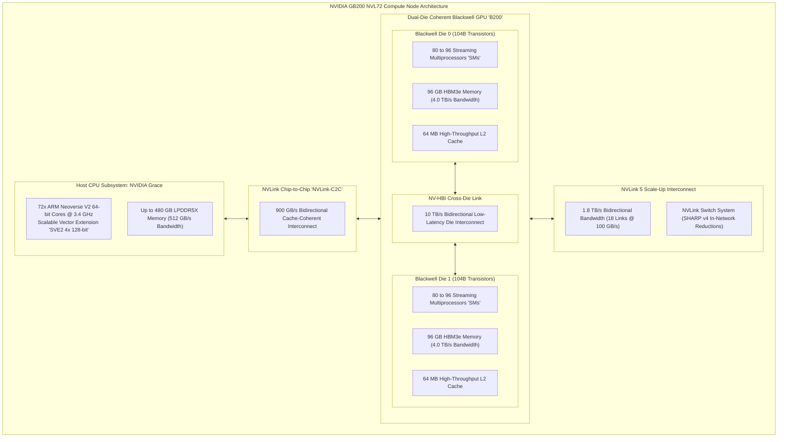
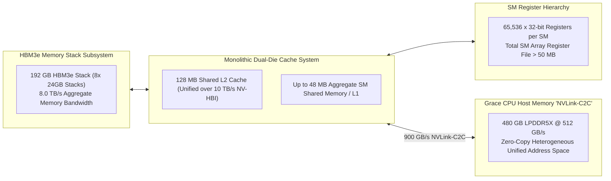
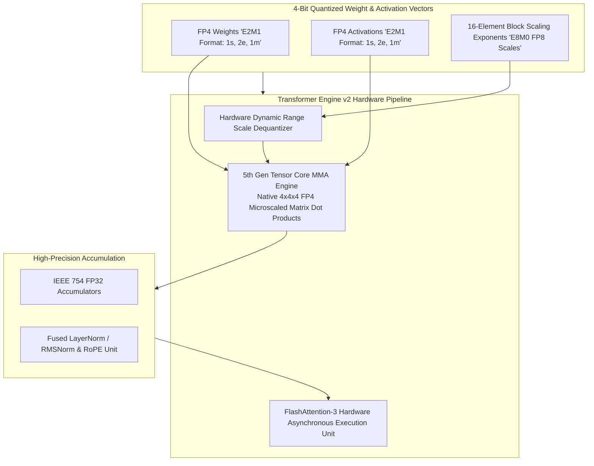
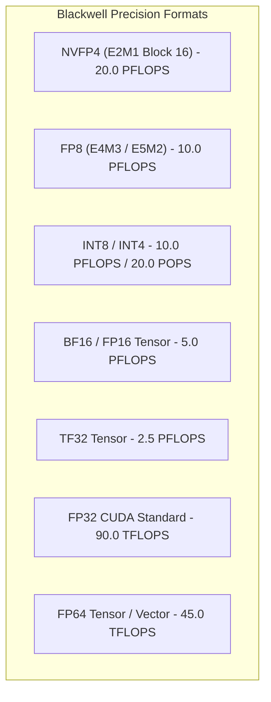
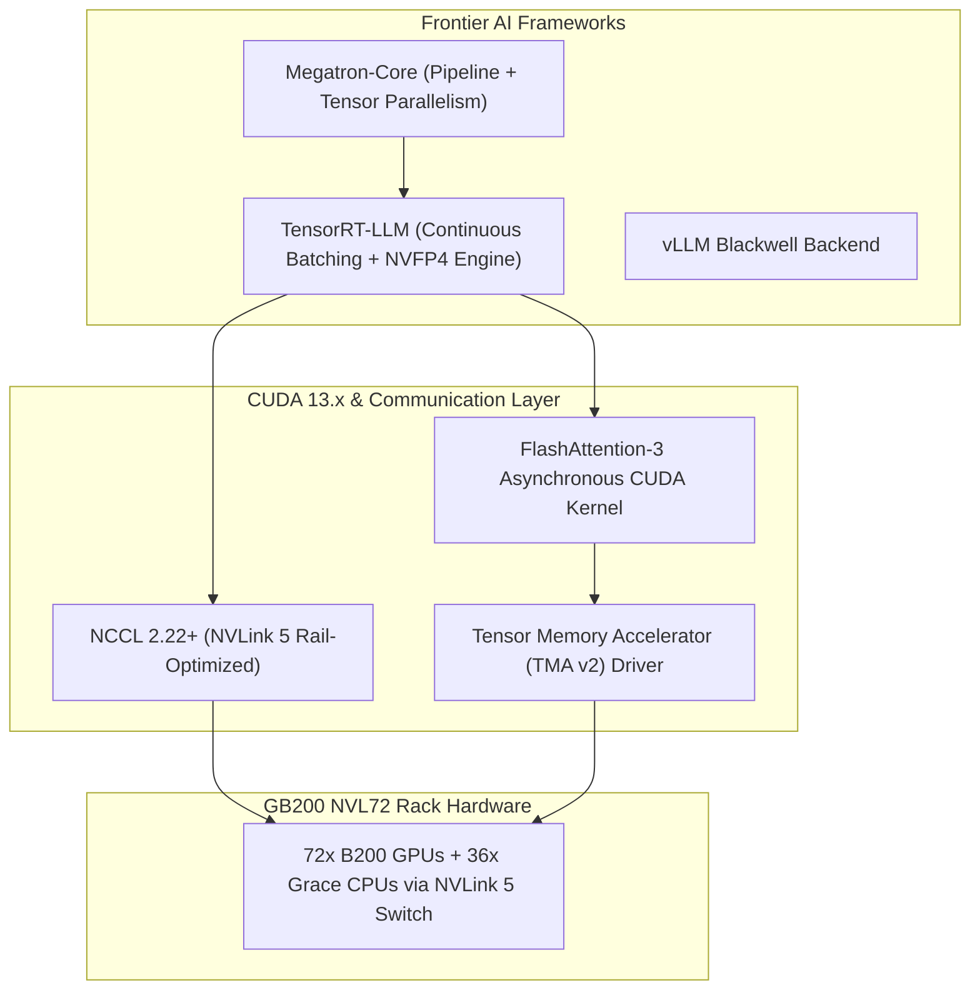

# 🏢 NVIDIA Blackwell B200 & GB200: Dual-Die Architecture, NVLink 5 & Hyperscale NVFP4 AI

## 1. Executive Summary & Hardware Typology

The **NVIDIA Blackwell Architecture**—embodied in the **B200**, **B100**, and **GB200 NVL72** rack-scale systems—represents a foundational breakthrough in high-performance datacenter computing, foundation model pre-training, and hyperscale Vision-Language-Action (VLA) inference. Fabricated on a customized TSMC 4NP process node, Blackwell breaks through single-die photolithographic reticle limits by implementing a **dual-die NV-HBI (High-Bandwidth Interface)** packaging architecture containing 208 billion transistors that behaves as a single, fully coherent monolithic GPU.

Blackwell introduces **5th Generation Tensor Cores** with native **NVFP4 (4-bit Microscaling)** precision, a **2nd Generation Transformer Engine** with hardware FlashAttention-3 acceleration, an ultra-high-bandwidth **8.0 TB/s HBM3e memory subsystem**, a dedicated 800 GB/s hardware **Decompression Engine**, **NVLink 5** delivering 1.8 TB/s bidirectional bandwidth per GPU, and coherent coupling to the **NVIDIA Grace CPU** via 900 GB/s NVLink-C2C.



### Hardware Typology Matrix: Blackwell Datacenter Lineup

| Platform / SKU | Die Configuration | Transistors | Memory Capacity & Type | Memory Bandwidth | Peak FP4 Tensor Compute | Peak FP8 Tensor Compute | Thermal TDP |
| :--- | :--- | :--- | :--- | :--- | :--- | :--- | :--- |
| **B200 Tensor Core** | Dual-Die Coherent | 208 Billion | 192 GB HBM3e (8-Hi) | **8.0 TB/s** | **20.0 PFLOPS** | 10.0 PFLOPS | 1,000 W (SXM) |
| **B100 Tensor Core** | Dual-Die Coherent | 208 Billion | 192 GB HBM3e | **8.0 TB/s** | **14.0 PFLOPS** | 7.0 PFLOPS | 700 W (Air-Cooled)|
| **GB200 (Single Superchip)**| 1x Grace + 2x B200 | 488 Billion | 384 GB HBM3e + 480 GB LPDDR5X | 16.0 TB/s (HBM) + 512 GB/s | **40.0 PFLOPS** | 20.0 PFLOPS | 2,700 W |
| **GB200 NVL72 (Rack-Scale)**| 36 Grace + 72 B200 | 17.5 Trillion| 13.8 TB HBM3e + 17.2 TB LPDDR5X| **576 TB/s Aggregate** | **1.44 EFLOPS** | 720 PFLOPS | 120 kW (Liquid) |

---

## 2. Compute Core & Memory Hierarchy

Blackwell resolves multi-GPU communication and memory bandwidth bottlenecks by treating an entire 72-GPU liquid-cooled rack (the **GB200 NVL72**) as a single unified computing domain sharing 13.8 TB of fast HBM3e memory over a **130 TB/s bisection bandwidth NVLink 5 fabric**.



### Die Layout and Interconnect Specifications
1. **NV-HBI (NVIDIA High-Bandwidth Interface)**:
   - Connects the two reticle-sized silicon dies across a passive silicon bridge with **10 TB/s bidirectional bandwidth**.
   - Maintains full cache coherency across both dies: CUDA threads executing on Die 0 access L2 cache partitions and HBM stacks on Die 1 with sub-10ns cross-die latency.
2. **HBM3e Memory Subsystem**:
   - 8 stacks of 8-high / 12-high HBM3e operating across an 8192-bit interface delivering **$8.0\text{ TB/s}$** per B200 GPU.
   - Eliminates memory bandwidth stalls during multi-head attention (MHA) decoding in trillion-parameter mixture-of-experts (MoE) foundation models.

---

## 3. Micro-Architectural Mechanics: 5th Gen Tensor Cores & NVFP4

Blackwell's 5th Generation Tensor Cores introduce native hardware acceleration for **NVFP4 (4-bit Microscaling)** floating-point matrix multiplication alongside 2nd Generation Transformer Engine optimizations.



#### NVFP4 Microscaling Mathematical Formulation
Standard scalar quantization applies a single global scale factor $\alpha$ across an entire matrix row ($W \approx \alpha \cdot Q$). NVFP4 microscaling applies independent floating-point scale factors $s_b$ across small, 16-element sub-vectors (blocks):
$$X_{i, j} = s_b \cdot q_{i, j}, \quad \text{where } b = \lfloor j / 16 \rfloor, \quad q_{i, j} \in \text{FP4 (E2M1)}, \quad s_b \in \text{FP8 (E8M0)}$$
- **E2M1 Format**: Provides 1 sign bit, 2 exponent bits, and 1 mantissa bit, representing values $\pm \{0, 0.5, 1.0, 1.5, 2.0, 3.0, 4.0, 6.0\}$.
- **Throughput Advantage**: NVFP4 Tensor Core execution delivers **$2\times$ higher throughput** than FP8 Tensor Core execution and **$4\times$ higher throughput** than FP16/BF16.

---

## 4. Numerical Precision & Arithmetic Throughput

The Blackwell B200 delivers dense and sparse computational throughput across floating-point and integer precisions.



### Precision Capabilities Matrix (NVIDIA B200 SXM Single GPU)

| Numerical Precision | Mantissa / Exponent | Block Size | Hardware Acceleration | Peak Dense Compute | Peak Sparse (2:4) Compute |
| :--- | :--- | :--- | :--- | :--- | :--- |
| **NVFP4 (E2M1)** | 1 Sign, 2 Exp, 1 Mant | 16 elements (E8M0 Scale) | 5th Gen Tensor Core | **10.0 PFLOPS** | **20.0 PFLOPS** |
| **FP8 (E4M3 / E5M2)**| 1 Sign, 4/5 Exp, 3/2 Mant | Scalar | 5th Gen Tensor Core | **5.0 PFLOPS** | **10.0 PFLOPS** |
| **INT8 / INT4** | Two's Complement Integer | Scalar | 5th Gen Tensor Core | **5.0 / 10.0 POPS** | **10.0 / 20.0 POPS** |
| **BF16 / FP16** | IEEE Standard Formats | Scalar | 5th Gen Tensor Core | **2.5 PFLOPS** | **5.0 PFLOPS** |
| **TF32** | 1 Sign, 8 Exp, 10 Mant | Scalar | 5th Gen Tensor Core | **1.25 PFLOPS** | **2.5 PFLOPS** |
| **FP32** | IEEE Standard 754 | Scalar | Blackwell CUDA Core | **90.0 TFLOPS** | N/A |
| **FP64** | IEEE Standard 754 | Scalar | Blackwell FP64 Unit | **45.0 TFLOPS** | N/A |

---

## 5. Software Stack, SDKs & Toolchains

The software ecosystem for Blackwell datacenter accelerators integrates **TensorRT-LLM**, **PyTorch 2.x native FP4**, **NVIDIA Megatron-Core**, **CUDA 13.x**, and **NVLink SHARP v4** in-network reductions.



### Production Toolchain Recipes

#### 1. Compiling a Trillion-Parameter MoE Model for B200 in NVFP4
```bash
# Export and Quantize MoE Model to NVFP4 using TensorRT-LLM
python3 tensorrt_llm/quantization/quantize.py \
    --model_dir /models/deepseek-v3/ \
    --dtype bfloat16 \
    --qformat nvfp4 \
    --calib_dataset /data/c4_calibration.json \
    --output_dir /models/deepseek-v3-nvfp4/

# Build NVLink 5 Optimized TensorRT Engine across 8x B200 GPUs
trtllm-build \
    --checkpoint_dir /models/deepseek-v3-nvfp4/ \
    --output_dir /engines/deepseek-v3-b200/ \
    --gemm_plugin nvfp4 \
    --tp_size 8 \
    --pp_size 1 \
    --max_batch_size 256 \
    --max_num_tokens 8192
```

---

## 6. Scale-Out Network & Thermal Topologies

- **NVLink 5 Scale-Up Domain**: 1.8 TB/s bidirectional bandwidth per GPU across 18 high-speed links. The NVLink Network Switch System aggregates up to 72 GPUs into a single shared-memory address space with SHARP v4 in-network hardware reduction.
- **Thermal Management**: GB200 NVL72 operates with full direct-to-chip liquid cooling (water/glycol), dissipating 120 kW per rack while operating at coolant inlet temperatures up to 45°C.

---

## 7. Comparative Datacenter Accelerator Matrix

| Architectural Dimension | NVIDIA B200 | NVIDIA H100 (Hopper) | AMD Instinct MI325X | Google TPU v5p |
| :--- | :--- | :--- | :--- | :--- |
| **Manufacturing Node** | TSMC 4NP (Dual-Die) | TSMC 4N (Monolithic) | TSMC 5nm/6nm (Chiplets) | 3nm Custom |
| **Transistor Count** | **208 Billion** | 80 Billion | 153 Billion | Undisclosed |
| **Memory Capacity & Type** | **192 GB HBM3e** | 80 GB HBM3 | **256 GB HBM3e** | 95 GB HBM3 |
| **Memory Bandwidth** | **8.0 TB/s** | 3.35 TB/s | 6.0 TB/s | 4.8 TB/s |
| **Peak Low-Bit Compute** | **20.0 PFLOPS (NVFP4)**| 4.0 PFLOPS (FP8) | 5.2 PFLOPS (FP8) | ~918 TFLOPS (BF16/INT8) |
| **Scale-Up Interconnect** | **NVLink 5 (1.8 TB/s)**| NVLink 4 (900 GB/s) | Infinity Fabric (896 GB/s) | ICI 4.8 Tbps Optical |
| **Transformer Engine** | **2nd Gen (FlashAttn-3)**| 1st Gen (FP8) | Software ROCm Engine | XLA Compiler Graph |
| **Thermal TDP** | 1,000 W (SXM) | 700 W (SXM) | 1,000 W (OAM) | Liquid-Cooled Pod |

---

## 8. Cross-References & Related Frameworks

- [[hardware/nvidia-drive-thor|NVIDIA DRIVE Thor Automotive Superchip]]
- [[hardware/nvidia-jetson-thor|NVIDIA Jetson Thor Robotics Module]]
- [[hardware/intel-xeon-amx|Intel Xeon 6th Gen AMX Datacenter Processor]]
- [[hardware/tenstorrent-wormhole-blackhole|Tenstorrent Wormhole & Blackhole AI Processors]]
- [[docs/edge-ai-quantization-playbook|Edge AI Quantization & Compression Playbook]]
