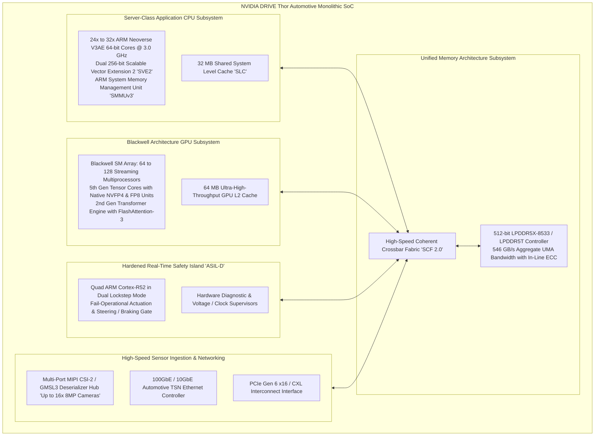
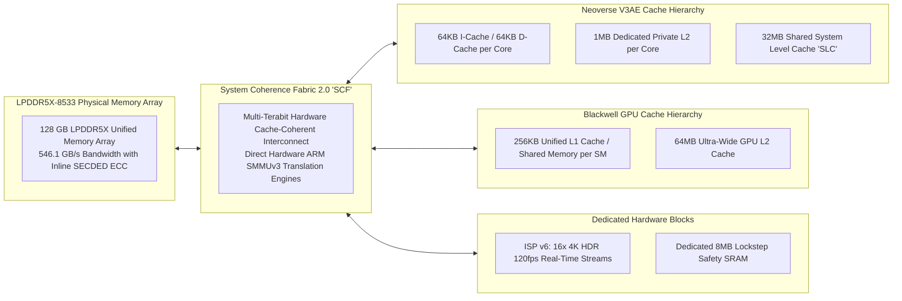
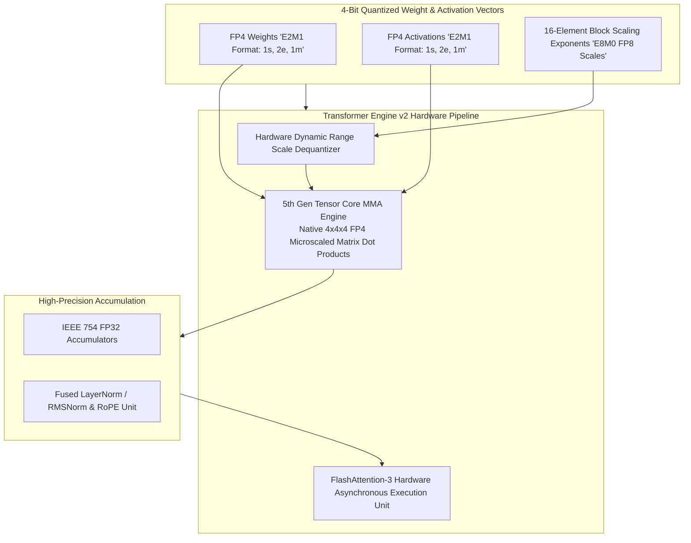
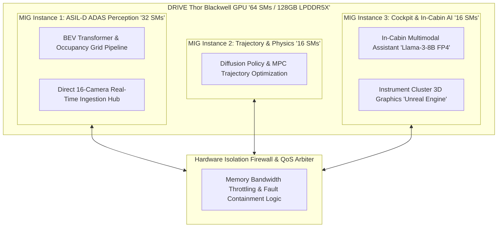
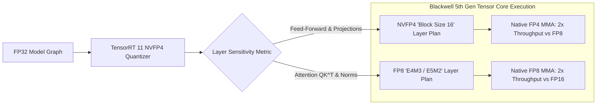
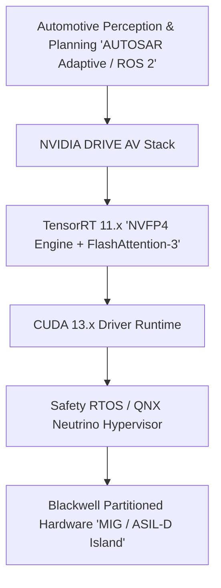
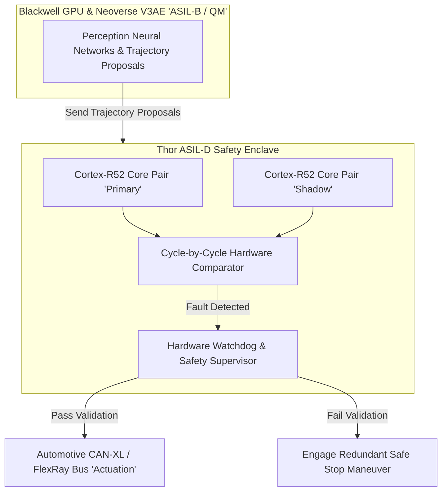

# 🚗 NVIDIA DRIVE Thor: Blackwell Architecture, 1000-2000 TFLOPS & Centralized Automotive Superchip

## 1. Executive Summary & Hardware Typology

**NVIDIA DRIVE Thor** is NVIDIA's flagship centralized automotive System-on-Chip (SoC), designed to unify the entirety of autonomous vehicle computing workloads onto a single monolithic silicon platform. Fabricated on a customized TSMC 4N process node, DRIVE Thor consolidates high-throughput autonomous driving perception (Multi-Camera Vision Transformers, Bird's-Eye-View [BEV] spatio-temporal representations, LiDAR/Radar point cloud backbones, 3D voxel occupancy networks), end-to-end trajectory planning, multi-modal in-cabin generative AI (multimodal Large Vision-Language Models [VLMs]), digital cockpit instrument clustering, and hard real-time ISO 26262 ASIL-D vehicle dynamics actuation.

DRIVE Thor integrates the **NVIDIA Blackwell GPU architecture** (featuring 5th Generation Tensor Cores with native 4-bit microscaling [NVFP4] arithmetic and 2nd Generation Transformer Engine), server-class **ARM Neoverse V3AE** 64-bit application CPU cores, a dedicated **ISO 26262 ASIL-D Safety Island**, and an ultra-high-bandwidth **LPDDR5X/LPDDR5T memory subsystem** delivering between **1,000 and 2,000 TFLOPS of FP4 compute** in single-SoC configurations and up to **3,000+ TFLOPS** in dual-SoC configurations.



### Hardware Typology Matrix: DRIVE Thor SKU Profiles

| Architectural Dimension | DRIVE Thor Standard | DRIVE Thor High-Throughput | DRIVE Thor Dual-SoC Module |
| :--- | :--- | :--- | :--- |
| **GPU Architecture** | Blackwell (64 SMs) | Blackwell (96 SMs) | Dual Blackwell (192 SMs) |
| **Tensor Cores (5th Gen)** | 256 Tensor Cores | 384 Tensor Cores | 768 Tensor Cores |
| **Peak FP4 Compute (Dense / Sparse)** | **1,000 / 2,000 TFLOPS** | **1,500 / 3,000 TFLOPS** | **3,000 / 6,000 TFLOPS** |
| **Peak FP8 Compute (Dense / Sparse)** | 500 / 1,000 TFLOPS | 750 / 1,500 TFLOPS | 1,500 / 3,000 TFLOPS |
| **Application CPU Complex** | 16x ARM Neoverse V3AE | 24x ARM Neoverse V3AE | 48x ARM Neoverse V3AE |
| **Safety Real-Time Cores** | Dual Lockstep Cortex-R52 | Quad Lockstep Cortex-R52 | Dual Quad Cortex-R52 Islands |
| **Memory Configuration** | 64 GB LPDDR5X (256-bit) | 128 GB LPDDR5X (512-bit) | 256 GB LPDDR5X (Dual 512-bit) |
| **Memory Bandwidth (Peak)** | 273 GB/s | **546.1 GB/s** | **1,092.2 GB/s** |
| **Thermal Dissipation (TDP)** | 100W – 140W | 150W – 200W | 300W – 400W |
| **Cooling Methodology** | Sealed Forced Air / Cold Plate | Automotive Liquid (Water/Glycol) | Automotive Liquid (Dual Plate) |
| **Target Deployment** | L2+/L3 Premium ADAS | L3/L4 Centralized AD + Cockpit | L4/L5 Autonomous Robotaxi Fleets |

---

## 2. Compute Core & Memory Hierarchy

DRIVE Thor overcomes the historical "automotive memory wall" by implementing a monolithic **Unified Memory Architecture (UMA)**. Instead of isolating CPU memory, GPU VRAM, and safety buffers across separate physical busses, Thor multiplexes an ultra-wide LPDDR5X-8533 bus delivering **$546.1\text{ GB/s}$** of coherent memory bandwidth with hardware Single Error Correction, Double Error Detection (SECDED) inline ECC.



### Die Layout and Subsystem Specifications

1. **ARM Neoverse V3AE Application Processors**:
   - Implements ARMv9.2-A with dual 256-bit **Scalable Vector Extension 2 (SVE2)** pipelines per core.
   - Server-grade branch predictors and high single-thread integer throughput enable executing non-linear Model Predictive Control (MPC) trajectory optimizers, trajectory smoothing spline solvers, and C++ ROS 2 / AUTOSAR Adaptive middleware with sub-millisecond execution bounds.
   
2. **Blackwell Streaming Multiprocessors (SM)**:
   - Configured with 256 KB of dynamically partitionable shared memory / L1 data cache per SM.
   - Features asynchronous transaction barriers (`arrive-on` and `mbarrier`) that allow direct memory-to-memory data exchange across SM shared memories without host CPU synchronization.

3. **Zero-Copy Camera Ingestion Path**:
   - GMSL3 / MIPI CSI-2 camera frames are captured by the on-chip deserializer hub, processed through the high-dynamic-range Image Signal Processor (ISP v6), and written directly into GPU L2 cache or shared LPDDR5X memory via Direct Memory Access (DMA).
   - Downstream Vision Transformers (e.g. BEVFormer, Sparse4D) consume raw Bayer or YUV422 tensors without single-byte memory copy operations.

---

## 3. Micro-Architectural Mechanics & Data Paths

### 5th Generation Tensor Cores & Native NVFP4 Microscaling

DRIVE Thor's Blackwell GPU introduces native hardware matrix execution for **NVFP4 (4-bit Microscaling Floating-Point)** arithmetic alongside 2nd Generation Transformer Engine acceleration.



#### NVFP4 Microscaling Mathematical Formulation
Standard scalar quantization applies a single scaling factor $\alpha$ across an entire tensor or row ($W \approx \alpha \cdot Q$). In contrast, NVFP4 microscaling applies independent floating-point scaling factors $s_b$ across small, 16-element sub-vectors (blocks):
$$X_{i, j} = s_b \cdot q_{i, j}, \quad \text{where } b = \lfloor j / 16 \rfloor, \quad q_{i, j} \in \text{FP4 (E2M1)}, \quad s_b \in \text{FP8 (E8M0)}$$
- **Mantissa/Exponent Layout**: FP4 (E2M1) provides 1 sign bit, 2 exponent bits, and 1 mantissa bit, representing values $\pm \{0, 0.5, 1.0, 1.5, 2.0, 3.0, 4.0, 6.0\}$.
- **Block Scaling**: Hardware decodes the 16-element block scale factor $s_b$ directly inside the Tensor Core register stage, eliminating memory transfer overhead while preserving dynamic range across outlier activations in large Vision Transformers.

### Hardware Multi-Tenancy & Spatial MIG Partitioning

Automotive domain consolidation demands mathematical isolation between safety-critical perception and non-critical infotainment. Thor implements hardware-enforced **Multi-Instance GPU (MIG)** partitioning:



- **Fault Containment**: A kernel panic, out-of-memory exception, or unbounded memory loop in the in-cabin LLM (Instance 3) cannot degrade the determinism or latency of the ASIL-D ADAS perception pipeline (Instance 1).
- **Guaranteed QoS**: Hardware memory arbiters allocate guaranteed DRAM bandwidth slices and L2 cache partitions to safety instances.

---

## 4. Numerical Precision & Quantization

DRIVE Thor provides multi-precision execution capability, allowing mixed-precision deployment where feed-forward layers execute in NVFP4, attention layers maintain FP8 precision, and trajectory optimization runs in FP32.



### Precision Capabilities Matrix (DRIVE Thor Single-SoC 64-SM Configuration)

| Numerical Format | Sign / Exp / Mantissa | Block Size | Hardware Acceleration | Peak Compute (TFLOPS) | Relative Memory Footprint |
| :--- | :--- | :--- | :--- | :--- | :--- |
| **NVFP4 (E2M1)** | 1 Sign, 2 Exp, 1 Mant | 16 elements (E8M0 Scale) | 5th Gen Tensor Core | **1,500 TFLOPS** | 0.125x (vs FP32) |
| **FP8 (E4M3)** | 1 Sign, 4 Exp, 3 Mant | Scalar | 5th Gen Tensor Core | **750 TFLOPS** | 0.25x |
| **FP8 (E5M2)** | 1 Sign, 5 Exp, 2 Mant | Scalar | 5th Gen Tensor Core | **750 TFLOPS** | 0.25x |
| **INT8 / INT4** | Two's Complement Integer | Scalar | 5th Gen Tensor Core | **750 / 1,500 TOPS** | 0.25x / 0.125x |
| **BF16 / FP16** | IEEE Standard Formats | Scalar | 5th Gen Tensor Core | **375 TFLOPS** | 0.5x |
| **TF32** | 1 Sign, 8 Exp, 10 Mant | Scalar | 5th Gen Tensor Core | **187.5 TFLOPS** | 0.5x (Memory 1.0x) |
| **FP32** | IEEE Standard 754 | Scalar | Blackwell CUDA Pipeline| **23.4 TFLOPS** | 1.0x (Baseline) |

---

## 5. Software Stack, SDKs & Driver Interface

The software ecosystem for DRIVE Thor relies on **NVIDIA DRIVE OS 7.x**, integrating a safety-certified **QNX Neutrino Hypervisor**, **TensorRT 11.x**, **CUDA 13.x**, and the **DRIVE AV** autonomous driving perception stack.



### Production Toolchain Workflows & CLI Commands

#### 1. NVFP4 Engine Compilation via TensorRT `trtexec`
```bash
# Build an NVFP4 quantized BEV Transformer engine with FlashAttention-3 plugins
trtexec --onnx=bev_transformer_v3.onnx \
        --saveEngine=bev_transformer_thor_fp4.engine \
        --fp4 \
        --nvfp4Scales=calib_scales.json \
        --useCustomAllReduce=enable \
        --builderOptimizationLevel=5 \
        --profilingVerbosity=detailed
```

#### 2. Hardware MIG Partitioning for Mixed Criticality
```bash
# Query available GPU instances on DRIVE Thor
nvidia-smi mig -lgi

# Partition GPU into ASIL-D ADAS instance (48 SMs) and Infotainment instance (16 SMs)
nvidia-smi mig -cgi 19,9 -C
```

#### 3. C++ Zero-Copy UMA Allocation with Hardware Coherency
```cpp
#include <cuda_runtime.h>
#include <iostream>
#include <stdexcept>

// Allocate unified memory accessible by Neoverse V3AE CPU and Blackwell GPU
void* allocate_thor_uma_buffer(size_t tensor_bytes) {
    void* unified_ptr = nullptr;
    
    // Allocate zero-copy memory backed by LPDDR5X with hardware coherency
    cudaError_t status = cudaMallocManaged(&unified_ptr, tensor_bytes, cudaMemAttachGlobal);
    if (status != cudaSuccess) {
        throw std::runtime_error("Failed to allocate Thor UMA memory");
    }
    
    // Advise runtime to optimize for GPU read/write while maintaining CPU prefetch
    cudaMemAdvise(unified_ptr, tensor_bytes, cudaMemAdviseSetPreferredLocation, 0);
    cudaMemAdvise(unified_ptr, tensor_bytes, cudaMemAdviseSetAccessedBy, cudaCpuDeviceId);
    
    return unified_ptr;
}
```

---

## 6. Functional Safety, Real-Time Latency & Thermal Profiles

### ISO 26262 ASIL-D Safety Island Architecture

DRIVE Thor embeds a fully isolated, fail-operational **ASIL-D Safety Enclave** driven by quad ARM Cortex-R52 cores running in dual lockstep mode.



### Latency and Thermal Dissipation Specifications

| Platform Implementation | Thermal Solution | System TDP | Perception Stack Latency | VLM (7B) Decode Throughput |
| :--- | :--- | :--- | :--- | :--- |
| **DRIVE Thor ECU (Single-SoC)**| Liquid Cooled (Water/Glycol) | **175 W** | 2.1 ms (Sparse4D) | 120 tokens / sec |
| **DRIVE Thor ECU (Dual-SoC)** | Liquid Cooled Dual Cold Plate | **320 W** | 1.1 ms (Full L4 Stack) | 240 tokens / sec |

---

## 7. Comparative Platform Matrix

| Architectural Dimension | NVIDIA DRIVE Thor | AMD Versal AI Edge Gen 2 (VE2808) | Qualcomm Snapdragon Ride Flex (SA8775P) |
| :--- | :--- | :--- | :--- |
| **Manufacturing Process** | TSMC 4N Customized | TSMC 4nm / 5nm | 4nm FinFET |
| **AI Inference Architecture**| Blackwell GPU + 5th Gen TC | AIE-ML v2 Tiles (Systolic) | Qualcomm Hexagon NPU + Adreno |
| **Peak Low-Bit AI Compute** | **1,500 TFLOPS (NVFP4)** | 760 TFLOPS (MX-FP4) | 300 TOPS (INT8 / INT4) |
| **Application Processor** | 24x ARM Neoverse V3AE | 8x ARM Cortex-A78AE | 16x ARM Cortex-A78AE / X-Cores |
| **Safety Real-Time Cores** | Quad Cortex-R52 Lockstep | Quad Cortex-R52 Lockstep | Dual Cortex-R52 Lockstep |
| **Memory Bandwidth** | **546.1 GB/s (LPDDR5X)** | 136.5 GB/s (LPDDR5X) | 102.4 GB/s (LPDDR5) |
| **Hardware Multi-Tenancy** | Hardware MIG + Spatial Slicing | PL Partitioning + NoC Virtual Ch | Hypervisor Software Slicing |
| **Software Framework** | TensorRT 11, DRIVE OS, DRIVE AV | Vitis AI 5.x, AMD Quark | Snapdragon Neural Processing SDK |
| **Functional Safety Rating**| ISO 26262 ASIL-D Complete | ISO 26262 ASIL-D Complete | ISO 26262 ASIL-D Capable |
| **Typical Board Power** | 120W – 200W (Liquid Cooled) | 45W – 75W (Air Cooled) | 50W – 90W |
| **Primary Advantage** | Highest raw AI compute + VLM serving | Adaptable logic for custom sensor I/O| Lower power envelope |
| **Primary Limitation** | Requires active automotive liquid cooling| Complex multi-engine toolchain | Lower peak compute for large VLMs |

---

## 8. Cross-References & Related Frameworks

- [[hardware/nvidia-jetson-thor|NVIDIA Jetson Thor Robotics Superchip]]
- [[hardware/nvidia-blackwell-b200|NVIDIA Blackwell B200 & Data Center GPU]]
- [[hardware/arm-neoverse-v3ae|ARM Neoverse V3AE Automotive CPU]]
- [[hardware/arm-cortex-r52|ARM Cortex-R52 Real-Time Lockstep Safety Core]]
- [[hardware/amd-versal-ai-edge-gen2|AMD Versal AI Edge Gen 2 Architecture]]
- [[topics/safety-verification-and-robustness/00-safety-verification-and-robustness-moc|Safety Verification & Robustness]]
