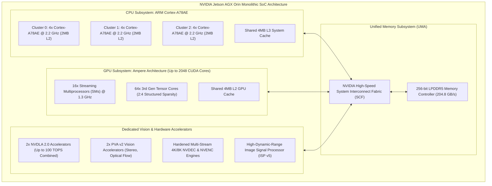
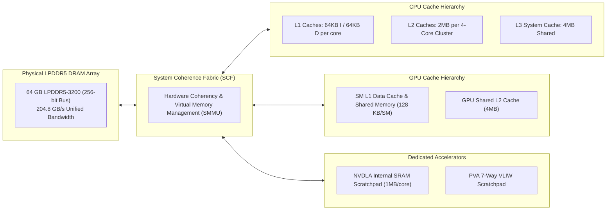
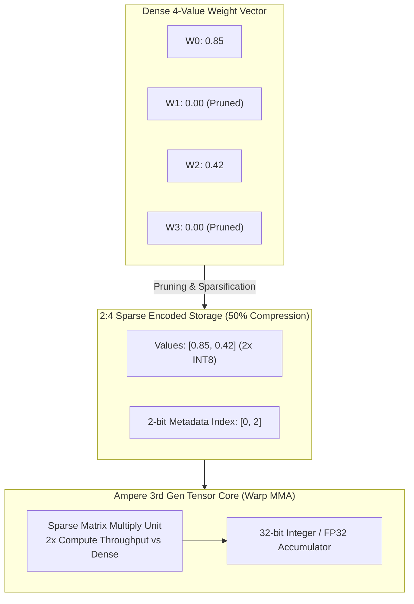
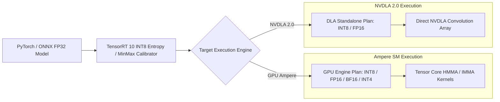
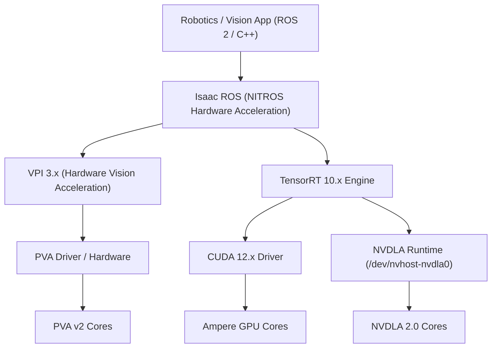
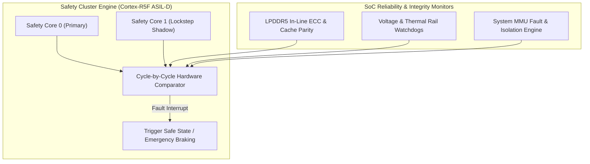

# ⚡ NVIDIA Jetson Orin: Architecture, Ampere Tensor Cores, NVDLA 2.0 & Autonomous Systems

## 1. Executive Summary & Hardware Typology

The **NVIDIA Jetson Orin** family is the industry standard for high-performance physical AI, robotics, intelligent video analytics, and embedded computer vision. Fabricated on a customized Samsung 8nm (8N) process node, the Orin SoC integrates an **NVIDIA Ampere architecture GPU** (featuring 3rd Generation Tensor Cores), up to 12 **ARM Cortex-A78AE** 64-bit CPU cores, second-generation **NVDLA 2.0** deep learning accelerators, second-generation **PVA v2** (Programmable Vision Accelerators), and a high-bandwidth **LPDDR5 Unified Memory Architecture (UMA)**.

The Orin line scales from ultra-compact 7W power envelopes in the **Jetson Orin Nano** up to 275 Sparse TOPS in the **Jetson AGX Orin**, with a specialized **AGX Orin Industrial** module built for extreme thermal, shock, vibration, and functional safety (ISO 26262 ASIL-D) deployments.



### Hardware Typology Matrix: Complete Jetson Orin Family

| Module Variant | GPU Cores / SMs | Tensor Cores | CPU Cores | NVDLA 2.0 | Memory Config (Bandwidth) | Peak INT8 (Dense/Sparse) | Thermal Power (TDP) | Form Factor / Ruggedization |
| :--- | :--- | :--- | :--- | :--- | :--- | :--- | :--- | :--- |
| **AGX Orin 64GB** | 2048 CUDA (16 SM) | 64 (3rd Gen) | 12x A78AE | 2 Cores | 64 GB LPDDR5 (204.8 GB/s) | 138 / **275 TOPS** | 15W - 60W | 100 mm $\times$ 87 mm (699-pin) |
| **AGX Orin Industrial** | 2048 CUDA (16 SM) | 64 (3rd Gen) | 12x A78AE | 2 Cores | 64 GB LPDDR5 (204.8 GB/s) | 124 / **248 TOPS** | 15W - 75W | -40°C to 85°C, ASIL-D Ready |
| **AGX Orin 32GB** | 1792 CUDA (14 SM) | 56 (3rd Gen) | 8x A78AE | 2 Cores | 32 GB LPDDR5 (204.8 GB/s) | 100 / **200 TOPS** | 15W - 40W | 100 mm $\times$ 87 mm (699-pin) |
| **Orin NX 16GB** | 1024 CUDA (8 SM) | 32 (3rd Gen) | 8x A78AE | 2 Cores | 16 GB LPDDR5 (102.4 GB/s) | 50 / **100 TOPS** | 10W - 25W | 69.6 mm $\times$ 45 mm (260-pin SODIMM) |
| **Orin NX 8GB** | 1024 CUDA (8 SM) | 32 (3rd Gen) | 6x A78AE | 2 Cores | 8 GB LPDDR5 (102.4 GB/s) | 35 / **70 TOPS** | 10W - 20W | 69.6 mm $\times$ 45 mm (260-pin SODIMM) |
| **Orin Nano 8GB** | 1024 CUDA (8 SM) | 32 (3rd Gen) | 6x A78AE | None | 8 GB LPDDR5 (68.0 GB/s) | 20 / **40 TOPS** | 7W - 15W | 69.6 mm $\times$ 45 mm (260-pin SODIMM) |
| **Orin Nano 4GB** | 512 CUDA (4 SM) | 16 (3rd Gen) | 6x A78AE | None | 4 GB LPDDR5 (34.0 GB/s) | 10 / **20 TOPS** | 5W - 10W | 69.6 mm $\times$ 45 mm (260-pin SODIMM) |

---

## 2. Compute Core & Memory Hierarchy

Jetson Orin's core architectural strength lies in its **Unified Memory Architecture (UMA)**, where CPU, GPU, NVDLA, PVA, and media decoders share a physical LPDDR5 memory pool with zero-copy data exchange.



### Die Layout and Memory Specifications

1. **CPU Complex (ARM Cortex-A78AE)**:
   - Up to 12 cores organized into three clusters of 4 cores each.
   - Each core features 64 KB Instruction and 64 KB Data L1 caches. Each cluster shares 2 MB of L2 cache. All clusters access a shared **4 MB L3 system cache**.
   - Supports ARMv8.2-A with Scalable Vector Extensions (SVE) and Cryptography extensions.

2. **GPU Complex (NVIDIA Ampere)**:
   - 16 Streaming Multiprocessors (SMs) on AGX Orin. Each SM contains 128 FP32 CUDA cores, 4 third-generation Tensor Cores, and 128 KB of unified L1 Data Cache / Shared Memory.
   - 4 MB high-speed L2 GPU cache directly connected to the memory crossbar.

3. **Unified Memory Architecture & Zero-Copy**:
   - The CPU, GPU, and accelerators share a single 256-bit wide LPDDR5 bus delivering up to **204.8 GB/s** bandwidth.
   - Memory allocations created via `cudaHostAllocMapped` or `cudaMallocManaged` (Unified Memory) are physically resident in the same DRAM. Pointers can be passed directly between camera capture (V4L2 DMA-BUF), vision preprocessing (PVA), deep learning inference (TensorRT on GPU/NVDLA), and display rendering with zero memory copies.

---

## 3. Micro-Architectural Mechanics & Data Paths

### 3rd Generation Tensor Core Architecture & 2:4 Sparsity

Jetson Orin's Ampere GPU features 3rd Generation Tensor Cores supporting hardware-accelerated **2:4 Structured Sparsity**.



### Micro-Architectural Enhancements

- **2:4 Structured Sparsity**:
  - In any group of 4 contiguous values, exactly 2 must be zero. The hardware stores only the 2 non-zero values plus a 2-bit index per pair.
  - The Tensor Core skips zero-value computations entirely, effectively **doubling mathematical throughput** (from 138 dense INT8 TOPS to 275 sparse INT8 TOPS on AGX Orin).
- **Asynchronous Data Transfer (`cp.async`)**:
  - Ampere SMs bypass register files during data loading, copying global memory directly into shared memory via hardware DMA without stalling CUDA execution threads.
- **NVDLA 2.0 (NVIDIA Deep Learning Accelerator)**:
  - Dual independent fixed-function neural processor cores. Each core features a dedicated MAC array ($2048\text{ INT8 MACs/cycle}$), planar convolution engines, and on-chip SRAM.
  - Offloads standard CNN backbones (ResNet, MobileNet, YOLO feature extractors) consuming only $\sim 1.5\text{W}$ per core, freeing 100% of the GPU for Transformers or graphics.
- **PVA v2 (Programmable Vision Accelerator)**:
  - 7-way VLIW vector DSP engineered for classical computer vision algorithms: optical flow (Lucas-Kanade), stereo disparity calculation, point feature tracking (FAST/Harris), and image warping/dewarping.

---

## 4. Numerical Precision & Quantization

Jetson Orin supports diverse precision profiles across its Ampere GPU and dual NVDLA 2.0 engines.



### Precision & TOPS Performance Profile (AGX Orin 64GB)

| Numerical Format | Hardware Execution Target | Dense Performance | 2:4 Sparse Performance | Typical Workload Profile |
| :--- | :--- | :--- | :--- | :--- |
| **INT4** | Ampere Tensor Cores | 275 TOPS | **550 TOPS** | Quantized LLMs (Llama-3, Mistral-7B) |
| **INT8** | Ampere Tensor Cores + NVDLA | 138 TOPS | **275 TOPS** | Production Vision (YOLOv8, RT-DETR, BEVFusion) |
| **FP16** | Ampere Tensor Cores + NVDLA | 69 TFLOPS | **138 TFLOPS** | Diffusion Models, Foundation Backbones |
| **BFloat16** | Ampere Tensor Cores | 69 TFLOPS | **138 TFLOPS** | Training Fine-Tuning & LLM Inference |
| **FP32** | Ampere CUDA Cores | 5.3 TFLOPS | 5.3 TFLOPS | Scientific Computing & Trajectory Solvers |

---

## 5. Software Stack, SDKs & Driver Interface

The Orin platform runs on **NVIDIA JetPack 6.x** (Linux Kernel 5.15+, Ubuntu 22.04 LTS), utilizing **TensorRT 10.x**, **DeepStream SDK 7.x**, **Isaac ROS**, and the **Vision Programming Interface (VPI 3.x)**.



### Essential CLI Commands & Production Workflows

1. **System Power Mode & Clock Management via `nvpmodel` and `jetson_clocks`**:
```bash
# Query active power model and available configurations
nvpmodel -q

# Set AGX Orin to MAX-N unrestricted performance mode (60W+)
sudo nvpmodel -m 0

# Lock CPU, GPU, and DLA clocks to maximum frequencies for benchmarking
sudo jetson_clocks --show
sudo jetson_clocks
```

2. **Compiling & Benchmarking TensorRT Engines via `trtexec`**:
```bash
# Compile and benchmark an ONNX model with INT8 quantization and 2:4 sparsity on GPU
trtexec --onnx=yolov8x.onnx \
        --saveEngine=yolov8x_orin.engine \
        --int8 \
        --fp16 \
        --sparsity=enable \
        --memPoolSize=workspace:4096MiB \
        --useSpinWait \
        --profilingVerbosity=detailed

# Compile the same model targeting NVDLA Core 0 with GPU fallback
trtexec --onnx=resnet50.onnx \
        --saveEngine=resnet50_dla0.engine \
        --useDLACore=0 \
        --allowGPUFallback \
        --int8
```

3. **Real-Time Telemetry & Monitoring via `tegrastats`**:
```bash
# Monitor real-time GPU/CPU utilization, temperature, and power rails
tegrastats --interval 1000

# Sample output:
# RAM 8420/62842MB (lfb 13204x4MB) CPU [12%@2201,15%@2201,8%@2201,10%@2201...] 
# EMC_FREQ 0%@3199 GR3D_FREQ 45%@1300 NVENC 0 NVDLA0 85%@1300 NVDLA1 0% 
# VDD_GPU_SOC 18240mW/18240mW VDD_CPU_CV 8400mW/8400mW
```

4. **Zero-Copy CUDA Host Mapping Example**:
```cpp
#include <cuda_runtime.h>
#include <iostream>

void allocate_zero_copy_frame(size_t width, size_t height) {
    size_t frame_bytes = width * height * 3; // RGB 8-bit
    void* host_mapped_ptr = nullptr;

    // Allocate page-locked, mapped host memory accessible directly by GPU/DLA
    cudaHostAlloc(&host_mapped_ptr, frame_bytes, 
                  cudaHostAllocMapped | cudaHostAllocWriteCombined);

    void* dev_ptr = nullptr;
    cudaHostGetDevicePointer(&dev_ptr, host_mapped_ptr, 0);

    std::cout << "Host Virtual Address:   " << host_mapped_ptr << "\n";
    std::cout << "Device Virtual Address: " << dev_ptr << " (Zero-Copy UMA)\n";

    // Memory can now be written by V4L2 camera DMA and read by TensorRT kernels
}
```

---

## 6. Functional Safety, Real-Time Latency & Thermal Profiles

### AGX Orin Industrial: Ruggedization & Safety (ISO 26262 ASIL-D)

The **Jetson AGX Orin Industrial** variant introduces hardware-level enhancements for safety-critical missions:

- **Thermal Operating Range**: Rated for ambient operating temperatures from **$-40^\circ\text{C}$ to $+85^\circ\text{C}$** with junction temperatures up to $105^\circ\text{C}$.
- **Vibration & Shock Tolerance**: Tested to 50G shock (11ms half-sine) and 5.0 Grms random vibration (5 Hz to 500 Hz).
- **In-Line LPDDR5 ECC**: Real-time single-error correction and double-error detection (SECDED) protecting memory integrity without sacrificing user-accessible RAM capacity.
- **Safety Cluster Engine (SCE)**: Dedicated dual-core Cortex-R5F safety subsystem monitoring SoC hardware health, voltage regulators, and thermal sensors.



### Real-World Latency & Power Envelopes

| Benchmark / Model | Precision | Platform Config | Power Mode | End-to-End Latency | Frame Rate (FPS) |
| :--- | :--- | :--- | :--- | :--- | :--- |
| **YOLOv8s (640x640)** | INT8 (Sparse) | AGX Orin 64GB | MAX-N (60W) | **1.2 ms** | 833 FPS |
| **BEVFusion (Multi-Camera)** | INT8 + FP16 | AGX Orin 64GB | 50W Mode | **18.4 ms** | 54.3 FPS |
| **DINOv2-Small (518x518)** | FP16 | AGX Orin 64GB | 30W Mode | **4.8 ms** | 208 FPS |
| **Segment Anything 2 (SAM2)**| FP16 / INT8 | AGX Orin 64GB | MAX-N (60W) | **14.1 ms** | 71 FPS |
| **YOLOv8s (640x640)** | INT8 | Orin Nano 8GB | 15W Mode | **6.4 ms** | 156 FPS |

---

## 7. Comparative Platform Matrix

| Dimension | NVIDIA Jetson AGX Orin | AMD Versal AI Edge (VE2802) | NVIDIA Jetson AGX Xavier (Legacy) |
| :--- | :--- | :--- | :--- |
| **Silicon Architecture** | 8nm GPU-SoC (Ampere) | 7nm ACAP (Multi-Engine Fabric) | 12nm GPU-SoC (Volta) |
| **Compute Engines** | 2048 CUDA + 64 Tensor Cores + 2x NVDLA | 304x AIE-ML v1 Tiles + PL Fabric | 512 CUDA + 64 Tensor Cores + 2x NVDLA |
| **Peak INT8 Throughput** | 275 Sparse TOPS (138 Dense) | 315 Dense TOPS | 32 Dense TOPS |
| **Unified Memory Bandwidth** | 204.8 GB/s (256-bit LPDDR5) | 68.2 GB/s (LPDDR4X) + 1 Tbps NoC | 137.0 GB/s (256-bit LPDDR4X) |
| **Vision Acceleration** | PVA v2 (Stereo / Optical Flow) | PL DSP58 + Custom HLS Vision IPs | PVA v1 |
| **Software Ecosystem** | CUDA 12, TensorRT 10, Isaac ROS | Vitis AI 3.x, XRT, Vivado | CUDA 10/11, TensorRT 8 |
| **Functional Safety** | ASIL-D (AGX Orin Industrial) | ASIL-B / SIL-2 | ASIL-C / SIL-3 Ready |
| **Power Flexibility** | 15W to 60W / 75W | 45W to 75W | 10W to 30W |
| **Primary Strength** | Unmatched AI software library maturity | Deterministic latency, custom sensor I/O | Mature long-term deployment base |
| **Primary Limitation** | Non-deterministic scheduler jitter under load | Steeper learning curve (RTL / HLS) | Outdated for Transformer workloads |

---

## 8. Cross-References & Related Frameworks

- [[hardware/nvidia-drive-thor|NVIDIA DRIVE Thor & Jetson Thor Architecture]]
- [[hardware/amd-versal-ai-edge-gen1|AMD Versal AI Edge Gen 1 Reference]]
- [[architectures/hardware-and-acceleration-runtimes/tensorrt-runtime|TensorRT 10 & Vulkan 1.3 Runtimes]]
- [[topics/gpu-deployment/00-gpu-deployment-moc|GPU Deployment & Kernel Optimization]]
- [[topics/real-time-systems/00-real-time-systems-moc|Real-Time Systems & Embedded Schedulers]]
