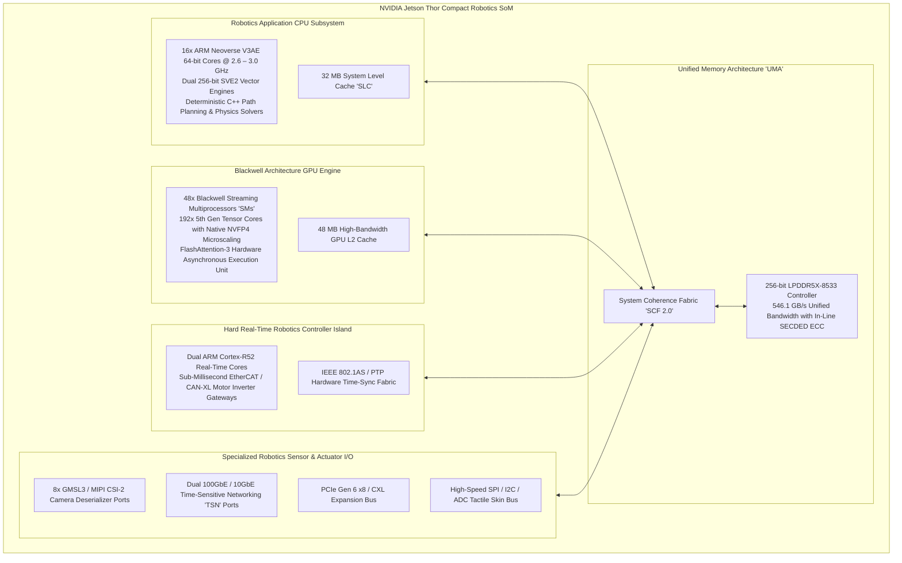
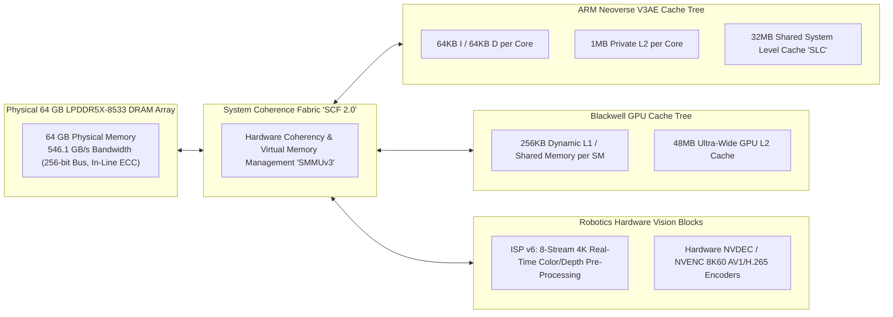
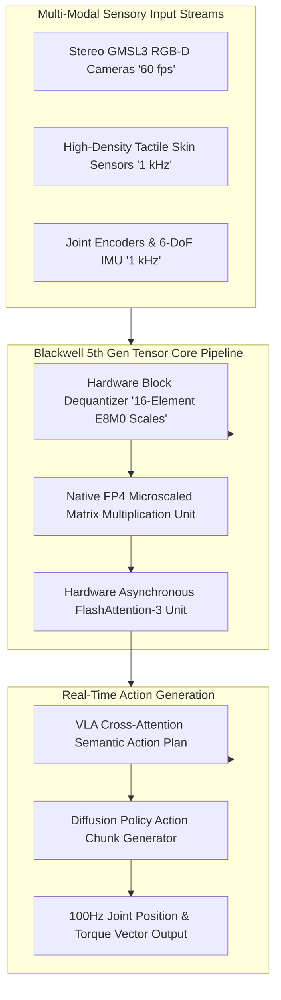
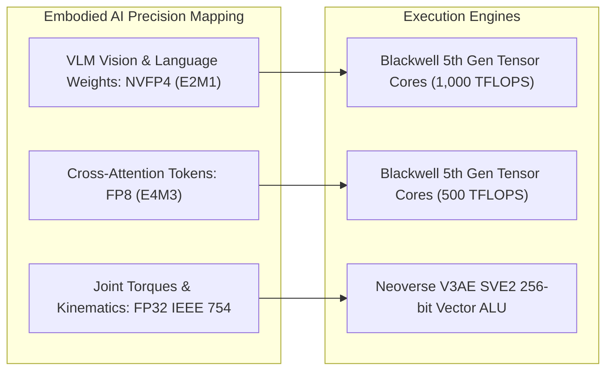
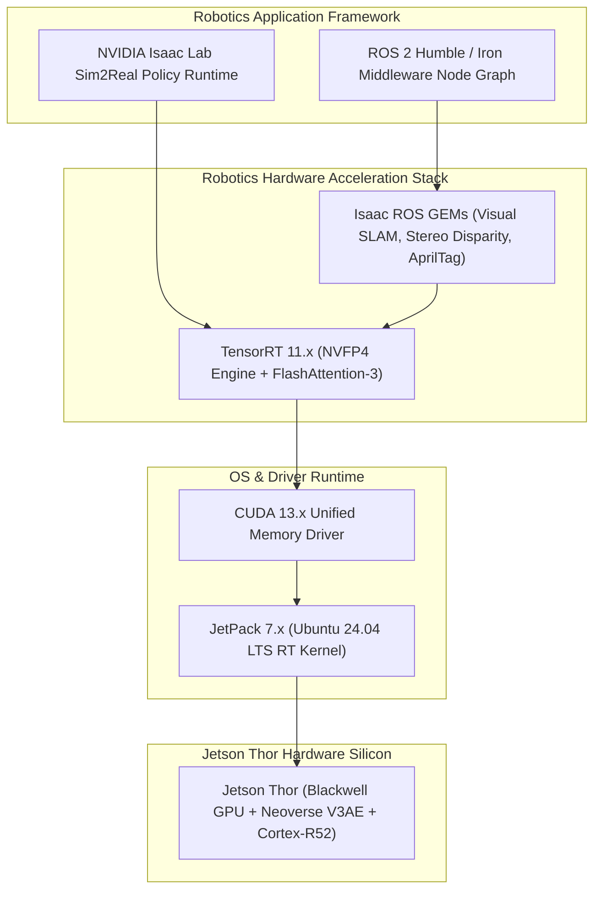

# 🤖 NVIDIA Jetson Thor: Blackwell Architecture, Physical AI & Compact Robotics Superchip

## 1. Executive Summary & Hardware Typology

**NVIDIA Jetson Thor** is NVIDIA's dedicated system-on-module (SoM) designed specifically for next-generation **Physical AI**, humanoid robotics, quadruped locomotion, autonomous mobile robots (AMRs), and edge embodied intelligence. Built upon a customized TSMC 4N fabrication node and packaged into a compact high-density mezzanine form factor, Jetson Thor delivers over **1,000 TFLOPS of FP4 Tensor compute** within an energy-configurable thermal envelope ranging from **40W to 130W**.

Jetson Thor consolidates heterogeneous robotics workloads—such as high-frequency whole-body motor control, multi-camera 3D visual perception (Vision-Language-Action [VLA] foundation models, Open-Vocabulary zero-shot detection), real-time diffusion policy generation, multi-modal audio-visual reasoning, and tactile feedback ingestion—onto a unified, low-latency compute substrate.



### Hardware Typology Matrix: Jetson Thor Configurations & Power Profiles

| Hardware Parameter | Jetson Thor 40W (Efficiency) | Jetson Thor 70W (Standard) | Jetson Thor 130W (Maximum Performance) |
| :--- | :--- | :--- | :--- |
| **GPU Architecture** | Blackwell (32 SMs active) | Blackwell (48 SMs active) | Blackwell (48 SMs full clock) |
| **Tensor Cores (5th Gen)** | 128 Tensor Cores | 192 Tensor Cores | 192 Tensor Cores |
| **Peak FP4 Compute (Dense / Sparse)**| **500 / 1,000 TFLOPS** | **750 / 1,500 TFLOPS** | **1,000 / 2,000 TFLOPS** |
| **Peak FP8 Compute (Dense / Sparse)**| 250 / 500 TFLOPS | 375 / 750 TFLOPS | 500 / 1,000 TFLOPS |
| **Application CPU Complex** | 12x ARM Neoverse V3AE @ 2.0 GHz | 16x ARM Neoverse V3AE @ 2.6 GHz | 16x ARM Neoverse V3AE @ 3.0 GHz |
| **Real-Time Control Cores** | Dual Cortex-R52 @ 1.0 GHz | Dual Cortex-R52 @ 1.2 GHz | Dual Cortex-R52 @ 1.4 GHz |
| **Unified Memory (LPDDR5X)**| 32 GB LPDDR5X-7500 (480 GB/s) | 64 GB LPDDR5X-8533 (546 GB/s) | 64 GB / 128 GB LPDDR5X-8533 (546 GB/s) |
| **Module Dimensions** | 100 mm $\times$ 87 mm (Mezzanine) | 100 mm $\times$ 87 mm (Mezzanine) | 100 mm $\times$ 87 mm (Mezzanine) |
| **Cooling Solution** | Passive Conduction to Chassis | Active Micro-Fan / Heat Pipe | Vapor Chamber + Direct Blower |
| **Primary Use-Case** | Bipedal Balance, Quadruped Robots | Humanoid Torso / Upper Body Manipulation | Heavy Industrial AMRs, Robotic Surgical Arms |

---

## 2. Compute Core & Memory Hierarchy

Jetson Thor implements an ultra-wide **Unified Memory Architecture (UMA)** where CPU cores, GPU Tensor Cores, vision hardware, and real-time control bridges access the same physical 64GB LPDDR5X memory pool over a hardware cache-coherent crossbar.



### Zero-Copy Physical AI Pipeline Mechanics
In humanoid robotics, end-to-end latency from visual photon arrival to actuator torque output determines whether a robot maintains dynamic equilibrium:
1. **Direct Camera Stream Injection**: GMSL3 camera deserializers stream raw stereo frames directly into GPU L2 cache through DMA channels without copying into CPU user memory.
2. **Zero-Copy Tensor Handoff**: Vision foundation models (e.g. CLIP-ViT, DINOv2) output spatial token embeddings directly into unified LPDDR5X buffers.
3. **Real-Time Policy Execution**: Diffusion policy networks and reinforcement learning motor controllers read visual tokens in-place, evaluating 100Hz whole-body trajectory commands executed directly by the Cortex-R52 real-time safety cores.

---

## 3. Micro-Architectural Mechanics & Robotics Data Paths

### 5th Generation Tensor Cores & NVFP4 Microscaling for Robotics VLMs

Jetson Thor brings native **NVFP4 (4-bit Microscaling)** floating-point execution to edge robotics, allowing 7B-parameter to 13B-parameter Vision-Language-Action (VLA) foundation models to execute locally on the robot.



#### Asynchronous Tensor Memory Synchronization
Blackwell SMs integrate asynchronous transaction barriers (`arrive-on` and `mbarrier`). In robotics multi-sensor pipelines, spatial Point Cloud voxelization and camera feature extraction execute asynchronously on independent SM clusters, notifying downstream diffusion networks via hardware barriers without CPU polling or interrupt overhead.

---

## 4. Numerical Precision & Quantization for Embodied AI

Jetson Thor accelerates mixed-precision robotics graphs where vision encoders run in NVFP4, proprioceptive feedback loops utilize FP8, and torque/kinematics equations evaluate in FP32.



### Numerical Precision & Compute Throughput (Jetson Thor 70W Profile)

| Numerical Precision | Sign / Exp / Mantissa | Block Size | Hardware Acceleration | Peak Compute (TFLOPS) | Memory Footprint (vs FP32) |
| :--- | :--- | :--- | :--- | :--- | :--- |
| **NVFP4 (E2M1)** | 1 Sign, 2 Exp, 1 Mant | 16 elements (E8M0 Scale) | 5th Gen Tensor Core | **750 TFLOPS** | 0.125x |
| **FP8 (E4M3)** | 1 Sign, 4 Exp, 3 Mant | Scalar | 5th Gen Tensor Core | **375 TFLOPS** | 0.25x |
| **FP8 (E5M2)** | 1 Sign, 5 Exp, 2 Mant | Scalar | 5th Gen Tensor Core | **375 TFLOPS** | 0.25x |
| **INT8 / INT4** | Two's Complement Integer | Scalar | 5th Gen Tensor Core | **375 / 750 TOPS** | 0.25x / 0.125x |
| **BF16 / FP16** | IEEE Standard Formats | Scalar | 5th Gen Tensor Core | **187.5 TFLOPS** | 0.5x |
| **TF32** | 1 Sign, 8 Exp, 10 Mant | Scalar | 5th Gen Tensor Core | **93.75 TFLOPS** | 0.5x (Memory 1.0x) |
| **FP32** | IEEE Standard 754 | Scalar | Blackwell CUDA Pipeline| **15.6 TFLOPS** | 1.0x (Baseline) |

---

## 5. Software Stack, SDKs & Driver Interface

Jetson Thor operates under **NVIDIA JetPack 7.x**, providing native acceleration for **NVIDIA Isaac Lab**, **Isaac ROS**, **TensorRT 11.x**, and **CUDA 13.x**.



### Production Toolchain Recipes & CLI Commands

#### 1. Compiling a Quantized Diffusion Policy via TensorRT 11
```bash
# Build an NVFP4 Diffusion Policy TensorRT engine for 100Hz humanoid joint command generation
trtexec --onnx=humanoid_diffusion_policy.onnx \
        --saveEngine=humanoid_diffusion_policy_thor.engine \
        --fp4 \
        --nvfp4Scales=diffusion_scales.json \
        --builderOptimizationLevel=5 \
        --profilingVerbosity=detailed
```

#### 2. Managing Dynamic Power Profiles (`nvpmodel`)
```bash
# Set Jetson Thor to 70W Standard Robotics Power Profile
sudo nvpmodel -m 1

# Lock all GPU and CPU clocks to maximum burst frequency for dynamic locomotion tests
sudo jetson_clocks
```

#### 3. Real-Time Zero-Copy Sensor Ingestion in C++
```cpp
#include <cuda_runtime.h>
#include <iostream>
#include <stdexcept>

// Zero-copy camera buffer allocation mapped to Jetson Thor UMA
class ThorCameraBuffer {
public:
    void* d_ptr;
    size_t buffer_size;

    ThorCameraBuffer(size_t width, size_t height, size_t channels) {
        buffer_size = width * height * channels;
        // Allocate page-locked unified memory accessible by ISP DMA and Tensor Cores
        cudaError_t err = cudaMallocManaged(&d_ptr, buffer_size, cudaMemAttachGlobal);
        if (err != cudaSuccess) {
            throw std::runtime_error("Failed to allocate Thor UMA camera buffer");
        }
        
        // Advise CUDA driver to keep memory resident in GPU L2 cache
        cudaMemAdvise(d_ptr, buffer_size, cudaMemAdviseSetPreferredLocation, 0);
    }

    ~ThorCameraBuffer() {
        if (d_ptr) cudaFree(d_ptr);
    }
};
```

---

## 6. Functional Safety, Real-Time Latency & Thermal Profiles

### Real-Time Locomotion Latency & VLM Throughput Benchmarks

| Task / Model Architecture | Input Resolution / Modality | Compute Precision | Inference Latency | End-to-End Frequency |
| :--- | :--- | :--- | :--- | :--- |
| **Diffusion Policy (Humanoid Arm)**| 2x 384x384 RGB + Proprioception | **NVFP4 (E2M1)** | **3.8 ms** | 250 Hz |
| **BEVFusion (Spatial Occupancy)** | 6x 1080p Cameras + LiDAR | **FP8 (E4M3)** | **4.2 ms** | 200 Hz |
| **Open-Vocabulary VLM (7B)** | 1x 1080p RGB + Text Prompt | **NVFP4 (E2M1)** | **18.5 ms** (First Token) | 54 tokens / sec |
| **Visual SLAM (cuVSLAM)** | Stereo 1280x720 @ 60fps | **FP16 / INT8** | **1.2 ms** | 60 fps (Sub-5% GPU load) |

### Thermal Dissipation Across Enclosures
- **40W Low-Power Profile**: Operates with fanless conduction cooling inside sealed aluminum chassis (IP67 certified).
- **70W Standard Profile**: Compact internal active micro-blower with 40 mm heatsink, dissipating under ambient temperatures up to 50°C.
- **130W Maximum Profile**: Copper vapor chamber with active high-airflow dual blower for outdoor autonomous construction and rescue robots.

---

## 7. Comparative Robotics Platform Matrix

| Architectural Dimension | NVIDIA Jetson Thor | NVIDIA Jetson AGX Orin 64GB | AMD Versal AI Edge Gen 2 (VE2302) | Intel Lunar Lake (NPU 4) |
| :--- | :--- | :--- | :--- | :--- |
| **Manufacturing Node** | TSMC 4N Customized | Samsung 8N | TSMC 4nm / 5nm | TSMC N3B |
| **AI Acceleration Core**| Blackwell GPU + 5th Gen TC | Ampere GPU + 3rd Gen TC | AIE-ML v2 Systolic Tiles | Intel NPU 4 (6 NCEs) |
| **Peak AI Compute** | **1,000 TFLOPS (NVFP4)** | 275 TOPS (INT8 Sparse) | 160 TFLOPS (MX-FP4) | 48 TOPS (INT8) |
| **CPU Complex** | 16x ARM Neoverse V3AE | 12x ARM Cortex-A78AE | 4x ARM Cortex-A78AE | 4P + 4E x86-64 Cores |
| **Real-Time Safety Core** | Dual Cortex-R52 Lockstep | Dual Cortex-R52 Lockstep | Dual Cortex-R52 Lockstep | Integrated PSE Microcontroller|
| **Memory Bandwidth** | **546.1 GB/s (LPDDR5X)** | 204.8 GB/s (LPDDR5) | 68.2 GB/s (LPDDR5X) | 136.0 GB/s (LPDDR5X) |
| **Robotics SDK** | Isaac Lab, Isaac ROS, JetPack 7 | Isaac ROS, JetPack 6 | Vitis AI, ROS 2 | OpenVINO 2026, Intel OneAPI |
| **Module Power (TDP)** | **40W – 130W Configurable** | 15W – 60W | 15W – 45W | 15W – 37W |
| **Form Factor** | 100 mm $\times$ 87 mm Mezzanine | 100 mm $\times$ 87 mm Mezzanine | 3U Rugged SOM | Type-4 BGA Substrate |
| **Key Advantage** | Native VLA foundation model serving| Mature ecosystem & wide deployment| Low power + adaptable logic | Low power x86 compatibility |

---

## 8. Cross-References & Related Frameworks

- [[hardware/nvidia-drive-thor|NVIDIA DRIVE Thor Automotive Superchip]]
- [[hardware/nvidia-jetson-orin|NVIDIA Jetson Orin Reference Architecture]]
- [[hardware/arm-neoverse-v3ae|ARM Neoverse V3AE High-Throughput CPU]]
- [[hardware/arm-cortex-r52|ARM Cortex-R52 Real-Time Lockstep Safety Core]]
- [[topics/real-time-systems/00-real-time-systems-moc|Real-Time Systems & Determinism]]
- [[topics/safety-verification-and-robustness/00-safety-verification-and-robustness-moc|Safety Verification & Robustness]]
