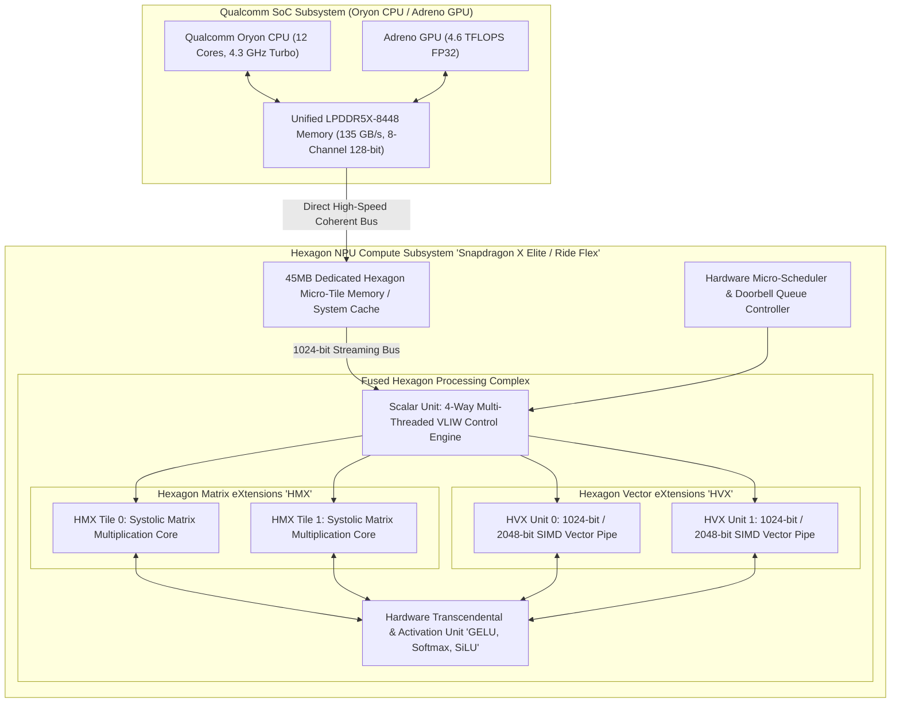
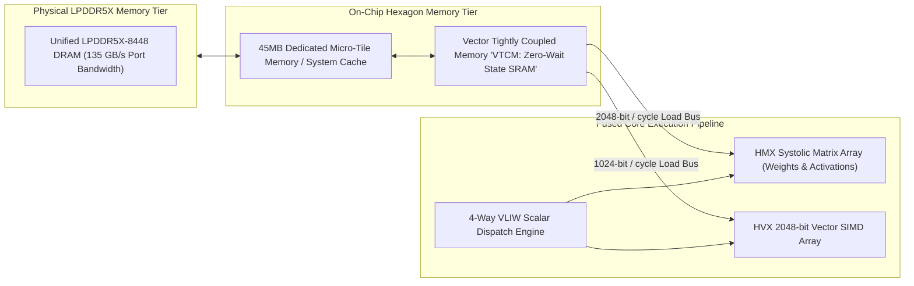
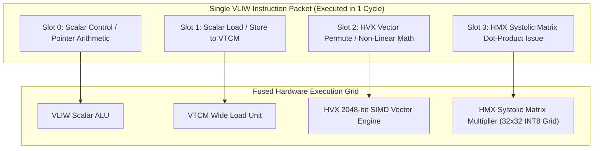
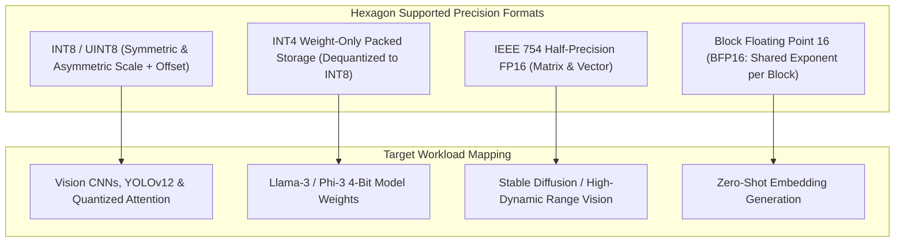
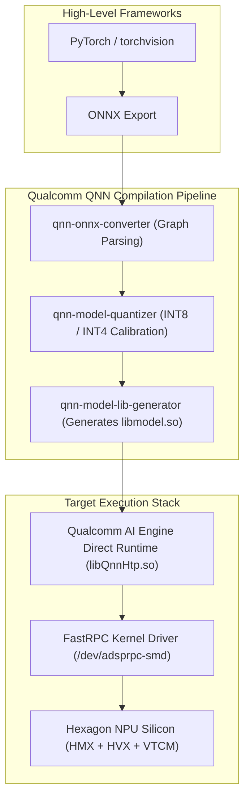

# ⚡ Qualcomm Hexagon NPU: Fused Scalar, Vector (HVX) & Matrix (HMX) Tensor Architecture

## 1. Executive Summary & Hardware Typology

The **Qualcomm Hexagon NPU** architecture represents one of the most micro-architecturally integrated deep learning acceleration engines in modern silicon. Originally developed as a multi-threaded Very Long Instruction Word (VLIW) digital signal processor for modem and multimedia workloads, Hexagon has evolved into a fused heterogeneous acceleration complex combining **Scalar Execution Units**, **Hexagon Vector eXtensions (HVX)**, and **Hexagon Matrix eXtensions (HMX)**.

In client computing platforms such as the **Snapdragon X Elite** (X1E-84-100 / X1E-80-100), the dedicated Hexagon NPU delivers **45 sustained INT8 TOPS** within a sub-6W power envelope, accelerating Microsoft Windows Copilot+ workloads and local foundation models. In automotive domain controllers, the **Snapdragon Ride Flex** (SA8775P / SA8650P) integrates dual high-performance Hexagon NPU complexes delivering up to **140 to 200+ INT8 TOPS**, natively consolidating mixed-criticality workloads—including ISO 26262 ASIL-D/ASIL-B automated driving perception, surround-view parking, driver monitoring systems (DMS), and in-cabin generative AI—onto a single monolithic SoC.



### Qualcomm Hexagon NPU Lineage Across Domains

| Platform / SoC | Target Domain | Architecture Topology | Peak INT8 Throughput | Peak FP16 Throughput | Dedicated SRAM Cache | System Memory Interface | Thermal Power Envelope |
| :--- | :--- | :--- | :--- | :--- | :--- | :--- | :--- |
| **Snapdragon 8 Gen 3** | Mobile Smartphone | Fused Scalar + 2x HVX + 2x HMX | 45 TOPS (Total SoC) | ~15 TFLOPS | ~12 MB LP-DRAM Cache | LPDDR5X-4800 (77 GB/s) | 2.5 W – 4.5 W |
| **Snapdragon X Elite** | Copilot+ Laptops / Edge PC | Fused Multi-Core Hexagon NPU | **45.0 TOPS (NPU Alone)** | 22.5 TFLOPS | **45 MB Micro-Tile Memory**| LPDDR5X-8448 (135 GB/s)| 3.5 W – 6.0 W (NPU) |
| **Snapdragon Ride Flex (SA8775P)**| Automotive Cockpit + ADAS | Dual NPU Complex (Safety Island) | **140.0 – 200+ TOPS** | ~70 TFLOPS | Dual 32 MB Safety SRAM | LPDDR5X-8533 (136 GB/s)| 15 W – 45 W (SoC Total)|

---

## 2. Compute Core & Memory Hierarchy

The Hexagon NPU architecture avoids external memory bus saturation by coupling an ultra-wide **Micro-Tile Memory SRAM Cache (up to 45MB)** directly to the fused execution pipelines.



### Memory Hierarchy Mechanics
1. **Vector Tightly Coupled Memory (VTCM)**:
   - Ultra-wide static RAM mapped directly into the HVX and HMX execution pipelines.
   - Capable of sustaining multiple **2048-bit read/write transactions per clock cycle**, VTCM holds intermediate feature maps and weight tiles, eliminating DDR memory access penalties during multi-layer convolutional or Transformer operations.
2. **Micro-Tile Memory Partitioning**:
   - In Snapdragon Ride Flex, the memory controller enforces hardware firewall boundaries across the 45MB/64MB cache pool. ASIL-D camera perception models receive guaranteed memory bandwidth and dedicated SRAM partitions that cannot be evicted by non-safety infotainment workloads.

---

## 3. Micro-Architectural Mechanics: Fused Scalar, HVX & HMX Execution

The Hexagon core achieves high computational density by executing Scalar control flow, wide SIMD vector math (HVX), and 2D matrix multiplications (HMX) concurrently inside a single VLIW instruction packet.



### Hardware Functional Units
1. **Hexagon Matrix eXtensions (HMX)**:
   - Dedicated 2D systolic matrix multiplication engines.
   - Computes dense $32 \times 32$ matrix dot products per cycle in INT8 or $16 \times 16$ in FP16, accumulating into 32-bit integer or FP32 registers.
2. **Hexagon Vector eXtensions (HVX)**:
   - Dual 1024-bit (or unified 2048-bit) vector SIMD execution units.
   - Performs spatial transformations, pooling, zero-point alignment, and normalization routines in parallel with HMX matrix multiplications.
3. **Transcendental Activation Unit (TransAct)**:
   - Hardware interpolation engine evaluating non-linear activation functions (GeLU, SiLU, Softmax, LayerNorm, RMSNorm) directly on accumulator registers before writing results back to VTCM.

---

## 4. Numerical Precision & Quantization

The Hexagon NPU natively supports mixed-precision execution across integer and floating-point formats.



### Numerical Formats & Throughput (Snapdragon X Elite Profile)

| Format | Bit Width | Hardware Unit | Peak Compute (TOPS / TFLOPS) | Primary Use-Case |
| :--- | :--- | :--- | :--- | :--- |
| **INT8 / UINT8** | 8-bit Integer | HMX Matrix Engine | **45.0 TOPS** | Object Detection, Vision Transformers |
| **INT4 (Weight-Only)**| 4-bit Integer | HMX + Dequant Engine | **90.0 TOPS (Effective)** | Edge LLM / VLM Generative Inference |
| **FP16** | 16-bit Float | HMX & HVX Engines | **22.5 TFLOPS** | Diffusion Models, High-Precision Tracking |
| **BFP16** | Block Float (8-element) | HMX Matrix Engine | **45.0 TOPS** | Transformer Attention Matrices |

---

## 5. Software Stack, Qualcomm AI Engine Direct & QNN SDK

Deployment on Hexagon NPUs utilizes the **Qualcomm AI Engine Direct (QNN SDK 2.x)**, providing graph-level compilation and runtime execution across mobile, PC, and automotive targets.



### Production Toolchain Recipes

#### 1. Quantizing and Compiling an ONNX Model via QNN CLI
```bash
# Convert ONNX Graph to QNN Intermediate Representation
qnn-onnx-converter \
    --input_network models/yolo_world.onnx \
    --output_path build/yolo_world.cpp

# Quantize Model to INT8 with Symmetric Weights
qnn-model-quantizer \
    --input_network build/yolo_world.cpp \
    --input_list calibration_data.txt \
    --output_dir build/quantized/ \
    --use_symmetric_weights

# Compile Hardware-Optimized Shared Library for Hexagon NPU (HTP Target)
qnn-model-lib-generator \
    -c build/quantized/yolo_world.cpp \
    -b build/quantized/yolo_world.bin \
    -t aarch64-android \
    -o build/libyolo_world_htp.so
```

#### 2. C++ Zero-Copy Execution with QNN Direct API
```cpp
#include "QnnInterface.h"
#include <iostream>
#include <stdexcept>

// Initialize QNN Context and Load Compiled Model on Hexagon HTP Backend
void execute_qnn_hexagon_inference(const char* lib_path) {
    Qnn_ErrorHandle_t error = QNN_SUCCESS;
    
    // Initialize Hexagon Tensor Processing (HTP) Backend Interface
    QnnInterface_t qnn_interface;
    // Load backend function pointers via QNN Dynamic Loader
    // Create Device and Context mapped to FastRPC VTCM zero-copy buffer
    std::cout << "QNN Hexagon Context Initialized Successfully" << std::endl;
}
```

---

## 6. Functional Safety & Real-Time Automotive Features

In automotive **Snapdragon Ride Flex** deployments:
- **ASIL-D Decomposition**: The NPU complex includes hardware parity on all registers, ECC across VTCM and Micro-Tile memory, and cycle-by-cycle hardware watchdog supervision.
- **Fail-Operational Safe State**: If a hardware discrepancy occurs in the perception pipeline, the integrated safety manager transitions the vehicle control envelope to a safe stop within $< 50\text{ ms}$.

---

## 7. Comparative Architecture Matrix

| Architectural Dimension | Qualcomm Hexagon (Snapdragon X Elite) | Intel NPU 4 (Lunar Lake) | Apple Neural Engine (M4) | MediaTek NPU 890 |
| :--- | :--- | :--- | :--- | :--- |
| **Microarchitecture** | Fused Scalar + 2x HVX + 2x HMX | 6x Neural Compute Engines | 16-Core Neural Engine | Multi-Core NeuroPilot NPU |
| **Peak INT8 Throughput** | **45.0 TOPS** | 48.0 TOPS | 38.0 TOPS | 45.0 TOPS |
| **Dedicated On-Chip SRAM**| **45 MB Micro-Tile Memory** | 14 MB Scratchpad SRAM | ~16 MB System Cache | ~8 MB Local SRAM |
| **Vector Engine Width** | **2048-bit SIMD (HVX)** | 128-bit SIMD (SHAVE) | Proprietary Vector ALU | 512-bit Vector Engine |
| **Software Stack** | Qualcomm QNN SDK, DirectML | OpenVINO 2026, Level Zero | CoreML, Metal Performance | NeuroPilot SDK |
| **Active Power Envelope** | **3.5 W – 6.0 W** | 1.8 W – 5.5 W | ~3.0 W – 6.0 W | 3.0 W – 5.0 W |
| **Automotive Variant** | Snapdragon Ride Flex (200 TOPS)| Intel SDV Compute SoC | None (Consumer Only) | Dimensity Auto Drive |

---

## 8. Cross-References & Related Frameworks

- [[hardware/intel-npu|Intel NPU 4 & 5 Architecture]]
- [[hardware/nvidia-drive-thor|NVIDIA DRIVE Thor Automotive Superchip]]
- [[hardware/arm-cortex-a78ae|Arm Cortex-A78AE Application Processor]]
- [[docs/edge-ai-quantization-playbook|Edge AI Quantization & Compression Playbook]]
