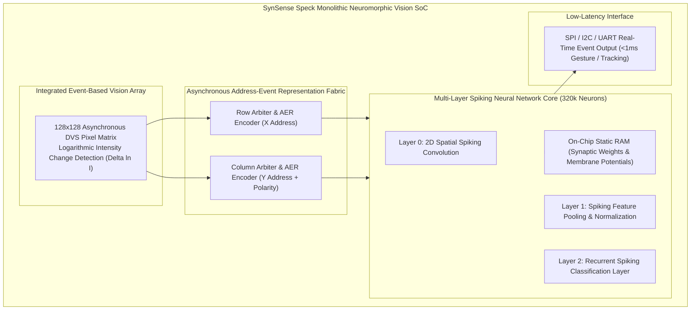
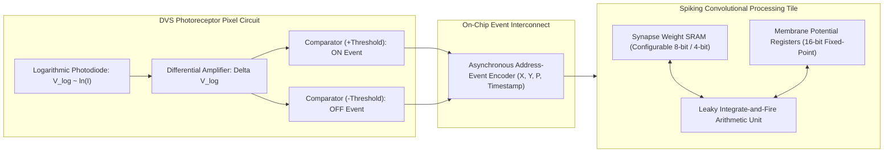
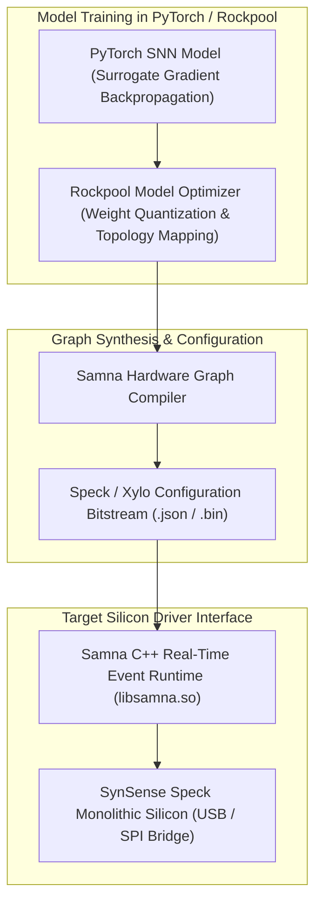

# 👁️ SynSense Speck & Xylo: Sub-Milliwatt Neuromorphic Dynamic Vision & Audio Processors

## 1. Executive Summary & Hardware Typology

**SynSense Speck** and **SynSense Xylo** represent state-of-the-art monolithic, fully event-driven neuromorphic Systems-on-Chip (SoCs) engineered for ultra-low-power edge vision, acoustic wake-word detection, and bio-signal processing. By abandoning global clock trees, traditional image frame buffers, and synchronous matrix multiplication, these processors achieve sub-milliwatt active perception:

1. **SynSense Speck**: A monolithic vision SoC that integrates an on-die **$128 \times 128$ Dynamic Vision Sensor (DVS)** pixel array directly coupled to an asynchronous **320,000-neuron Spiking Neural Network (SNN)** processing core. Operating within a power envelope of **$1.0\text{ mW} - 8.0\text{ mW}$**, Speck processes visual scenes with microsecond-level temporal resolution without transmitting full video frames over external buses.
2. **SynSense Xylo**: An ultra-low-power neuromorphic audio and vibration processor consuming **$< 100\ \mu\text{W}$** in continuous acoustic monitoring mode, designed for always-on keyword detection, acoustic anomaly tracking, and ECG/wearable health sensing.



### SynSense Hardware Architecture Typology

| Parameter / Silicon | SynSense Speck (Vision SoC) | SynSense Xylo (Audio/Signal SoC) |
| :--- | :--- | :--- |
| **Silicon Integration** | **Monolithic DVS Sensor + SNN Core** | Dedicated Audio/Sensor SNN Core |
| **Integrated Sensor Array** | **$128 \times 128$ DVS Event-Camera Array** | Optional Analog Audio Front-End |
| **Spiking Neuron Capacity** | **Up to 320,000 Spiking Neurons** | **Up to 1,000 Spiking Neurons** |
| **Synaptic Weight Capacity** | Up to 320,000 Configurable Synapses | Up to 100,000 Configurable Synapses |
| **Network Topology** | Up to 9-Layer Spiking CNN / RNN | Multi-Layer Recurrent SNN (RSNN) |
| **Temporal Resolution** | **$< 100\ \mu\text{s}$** (Microsecond event timing) | Sub-millisecond acoustic binning |
| **Active Power Consumption** | **$1.0\text{ mW} - 8.0\text{ mW}$** (Standard Gesture Task) | **$50\ \mu\text{W} - 250\ \mu\text{W}$** (Continuous Listening) |
| **Standby Power Leakage** | $< 200\ \mu\text{W}$ | **$< 10\ \mu\text{W}$** |
| **Primary Software Stack** | Rockpool / Samna / Sinabs | Rockpool / Samna |
| **Typical Target Application** | Wearable AR Gestures, Smart Surveillance | Always-On Voice Wake, Industrial Audio Anomaly |

---

## 2. Compute Core & Memory Hierarchy

The compute topology of SynSense Speck is purely event-driven: if there is no motion or brightness variation in a pixel's receptive field, zero events are generated, and the compute core draws only quiescent static leakage power.



### Memory Locality Mechanics
1. **Zero External Memory Traffic**: Unlike standard vision processors that continuously stream $1920\times 1080$ RGB frames across high-bandwidth MIPI and DDR interfaces, Speck generates spikes directly on-chip. Events flow into the adjacent SNN core over an internal asynchronous Address-Event Representation (AER) crossbar without touching external pins.
2. **In-Core Synaptic SRAM**: Synaptic weights and neuron states reside in static RAM integrated directly into each spiking layer tile.

---

## 3. Micro-Architectural Mechanics & Mathematical Formulations

### 1. DVS Event Generation Formulation
Each pixel in the $128 \times 128$ DVS array operates autonomously. An event $e_k = (x, y, p, t_k)$ is emitted when the temporal change in logarithmic illuminance exceeds a predefined threshold contrast sensitivity $C$:
$$\Delta \ln I(t) = \ln I(t) - \ln I(t_{\text{prev}}) \ge \pm C$$
- **ON Event ($p = +1$)**: Emitted when brightness increases by $C$.
- **OFF Event ($p = -1$)**: Emitted when brightness decreases by $C$.

### 2. Leaky Integrate-and-Fire (LIF) Neuron Hardware Model
Inside the SNN processing layers, neuron membrane potentials $V_j[t]$ update upon receipt of input spike events $S_i[t]$:
$$V_j[t] = \lambda \cdot V_j[t-1] + \sum_{i} W_{i, j} \cdot S_i[t]$$
$$S_j[t] = \begin{cases} 1 & \text{if } V_j[t] \ge V_{\text{thresh}} \\ 0 & \text{otherwise} \end{cases}$$
- When $V_j[t] \ge V_{\text{thresh}}$, an output spike $S_j[t]$ is emitted to the subsequent SNN layer, and the membrane potential is reset ($V_j \leftarrow V_{\text{reset}}$).
- Parameter $\lambda \in [0, 1)$ represents the exponential leak decay constant implemented in digital fixed-point arithmetic.

---

## 4. Software Stack, Rockpool & Samna Frameworks

SynSense hardware is supported by **Rockpool** (an open-source Python framework for training and quantizing SNNs) and **Samna** (the hardware abstraction runtime driver).



### Practical Python Implementation with Rockpool & Samna

```python
import rockpool
from rockpool.nn.modules import LIFTorch, LinearTorch
from rockpool.devices.speck import SpeckModule
import torch

# 1. Define a 3-Layer Spiking Neural Network in Rockpool
class SpeckGestureClassifier(torch.nn.Module):
    def __init__(self):
        super().__init__()
        # Layer 1: Spatial Spiking Convolution (128x128 -> 16 channels)
        self.conv = LIFTorch(shape=(16, 32, 32), tau_mem=0.02)
        # Layer 2: Fully Connected Classification Layer (10 Gesture Classes)
        self.fc = LinearTorch(shape=(16 * 32 * 32, 10))
        self.out_lif = LIFTorch(shape=(10,), tau_mem=0.05)

    def forward(self, spike_events):
        x = self.conv(spike_events)
        x = self.fc(x)
        return self.out_lif(x)

# 2. Deploy Model directly to SynSense Speck Hardware via Samna
def deploy_to_speck(model):
    speck_device = SpeckModule.from_torch(model)
    speck_device.save_config("speck_gesture_config.json")
    print("Configuration exported for Samna hardware runtime")
```

---

## 5. Latency, Energy & Sub-Milliwatt Benchmarks

| Task / Application | Input Modality | Compute Platform | Inference Latency | Active Power Dissipation |
| :--- | :--- | :--- | :--- | :--- |
| **Real-Time Hand Gesture Recognition**| Integrated 128x128 DVS | **SynSense Speck** | **$< 2.5\text{ ms}$** | **$1.8\text{ mW}$** |
| **Ultra-Low-Power Face Presence Detection**| Integrated 128x128 DVS | **SynSense Speck** | **$< 1.0\text{ ms}$** | **$1.2\text{ mW}$** |
| **Acoustic Wake-Word ('Hey Assistant')**| Analog Audio Frontend | **SynSense Xylo** | **$< 5.0\text{ ms}$** | **$78\ \mu\text{W}$** |
| **Industrial Bearing Vibration Anomaly**| 3-Axis Accelerometer | **SynSense Xylo** | **$< 2.0\text{ ms}$** | **$65\ \mu\text{W}$** |

---

## 6. Comparative Neuromorphic Hardware Matrix

| Architectural Dimension | SynSense Speck | SynSense Xylo | Intel Loihi 2 | Sony IMX636 (Event Sensor) |
| :--- | :--- | :--- | :--- | :--- |
| **Primary Domain** | Event-Based Vision SoC | Event-Based Audio/Sensors | General Neuromorphic Compute | Pure Event Vision Sensor |
| **Integrated Sensor** | **Yes ($128\times 128$ DVS)** | Optional Analog Frontend | No (External Sensor) | **Yes ($1280\times 720$ HD DVS)** |
| **Integrated Compute** | **320k Neuron SNN Core** | **1k Neuron SNN Core** | 1M Programmable Neurons | None (Pixel Sensor Only) |
| **Active Power Envelope**| **$1.0\text{ mW} - 8.0\text{ mW}$** | **$50\ \mu\text{W} - 250\ \mu\text{W}$**| $5\text{ mW} - 250\text{ mW}$ | 20 mW – 60 mW (Sensor Only) |
| **Event Routing** | Internal Asynchronous AER | Internal Asynchronous AER | 3D Asynchronous Mesh NoC | High-Speed MIPI CSI-2 |
| **Software Stack** | Rockpool / Samna | Rockpool / Samna | Intel Lava Framework | Prophesee Metavision SDK |
| **Form Factor** | Compact BGA Packaging | Ultra-Compact QFN | PCIe Card / Test Board | Camera Module Sensor |

---

## 7. Cross-References & Related Frameworks

- [[hardware/intel-loihi-2|Intel Loihi 2 Neuromorphic Processor]]
- [[hardware/arm-ethos-u85|Arm Ethos-U85 Micro-NPU]]
- [[topics/real-time-systems/00-real-time-systems-moc|Real-Time Systems & Determinism]]
- [[docs/edge-ai-quantization-playbook|Edge AI Quantization & Compression Playbook]]
