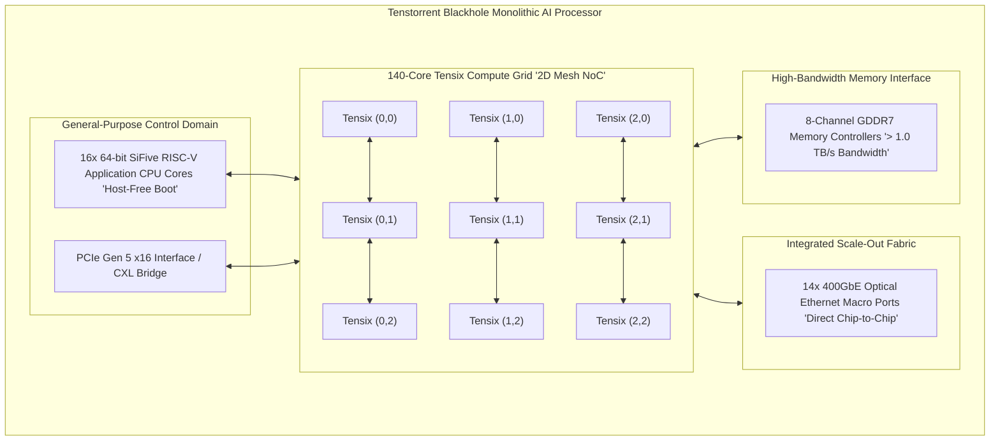
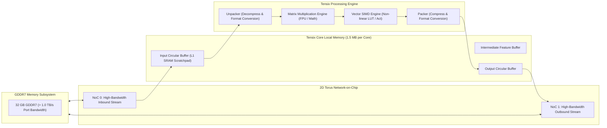
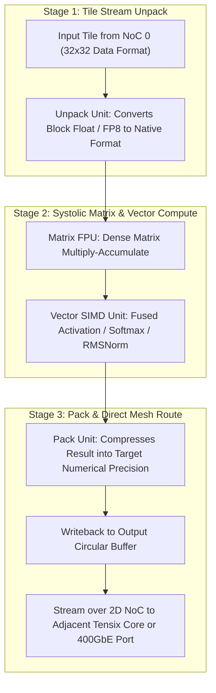
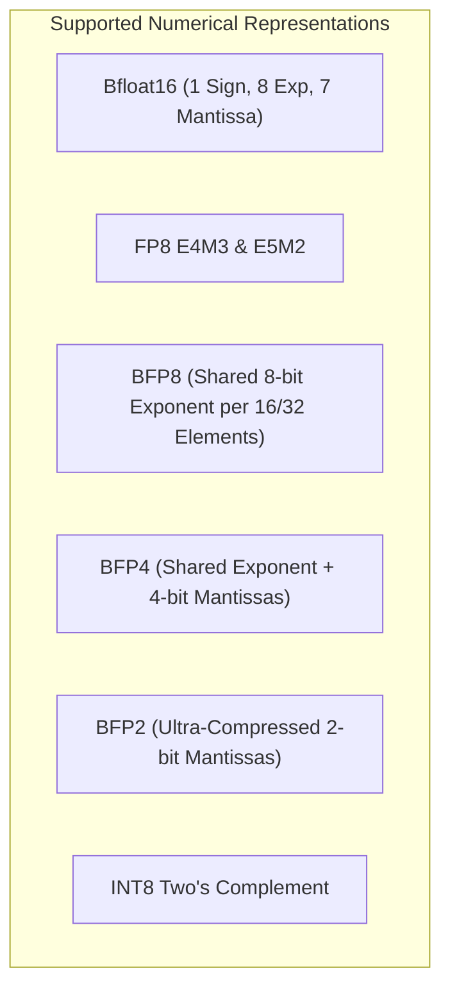
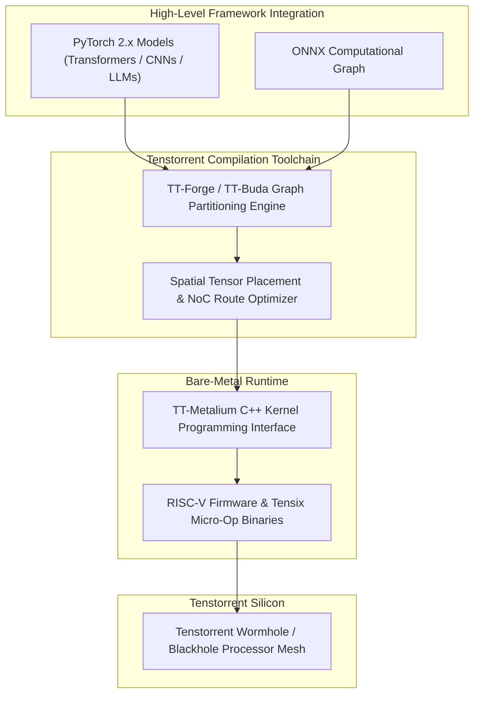

# 🌀 Tenstorrent Wormhole & Blackhole: Tensix Core Spatial Dataflow & Direct Mesh Architecture

## 1. Executive Summary & Hardware Typology

**Tenstorrent Wormhole** and **Tenstorrent Blackhole** represent a fundamental departure from monolithic GPU computing paradigms by implementing **RISC-V-controlled Spatial Dataflow Architectures**. Pioneered by Tenstorrent, this architecture eliminates expensive proprietary interconnect switches, bloated monolithic hardware schedulers, and closed instruction set architectures (ISAs) in favor of programmable 2D Network-on-Chip (NoC) grids of **Tensix compute cores** coupled to high-bandwidth memory and direct chip-to-chip optical ethernet links.

1. **Tenstorrent Wormhole**: Fabricated on a 12nm FinFET node, Wormhole integrates a $12 \times 10$ grid of Tensix cores (72 to 80 active), 6-channel GDDR6 memory (288 GB/s), and **16 integrated 100GbE optical Ethernet NoC ports**, allowing cards to connect directly into 2D toroidal meshes without external PCIe or InfiniBand switches.
2. **Tenstorrent Blackhole**: Fabricated on a 6nm FinFET node, Blackhole integrates **140 Tensix cores**, **16 general-purpose 64-bit SiFive RISC-V CPU cores** (enabling standalone, host-free Linux boot), 8-channel GDDR7 memory delivering **$> 1.0\text{ TB/s}$ bandwidth**, and **14 integrated 400GbE Ethernet ports**, yielding over **780 TFLOPS of FP8/BF16 compute** within a **$275\text{ W} - 350\text{ W}$** envelope.



### Architectural Lineage & Typology Matrix

| Parameter / Silicon | Tenstorrent Wormhole | Tenstorrent Blackhole |
| :--- | :--- | :--- |
| **Manufacturing Process** | 12nm FinFET (TSMC) | **6nm FinFET (TSMC)** |
| **Compute Core Count** | 72–80 Tensix Cores | **140 Tensix Cores** |
| **Integrated Host CPU** | External Host Required (x86/ARM via PCIe)| **16x 64-bit SiFive RISC-V Cores (Standalone OS)**|
| **Peak FP8 / BF16 Compute**| 350 TFLOPS | **780 TFLOPS** |
| **Peak INT8 Compute** | 350 TOPS | **780 TOPS** |
| **On-Chip Scratchpad SRAM**| ~120 MB (1.5 MB per Tensix core) | **210 MB (1.5 MB per Tensix core)** |
| **External Memory & Bandwidth**| 6-Ch GDDR6 (288 GB/s) | **8-Ch GDDR7 (> 1,024 GB/s)** |
| **Direct Scale-Out Fabric** | 16x 100GbE Direct Mesh | **14x 400GbE Direct Mesh (5.6 Tbps Aggregate)** |
| **Thermal Power Envelope** | 225 W – 300 W TDP | **275 W – 350 W TDP** |
| **Primary Software Framework**| TT-Metalium / TT-Buda / TT-Forge | TT-Metalium / TT-Forge / PyTorch 2.x |

---

## 2. Compute Core & Memory Hierarchy

The Tenstorrent memory hierarchy eliminates traditional hardware-managed data cache hierarchies in favor of a distributed, software-managed **Circular Buffer (CB)** model executed across on-chip SRAM scratchpads.



### Tensix Core Anatomy
Each Tensix core contains:
1. **5 RISC-V Micro-Controllers (Baby RISC-V)**: Tiny, specialized RISC-V cores programmed to manage the Unpacker, Math Engine, Packer, and NoC 0 / NoC 1 data streaming channels independently.
2. **1.5 MB Local L1 SRAM**: Configured as multi-page circular buffers where data tiles ($32 \times 32$ matrices) are streamed and consumed directly without CPU thread interrupts.
3. **Decoupled Access-Execute (DAE)**: Memory movement over the 2D NoC runs fully decoupled from mathematical matrix execution, completely hiding memory latency.

---

## 3. Micro-Architectural Mechanics: Tensix Execution & Dataflow Routing



### Direct Mesh Scale-Out Topology
Unlike traditional GPU clusters requiring thousands of dollars per port in external InfiniBand switches, Tenstorrent processors connect directly to neighboring chips using integrated QSFP-DD optical ethernet interfaces. The 2D NoC extends seamlessly across circuit boards and rack chassis, creating a single massive spatial computing grid.

---

## 4. Numerical Precision & Block Floating Point Formats

Tenstorrent silicon provides native hardware acceleration for standard floating-point types alongside specialized **Block Floating Point (BFP)** representations.



### Block Floating Point (BFP) Mathematical Formulation
In BFP formats, a $32 \times 32$ tile of numbers shares a common maximum exponent $E_{\text{shared}}$, allowing individual elements to store only low-bit mantissas:
$$X_{i, j} = (-1)^{s_{i, j}} \cdot 2^{E_{\text{shared}}} \cdot (0.m_{i, j})$$
This preserves dynamic floating-point range while slashing SRAM footprint and memory transfer energy by up to **$75\%$**.

---

## 5. Software Stack, TT-Metalium & TT-Buda Toolchains

Tenstorrent provides a two-tiered software ecosystem:
1. **TT-Metalium**: A low-level, bare-metal C++ framework that exposes direct access to Tensix core circular buffers, RISC-V control micro-engines, and NoC routers.
2. **TT-Buda / TT-Forge**: Graph-level compilers translating PyTorch, ONNX, and JAX models directly into spatial dataflow pipelines.



### TT-Metalium C++ Low-Level Kernel Example

```cpp
#include "tt_metal/host_api.hpp"
#include "tt_metal/common/bfloat16.hpp"

using namespace tt::tt_metal;

// Launch a Custom Spatial Dataflow Kernel on Tenstorrent Tensix Core
void launch_tensix_dataflow_kernel(Device* device) {
    CoreCoord core = {0, 0}; // Target Tensix Core (0,0)
    Program program = CreateProgram();

    // 1. Configure Circular Buffers in Tensix L1 SRAM
    uint32_t cb_index = CB::c_in0;
    uint32_t num_input_tiles = 2;
    uint32_t tile_size_bytes = 2048; // 32x32 tile in BF16
    
    CircularBufferConfig cb_config = CircularBufferConfig(num_input_tiles * tile_size_bytes, {{cb_index, tt::DataFormat::Float16_b}})
        .set_page_size(cb_index, tile_size_bytes);
    CreateCircularBuffer(program, core, cb_config);

    // 2. Load and Compile Data Movement & Compute Kernels onto Baby RISC-V Cores
    KernelHandle reader_kernel = CreateKernel(
        program, "kernels/dataflow/reader_unary.cpp", core,
        DataMovementConfig{.processor = DataMovementProcessor::RISCV_0, .noc = NOC::NOC_0}
    );

    KernelHandle compute_kernel = CreateKernel(
        program, "kernels/compute/eltwise_binary.cpp", core,
        ComputeConfig{.math_approx_mode = false, .fp32_dest_acc_en = false}
    );

    // 3. Execute Program across the NoC
    EnqueueProgram(device->command_queue(), program, false);
    Finish(device->command_queue());
}
```

---

## 6. Comparative AI Acceleration Matrix

| Architectural Dimension | Tenstorrent Blackhole | Tenstorrent Wormhole | NVIDIA B200 (Blackwell) | Groq LP-1 (TSP) |
| :--- | :--- | :--- | :--- | :--- |
| **Architecture Paradigm** | **Spatial Dataflow (RISC-V)** | Spatial Dataflow (RISC-V) | SIMT GPU (Dual-Die) | Deterministic Tensor Stream |
| **Fabrication Node** | **6nm FinFET** | 12nm FinFET | TSMC 4NP | 14nm FinFET |
| **Core Composition** | **140 Tensix + 16 SiFive Cores**| 72–80 Tensix Cores | 160–192 SMs | 1 Large TSP Engine |
| **Peak Low-Bit Compute** | **780 TFLOPS (FP8/BF16)** | 350 TFLOPS (FP8/BF16) | 20.0 PFLOPS (NVFP4) | 750 TOPS (INT8) |
| **Memory Bandwidth** | **> 1,024 GB/s (GDDR7)** | 288 GB/s (GDDR6) | 8.0 TB/s (HBM3e) | 80 TB/s (SRAM-only) |
| **On-Chip SRAM Cache** | **210 MB L1 Scratchpad** | 120 MB L1 Scratchpad | 128 MB L2 Cache | 230 MB Static SRAM |
| **Direct Scale-Out Mesh** | **14x 400GbE Optical Ethernet**| 16x 100GbE Optical Ethernet| NVLink 5 (Requires Switches)| 16x Real-Time Chip-to-Chip |
| **Thermal Power (TDP)** | **275 W – 350 W** | 225 W – 300 W | 1,000 W (SXM) | 300 W |
| **Open-Source Software** | **TT-Metalium (Fully Open)** | TT-Metalium (Fully Open) | Proprietary CUDA/TRT | Closed Proprietary Compiler |

---

## 7. Cross-References & Related Frameworks

- [[hardware/esperanto-et-soc-1|Esperanto ET-SoC-1 Many-Core RISC-V Processor]]
- [[hardware/nvidia-blackwell-b200|NVIDIA Blackwell B200 Data Center GPU]]
- [[hardware/intel-xeon-amx|Intel Xeon 6th Gen AMX Datacenter Processor]]
- [[docs/edge-ai-quantization-playbook|Edge AI Quantization & Compression Playbook]]
