# 🧬 Techniques & Algorithmic Mechanics Vault MOC

> **Navigation**: [[README|🏠 Central Knowledge Hub]] / **Techniques & Algorithmic Mechanics**

This directory houses dedicated, mathematically rigorous, and didactic guides explaining the foundational algorithmic building blocks, signal processing transforms, neural operators, and geometric mechanics that empower modern computer vision, physical AI, and edge deployment architectures.

---

## 🧭 Core Architectural Mechanics & Techniques Index

### 1. Signal Processing, Domain Adaptation & Physics
| Technique / Operator | Core Mathematical Principle | Key Benefit | Dedicated Deep-Dive Guide |
| :--- | :--- | :--- | :--- |
| **Fourier Domain Adaptation (FDA)** | 2D centered FFT decomposition into Phase $\mathcal{P}$ (geometry) and Amplitude $\mathcal{A}$ (style); low-frequency amplitude swap | Zero-parameter, zero-gradient transfer of real camera style to synthetic frames without altering bounding boxes | [[techniques/fourier-domain-adaptation\|Fourier Domain Adaptation Guide]] |
| **Gradient Reversal Layer (GRL / DANN)** | Minimax adversarial optimization with identity forward $\mathcal{R}(\mathbf{z}) = \mathbf{z}$ and negated backward $\frac{d\mathcal{R}}{d\mathbf{z}} = -\lambda \mathbf{I}$ | Single-pass joint optimization forcing backbones to discard synthetic artifacts and learn domain-invariant representations | [[techniques/gradient-reversal-and-dann\|Gradient Reversal & DANN Guide]] |

### 2. Spatial, Geometric & Structural Operators
| Technique / Operator | Core Mathematical Principle | Key Benefit | Dedicated Deep-Dive Guide |
| :--- | :--- | :--- | :--- |
| **Deformable Convolutions (DCNv1–DCNv4)** | Continuous 2D spatial offsets $\Delta p$ and modulation scalars $m \in [0, 1]$ evaluated via bilinear interpolation; FlashDeformable memory fusion | Kernel sampling points dynamically mold to object contours and compensate for optical fisheye/barrel distortion | [[techniques/deformable-convolutions\|Deformable Convolutions Guide]] |
| **Hypergraph Neural Computation** | Incidence matrix $\mathbf{H} \in \mathbb{R}^{N \times M}$ modeling arbitrary $k$-ary cliques; spectral normalized Laplacian $\mathbf{D}_v^{-1/2} \mathbf{H} \mathbf{W} \mathbf{D}_e^{-1} \mathbf{H}^T \mathbf{D}_v^{-1/2} \mathbf{X} \mathbf{\Theta}$ | Captures high-order multi-part object co-occurrences that survive severe occlusion, background clutter, and sensor noise | [[techniques/hypergraph-computation\|Hypergraph Computation Guide]] |
| **Lift-Splat-Shoot (LSS) & BEV Pooling** | Frustum depth probability lifting $\mathbf{p} = d \cdot \mathbf{K}^{-1} [u, v, 1]^T$, ego splatting, and fast cumsum voxel aggregation | Transforms multi-camera 2D perspective images into a unified 3D metric ego-frame BEV representation in $<4\text{ ms}$ | [[techniques/lift-splat-shoot-bev-pooling\|Lift-Splat-Shoot & BEV Pooling Guide]] |
| **3D Gaussian Splatting & Tile Rasterization** | Anisotropic 3D covariance $\mathbf{\Sigma} = \mathbf{R} \mathbf{S} \mathbf{S}^T \mathbf{R}^T$, 2D EWA projection $\mathbf{\Sigma}' = \mathbf{J} \mathbf{W} \mathbf{\Sigma} \mathbf{W}^T \mathbf{J}^T$, tile Radix sort & alpha blending | Explicit differentiable 3D rendering achieving photorealistic $1080\text{p}$ novel view synthesis at $>100\text{ FPS}$ | [[techniques/3d-gaussian-splatting-rasterization\|3D Gaussian Splatting Guide]] |
| **Lie Algebra $\mathfrak{se}(3)$ & $\mathrm{SE}(3)$ Pose Tracking** | Unconstrained 6D tangent twist $\boldsymbol{\xi} = [\boldsymbol{\upsilon}, \boldsymbol{\omega}]^T \in \mathbb{R}^6$, matrix exponential $\exp(\boldsymbol{\xi}^\wedge)$, analytical photometric Jacobians | Rigorous manifold optimization maintaining perfect rotation orthogonality without gimbal lock or quaternion drift | [[techniques/lie-algebra-se3-pose-tracking\|Lie Algebra se(3) Pose Tracking Guide]] |
| **All-Pairs Correlation Pyramids (RAFT)** | Full 4D pairwise dot-product volume $\mathbf{C} = \frac{1}{\sqrt{C}} \mathbf{f}_1^T \mathbf{f}_2$, target multi-scale pooling, local bilinear neighborhood lookup | Preserves small, fast-moving objects across frames that vanish in traditional coarse-to-fine feature warping | [[techniques/all-pairs-correlation-pyramids\|All-Pairs Correlation Pyramids Guide]] |

### 3. Detection, Assignment & Loss Formulations
| Technique / Operator | Core Mathematical Principle | Key Benefit | Dedicated Deep-Dive Guide |
| :--- | :--- | :--- | :--- |
| **DFL vs. Direct Metric Regression** | Expected value over 16 Softmax bins $\sum i \cdot P(i)$ versus continuous direct coordinate metrics (CIoU / GIoU / NWD) | Direct regression eliminates INT8 quantization drops, cuts regression VRAM by $16\times$, and avoids Sim2Real edge blur jitter | [[techniques/distribution-focal-loss-vs-direct-regression\|DFL vs Direct Regression Guide]] |
| **Bipartite Matching & Hungarian Assigner** | Permutation $\hat{\sigma} \in \mathfrak{S}_N = \arg\min \sum \mathcal{L}_{\text{match}}(y_i, \hat{y}_{\sigma(i)})$ via Kuhn-Munkres cost matrix reduction | Enforces strict $1:1$ prediction matching, permanently eliminating heuristic Non-Maximum Suppression (NMS) | [[techniques/bipartite-matching-and-hungarian-assigner\|Bipartite Matching & Hungarian Assigner Guide]] |

### 4. Sequence, Attention & Continuous Dynamical Systems
| Technique / Operator | Core Mathematical Principle | Key Benefit | Dedicated Deep-Dive Guide |
| :--- | :--- | :--- | :--- |
| **Visual State-Space Models (VMamba / SS2D)** | Discretized continuous ODE $\dot{h} = \mathbf{A} h + \mathbf{B} x$, ZOH discretization $\bar{\mathbf{A}} = \exp(\mathbf{\Delta} \mathbf{A})$, 4-way 2D selective scan | Global effective receptive field with strictly linear $\mathcal{O}(N)$ computation, bypassing quadratic attention | [[techniques/visual-state-space-mamba\|Visual State-Space Models (SSM) Guide]] |
| **Continuous Flow Matching (CFM)** | Optimal Transport straight vector fields $\mathbf{u}_t = \mathbf{x}_1 - \mathbf{x}_0$, continuity equation, forward Euler ODE integration | Replaces curved Brownian diffusion paths with straight trajectories, generating samples in $1\text{--}4$ forward steps | [[techniques/continuous-flow-matching\|Continuous Flow Matching Guide]] |
| **Action Chunking with C-VAE (ACT)** | C-VAE latent style $z \sim \mathcal{N}(0, I)$, predicting $H$-step future trajectory $a_{t:t+H}$, decaying temporal ensembling $w_i = e^{-mi}$ | Eliminates single-step compounding errors and prevents mode collapse in multimodal robot demonstrations at $50\text{ Hz}$ | [[techniques/action-chunking-cvae\|Action Chunking with C-VAE Guide]] |

### 5. Edge Acceleration, Quantization & Architecture Efficiency
| Technique / Operator | Core Mathematical Principle | Key Benefit | Dedicated Deep-Dive Guide |
| :--- | :--- | :--- | :--- |
| **Structural Reparameterization** | Homogeneous linear transformation fusion: $W_{\text{fused}} = \frac{\gamma}{\sigma} W$, Dirac kernel conversion, addition into single $3\times 3$ kernel | Multi-branch training for high gradient diversity folded into a single zero-overhead linear conv path for edge inference | [[techniques/structural-reparameterization\|Structural Reparameterization Guide]] |
| **PTQ & Outlier Smoothing (SmoothQuant)** | Mathematical difficulty migration: $\mathbf{Y} = \mathbf{X} \mathbf{W} = (\mathbf{X} \mathbf{S}^{-1}) (\mathbf{S} \mathbf{W})$ via diagonal per-channel scaling matrix $\mathbf{S}$ | Eliminates activation outliers in Vision Transformers, enabling full INT8 GEMM acceleration with $<0.5\%$ Top-1 accuracy drop | [[techniques/post-training-quantization-and-outlier-smoothing\|PTQ & Outlier Smoothing Guide]] |

---

## 🔗 Comprehensive Architectural Cross-Reference Matrix

```mermaid
flowchart TD
    subgraph Techniques ["Foundational Algorithmic Techniques (techniques/)"]
        FDA["Fourier Domain Adaptation (FDA)"]
        DCN["Deformable Convolutions (DCNv4)"]
        HG["Hypergraph Neural Networks (HG-AP)"]
        GRL["Gradient Reversal Layers (DANN)"]
        DirectReg["Direct Metric Regression (No DFL)"]
        RepConv["Structural Reparameterization"]
        Bipartite["Bipartite Matching (Hungarian)"]
        LSS["Lift-Splat-Shoot (BEV Pooling)"]
        SSM["Visual State-Space (VMamba SS2D)"]
        ACT["Action Chunking (C-VAE)"]
        CFM["Continuous Flow Matching (CFM)"]
        GS3D["3D Gaussian Splatting (3DGS)"]
        LieSE3["Lie Algebra se(3) Photometric"]
        AllPairs["All-Pairs Correlation Pyramids"]
        PTQ["PTQ & Outlier Smoothing (SmoothQuant)"]
    end

    subgraph ArchDetect ["Detectors & Segmenters"]
        Y13["YOLOv13"]
        Y14["YOLOv14-Sim2Real"]
        Y26["YOLO26"]
        DFINE["D-FINE"]
        RFDETR["RF-DETR"]
        GroundingDINO["Grounding DINO"]
    end

    subgraph Arch3D ["3D, SLAM & Sensor Fusion"]
        BEVFusion["BEVFusion"]
        Sparse4D["Sparse4D"]
        GS3D_SLAM["3DGS-SLAM"]
        DROID["DROID-SLAM"]
    end

    subgraph ArchRobot ["Robotics, VLA & Foundation Models"]
        PI0["pi0 (Physical Intelligence)"]
        ACT_Arch["ACT (ALOHA)"]
        VMamba_Arch["VMamba"]
        DINOv2_Arch["DINOv2"]
        SAM2_Arch["SAM 2"]
        RAFT_Arch["RAFT"]
    end

    FDA --> Y14
    GRL --> Y14
    DirectReg --> Y14
    DirectReg --> Y26
    DirectReg --> DFINE
    DCN --> Y14
    DCN --> DFINE
    DCN --> RFDETR
    DCN --> Sparse4D
    DCN --> BEVFusion
    HG --> Y13
    RepConv --> Y14
    RepConv --> Y26
    Bipartite --> RFDETR
    Bipartite --> DFINE
    Bipartite --> GroundingDINO
    LSS --> BEVFusion
    LSS --> Sparse4D
    GS3D --> GS3D_SLAM
    LieSE3 --> GS3D_SLAM
    LieSE3 --> DROID
    AllPairs --> RAFT_Arch
    AllPairs --> DROID
    SSM --> VMamba_Arch
    ACT --> ACT_Arch
    ACT --> PI0
    CFM --> PI0
    PTQ --> DINOv2_Arch
    PTQ --> SAM2_Arch
```

---

## 📚 Related Knowledge Hubs

- **Central Architecture MOC**: [[architectures/00-architectures-moc|Central Architecture MOC]] (100 production architectures).
- **Runnable Cookbooks**: [[cookbooks/00-cookbooks-moc|Cookbooks Vault MOC]] (24 standalone scripts).
- **Sim2Real Playbook**: [[topics/object-detection/03-sim2real-and-domain-adaptation|Sim2Real Object Detection Playbook]].
- **Physical AI & VLA Hub**: [[topics/vla-and-physical-ai-robotics/00-vla-and-physical-ai-robotics-moc|VLA & Physical AI MOC]].
- **SLAM & Spatial Perception Hub**: [[topics/slam-and-spatial-perception/00-slam-and-spatial-perception-moc|SLAM & Spatial Perception MOC]].
