# 🧬 Techniques & Algorithmic Mechanics Vault MOC

> **Navigation**: [[README|🏠 Central Knowledge Hub]] / **Techniques & Algorithmic Mechanics**

This directory houses dedicated, mathematically rigorous, and didactic guides explaining the foundational algorithmic building blocks, signal processing transforms, neural operators, variational solvers, and geometric mechanics that empower modern computer vision, physical AI, and edge deployment architectures.

---

## 🧭 Core Architectural Mechanics & Techniques Index

### 1. Signal Processing, Domain Adaptation & Active Metrology
| Technique / Operator | Core Mathematical Principle | Key Benefit | Dedicated Deep-Dive Guide |
| :--- | :--- | :--- | :--- |
| **Fourier Domain Adaptation (FDA)** | 2D centered FFT decomposition into Phase $\mathcal{P}$ (geometry) and Amplitude $\mathcal{A}$ (style); low-frequency amplitude swap | Zero-parameter, zero-gradient transfer of real camera style to synthetic frames without altering bounding boxes | [[techniques/fourier-domain-adaptation\|Fourier Domain Adaptation Guide]] |
| **Gradient Reversal Layer (GRL / DANN)** | Minimax adversarial optimization with identity forward $\mathcal{R}(\mathbf{z}) = \mathbf{z}$ and negated backward $\frac{d\mathcal{R}}{d\mathbf{z}} = -\lambda \mathbf{I}$ | Single-pass joint optimization forcing backbones to discard synthetic artifacts and learn domain-invariant representations | [[techniques/gradient-reversal-and-dann\|Gradient Reversal & DANN Guide]] |
| **Sinusoidal Phase-Shifting Profilometry** | $N$-step fringe projection, arctangent wrapped phase $\phi = -\text{atan2}(\sum I_n \sin\delta_n, \sum I_n \cos\delta_n)$, heterodyne beat unwrapping | Sub-10-micron surface metrology completely invariant to ambient illumination and surface albedo | [[techniques/phase-shifting-profilometry-structured-light\|Phase-Shifting Profilometry Guide]] |

### 2. Spatial, Geometric & Structural Operators
| Technique / Operator | Core Mathematical Principle | Key Benefit | Dedicated Deep-Dive Guide |
| :--- | :--- | :--- | :--- |
| **Deformable Convolutions (DCNv1–DCNv4)** | Continuous 2D spatial offsets $\Delta p$ and modulation scalars $m \in [0, 1]$ evaluated via bilinear interpolation; FlashDeformable memory fusion | Kernel sampling points dynamically mold to object contours and compensate for optical fisheye/barrel distortion | [[techniques/deformable-convolutions\|Deformable Convolutions Guide]] |
| **Hypergraph Neural Computation** | Incidence matrix $\mathbf{H} \in \mathbb{R}^{N \times M}$ modeling arbitrary $k$-ary cliques; spectral normalized Laplacian $\mathbf{D}_v^{-1/2} \mathbf{H} \mathbf{W} \mathbf{D}_e^{-1} \mathbf{H}^T \mathbf{D}_v^{-1/2} \mathbf{X} \mathbf{\Theta}$ | Captures high-order multi-part object co-occurrences that survive severe occlusion, background clutter, and sensor noise | [[techniques/hypergraph-computation\|Hypergraph Computation Guide]] |
| **Lift-Splat-Shoot (LSS) & BEV Pooling** | Frustum depth probability lifting $\mathbf{p} = d \cdot \mathbf{K}^{-1} [u, v, 1]^T$, ego splatting, and fast cumsum voxel aggregation | Transforms multi-camera 2D perspective images into a unified 3D metric ego-frame BEV representation in $<4\text{ ms}$ | [[techniques/lift-splat-shoot-bev-pooling\|Lift-Splat-Shoot & BEV Pooling Guide]] |
| **3D Gaussian Splatting & Tile Rasterization** | Anisotropic 3D covariance $\mathbf{\Sigma} = \mathbf{R} \mathbf{S} \mathbf{S}^T \mathbf{R}^T$, 2D EWA projection $\mathbf{\Sigma}' = \mathbf{J} \mathbf{W} \mathbf{\Sigma} \mathbf{W}^T \mathbf{J}^T$, tile Radix sort & alpha blending | Explicit differentiable 3D rendering achieving photorealistic $1080\text{p}$ novel view synthesis at $>100\text{ FPS}$ | [[techniques/3d-gaussian-splatting-rasterization\|3D Gaussian Splatting Guide]] |
| **Lie Algebra $\mathfrak{se}(3)$ & $\mathrm{SE}(3)$ Pose Tracking** | Unconstrained 6D tangent twist $\boldsymbol{\xi} = [\boldsymbol{\upsilon}, \boldsymbol{\omega}]^T \in \mathbb{R}^6$, matrix exponential $\exp(\boldsymbol{\xi}^\wedge)$, analytical photometric Jacobians | Rigorous manifold optimization maintaining perfect rotation orthogonality without gimbal lock or quaternion drift | [[techniques/lie-algebra-se3-pose-tracking\|Lie Algebra se(3) Pose Tracking Guide]] |
| **All-Pairs Correlation Pyramids (RAFT)** | Full 4D pairwise dot-product volume $\mathbf{C} = \frac{1}{\sqrt{C}} \mathbf{f}_1^T \mathbf{f}_2$, target multi-scale pooling, local bilinear neighborhood lookup | Preserves small, fast-moving objects across frames that vanish in traditional coarse-to-fine feature warping | [[techniques/all-pairs-correlation-pyramids\|All-Pairs Correlation Pyramids Guide]] |
| **Variational Optical Flow (TV-$L^1$)** | Primal-Dual Chambolle-Pock decoupling, Total Variation regularization $\|\nabla\mathbf{u}\|$, pointwise soft-thresholding shrinkage | Preserves razor-sharp motion step discontinuities across object boundaries without oversmoothing | [[techniques/variational-optical-flow-tv-l1\|Variational Optical Flow TV-L1 Guide]] |
| **Multiresolution Spatial Hash Encodings** | Prime-XOR spatial hashing $h(\mathbf{v}) = (\bigoplus v_i \pi_i) \pmod T$, geometric level stacking, dynamic sparse voxel indexing | Delivers dense continuous 3D representations in constant $\mathcal{O}(1)$ memory, eliminating the cubic $\mathcal{O}(N^3)$ voxel memory barrier | [[techniques/multiresolution-hash-encodings-and-sparse-voxels\|Multiresolution Spatial Hash Encodings Guide]] |
| **Orthogonal Procrustes & Umeyama Alignment** | Centroid decoupling, spatial cross-covariance SVD $\mathbf{\Sigma} = \mathbf{U}\mathbf{D}\mathbf{V}^T$, determinant reflection sign correction | Exact, closed-form, globally optimal $\mathrm{Sim}(3)$ metric scale, rotation, and translation in $<10\ \mu\text{s}$ | [[techniques/orthogonal-procrustes-and-umeyama-sim3\|Orthogonal Procrustes & Umeyama Guide]] |
| **Pillar Feature Encoding (PointPillars)** | Vertical pillar discretization, 9D geometric feature augmentation, simplified PointNet max-pooling, and 2D pseudo-image scatter | Transforms unordered 3D LiDAR point clouds into dense 2D BEV representations running at $>60\text{ FPS}$ on standard 2D CNN engines | [[techniques/point-cloud-pillar-feature-encoding\|Point Cloud Pillar Feature Encoding Guide]] |
| **Bundle Adjustment & Schur Complement** | Arrowhead block Hessian $\mathbf{H} = \begin{bmatrix} \mathbf{B} & \mathbf{E} \\ \mathbf{E}^T & \mathbf{C} \end{bmatrix}$, $\mathcal{O}(N)$ landmark marginalization $(\mathbf{B} - \mathbf{E}\mathbf{C}^{-1}\mathbf{E}^T)\Delta\mathbf{x}_p = \mathbf{g}$ | Solves multi-camera 3D reconstruction in $<5\text{ ms}$ bypassing the cubic $\mathcal{O}(D^3)$ inversion barrier | [[techniques/bundle-adjustment-and-schur-complement\|Bundle Adjustment & Schur Complement Guide]] |
| **Epipolar Geometry & Essential Matrix** | Coplanarity constraint $\mathbf{x}_2^T \mathbf{E} \mathbf{x}_1 = 0$, Hartley isotropic scaling, SVD rank-2 projection, Cheirality depth check | Estimates relative camera rotation $\mathbf{R} \in \mathrm{SO}(3)$ and baseline direction $\mathbf{t}$ from 2D point correspondences | [[techniques/epipolar-geometry-essential-matrix\|Epipolar Geometry & Essential Matrix Guide]] |
| **Perspective-n-Point (PnP & EPnP)** | 4 virtual control points with rigid-invariant barycentric weights, $\mathcal{O}(N)$ linear system $\mathbf{M}\mathbf{x} = \mathbf{0}$, closed-form Procrustes alignment | Computes 6-DoF object/camera pose $(\mathbf{R}, \mathbf{t}) \in \mathrm{SE}(3)$ from 2D-3D correspondences in $<1\text{ ms}$ | [[techniques/perspective-n-point-epnp-pose-estimation\|Perspective-n-Point (EPnP) Guide]] |

### 3. Detection, Assignment, Safety & Losses
| Technique / Operator | Core Mathematical Principle | Key Benefit | Dedicated Deep-Dive Guide |
| :--- | :--- | :--- | :--- |
| **DFL vs. Direct Metric Regression** | Expected value over 16 Softmax bins $\sum i \cdot P(i)$ versus continuous direct coordinate metrics (CIoU / GIoU / NWD) | Direct regression eliminates INT8 quantization drops, cuts regression VRAM by $16\times$, and avoids Sim2Real edge blur jitter | [[techniques/distribution-focal-loss-vs-direct-regression\|DFL vs Direct Regression Guide]] |
| **Bipartite Matching & Hungarian Assigner** | Permutation $\hat{\sigma} \in \mathfrak{S}_N = \arg\min \sum \mathcal{L}_{\text{match}}(y_i, \hat{y}_{\sigma(i)})$ via Kuhn-Munkres cost matrix reduction | Enforces strict $1:1$ prediction matching, permanently eliminating heuristic Non-Maximum Suppression (NMS) | [[techniques/bipartite-matching-and-hungarian-assigner\|Bipartite Matching & Hungarian Assigner Guide]] |
| **Contrastive Learning: InfoNCE vs. SigLIP** | Decoupled pairwise binary Sigmoid loss $\mathcal{L} = - \frac{1}{B} \sum \log \sigma(y_{ij} (t \mathbf{u}_i^T \mathbf{v}_j + b))$ | Eliminates distributed multi-GPU `all-gather` communication bottlenecks, scaling contrastive pretraining past batch size 1M | [[techniques/contrastive-learning-infonce-vs-siglip\|InfoNCE vs SigLIP Contrastive Learning Guide]] |
| **Control Barrier Functions (CBF-QP)** | Set forward invariance $\dot{h}(\mathbf{x}) + \gamma h(\mathbf{x}) \ge 0$, online convex Quadratic Program minimal intervention filter | Guarantees formal provable safety and collision avoidance around uncertified neural network and VLA policy actions in $<50\ \mu\text{s}$ | [[techniques/control-barrier-functions-safe-control\|Control Barrier Functions (CBF) Guide]] |
| **Error-State Kalman Filter (ESKF)** | True/nominal/error decomposition, $\delta\boldsymbol{\theta} \in \mathfrak{so}(3)$ tangent rotation, error reset after injection | Non-singular minimal $15\times 15$ covariance matrix eliminating quaternion normalization singularity in visual-inertial fusion | [[techniques/error-state-kalman-filter-eskf-vio\|Error-State Kalman Filter (ESKF) Guide]] |
| **Bounding Box Losses (GIoU, DIoU, CIoU, NWD)** | Scale-invariant metrics: convex area penalty (GIoU), center distance (DIoU), aspect ratio (CIoU), and 2D Gaussian Wasserstein distance (NWD) | Eliminates vanishing gradients on non-overlapping boxes and stabilizes sub-pixel regression for tiny objects | [[techniques/bounding-box-losses-giou-ciou-nwd\|Bounding Box Regression Losses Guide]] |
| **Focal Loss & Class Imbalance** | Dynamic modulating factor $\text{FL}(p_t) = -\alpha_t (1 - p_t)^\gamma \log(p_t)$ and Quality Focal Loss (QFL) with continuous IoU targets | Downweights easy negatives, preventing loss gradient domination in dense one-stage detectors with extreme $10,000:1$ class imbalance | [[techniques/focal-loss-and-class-imbalance\|Focal Loss & Class Imbalance Guide]] |
| **FPN & Path Aggregation (PANet / BiFPN)** | Top-down semantic enrichment, bottom-up localization pathways, and fast normalized weighted cross-scale fusion | Delivers scale-invariant representations across tiny, medium, and large objects without costly multi-scale image inference | [[techniques/feature-pyramid-networks-and-path-aggregation\|FPN & Path Aggregation Guide]] |

### 4. Sequence, Attention & Continuous Dynamical Systems
| Technique / Operator | Core Mathematical Principle | Key Benefit | Dedicated Deep-Dive Guide |
| :--- | :--- | :--- | :--- |
| **FlashAttention & Online Softmax** | Online max-sum rescaling $m^{\text{new}} = \max(m_1, m_2)$, on-chip SRAM block tiling, $\mathcal{O}(N)$ IO complexity | Computes exact attention without materializing the $N \times N$ matrix in DRAM, unlocking $3\times$ speedup and $85\%$ VRAM reduction | [[techniques/flash-attention-and-online-softmax\|FlashAttention & Online Softmax Guide]] |
| **Visual State-Space Models (VMamba / SS2D)** | Discretized continuous ODE $\dot{h} = \mathbf{A} h + \mathbf{B} x$, ZOH discretization $\bar{\mathbf{A}} = \exp(\mathbf{\Delta} \mathbf{A})$, 4-way 2D selective scan | Global effective receptive field with strictly linear $\mathcal{O}(N)$ computation, bypassing quadratic attention | [[techniques/visual-state-space-mamba\|Visual State-Space Models (SSM) Guide]] |
| **Continuous Flow Matching (CFM)** | Optimal Transport straight vector fields $\mathbf{u}_t = \mathbf{x}_1 - \mathbf{x}_0$, continuity equation, forward Euler ODE integration | Replaces curved Brownian diffusion paths with straight trajectories, generating samples in $1\text{--}4$ forward steps | [[techniques/continuous-flow-matching\|Continuous Flow Matching Guide]] |
| **Action Chunking with C-VAE (ACT)** | C-VAE latent style $z \sim \mathcal{N}(0, I)$, predicting $H$-step future trajectory $a_{t:t+H}$, decaying temporal ensembling $w_i = e^{-mi}$ | Eliminates single-step compounding errors and prevents mode collapse in multimodal robot demonstrations at $50\text{ Hz}$ | [[techniques/action-chunking-cvae\|Action Chunking with C-VAE Guide]] |
| **Multi-Scale Deformable Attention (MS-DeformAttn)** | Reference points with learned 2D sampling offsets $\Delta \mathbf{p}_{mqk}$, multi-scale bilinear interpolation, attention weight aggregation | Scales vision transformers to multi-scale high-resolution feature maps with strictly linear $\mathcal{O}(N_q C)$ complexity | [[techniques/multi-scale-deformable-attention\|Multi-Scale Deformable Attention Guide]] |
| **Shifted Window Self-Attention (Swin)** | Partitioned non-overlapping window attention (W-MSA) with cyclic shift, masked computation, and reverse roll | Delivers hierarchical vision transformer backbones with linear $\mathcal{O}(M^2 HW)$ complexity and cross-window receptive fields | [[techniques/shifted-window-attention-swin\|Shifted Window Self-Attention Guide]] |
| **Rotary Positional Embeddings (RoPE & M-RoPE)** | 2D complex orthogonal rotation matrices $\mathbf{R}_{\Theta, n-m}$ decomposing spatial coordinates into temporal, vertical, and horizontal $(t, y, x)$ axes | Encodes relative geometric distance directly within attention inner products, supporting arbitrary image resolutions and aspect ratios | [[techniques/rotary-positional-embeddings-rope-and-mrope\|Rotary Positional Embeddings Guide]] |

### 5. Edge Acceleration, Quantization & Architecture Efficiency
| Technique / Operator | Core Mathematical Principle | Key Benefit | Dedicated Deep-Dive Guide |
| :--- | :--- | :--- | :--- |
| **Structural Reparameterization** | Homogeneous linear transformation fusion: $W_{\text{fused}} = \frac{\gamma}{\sigma} W$, Dirac kernel conversion, addition into single $3\times 3$ kernel | Multi-branch training for high gradient diversity folded into a single zero-overhead linear conv path for edge inference | [[techniques/structural-reparameterization\|Structural Reparameterization Guide]] |
| **PTQ & Outlier Smoothing (SmoothQuant)** | Mathematical difficulty migration: $\mathbf{Y} = \mathbf{X} \mathbf{W} = (\mathbf{X} \mathbf{S}^{-1}) (\mathbf{S} \mathbf{W})$ via diagonal per-channel scaling matrix $\mathbf{S}$ | Eliminates activation outliers in Vision Transformers, enabling full INT8 GEMM acceleration with $<0.5\%$ Top-1 accuracy drop | [[techniques/post-training-quantization-and-outlier-smoothing\|PTQ & Outlier Smoothing Guide]] |

---

## 🔗 Architectural Mapping & Knowledge Network

```mermaid
flowchart TD
    subgraph SignalAndSensors ["Signal, Sensors & Active Vision"]
        FDA["Fourier Domain Adaptation (FDA)"]
        GRL["Gradient Reversal (DANN)"]
        PSP["Phase-Shifting Profilometry"]
        ESKF["Error-State Kalman Filter (ESKF)"]
    end

    subgraph SpatialAndGeometry ["Spatial, 3D & Geometry"]
        DCN["Deformable Convolutions (DCNv4)"]
        HG["Hypergraph Neural Networks"]
        LSS["Lift-Splat-Shoot (BEV Pooling)"]
        GS3D["3D Gaussian Splatting (3DGS)"]
        LieSE3["Lie Algebra se(3) Photometric"]
        AllPairs["All-Pairs Correlation (RAFT)"]
        TVL1["Variational TV-L1 Flow"]
        Hash3D["Spatial Hash Encodings (Instant-NGP)"]
        Procrustes["Orthogonal Procrustes (Umeyama)"]
        Pillars["Point Cloud Pillar Encoding"]
        BA_Schur["Bundle Adjustment & Schur"]
        Epipolar["Epipolar Geometry & Essential Matrix"]
        EPnP["Perspective-n-Point (EPnP)"]
    end

    subgraph FoundationsAndControl ["Attention, Sequences & Provable Control"]
        FlashAttn["FlashAttention & Online Softmax"]
        SigLIP_Tech["Contrastive SigLIP vs InfoNCE"]
        SSM["Visual State-Space (VMamba SS2D)"]
        CFM["Continuous Flow Matching"]
        ACT["Action Chunking (C-VAE)"]
        CBF["Control Barrier Functions (CBF-QP)"]
        Bipartite["Bipartite Matching (Hungarian)"]
        DirectReg["Direct Metric Regression"]
        RepConv["Structural Reparameterization"]
        PTQ["PTQ & Outlier Smoothing"]
        BBoxLosses["Bounding Box Losses (CIoU / NWD)"]
        FocalLoss["Focal Loss & Class Imbalance"]
        FPN_PANet["FPN & Path Aggregation (BiFPN)"]
        MSDeform["Multi-Scale Deformable Attention"]
        SwinAttn["Shifted Window Attention (Swin)"]
        RoPE_Tech["Rotary Positional Embeddings (RoPE)"]
    end

    subgraph VaultDeployments ["Vault Architectures & Systems"]
        Y14["YOLOv14-Sim2Real"]
        Y26["YOLO26"]
        RFDETR["RF-DETR"]
        BEVFusion["BEVFusion"]
        GS3D_SLAM["3DGS-SLAM"]
        OpenVLA_Model["OpenVLA"]
        PI0_Model["pi0"]
        SAM2_Model["SAM 2"]
        DINOv2_Model["DINOv2"]
        FastLIO["FAST-LIO2"]
        PointPillars_Model["PointPillars"]
        DROID_SLAM_Model["DROID-SLAM"]
        FoundationPose_Model["FoundationPose"]
    end

    FDA --> Y14
    GRL --> Y14
    DirectReg --> Y14
    DirectReg --> Y26
    DCN --> Y14
    DCN --> RFDETR
    DCN --> BEVFusion
    RepConv --> Y14
    RepConv --> Y26
    Bipartite --> RFDETR
    LSS --> BEVFusion
    GS3D --> GS3D_SLAM
    LieSE3 --> GS3D_SLAM
    FlashAttn --> SAM2_Model
    FlashAttn --> DINOv2_Model
    SigLIP_Tech --> OpenVLA_Model
    CFM --> PI0_Model
    ACT --> PI0_Model
    ACT --> OpenVLA_Model
    CBF --> OpenVLA_Model
    CBF --> PI0_Model
    ESKF --> FastLIO
    Hash3D --> GS3D_SLAM
    Procrustes --> GS3D_SLAM
    Pillars --> PointPillars_Model
    Pillars --> BEVFusion
    BA_Schur --> DROID_SLAM_Model
    BA_Schur --> GS3D_SLAM
    Epipolar --> DROID_SLAM_Model
    EPnP --> FoundationPose_Model
    MSDeform --> RFDETR
    FocalLoss --> RFDETR
    FocalLoss --> Y14
    BBoxLosses --> Y14
    FPN_PANet --> Y14
    FPN_PANet --> RFDETR
    SwinAttn --> DINOv2_Model
    RoPE_Tech --> OpenVLA_Model
```

---

## 📚 Related Knowledge Hubs

- **Central Architecture MOC**: [[architectures/00-architectures-moc|Central Architecture MOC]] (100 production architectures).
- **Runnable Cookbooks**: [[cookbooks/00-cookbooks-moc|Cookbooks Vault MOC]] (24 standalone scripts).
- **Safety Verification Hub**: [[topics/safety-verification-and-robustness/00-safety-verification-and-robustness-moc|Safety Verification MOC]].
- **Active 3D Sensing Hub**: [[topics/active-3d-sensing-and-structured-light/00-active-3d-sensing-and-structured-light-moc|Active 3D Sensing MOC]].
- **Sensor Fusion Hub**: [[topics/sensor-fusion/00-sensor-fusion-moc|Sensor Fusion MOC]].
