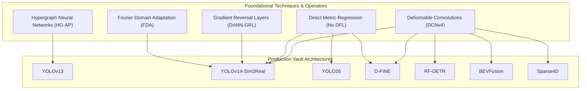

# 🧬 Techniques & Algorithmic Mechanics Vault MOC

> **Navigation**: [[README|🏠 Central Knowledge Hub]] / **Techniques & Algorithmic Mechanics**

This directory houses dedicated, mathematically rigorous, and didactic guides explaining the foundational algorithmic building blocks, signal processing transforms, and mathematical operators that empower modern computer vision, physical AI, and edge deployment architectures.

---

## 🧭 Core Architectural Mechanics & Techniques

| Technique / Operator | Primary Domain | Core Mathematical Principle | Key Benefit | Dedicated Deep-Dive Guide |
| :--- | :--- | :--- | :--- | :--- |
| **Fourier Domain Adaptation (FDA)** | Sim2Real & Domain Generalization | 2D centered FFT decomposition into Phase $\mathcal{P}$ (geometry) and Amplitude $\mathcal{A}$ (style); low-frequency amplitude swap | Zero-parameter, zero-gradient transfer of real camera style to synthetic training frames without altering bounding boxes | [[techniques/fourier-domain-adaptation\|Fourier Domain Adaptation Guide]] |
| **Deformable Convolutions (DCNv1–DCNv4)** | Non-Rigid & Distorted Vision | Continuous 2D spatial offsets $\Delta p$ and modulation scalars $m \in [0, 1]$ evaluated via bilinear interpolation; FlashDeformable memory fusion | Kernel sampling points dynamically mold to object contours and compensate for optical fisheye/barrel distortion | [[techniques/deformable-convolutions\|Deformable Convolutions Guide]] |
| **Hypergraph Neural Computation** | Robust Structural Perception | Incidence matrix $\mathbf{H} \in \mathbb{R}^{N \times M}$ modeling arbitrary $k$-ary cliques; spectral normalized Laplacian $\mathbf{D}_v^{-1/2} \mathbf{H} \mathbf{W} \mathbf{D}_e^{-1} \mathbf{H}^T \mathbf{D}_v^{-1/2} \mathbf{X} \mathbf{\Theta}$ | Captures high-order multi-part object co-occurrences that survive severe occlusion, background clutter, and sensor noise | [[techniques/hypergraph-computation\|Hypergraph Computation Guide]] |
| **Gradient Reversal Layer (GRL / DANN)** | Adversarial Domain Alignment | Minimax optimization with identity forward $\mathcal{R}(\mathbf{z}) = \mathbf{z}$ and negated backward $\frac{d\mathcal{R}}{d\mathbf{z}} = -\lambda \mathbf{I}$ | Single-pass joint optimization forcing backbones to discard synthetic artifacts and learn domain-invariant representations | [[techniques/gradient-reversal-and-dann\|Gradient Reversal & DANN Guide]] |
| **DFL vs. Direct Metric Regression** | Bounding Box Regression | Expected value over 16 Softmax bins $\sum i \cdot P(i)$ versus continuous direct coordinate metrics (CIoU / GIoU / NWD) | Direct regression eliminates INT8 quantization drops, cuts regression VRAM by $16\times$, and avoids Sim2Real edge blur jitter | [[techniques/distribution-focal-loss-vs-direct-regression\|DFL vs Direct Regression Guide]] |

---

## 🔗 Architectural Cross-Reference Matrix

How these individual techniques map directly to production architectures across the vault:

---

## 📚 Related Knowledge Hubs

- **Object Detection Hub**: [[topics/object-detection/00-object-detection-moc|Object Detection MOC]].
- **Sim2Real Playbook**: [[topics/object-detection/03-sim2real-and-domain-adaptation|Sim2Real Object Detection Playbook]].
- **Architectures Vault**: [[architectures/00-architectures-moc|Central Architecture MOC]].
- **Runnable Cookbooks**: [[cookbooks/00-cookbooks-moc|Cookbooks Vault MOC]].
