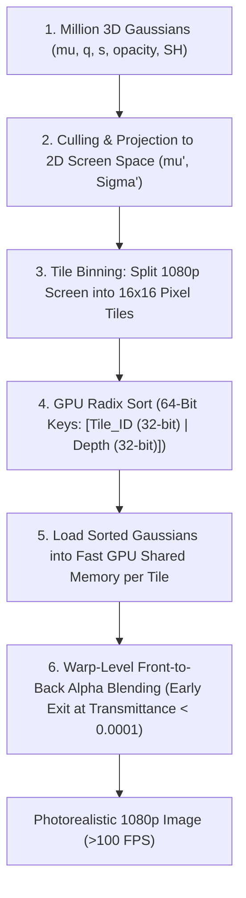

# 🎆 3D Gaussian Splatting & Tile-Based Differentiable Rasterization

## 1. High-Level Concept & The Neural Rendering Dilemma

Neural Radiance Fields (NeRF, Mildenhall et al., 2020) revolutionized photorealistic 3D novel view synthesis by training continuous multilayer perceptrons (MLPs) to map spatial coordinates and viewing angles $(x, y, z, \theta, \phi)$ to volume density and radiance $(\sigma, \mathbf{c})$.

However, NeRFs suffer from a debilitating computational bottleneck:
- **Volumetric Ray Marching**: Evaluating a single camera pixel requires casting a ray through 3D space and querying the neural network at $64\text{ to }256$ sample points.
- **Rendering Throughput**: Rendering a single $1080\text{p}$ frame requires millions of MLP forwards, limiting rendering speeds to $0.1\text{--}2.0\text{ FPS}$ on high-end GPUs, rendering them unusable for real-time robotics, SLAM, or embedded spatial perception.

**3D Gaussian Splatting (3DGS)** (Kerbl et al., SIGGRAPH 2023) fundamentally abandoned implicit volumetric neural fields in favor of an **explicit, differentiable particle representation**:
1. **Explicit 3D Gaussians**: Represents the physical scene as millions of discrete 3D Gaussian ellipsoids defined by spatial position $\boldsymbol{\mu}$, 3D anisotropic covariance $\mathbf{\Sigma}$, color (via Spherical Harmonics $\mathbf{c}$), and opacity $\alpha$.
2. **2D EWA Splatting**: Mathematically projects 3D Gaussians onto the 2D image plane via calibrated camera optics.
3. **Tile-Based Parallel Rasterization**: Divides the screen into $16 \times 16$ pixel tiles, sorts Gaussians via 64-bit Radix keys in parallel, and evaluates front-to-back alpha blending, rendering full HD at **$>100\text{ FPS}$** with fully differentiable gradients back to Gaussian parameters.

```
Volumetric NeRF Ray Marching vs. 3D Gaussian Splatting:

NeRF (Implicit Ray Marching):        3D Gaussian Splatting (Explicit Tile Splatting):
Camera Eye -> Ray -> Sample Sample Sample      [ 3D Gaussian Ellipsoids in Metric Space ]
(256 MLP queries per pixel = 0.5 FPS)                       |
                                                           v
                                            [ 2D Projection: Sigma' = J W Sigma W^T J^T ]
                                                           |
                                                           v
                                            [ Tile-Based Radix Sort & Alpha Blending ]
                                                (Parallel Rasterization = >100 FPS!)
```

---

## 2. Mathematical Formulation

### 2.1 The 3D Gaussian Representation
A 3D Gaussian centered at mean position $\boldsymbol{\mu} \in \mathbb{R}^3$ is defined by its probability density:

$$
G(\mathbf{x}) = \exp\left( -\frac{1}{2} (\mathbf{x} - \boldsymbol{\mu})^T \mathbf{\Sigma}^{-1} (\mathbf{x} - \boldsymbol{\mu}) \right)
$$

where $\mathbf{\Sigma} \in \mathbb{R}^{3 \times 3}$ is the 3D covariance matrix.

To ensure that $\mathbf{\Sigma}$ remains mathematically positive semi-definite throughout gradient descent optimization, it is factorized into a **rotation matrix** $\mathbf{R} \in \mathrm{SO}(3)$ and a **scale matrix** $\mathbf{S} \in \mathbb{R}^{3 \times 3}$:

$$
\mathbf{\Sigma} = \mathbf{R} \mathbf{S} \mathbf{S}^T \mathbf{R}^T
$$

where:
- $\mathbf{S} = \text{diag}(s_x, s_y, s_z)$ represents 3 independent spatial semi-axes (stored as logarithms for unconstrained optimization).
- $\mathbf{R}$ is parameterized by a normalized 4D unit quaternion $\mathbf{q} = (q_w, q_x, q_y, q_z)$.

---

### 2.2 2D Elliptical Weighted Average (EWA) Projection
To render a 3D Gaussian onto a 2D camera sensor, the 3D covariance $\mathbf{\Sigma}$ is projected into a 2D covariance matrix $\mathbf{\Sigma}' \in \mathbb{R}^{2 \times 2}$ in pixel coordinates (Zwicker et al., 2001):

$$
\mathbf{\Sigma}' = \mathbf{J} \mathbf{W} \mathbf{\Sigma} \mathbf{W}^T \mathbf{J}^T
$$

where:
- $\mathbf{W} \in \mathbb{R}^{3 \times 3}$ is the viewing transformation matrix (camera extrinsics rotation).
- $\mathbf{J} \in \mathbb{R}^{2 \times 3}$ is the Jacobian of the affine approximation of the projective transformation evaluated at camera coordinates $\mathbf{t} = [t_x, t_y, t_z]^T$:

$$
\mathbf{J} = \begin{bmatrix}
\frac{f_x}{t_z} & 0 & -\frac{f_x \cdot t_x}{t_z^2} \\
0 & \frac{f_y}{t_z} & -\frac{f_y \cdot t_y}{t_z^2}
\end{bmatrix}
$$

To prevent visual aliasing when a Gaussian projects smaller than a single physical pixel, a low-pass filter adds $\epsilon = 0.3 \cdot \mathbf{I}_{2\times 2}$ to $\mathbf{\Sigma}'$.

---

### 2.3 Front-to-Back Differentiable Alpha Blending
The color $C$ of a screen pixel $\mathbf{p} = (u, v)$ is computed by accumulating all Gaussians overlapping that pixel, sorted from closest to farthest from the camera:

$$
C(\mathbf{p}) = \sum_{i \in \mathcal{N}} \mathbf{c}_i \alpha_i(\mathbf{p}) \prod_{j=1}^{i-1} \left( 1 - \alpha_j(\mathbf{p}) \right)
$$

where:
- $\mathbf{c}_i$ is the view-dependent color evaluated from degree-3 Spherical Harmonics coefficients.
- $\alpha_i(\mathbf{p})$ is the 2D projected opacity:

$$
\alpha_i(\mathbf{p}) = o_i \cdot \exp\left( -\frac{1}{2} (\mathbf{p} - \boldsymbol{\mu}'_i)^T (\mathbf{\Sigma}'_i)^{-1} (\mathbf{p} - \boldsymbol{\mu}'_i) \right)
$$

where $o_i \in [0, 1]$ is the learned base opacity of Gaussian $i$.

---

## 3. Tile-Based Sorting & Parallel Rasterization Architecture



1. **Tile Binning**: The screen is subdivided into $16 \times 16$ pixel tiles. A 3D Gaussian whose $3\sigma$ ellipse overlaps multiple tiles is replicated with unique tile keys.
2. **GPU Radix Sort**: Gaussians are sorted in a single GPU pass using 64-bit keys combining `tile_id` (upper 32 bits) and `depth` (lower 32 bits).
3. **Early Exit Transmittance**: As soon as accumulated opacity reaches $T_i = \prod (1 - \alpha_j) < 10^{-4}$, thread execution terminates immediately, avoiding wasted computation on heavily occluded geometry.

---

## 4. PyTorch Reference Implementation

```python
import torch
import torch.nn as nn

def build_covariance_3d(scales: torch.Tensor, quaternions: torch.Tensor) -> torch.Tensor:
    """
    Constructs positive semi-definite 3D covariance matrix Sigma = R * S * S^T * R^T.
    scales: [N, 3] positive semi-axis lengths
    quaternions: [N, 4] normalized rotation quaternions (w, x, y, z)
    """
    n = scales.shape[0]
    w, x, y, z = quaternions.unbind(-1)
    
    # Quaternion to Rotation Matrix R
    R = torch.stack([
        1 - 2*(y**2 + z**2), 2*(x*y - w*z),     2*(x*z + w*y),
        2*(x*y + w*z),     1 - 2*(x**2 + z**2), 2*(y*z - w*x),
        2*(x*z - w*y),     2*(y*z + w*x),     1 - 2*(x**2 + y**2)
    ], dim=-1).reshape(n, 3, 3)
    
    # Scale matrix S
    S = torch.diag_embed(scales)  # [N, 3, 3]
    M = torch.bmm(R, S)
    return torch.bmm(M, M.transpose(1, 2))  # Sigma: [N, 3, 3]

def project_covariance_2d(sigma_3d: torch.Tensor, t_cam: torch.Tensor, fx: float, fy: float) -> torch.Tensor:
    """
    EWA splatting: Projects 3D covariance Sigma onto 2D image plane: Sigma' = J * Sigma * J^T.
    sigma_3d: [N, 3, 3]
    t_cam: [N, 3] center of Gaussian in camera frame (tx, ty, tz)
    """
    n = sigma_3d.shape[0]
    tx, ty, tz = t_cam.unbind(-1)
    tz2 = tz * tz
    
    # Projective Jacobian J: [N, 2, 3]
    J = torch.zeros(n, 2, 3, device=sigma_3d.device)
    J[:, 0, 0] = fx / tz
    J[:, 0, 2] = -fx * tx / tz2
    J[:, 1, 1] = fy / tz
    J[:, 1, 2] = -fy * ty / tz2
    
    # Sigma' = J * Sigma * J^T
    sigma_2d = torch.bmm(J, torch.bmm(sigma_3d, J.transpose(1, 2)))
    
    # Add 0.3 pixel low-pass filter to prevent aliasing
    sigma_2d[:, 0, 0] += 0.3
    sigma_2d[:, 1, 1] += 0.3
    return sigma_2d
```

---

## 5. Models & Cookbooks Utilizing 3DGS

- **[[architectures/spatial-radiance-and-slam/3d-gaussian-splatting|3D Gaussian Splatting]]**: Seminal real-time radiance field architecture.
- **[[architectures/spatial-radiance-and-slam/3dgs-slam|3DGS-SLAM & MonoGS]]**: Monocular SLAM system maintaining explicit continuous 3D Gaussian maps.
- **[[cookbooks/18-3dgs-lie-slam/README|Cookbook 18: 3DGS Lie SLAM]]**: Runnable script executing analytical $\mathfrak{se}(3)$ photometric tracking over 3D Gaussians.
- **[[architectures/spatial-radiance-and-slam/splatam|SplaTAM]]**: Sub-centimeter camera tracking and volumetric mapping.
