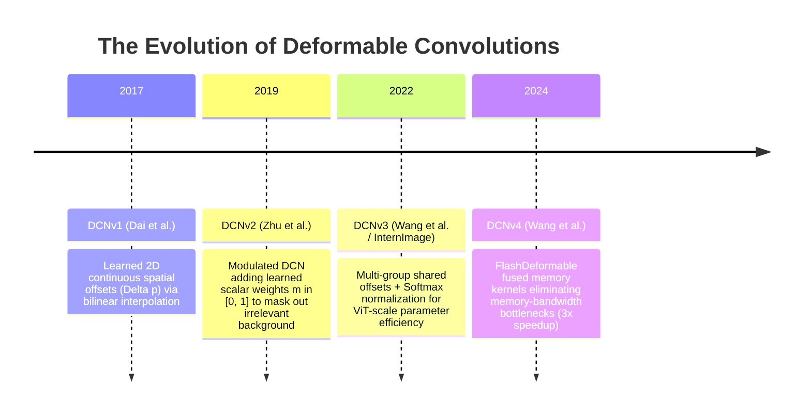

# 🌀 Deformable Convolutions: From DCNv1 to DCNv4 - Mathematical Principles & Efficient Edge Vision

## 1. High-Level Concept & The Geometric Rigidity Problem

In classical computer vision and deep convolutional networks, the standard 2D convolution operator operates on a **rigid, regular grid**. For a standard $3 \times 3$ kernel, the receptive field is strictly confined to:

$$
\mathcal{R} = \{(-1, -1), (-1, 0), (-1, 1), (0, -1), (0, 0), (0, 1), (1, -1), (1, 0), (1, 1)\}
$$

While computationally regular and hardware-friendly, this rigid geometry has fundamental flaws when processing real-world scenes:
1. **Geometric Scale & Aspect Ratio Variations**: Objects appear at varying distances, foreshortened by perspective projection, or elongated across unconventional aspect ratios.
2. **Non-Rigid Articulated Deformations**: Human bodies, robotic limbs, fabrics, and fluids do not conform to rectangular boxes.
3. **Optical Lens Curvature & Distortion**: Fisheye lenses, wide-angle automotive cameras, and aerial oblique cameras introduce spatial curvature where straight lines in reality become curved in the image plane.

```
Standard 3x3 Rigid Grid vs. Deformable Sampling:

Standard 3x3 Conv:                   Deformable Conv (DCN):
    [ (-1,-1)  (-1, 0)  (-1, 1) ]             (•)        (•)
    [ ( 0,-1)  ( 0, 0)  ( 0, 1) ]         (•)      (•)
    [ ( 1,-1)  ( 1, 0)  ( 1, 1) ]               (p0)       (•)
                                            (•)       (•)
(Rigid, uniform square sampling)       (Samples dynamically adapt to
                                        the object's true contour)
```

**Deformable Convolutional Networks (DCN)** liberate the convolution operator from fixed grids by enabling kernels to dynamically predict **spatial offsets** ($\Delta p$) and **modulation weights** ($m$) directly from the input feature map, allowing the receptive field to mold itself to the object's actual physical geometry.

---

## 2. The Four Generations: DCNv1 to DCNv4



### 2.1 DCNv1: Spatial Offsets via Bilinear Interpolation
In standard 2D convolution, given an input feature map $\mathbf{x}$ and output location $p_0$:

$$
\mathbf{y}(p_0) = \sum_{p_n \in \mathcal{R}} \mathbf{w}(p_n) \cdot \mathbf{x}(p_0 + p_n)
$$

DCNv1 augments the regular sampling grid with learned 2D continuous offsets $\{\Delta p_n \mid n = 1, \dots, N\}$:

$$
\mathbf{y}(p_0) = \sum_{p_n \in \mathcal{R}} \mathbf{w}(p_n) \cdot \mathbf{x}(p_0 + p_n + \Delta p_n)
$$

Because the shifted coordinate $p = p_0 + p_n + \Delta p_n$ is fractional (non-integer), $\mathbf{x}(p)$ is evaluated via **2D Bilinear Interpolation**:

$$
\mathbf{x}(p) = \sum_{q \in \text{neighbors}(p)} G(q, p) \cdot \mathbf{x}(q)
$$

where $q$ indexes the four integer pixel neighbors surrounding fractional coordinate $p$, and $G(q, p)$ is the 2D bilinear interpolation kernel:

$$
G(q, p) = \max\left(0, 1 - |q_x - p_x|\right) \cdot \max\left(0, 1 - |q_y - p_y|\right)
$$

### 2.2 DCNv2: Modulated Deformable Convolutions
While DCNv1 allowed kernels to shift spatially, it could not control the **magnitude of contribution** from each sampling point. If an offset shifted outside the object of interest into noisy background clutter, DCNv1 was forced to include that background feature in its sum.

DCNv2 introduced a **modulation scalar** $m_n \in [0, 1]$ learned simultaneously with the spatial offsets:

$$
\mathbf{y}(p_0) = \sum_{p_n \in \mathcal{R}} \mathbf{w}(p_n) \cdot m_n(p_0) \cdot \mathbf{x}(p_0 + p_n + \Delta p_n(p_0))
$$

- An offset sub-network predicts $3 \times |\mathcal{R}|$ output channels ($2 \times |\mathcal{R}|$ channels for $(x, y)$ offsets, and $1 \times |\mathcal{R}|$ channels passed through a Sigmoid activation to produce $m_n$).
- The modulation mechanism acts as a learned spatial attention mask, enabling the kernel to completely discard ($m_n \to 0$) uninformative or distracting background pixels.

### 2.3 DCNv3: Multi-Group Sparse Normalization (InternImage)
DCNv3 addressed the parameter and computational scaling bottlenecks when scaling deformable operations to Vision Transformer capacities:
1. **Multi-Group Offset Sharing**: Channels are partitioned into $G$ groups, with all channels within a group sharing the same spatial offsets, reducing offset parameter overhead by $G\times$.
2. **Softmax Modulation Normalization**: Replaces independent Sigmoid activations with a Softmax across the sampling points $\sum_{n=1}^K m_{gkn} = 1$, stabilizing optimization in deep architectures.

### 2.4 DCNv4: Fused FlashDeformable Memory Architecture
On modern high-throughput hardware (NVIDIA Ada Lovelace, Blackwell, Jetson Orin), DCNv2/v3 suffered from memory-bandwidth bottlenecks due to scattered non-contiguous memory reads during bilinear interpolation.

DCNv4 (Wang et al., 2024) introduces **FlashDeformable**:
- Fuses offset prediction, coordinate clamping, and bilinear interpolation into a single optimized CUDA / TensorRT kernel.
- Removes redundant memory round-trips to global VRAM, achieving a **$3\times$ speedup** over DCNv3, matching or exceeding the throughput of standard depthwise convolutions.

---

## 3. Mathematical Comparison Table

| Operator | Formulation $\mathbf{y}(p_0)$ | Receptive Field Geometry | Degrees of Freedom per Point | Memory Read Pattern |
| :--- | :--- | :--- | :---: | :--- |
| **Standard Conv 3x3** | $\sum w_n \mathbf{x}(p_0 + p_n)$ | Fixed square ($3 \times 3$) | 0 | Dense contiguous |
| **DCNv1** | $\sum w_n \mathbf{x}(p_0 + p_n + \Delta p_n)$ | Arbitrary continuous polygon | 2 ($dx, dy$) | Scattered bilinear |
| **DCNv2 (Modulated)** | $\sum w_n m_n \mathbf{x}(p_0 + p_n + \Delta p_n)$ | Modulated arbitrary polygon | 3 ($dx, dy, m$) | Scattered modulated bilinear |
| **DCNv3** | $\sum_g w_g \sum_k m_{gk} \mathbf{x}(p_0 + p_k + \Delta p_{gk})$ | Group-shared normalized polygon | $2/G + 1$ | Group-strided bilinear |
| **DCNv4** | Fused FlashDeformable operator | Fused hardware-aligned polygon | $2/G + 1$ | **Fused warp-level coalesced** |

---

## 4. PyTorch Reference Implementation (Modulated DCNv2)

```python
import torch
import torch.nn as nn
import torchvision.ops as ops

class ModulatedDeformableConv2d(nn.Module):
    """
    Modulated Deformable Convolution (DCNv2) module.
    Predicts 2D spatial offsets (dx, dy) and modulation masks (m in [0, 1])
    conditioned on input features, sampling at arbitrary fractional coordinates.
    """
    def __init__(self, in_channels: int, out_channels: int, kernel_size: int = 3, stride: int = 1, padding: int = 1):
        super().__init__()
        self.kernel_size = kernel_size
        self.stride = stride
        self.padding = padding
        self.num_points = kernel_size * kernel_size
        
        # 1. Offset and Mask generator sub-network
        # Generates: 2 channels per point for (x, y) offsets + 1 channel per point for mask
        self.conv_offset_mask = nn.Conv2d(
            in_channels,
            3 * self.num_points,
            kernel_size=kernel_size,
            stride=stride,
            padding=padding,
            bias=True
        )
        # Initialize offsets to zero so training starts identical to standard convolution
        nn.init.constant_(self.conv_offset_mask.weight, 0.0)
        nn.init.constant_(self.conv_offset_mask.bias, 0.0)
        
        # 2. Deformable convolution weights
        self.weight = nn.Parameter(torch.empty(out_channels, in_channels, kernel_size, kernel_size))
        self.bias = nn.Parameter(torch.empty(out_channels))
        nn.init.kaiming_uniform_(self.weight, a=1)
        nn.init.constant_(self.bias, 0.0)

    def forward(self, x: torch.Tensor) -> torch.Tensor:
        # Predict combined offsets and mask logits
        out = self.conv_offset_mask(x)
        
        # Split into offsets (2 * K) and mask (1 * K)
        offset = out[:, : 2 * self.num_points, :, :]
        mask = torch.sigmoid(out[:, 2 * self.num_points :, :, :])
        
        # Invoke hardware-accelerated torchvision deformable convolution operator
        return ops.deform_conv2d(
            input=x,
            offset=offset,
            weight=self.weight,
            bias=self.bias,
            stride=(self.stride, self.stride),
            padding=(self.padding, self.padding),
            mask=mask
        )
```

---

## 5. Models & Architectures Utilizing Deformable Convolutions

- **[[architectures/real-time-detectors-and-segmenters/d-fine|D-FINE Detector]]**: Uses deformable sampling to refine continuous bounding box coordinate distributions.
- **[[architectures/real-time-detectors-and-segmenters/rf-detr|RF-DETR]] & [[architectures/real-time-detectors-and-segmenters/rt-detr|RT-DETR]]**: Multi-scale deformable cross-attention in the hybrid encoder.
- **[[architectures/real-time-detectors-and-segmenters/yolov14-sim2real|YOLOv14-Sim2Real]]**: Distortion-aware deformable convolutions to bridge rectilinear synthetic cameras and real-world lens aberrations.
- **[[architectures/3d-pointclouds-and-lidar/sparse4d|Sparse4D]]**: Deformable 4D sampling projecting 3D anchor queries across multi-camera temporal video streams.
- **[[architectures/3d-pointclouds-and-lidar/bevfusion|BEVFusion]]**: Deformable feature alignment between camera bird's-eye-view projections and LiDAR point cloud voxels.
