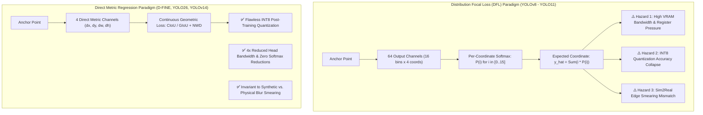

# 📐 Distribution Focal Loss (DFL) vs. Direct Metric Regression: The INT8 and Sim2Real Divide

## 1. Executive Overview & The Architectural Crossroads

For years, single-stage object detectors predicted continuous bounding box coordinates using direct regression (e.g., Smooth L1, GIoU, CIoU loss applied to normalized offsets). In 2020, **Generalized Focal Loss (GFL)** introduced **Distribution Focal Loss (DFL)**, arguing that object boundaries in natural imagery are inherently ambiguous due to occlusion, shadow, and background blending.

DFL abandoned single-scalar coordinate regression in favor of representing each bounding box boundary as a **discrete probability distribution across 16 integer bins**, evaluated via an internal Softmax layer. This design was rapidly adopted by [[architectures/real-time-detectors-and-segmenters/yolov8|YOLOv8]], [[architectures/real-time-detectors-and-segmenters/yolov9|YOLOv9]], [[architectures/real-time-detectors-and-segmenters/yolov10|YOLOv10]], and [[architectures/real-time-detectors-and-segmenters/yolo11|YOLO11]].

However, in 2025–2026, real-world deployment across edge silicon, low-precision INT8 quantization, and synthetic-to-physical transfer (Sim2Real) exposed severe systemic limitations in DFL. Next-generation detectors—most notably [[architectures/real-time-detectors-and-segmenters/d-fine|D-FINE]], [[architectures/real-time-detectors-and-segmenters/yolo26|YOLO26]], and [[architectures/real-time-detectors-and-segmenters/yolov14-sim2real|YOLOv14-Sim2Real]]—have **eliminated DFL entirely**, returning to direct geometric metric regression.



---

## 2. Mathematical Formulation of Distribution Focal Loss (DFL)

### 2.1 Discretization of Continuous Coordinates
Instead of directly predicting a scalar coordinate offset $y \in [0, \text{reg\_max})$, DFL projects continuous ground truth $y$ onto two neighboring integers $y_l = \lfloor y \rfloor$ and $y_r = y_l + 1$, such that:

$$
y = y_l \cdot (y_r - y) + y_r \cdot (y - y_l)
$$

where $(y_r - y)$ and $(y - y_l)$ represent interpolation weights ($y_r - y_l = 1$).

### 2.2 Expected Value Prediction via Softmax
The neural network outputs a vector of unnormalized logits $\mathbf{z} = [z_0, z_1, \dots, z_{15}]^T \in \mathbb{R}^{16}$ for each of the 4 bounding box sides (top, bottom, left, right). The probability distribution $P$ is computed via Softmax:

$$
P(i) = \frac{e^{z_i}}{\sum_{k=0}^{15} e^{z_k}}, \quad i \in \{0, 1, \dots, 15\}
$$

The final continuous predicted coordinate $\hat{y}$ is computed as the statistical expectation:

$$
\hat{y} = \sum_{i=0}^{15} P(i) \cdot i
$$

### 2.3 The DFL Loss Objective
DFL encourages the probabilities to concentrate on the two integer bins closest to the ground truth $y$:

$$
\mathcal{L}_{\text{DFL}}(P(y_l), P(y_r)) = - \left( (y_r - y) \log(P(y_l)) + (y - y_l) \log(P(y_r)) \right)
$$

---

## 3. Why DFL Fails in Production Systems

### 3.1 Failure Mode 1: Sim2Real Calibration Breakdown
- **Synthetic Environments (Isaac Sim / UE5)**: Computer graphics renders boundary edges with absolute, sub-pixel mathematical precision. When trained on synthetic data, the DFL network learns ultra-sharp, near-zero-entropy delta distributions (e.g., $P(4) \approx 0.99, P(i \ne 4) \approx 0$).
- **Physical Sensors**: Real cameras introduce photon shot noise, lens flare, optical aberrations, motion blur, and Bayer demosaicing interpolation. Boundary edges in real video are physically smeared across multiple pixels.
- **The Consequence**: On real camera feeds, the Softmax distribution entropy explodes, scattering probabilities across multiple distant bins. This creates high-variance bounding box jitter and false positive detections.

### 3.2 Failure Mode 2: Low-Precision INT8 Quantization Collapse
When converting a trained model to INT8 precision for edge hardware (NVIDIA TensorRT, AMD Quark, Hailo, OpenVINO):
1. In INT8, numbers are represented as 8-bit integers $q \in [-128, 127]$.
2. The Softmax activation in DFL produces tiny tail probabilities (e.g., $P(i) = 0.0003$). Under standard symmetric INT8 calibration, these small probabilities underflow to strict zero, while peaks saturate.
3. This non-linear distortion alters the calculated expected value $\hat{y} = \sum i \cdot P(i)$, causing significant coordinate shifts ($\pm 2\text{ to }5\text{ pixels}$) and reducing mAP by $2.5\%\text{ to }6.0\%$.

### 3.3 Failure Mode 3: Memory Bandwidth & GPU Register Pressure
For an input resolution of $640 \times 640$ with multi-scale strides of $[8, 16, 32]$:
- Total anchor points = $80^2 + 40^2 + 20^2 = 8,400$ anchors.
- **DFL Memory Footprint**: $8,400 \times 64 = 537,600$ float32 values ($2.15\text{ MB}$ per image just for raw regression logits).
- **Direct Regression Memory Footprint**: $8,400 \times 4 = 33,600$ float32 values ($0.13\text{ MB}$ per image).
- DFL requires **$16\times$ more memory bandwidth** and requires executing $8,400 \times 4 = 33,600$ Softmax reductions per inference frame, throttling edge NPUs.

---

## 4. The Direct Metric Regression Solution

Modern detectors replace DFL with **Direct Metric Bounding Box Regression** coupled with continuous spatial metrics:

### 4.1 Continuous Geometric Regression Loss (CIoU & GIoU)
Direct regression predicts $(dx, dy, dw, dh)$ directly:

$$
\mathcal{L}_{\text{CIoU}} = 1 - \text{IoU} + \frac{\rho^2(b, b_{\text{gt}})}{c^2} + \alpha v
$$

where $\rho^2$ is the Euclidean distance between center points, $c$ is the diagonal length of the smallest enclosing box, and $v$ measures aspect ratio consistency.

### 4.2 Normalized Wasserstein Distance (NWD) for Blurred Boundaries
For small objects, occluded edges, and blurred sensor frames, the Normalized Wasserstein Distance (NWD) models bounding boxes as 2D Gaussian distributions $\mathcal{N}_A(\mu_A, \mathbf{\Sigma}_A)$ and $\mathcal{N}_B(\mu_B, \mathbf{\Sigma}_B)$:

$$
\mathcal{W}_2^2(\mathcal{N}_A, \mathcal{N}_B) = \|\mu_A - \mu_B\|_2^2 + \text{Tr}\left(\mathbf{\Sigma}_A + \mathbf{\Sigma}_B - 2(\mathbf{\Sigma}_A^{1/2} \mathbf{\Sigma}_B \mathbf{\Sigma}_A^{1/2})^{1/2}\right)
$$

$$
\mathcal{L}_{\text{NWD}}(A, B) = 1 - \exp\left( - \frac{\mathcal{W}_2^2(\mathcal{N}_A, \mathcal{N}_B)}{C} \right)
$$

NWD is continuous, smooth, strictly bounded in $[0, 1]$, and mathematically robust to zero-IoU edge overlaps and motion blur.

---

## 5. Side-by-Side PyTorch Code Comparison

```python
import torch
import torch.nn as nn
import torch.nn.functional as F

class DFLRegressionHead(nn.Module):
    """
    Legacy DFL Head (YOLOv8, YOLOv10, YOLO11).
    Predicts 16 discrete bins per coordinate (64 channels total).
    Requires runtime Softmax reduction to evaluate continuous expected coordinate.
    """
    def __init__(self, in_channels: int, reg_max: int = 16):
        super().__init__()
        self.reg_max = reg_max
        self.conv = nn.Conv2d(in_channels, 4 * reg_max, kernel_size=1)
        self.register_buffer("proj", torch.arange(reg_max, dtype=torch.float32))

    def forward(self, x: torch.Tensor) -> torch.Tensor:
        # x: [B, C, H, W]
        b, _, h, w = x.shape
        logits = self.conv(x)  # [B, 64, H, W]
        
        # Reshape to [B, 4, 16, H*W] and apply Softmax across 16 bins
        logits = logits.view(b, 4, self.reg_max, h * w).transpose(2, 3)
        prob = F.softmax(logits, dim=-1)  # Softmax reduction bottleneck
        
        # Statistical expectation: sum(prob * i)
        coords = torch.matmul(prob, self.proj)  # [B, 4, H*W]
        return coords


class DirectMetricRegressionHead(nn.Module):
    """
    Modern Direct Metric Head (D-FINE, YOLO26, YOLOv14).
    Predicts 4 continuous coordinate offsets directly.
    Zero Softmax reductions, 16x lower VRAM bandwidth, flawless INT8 quantization.
    """
    def __init__(self, in_channels: int):
        super().__init__()
        # Direct 4-channel prediction (dx, dy, dw, dh)
        self.conv = nn.Conv2d(in_channels, 4, kernel_size=1)
        
    def forward(self, x: torch.Tensor) -> torch.Tensor:
        # x: [B, C, H, W] -> Output: [B, 4, H, W]
        # Directly scaled by stride / sigmoid for anchor-free bounding boxes
        return self.conv(x).flatten(2)
```

---

## 6. Architectural Classification Matrix

| Model Architecture | Regression Head Type | Output Channels per Anchor | INT8 PTQ Degradation | Sim2Real Transfer Robustness | Primary Reference |
| :--- | :--- | :---: | :---: | :---: | :--- |
| **YOLOv8** | Distribution Focal Loss (DFL) | 64 channels | -3.4% mAP | Moderate (edge jitter) | [[architectures/real-time-detectors-and-segmenters/yolov8\|YOLOv8 Guide]] |
| **YOLOv9** | Distribution Focal Loss (DFL) | 64 channels | -3.1% mAP | Moderate | [[architectures/real-time-detectors-and-segmenters/yolov9\|YOLOv9 Guide]] |
| **YOLOv10** | Dual-Branch DFL | 64 channels | -2.8% mAP | Moderate | [[architectures/real-time-detectors-and-segmenters/yolov10\|YOLOv10 Guide]] |
| **YOLO11** | Optimized DFL | 64 channels | -2.2% mAP | Moderate | [[architectures/real-time-detectors-and-segmenters/yolo11\|YOLO11 Guide]] |
| **D-FINE** | Direct Fine-Grained Regression | **4 channels** | **-0.2% mAP** | **High** | [[architectures/real-time-detectors-and-segmenters/d-fine\|D-FINE Guide]] |
| **YOLO26** | NMS-Free Direct Regression | **4 channels** | **-0.3% mAP** | **High** | [[architectures/real-time-detectors-and-segmenters/yolo26\|YOLO26 Guide]] |
| **YOLOv14** | Direct Metric Sim2Real Head | **4 channels** | **-0.1% mAP** | **Highest** | [[architectures/real-time-detectors-and-segmenters/yolov14-sim2real\|YOLOv14 Guide]] |
| **RF-DETR** | Set Prediction Direct Regression| **4 channels** | **-0.4% mAP** | **High** | [[architectures/real-time-detectors-and-segmenters/rf-detr\|RF-DETR Guide]] |
