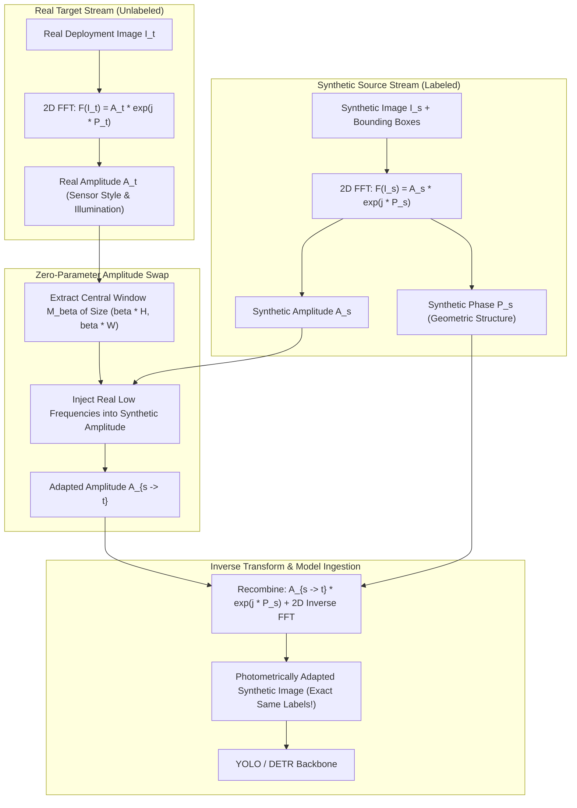

# 🌊 Fourier Domain Adaptation (FDA): Mathematics, Intuition, and Vision Implementation

## 1. High-Level Concept & Intuition

When deploying neural networks trained on synthetic simulation engines (e.g., NVIDIA Isaac Sim, Unreal Engine 5, BlenderProc) onto physical edge cameras, models frequently suffer a $25\%\text{ to }45\%$ drop in accuracy. This performance gap—the **Sim2Real domain gap**—is predominantly driven by low-level **photometric discrepancies**:
- Synthetic graphics engines render mathematically sterile textures with homogeneous lighting, artificial specular reflections, and non-physical rendering spectra.
- Real cameras ingest photon shot noise, ambient lighting variations, lens aberrations, and sensor-specific color filter array (CFA) curves.

A naive solution is training large generative adversarial translation networks (e.g., CycleGAN, CUT). However, GANs are heavy, computationally expensive, unstable to train, and often introduce geometric distortions that invalidate ground-truth bounding box labels.

**Fourier Domain Adaptation (FDA)** (Yang & Soatto, 2020) solves this problem with **zero learnable parameters and zero gradient overhead**. By decomposing images into frequency space via the 2D Fast Fourier Transform (FFT):
1. The **Phase spectrum** ($\mathcal{P}$) encodes **geometric semantics, object boundaries, spatial layouts, and shapes**.
2. The **Amplitude spectrum** ($\mathcal{A}$) encodes **low-level style, illumination, contrast, and color balance**.

By simply replacing the low-frequency center of the synthetic image's amplitude with that of an unlabeled real target image, the synthetic image instantaneously takes on the physical sensor's appearance while **strictly preserving 100% of the original bounding box and segmentation geometry**.



---

## 2. Mathematical Formulation

### 2.1 The 2D Discrete Fourier Transform (DFT)
Given a single-channel 2D discrete image $\mathbf{x} \in \mathbb{R}^{H \times W}$, its Discrete Fourier Transform $\mathcal{F}(\mathbf{x}) \in \mathbb{C}^{H \times W}$ is defined as:

$$
\mathcal{F}(\mathbf{x})(u, v) = \sum_{h=0}^{H-1} \sum_{w=0}^{W-1} \mathbf{x}(h, w) e^{-j 2\pi \left(\frac{uh}{H} + \frac{vw}{W}\right)}
$$

where $j = \sqrt{-1}$, and $(u, v)$ represent discrete spatial frequency coordinates along the vertical and horizontal axes.

### 2.2 Amplitude and Phase Decomposition
Any complex frequency value $\mathcal{F}(\mathbf{x})(u, v) \in \mathbb{C}$ can be expressed in polar coordinates as:

$$
\mathcal{F}(\mathbf{x})(u, v) = \mathcal{A}(\mathbf{x})(u, v) \cdot e^{j \mathcal{P}(\mathbf{x})(u, v)}
$$

where the **Amplitude Spectrum** $\mathcal{A}(\mathbf{x})(u, v) \in \mathbb{R}_{\ge 0}$ and **Phase Spectrum** $\mathcal{P}(\mathbf{x})(u, v) \in (-\pi, \pi]$ are:

$$
\mathcal{A}(\mathbf{x})(u, v) = \sqrt{\text{Re}^2(\mathcal{F}(\mathbf{x})(u, v)) + \text{Im}^2(\mathcal{F}(\mathbf{x})(u, v))}
$$

$$
\mathcal{P}(\mathbf{x})(u, v) = \text{arctan2}\left(\text{Im}(\mathcal{F}(\mathbf{x})(u, v)), \text{Re}(\mathcal{F}(\mathbf{x})(u, v))\right)
$$

### 2.3 The Low-Frequency Mask $M_\beta$
After applying a standard quadrant shift (`fftshift`) so that zero-frequency DC components are centered at $\left(c_h, c_w\right) = \left(\lfloor \frac{H}{2} \rfloor, \lfloor \frac{W}{2} \rfloor\right)$, we define a binary spatial mask $M_\beta \in \{0, 1\}^{H \times W}$ parameterized by the scaling factor $\beta \in (0, 0.5)$:

$$
M_\beta(u, v) = \begin{cases}
1, & \text{if } |u - c_h| \le \beta \cdot H \quad \text{and} \quad |v - c_w| \le \beta \cdot W \\
0, & \text{otherwise}
\end{cases}
$$

### 2.4 Amplitude Swapping & Reconstruction
The adapted amplitude $\mathcal{A}_{s \to t}$ blends the source synthetic amplitude $\mathcal{A}_s$ with target real amplitude $\mathcal{A}_t$:

$$
\mathcal{A}_{s \to t} = M_\beta \odot \mathcal{A}_t + (1 - M_\beta) \odot \mathcal{A}_s
$$

The adapted image $\mathbf{x}_{s \to t}$ is obtained via the 2D Inverse Discrete Fourier Transform ($\mathcal{F}^{-1}$):

$$
\mathbf{x}_{s \to t} = \mathcal{F}^{-1}\left( \mathcal{A}_{s \to t} \cdot e^{j \mathcal{P}_s} \right)
$$

Because the phase spectrum $\mathcal{P}_s$ belongs entirely to the synthetic image, the exact spatial coordinates of all physical objects, bounding boxes, and segmentation masks remain strictly invariant.

---

## 3. Step-by-Step Python & PyTorch Reference Implementation

```python
import torch
import torch.nn as nn
from typing import Optional

class FourierDomainAdapter(nn.Module):
    """
    Zero-parameter Fourier Domain Adaptation (FDA) module.
    Transfers low-frequency amplitude (style/lighting) from target real images
    to source synthetic images while strictly preserving geometric phase (labels).
    """
    def __init__(self, beta: float = 0.08):
        """
        Args:
            beta: Fraction of low-frequency spectrum swapped (0.01 to 0.15).
                  Higher beta transfers more texture/style; lower beta only transfers global color/illumination.
        """
        super().__init__()
        assert 0.0 < beta < 0.5, f"beta must be in (0, 0.5), got {beta}"
        self.beta = beta

    @torch.no_grad()
    def forward(self, sim_images: torch.Tensor, real_images: torch.Tensor) -> torch.Tensor:
        """
        Args:
            sim_images:  [B, C, H, W] float32 tensor of synthetic source images in [0, 1]
            real_images: [B, C, H, W] float32 tensor of real target images in [0, 1]
        Returns:
            adapted_sim: [B, C, H, W] photometrically adapted synthetic images in [0, 1]
        """
        b, c, h, w = sim_images.shape
        
        # 1. 2D Fast Fourier Transform (centered)
        fft_sim = torch.fft.fftshift(torch.fft.fft2(sim_images, dim=(-2, -1)), dim=(-2, -1))
        fft_real = torch.fft.fftshift(torch.fft.fft2(real_images, dim=(-2, -1)), dim=(-2, -1))
        
        # 2. Decompose into Amplitude and Phase
        amp_sim = torch.abs(fft_sim)
        phase_sim = torch.angle(fft_sim)
        amp_real = torch.abs(fft_real)
        
        # 3. Compute central crop dimensions for beta window
        dh, dw = int(h * self.beta), int(w * self.beta)
        ch, cw = h // 2, w // 2
        
        # 4. Swap low-frequency amplitude components
        amp_adapted = amp_sim.clone()
        amp_adapted[..., ch - dh : ch + dh, cw - dw : cw + dw] = \
            amp_real[..., ch - dh : ch + dh, cw - dw : cw + dw]
            
        # 5. Recombine with synthetic phase and unshift
        fft_adapted = amp_adapted * torch.exp(1j * phase_sim)
        fft_adapted = torch.fft.ifftshift(fft_adapted, dim=(-2, -1))
        
        # 6. Inverse FFT back to spatial image domain
        adapted_images = torch.fft.ifft2(fft_adapted, dim=(-2, -1)).real
        
        return torch.clamp(adapted_images, 0.0, 1.0)
```

---

## 4. Hyperparameter Guidelines & Tuning Rules

| Parameter Setting | Visual & Perception Effect | Recommended Domain Application |
| :--- | :--- | :--- |
| **$\beta \le 0.03$ (Subtle)** | Modifies only global illumination, ambient white balance, and contrast. Leaves high-frequency textures untouched. | Daytime synthetic camera transfers with minimal sensor noise disparity. |
| **$\beta \in [0.05, 0.10]$ (Standard)** | Blends lighting, sensor color bias, shadow softness, and background color temperature while preserving object boundaries cleanly. | **Default recommended setting** for Isaac Sim / UE5 $\to$ real robotics and autonomous driving. |
| **$\beta \ge 0.15$ (Aggressive)** | Transmits medium-frequency textures from target images. | High-noise environments (infrared, low-light thermal, underwater cameras). |
| **$\beta > 0.20$ (Hazardous)** | Can cause semantic ghosting or bleeding of target image object textures onto the synthetic geometry. | **Avoid**: Corrupts synthetic label accuracy. |

---

## 5. Models & Architectures Utilizing FDA

- **[[architectures/real-time-detectors-and-segmenters/yolov14-sim2real|YOLOv14 & Sim2Real Detectors]]**: FDA operates directly inside the multi-stream ingestion stem.
- **[[topics/object-detection/03-sim2real-and-domain-adaptation|Sim2Real Object Detection Playbook]]**: Combined with adversarial gradient reversal for end-to-end domain generalization.
- **Semantic Segmentation FDA**: Yang & Soatto (CVPR 2020) landmark framework for GTA5/SYNTHIA $\to$ Cityscapes domain transfer.
