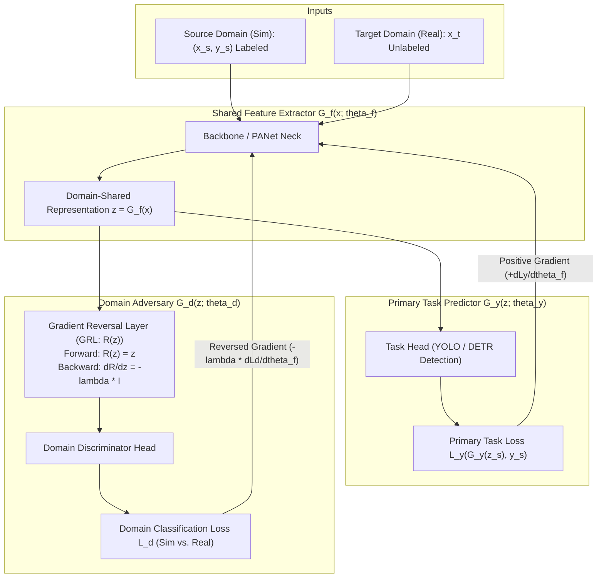

# ⚔️ Gradient Reversal Layers (GRL) & Domain-Adversarial Neural Networks (DANN)

## 1. High-Level Concept & The Domain Invariance Challenge

When training deep perception models, access to labeled data is often restricted to a **source domain** $\mathcal{S}$—such as a 3D simulation engine (NVIDIA Isaac Sim, Unreal Engine 5) or day-lit clear-weather public benchmarks. However, the model must deploy on a distinct **target domain** $\mathcal{T}$—such as physical robot cameras with sensor noise, variable focal lengths, nighttime illumination, or inclement weather.

If trained solely via empirical risk minimization on $\mathcal{S}$, the feature extractor inevitably overfits to domain-specific idiosyncrasies (e.g., synthetic shader specularities, camera lens distortions), leading to catastrophic degradation on $\mathcal{T}$.

**Domain-Adversarial Neural Networks (DANN)** (Ganin & Lempitsky, 2015; Ganin et al., 2016) resolve this through a two-player **minimax game**:
1. We want features that are **maximally discriminative** for the main task (e.g., bounding box regression, category classification).
2. Simultaneously, we want features that are **maximally invariant** with respect to the domain shift (i.e., an adversary cannot distinguish whether a feature vector originated from $\mathcal{S}$ or $\mathcal{T}$).

Instead of unstable, alternating multi-step optimization (common in standard GANs), DANN achieves this in a **single standard backpropagation pass** using a simple mathematical construct: the **Gradient Reversal Layer (GRL)**.



---

## 2. Mathematical Formulation

### 2.1 The Three Sub-Networks
A DANN architecture consists of three components:
1. **Feature Extractor** $G_f(\mathbf{x}; \theta_f)$: Maps input image $\mathbf{x} \in \mathcal{X}$ into a latent representation $\mathbf{z} \in \mathbb{R}^D$.
2. **Task Predictor** $G_y(\mathbf{z}; \theta_y)$: Maps representation $\mathbf{z}$ into task predictions $\hat{\mathbf{y}}$ (e.g., bounding boxes and class logits).
3. **Domain Discriminator** $G_d(\mathbf{z}; \theta_d)$: Maps representation $\mathbf{z}$ into a binary domain label $\hat{d} \in [0, 1]$ ($d=0$ for source, $d=1$ for target).

### 2.2 The Total Minimax Objective
Given $n_s$ labeled source samples $\{(\mathbf{x}_i^s, \mathbf{y}_i^s)\}_{i=1}^{n_s}$ and $n_t$ unlabeled target samples $\{\mathbf{x}_j^t\}_{j=1}^{n_t}$, the optimization objective is:

$$
E(\theta_f, \theta_y, \theta_d) = \frac{1}{n_s} \sum_{i=1}^{n_s} \mathcal{L}_y\left(G_y(G_f(\mathbf{x}_i^s)), \mathbf{y}_i^s\right) - \lambda \left[ \frac{1}{n_s} \sum_{i=1}^{n_s} \mathcal{L}_d\left(G_d(G_f(\mathbf{x}_i^s)), 0\right) + \frac{1}{n_t} \sum_{j=1}^{n_t} \mathcal{L}_d\left(G_d(G_f(\mathbf{x}_j^t)), 1\right) \right]
$$

We seek a saddle point $(\hat{\theta}_f, \hat{\theta}_y, \hat{\theta}_d)$ satisfying:

$$
(\hat{\theta}_f, \hat{\theta}_y) = \arg\min_{\theta_f, \theta_y} E(\theta_f, \theta_y, \hat{\theta}_d)
$$

$$
\hat{\theta}_d = \arg\max_{\theta_d} E(\hat{\theta}_f, \hat{\theta}_y, \theta_d)
$$

### 2.3 The Gradient Reversal Operator $\mathcal{R}(\mathbf{z})$
The Gradient Reversal Layer is formally defined by its forward and backward behavior:

$$
\mathcal{R}(\mathbf{z}) = \mathbf{z} \quad (\text{Forward Pass: Exact Identity})
$$

$$
\frac{d\mathcal{R}(\mathbf{z})}{d\mathbf{z}} = -\lambda \mathbf{I} \quad (\text{Backward Pass: Negation & Scaling})
$$

When backpropagation reaches the representation layer $\mathbf{z}$, the gradients flowing from the primary task and domain discriminator sum to:

$$
\frac{\partial E}{\partial \theta_f} = \frac{\partial \mathcal{L}_y}{\partial \theta_f} - \lambda \frac{\partial \mathcal{L}_d}{\partial \theta_f}
$$

Because the domain loss gradient is **subtracted**, updating $\theta_f$ via gradient descent **maximizes** the domain discriminator's uncertainty while simultaneously **minimizing** the primary task error.

### 2.4 Dynamic Learning Progress Schedule $\lambda(p)$
At the start of training, the feature extractor has not yet learned meaningful visual representations. Forcing domain invariance too early destabilizes task convergence.

To ensure stable optimization, $\lambda$ is dynamically annealed from $0$ to $1$ based on training progress $p \in [0, 1]$:

$$
p = \frac{\text{current\_step}}{\text{total\_steps}}, \quad \lambda(p) = \frac{2}{1 + e^{-\gamma \cdot p}} - 1
$$

where $\gamma$ is a scaling hyperparameter (typically $\gamma = 10$).

---

## 3. PyTorch Reference Implementation

```python
import torch
import torch.nn as nn
from torch.autograd import Function

class GradientReversalFunction(Function):
    """
    Custom autograd Function implementing the Gradient Reversal Layer (GRL).
    Forward pass: acts as an exact identity mapping.
    Backward pass: negates incoming gradients and multiplies by lambda.
    """
    @staticmethod
    def forward(ctx, x: torch.Tensor, alpha: float) -> torch.Tensor:
        ctx.alpha = alpha
        return x.view_as(x)

    @staticmethod
    def backward(ctx, grad_output: torch.Tensor):
        # Negate gradient and multiply by alpha scaling factor
        return grad_output.neg() * ctx.alpha, None

class GradientReversalLayer(nn.Module):
    def __init__(self, alpha: float = 1.0):
        super().__init__()
        self.alpha = alpha

    def forward(self, x: torch.Tensor, alpha: float = None) -> torch.Tensor:
        current_alpha = alpha if alpha is not None else self.alpha
        return GradientReversalFunction.apply(x, current_alpha)

class DomainDiscriminatorHead(nn.Module):
    """
    Multi-scale domain discriminator for YOLO / DETR feature pyramids.
    Predicts domain probability: 0 = Synthetic (Source), 1 = Physical (Target).
    """
    def __init__(self, in_channels: int = 256, hidden_dim: int = 128):
        super().__init__()
        self.grl = GradientReversalLayer()
        self.classifier = nn.Sequential(
            nn.AdaptiveAvgPool2d((1, 1)),
            nn.Flatten(),
            nn.Linear(in_channels, hidden_dim),
            nn.LeakyReLU(0.2, inplace=True),
            nn.Dropout(0.3),
            nn.Linear(hidden_dim, 1)  # Output raw binary logit
        )

    def forward(self, feature_map: torch.Tensor, alpha: float = 1.0) -> torch.Tensor:
        # 1. Reverse gradients on backward pass
        reversed_features = self.grl(feature_map, alpha=alpha)
        # 2. Predict domain logits
        return self.classifier(reversed_features)

def compute_dann_lambda(current_step: int, total_steps: int, gamma: float = 10.0) -> float:
    """Computes dynamic schedule lambda(p) in [0, 1]."""
    p = float(current_step) / float(max(1, total_steps))
    return float(2.0 / (1.0 + torch.exp(torch.tensor(-gamma * p))) - 1.0)
```

---

## 4. Practical Tuning Rules & Common Traps

| Symptom / Failure Mode | Root Cause | Engineering Solution |
| :--- | :--- | :--- |
| **Primary Task Diverges Early** | $\lambda$ is too large at the beginning; discriminator forces noise into untrained features. | Enforce dynamic schedule $\lambda(p)$ starting at $0.0$; delay domain loss until epoch 5. |
| **Discriminator Accuracy $\approx 100\%$** | Discriminator is overpowering the feature extractor (features are trivial to separate). | Increase dropout in discriminator ($0.3 \to 0.5$); lower discriminator learning rate ($0.1\times$ of backbone). |
| **Discriminator Accuracy $\approx 50\%$** | Ideal saddle-point equilibrium (features are domain-invariant). | Maintain current hyperparameter balance. |
| **Batch Normalization Leakage** | Mixing source and target samples in the same BatchNorm layer contaminates running statistics. | Use separate BatchNorm statistics or Domain-Specific BatchNorm (DSBN) layers for source vs. target streams. |

---

## 5. Models & Cookbooks Utilizing DANN / GRL

- **[[architectures/real-time-detectors-and-segmenters/yolov14-sim2real|YOLOv14 & Sim2Real Detectors]]**: GRL attached to P4/P5 PANet features for real-time synthetic-to-physical adaptation.
- **[[cookbooks/09-dann-sim2real-safety-gate/README|Cookbook 09: DANN Sim2Real Safety Gate]]**: Evaluates feature divergence to trigger deterministic safety fallbacks in robotics.
- **[[topics/object-detection/03-sim2real-and-domain-adaptation|Sim2Real Object Detection Playbook]]**: Dual-domain joint optimization pipeline.
