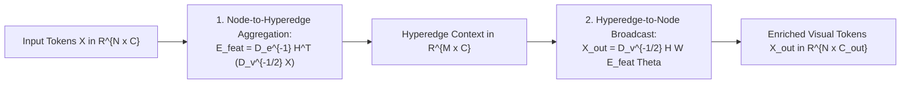

# 🕸️ Hypergraph Neural Networks in Computer Vision: High-Order Structural Perception

## 1. High-Level Concept & Why Pairwise Graphs Fail

Traditional computer vision architectures process visual features through either **local Euclidean operations** (standard convolutions) or **pairwise relational operations** (Self-Attention in Vision Transformers and Graph Convolutional Networks).

In standard Graph Neural Networks (GNNs), an edge $e$ is strictly dyadic, connecting exactly two vertices:

$$
e = (v_i, v_j)
$$

Similarly, standard Self-Attention constructs a pairwise similarity matrix $\mathbf{A}_{ij} = \frac{\mathbf{q}_i \mathbf{k}_j^T}{\sqrt{d}}$, measuring the affinity between token $i$ and token $j$.

### The Limitation of Pairwise Formulations
Complex visual scenes do not exist as isolated pairs of pixels. Real-world objects (e.g., a person riding a bicycle, an articulated robotic gripper handling a tool, or a vehicle navigating an intersection) are characterized by **high-order, multi-entity relationships**:
1. **Multi-Part Co-Occurrence**: A "car" is defined by the simultaneous, co-dependent presence of wheels, windshield, chassis, and headlights across disjoint spatial locations. Pairwise attention struggles when intermediate parts are obscured.
2. **Robustness to Severe Occlusion**: If an object is partially occluded, pairwise relationships between visible and hidden tokens drop to zero. A hyperedge grouping all object parts can still infer the presence of the whole from the remaining visible clique.
3. **Sim2Real Transfer Invariance**: While local pixel textures change dramatically between synthetic CAD renders and noisy physical sensors, high-order relational topologies remain invariant.

**Hypergraph Neural Networks (HGNN)** generalize graphs by allowing a **hyperedge** to connect an arbitrary number of vertices simultaneously ($e = \{v_1, v_2, \dots, v_k\}$), capturing complex non-pairwise dependencies with high computational efficiency.

```
Standard Graph vs. Hypergraph Relational Topology:

Standard Graph (Pairwise):           Hypergraph (High-Order):
        (v1) --- (v2)                           e1 = {v1, v2, v3}
         |        |                           +-------------------+
         |        |                           |   (v1)     (v2)   |
        (v3) --- (v4)                         |         (v3)      |
                                              +-------------------+
   (Only captures 1-to-1 links;                         |
    requires O(N^2) edges for dense               e2 = {v3, v4}
    inter-token dependencies)                 (Hyperedges capture arbitrary
                                               k-ary multi-point semantics)
```

---

## 2. Mathematical Formulation of Hypergraph Spectral Convolution

### 2.1 Hypergraph Definition
A hypergraph is denoted as $\mathcal{G} = (\mathcal{V}, \mathcal{E}, \mathbf{W})$, where:
- $\mathcal{V} = \{v_1, v_2, \dots, v_N\}$ is the set of $N$ vertices (e.g., spatial visual tokens in a feature map).
- $\mathcal{E} = \{e_1, e_2, \dots, e_M\}$ is the set of $M$ hyperedges (learned semantic clusters).
- $\mathbf{W} \in \mathbb{R}^{M \times M}$ is a diagonal matrix containing the weight $w(e_j)$ of each hyperedge.

### 2.2 The Incidence Matrix $\mathbf{H}$
The structural connectivity is encoded by the **incidence matrix** $\mathbf{H} \in \mathbb{R}^{N \times M}$:

$$
\mathbf{H}_{ij} = h(v_i, e_j) = \begin{cases}
1, & \text{if } v_i \in e_j \\
0, & \text{otherwise}
\end{cases}
$$

In modern deep learning (such as [[architectures/real-time-detectors-and-segmenters/yolov13|YOLOv13]]), $\mathbf{H}$ is formulated continuously via soft cross-attention between token projections $\mathbf{X}\mathbf{W}_v$ and learnable hyperedge prototype centroids $\mathbf{E}$:

$$
\mathbf{H} = \text{Softmax}\left(\frac{(\mathbf{X}\mathbf{W}_v)(\mathbf{E}\mathbf{W}_e)^T}{\sqrt{d}}\right) \in \mathbb{R}^{N \times M}
$$

### 2.3 Degree Matrices
The **vertex degree matrix** $\mathbf{D}_v \in \mathbb{R}^{N \times N}$ and **edge degree matrix** $\mathbf{D}_e \in \mathbb{R}^{M \times M}$ are diagonal matrices defined as:

$$
(\mathbf{D}_v)_{ii} = \sum_{j=1}^M \mathbf{W}_{jj} \mathbf{H}_{ij}, \quad (\mathbf{D}_e)_{jj} = \sum_{i=1}^N \mathbf{H}_{ij}
$$

- $(\mathbf{D}_v)_{ii}$ measures how many hyperedges contain vertex $v_i$.
- $(\mathbf{D}_e)_{jj}$ measures the size (cardinality) of hyperedge $e_j$.

### 2.4 Hypergraph Spectral Convolution Operator
Information propagation across vertices via their shared hyperedges follows the normalized hypergraph Laplacian:

$$
\mathbf{X}^{(l+1)} = \sigma\left( \mathbf{D}_v^{-1/2} \mathbf{H} \mathbf{W} \mathbf{D}_e^{-1} \mathbf{H}^T \mathbf{D}_v^{-1/2} \mathbf{X}^{(l)} \mathbf{\Theta}^{(l)} \right)
$$

where $\mathbf{\Theta}^{(l)} \in \mathbb{R}^{C_{\text{in}} \times C_{\text{out}}}$ is the learnable transformation weight matrix, and $\sigma$ is a non-linear activation (e.g., SiLU or GELU).

---

## 3. Two-Stage GEMM Decomposition (Hardware Efficiency)

While the full hypergraph Laplacian formula appears complex, in practice it decomposes into **two consecutive dense matrix multiplications (GEMMs)** that execute with optimal cache locality on GPUs and NPUs:



1. **Step 1: Vertex-to-Edge Aggregation ($\mathcal{V} \to \mathcal{E}$)**
   $$
   \mathbf{E}_{\text{feat}} = \mathbf{D}_e^{-1} \mathbf{H}^T \left(\mathbf{D}_v^{-1/2} \mathbf{X}^{(l)}\right) \in \mathbb{R}^{M \times C_{\text{in}}}
   $$
   *Computes the semantic centroid of each high-order hyperedge.*

2. **Step 2: Edge-to-Vertex Broadcast ($\mathcal{E} \to \mathcal{V}$)**
   $$
   \mathbf{X}^{(l+1)} = \sigma\left( \mathbf{D}_v^{-1/2} \mathbf{H} \mathbf{W} \mathbf{E}_{\text{feat}} \mathbf{\Theta}^{(l)} \right) \in \mathbb{R}^{N \times C_{\text{out}}}
   $$
   *Broadcasts high-order context back to individual pixel tokens.*

**Computational Complexity Comparison**:
- Self-Attention (ViT / DETR): $\mathcal{O}(N^2 \cdot C)$
- Hypergraph Convolution: $\mathcal{O}(N \cdot M \cdot C)$ where $M \ll N$ (typically $M = 32\text{ or }64$, while $N = 1600\text{ to }6400$).
- When $N = 3200$ and $M = 32$, HGNN is **$100\times$ faster** than standard pairwise self-attention.

---

## 4. PyTorch Reference Implementation

```python
import torch
import torch.nn as nn
import torch.nn.functional as F

class HypergraphConvolutionBlock(nn.Module):
    """
    Differentiable Hypergraph Spectral Convolution layer for computer vision.
    Dynamically groups 2D visual tokens into M learned hyperedges and broadcasts
    high-order semantic context back across all spatial pixels.
    """
    def __init__(self, in_channels: int, out_channels: int, num_hyperedges: int = 32):
        super().__init__()
        self.num_hyperedges = num_hyperedges
        self.out_channels = out_channels
        
        # Linear projection for token features
        self.theta = nn.Linear(in_channels, out_channels, bias=False)
        
        # Learnable hyperedge prototypes in latent space
        self.edge_prototypes = nn.Parameter(torch.randn(num_hyperedges, in_channels))
        nn.init.orthogonal_(self.edge_prototypes)
        
        # Learnable hyperedge weights (W matrix)
        self.edge_weights = nn.Parameter(torch.ones(num_hyperedges))
        
        self.norm = nn.BatchNorm2d(out_channels)
        self.act = nn.SiLU(inplace=True)

    def forward(self, x: torch.Tensor) -> torch.Tensor:
        # x shape: [B, C, H, W]
        b, c, h, w = x.shape
        n = h * w
        
        # Flatten spatial tokens: [B, N, C]
        tokens = x.flatten(2).transpose(1, 2)
        
        # 1. Compute soft continuous incidence matrix H: [B, N, M]
        scale = c ** -0.5
        affinity = torch.matmul(tokens, self.edge_prototypes.transpose(0, 1)) * scale
        h_matrix = F.softmax(affinity, dim=-1)  # Soft vertex-to-hyperedge assignment
        
        # 2. Compute degree matrices
        deg_v = torch.sum(h_matrix * self.edge_weights, dim=-1, keepdim=True).clamp(min=1e-5) # [B, N, 1]
        deg_e = torch.sum(h_matrix, dim=1, keepdim=True).clamp(min=1e-5)                      # [B, 1, M]
        
        # Normalize tokens by vertex degree: D_v^{-1/2} * X
        norm_tokens = tokens / torch.sqrt(deg_v)
        
        # 3. Vertex to Hyperedge Aggregation: E = D_e^{-1} * H^T * norm_tokens
        h_trans = h_matrix.transpose(1, 2)  # [B, M, N]
        h_norm_e = h_trans / deg_e.transpose(1, 2)  # [B, M, N]
        edge_features = torch.matmul(h_norm_e, norm_tokens)  # [B, M, C]
        
        # Apply hyperedge weighting W
        edge_features = edge_features * self.edge_weights.view(1, -1, 1)
        
        # 4. Hyperedge to Vertex Broadcast: X_out = D_v^{-1/2} * H * edge_features
        vertex_context = torch.matmul(h_matrix, edge_features) / torch.sqrt(deg_v)  # [B, N, C]
        
        # 5. Linear transformation Theta and reshape back to [B, C_out, H, W]
        out_tokens = self.theta(vertex_context)
        out = out_tokens.transpose(1, 2).view(b, self.out_channels, h, w)
        
        return self.act(self.norm(out))
```

---

## 5. Applications & Models in the Vault

- **[[architectures/real-time-detectors-and-segmenters/yolov13|YOLOv13]]**: Employs Hypergraph-Enhanced Adaptive Visual Perception (HG-AP) in the neck to survive extreme occlusion and domain shift.
- **[[architectures/3d-pointclouds-and-lidar/pointpillars|PointPillars]] & 3D LiDAR**: Groups spatial point clusters into geometric hyperedges to capture non-pairwise surface normals.
- **[[topics/object-detection/00-object-detection-moc|Object Detection MOC]]**: Connected as a core architectural enhancement for real-time edge vision.
