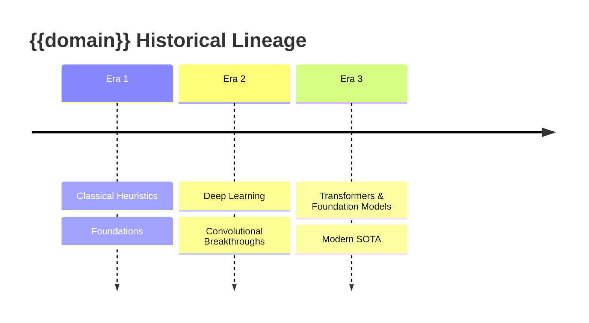
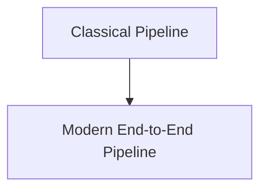

# 📜 {{domain}}: Historical Evolution & Paradigm Shifts

A didactic guide dissecting how this field transitioned across historical eras: from classical mathematical formulations to deep learning and foundation paradigms.

## 1. Timeline of Historical Eras

---

## 2. Deep Paradigm Shifts & Mathematical Transitions
- **Classical Formulations**:
- **The Convolutional & Dense Era**:
- **The Modern Attention / Implicit / Foundation Era**:

---

## 3. Structural Architectural Comparison

| Dimension | Classical Paradigm | First-Gen Deep Learning | Modern SOTA Foundation Paradigm |
| :--- | :--- | :--- | :--- |
| ... | ... | ... | ... |
